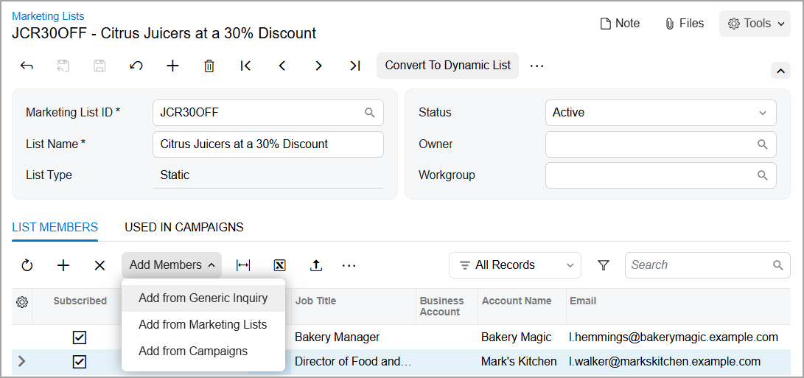
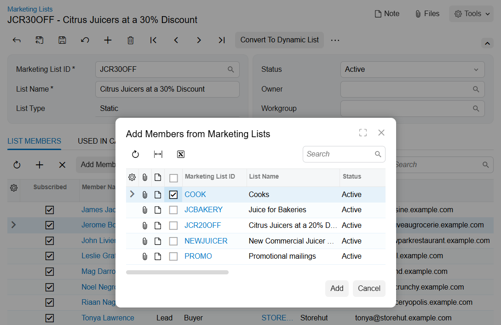
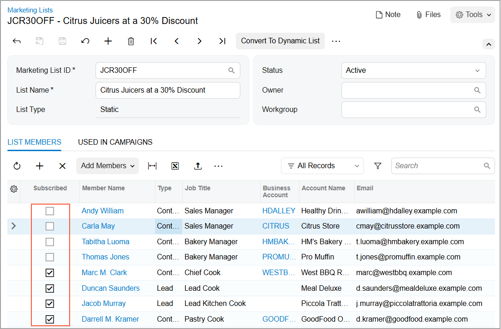

# Marketing Lists: To Create a Static Marketing List {#_0591adb9-7609-47d2-aa51-b29da69e3e50 .task}

The following activity demonstrates how to create static marketing lists and add members to it.

**Attention:** This activity is based on the *U100* dataset. If you are using another dataset or if any system settings have been changed in *U100*, these changes can affect the workflow of the activity and the results of the processing. To avoid issues, restore the *U100* dataset to its initial state.

## Story { .section}

Suppose that you are Bill Owen, a marketing manager of the SweetLife Fruits &amp; Jams company.You need to create a new marketing list that includes leads from bakeries and restaurants with confirmed contact information, contacts and leads from a previously prepared marketing list, and members of one of the company's existing marketing campaigns. These members will receive a special offer from the company with 30 percent off the price of citrus juicers.

## Configuration Overview { .section}

In the *U100* dataset, for the purposes of this activity, the following tasks have been performed:

-   On the [Enable/Disable Features](CS_10_00_00.md) \(CS100000\) form, the *Customer Management* feature has been enabled. This feature provides the customer relationship management \(CRM\) functionality, including lead and customer tracking, as well as the handling of sales opportunities, contacts, marketing lists, and campaigns.
-   On the [Leads](CR_30_10_00.md) \(CR301000\) form, two leads \(which will be added to a marketing list manually\) of the *CAFE* and *BAKERY* classes with the following lead IDs have been added to the system:
    -   *Leslie Walker*
    -   *Leonard Hemmings*
-   On the [Marketing Lists](CR_20_40_00.md) \(CR204000\) form, the *Cooks* marketing list with five members has been defined.
-   On the [Marketing Campaigns](CR_20_20_00.md) \(CR202000\) form, the *Juice for Bakeries* marketing campaign with four members has been added.

## Process Overview { .section}

In this activity, on the [Marketing Lists](CR_20_40_00.md) \(CR204000\) form, you will do the following:

1.  Create a static marketing list
2.  Add members to the static marketing list manually
3.  Add members to the marketing list by using an inquiry
4.  Add members to the marketing list by using another marketing list
5.  Add members to the marketing list by using another marketing campaign
6.  For some members of the created marketing list, cancel the subscription

## System Preparation { .section}

Before you start creating marketing lists, you should do the following:

1.  Launch the Acumatica ERP website with the *U100* dataset preloaded.
2.  Sign in to the system as marketing manager Bill Owen by using the following credentials:
    -   **Username**: *owen*
    -   **Password**: *123*
3.  Make sure that on the Company and Branch Selection menu, in the top pane of the Acumatica ERP screen, the *SweetLife Head Office and Wholesale Center* branch is selected.

## Step 1: Creating a Static Marketing List { .section}

To create a static marketing list, do the following:

1.  On the [Marketing Lists](CR_20_40_00.md) \(CR204000\) form, add a new record.
2.  In the Summary area, specify the following settings:
    -   **Marketing List ID**: `JCR30OFF`
    -   **List Name**: `Citrus Juicers at a 30% Discount`
    -   **Status**: *Active*
3.  On the form toolbar, click **Save**.

You have created a static marketing list. You can now add and remove list members, or unsubscribe them from the marketing emails according to your needs or preferences, as described in the following steps.

## Step 2: Adding Individual Members to a Static Marketing List { .section}

Now you will manually add two members, Leslie Walker and Leonard Hemmings, to the static marketing list you created. While you are still viewing the *Citrus Juicers at a 30% Discount* marketing list on the [Marketing Lists](CR_20_40_00.md) \(CR204000\) form, do the following:

1.  Go to the **List Members** tab.
2.  Add the members to the static marketing list as follows:
    1.  On the table toolbar, click **Add Row**.
    2.  In the **Member Name** column, select *Leslie Walker*. The system adds a row with the lead's data to the table.
    3.  On the table toolbar, click **Add Row**.
    4.  In the **Member Name** column, select *Leonard Hemmings*. The system adds a row with the lead's data to the table.
3.  On the form toolbar, click **Save**.

You have added two members to the marketing list manually.

## Step 3: Adding Multiple Members to a Static Marketing List by Using a Generic Inquiry { .section}

To add multiple members to the marketing list by using a generic inquiry, while you are still viewing the *Citrus Juicers at a 30% Discount* list on the [Marketing Lists](CR_20_40_00.md) \(CR204000\) form, do the following:

1.  On the table toolbar of the **List Members** tab, click **Add Members** &gt; **Add from Generic Inquiry**, as shown in the following screenshot.

    

2.  In the **Add Members from Inquiry** dialog box, which opens, do the following:
    1.  In the **Generic Inquiry** box, select the *BI-Leads* generic inquiry, which is predefined \(available in an out-of-the-box system\).
    2.  In the **Shared Filter** box, select the *Leads Ready for Sales* shared filter, which has been defined for the selected generic inquiry. This filter contains only leads that have the *Open* status.

        **Tip:**

        -   Acumatica ERP also provides the following predefined generic inquiries, which can be specified in marketing lists:
            -   *CR-Contacts2018R1* to add contacts
            -   *CR-Opportunities2018R1* to add contacts related to opportunities
        -   In this dialog box, you can select any shared filter that is available for the specified inquiry form. This gives you the ability to select members from only the relevant records. For details on shared filters, see [Managing Advanced Filters](GI_Reusable_Filters_Mapref.md).
    3.  Click **Add**. The system closes the dialog box and adds the leads to the marketing list.

You have added multiple members to the marketing list by using a generic inquiry.

## Step 4: Adding Multiple Members to a Static Marketing List by Using a Marketing List {#section_lc4_g3s_h5b .section}

To add multiple members to the marketing list by using another marketing list, while you are still viewing the *Citrus Juicers at a 30% Discount* list on the [Marketing Lists](CR_20_40_00.md) \(CR204000\) form,do the following:

1.  On the table toolbar of the **List Members** tab, click **Add Members** &gt; **Add from Marketing Lists**.
2.  In the **Add Members from Marketing Lists** dialog box, which opens, do the following:
    1.  Select the Selected check box in the row with the *Cooks* marketing list, as shown in the following screenshot.

        

        **Tip:**

        -   You can select as many marketing lists as you need to add their members to the current marketing list.
        -   If the table contains a large number of marketing lists, you can use the Search box at the top of the dialog box to find a specific list.
        -   You can expand this dialog box to a full screen by clicking the  icon in the top right corner of the dialog box. This may make it easier to see all the settings of the marketing lists.
    2.  Click **Add**. The system closes the dialog box and adds the members to the marketing list.

You have added multiple members to the marketing list by using another marketing list.

## Step 5: Adding Multiple Members to a Static Marketing List By Using a Marketing Campaign {#section_tzh_y3s_h5b .section}

To add multiple members to the marketing list by using a marketing campaign, while you are still viewing the *Citrus Juicers at a 30% Discount* list on the [Marketing Lists](CR_20_40_00.md) \(CR204000\) form, do the following:

1.  On the table toolbar of the **List Members** tab, click **Add Members** &gt; **Add from Campaigns**.
2.  In the **Add Members from Campaigns** dialog box, which opens, do the following:
    -   Select the Selected check box in the row of the *Juice for Bakeries* marketing campaign.

        **Tip:**

        -   You can select any number of marketing campaigns to add their members to the current marketing list.
        -   If the table contains a large number of marketing campaigns, you can use the Search box at the top of the dialog box to find a specific campaign.
        -   You can expand this dialog box to a full screen by clicking the  icon in the top right corner of the dialog box. This may make it easier to see all the settings of the marketing campaigns.
    -   Click **Add**. The system closes the dialog box and adds the members from the marketing campaign to the marketing list.

You have added multiple members to the marketing list by using a marketing campaign.

## Step 6: Unsubscribing Multiple Members From the Marketing List { .section}

Suppose that you need to temporarily cancel the subscription \(that is, cancel marketing mailings for some or all members of the marketing list, but do not remove them from the marketing list\) for all the members of the marketing list except those who work as cooks, because you want to initially use this marketing list only for cooks.

To cancel the subscription for most of members of the marketing list, while you are still viewing the *Citrus Juicers at a 30% Discount* list on the [Marketing Lists](CR_20_40_00.md) \(CR204000\) form, do the following:

1.  On the table toolbar of the **List Members** tab, click **Manage Subscription** &gt; **Unsubscribe All**.
2.  Click the header of the **Job Title** table column.
3.  In the Quick Filter menu, which opens, apply the filter with the *Contains* condition, type `Cook` in the Search box, and click **Apply**. As a result, the table contains five records with the following cooks: *Marc M. Clark*, *Duncan Saunders*, *Jacob Murray*, *Darrell M. Kramer*, and *Leslie Graff*.
4.  On the table toolbar, click **Manage Subscription** &gt; **Subscribe All** to subscribe all of the rows that are currently listed \(because of the filter\).
5.  Remove the filter for the header of the **Job Title** column to make sure that the other members of the marketing list remain unsubscribed.

You have temporarily canceled the subscription for part of the members of the marketing list without removing them from the marketing list, as shown in the following screenshot.

**Parent topic:**[Managing Marketing Lists](../UserGuide/CRM_Mktg_Mng_Marketing_Lists_Mapref.md)

