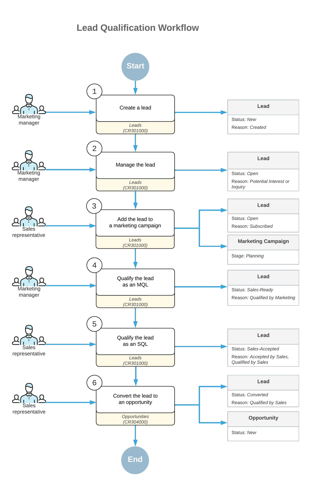
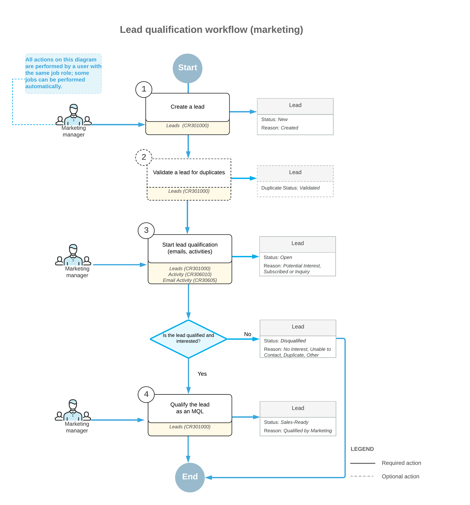

# Lead Qualification by Marketing Teams: General Information {#_fb7aae63-3bf9-465e-ac9b-924e6d410c25 .concept}

Marketing and sales teams rapidly adjust their processes and optimally use collected data, striving for the most effective work approaches. As such, they need their CRM systems to be flexible enough to support adjustments in processes without lengthy, costly development being required. Acumatica ERP provides flexible tools that marketing and sales teams can use to implement and customize workflows in the system without doing the coding.

## Learning Objectives { .section}

In this chapter, you will learn how to do the following:

-   Use the lead statuses in Acumatica ERP in your lead qualification workflow
-   Qualify a lead and pass the marketing-qualified lead to a sales team for further qualification
-   Disqualify a lead
-   Reopen a disqualified lead

## Applicable Scenarios { .section}

You may want to learn how to qualify leads in Acumatica ERP in scenarios that include the following:

-   A lead has contacted you and confirmed the intention to buy the company's products or services and you need to convert the lead to an opportunity.
-   A lead has expressed that its organization is not interested in your company's products or services, and you need to disqualify the lead.
-   You have a list of cold leads \(individuals or organizations who never contacted your organization or expressed any interest in your products or services\) and you need to confirm these leads' contact information and gauge their current interest in buying.
-   You need to pass a marketing-qualified lead to the sales team for further qualification.

## Lead Qualification Process { .section}

Lead qualification is the process of determining a lead to be one of the following:

-   A prospect that fits your target customer profile and has a high chance to become a customer
-   An existing customer with interest in a product or service that this customer has not already purchased

When marketing personnel communicate with leads \(for example, during marketing campaigns\) and work on developing the leads’ interest in the company’s products or services, they establish qualification criteria, which show that some leads are interested to buy more than others. The particular lead qualification criteria vary for different companies and for different products or services. The number of leads that a marketing team passes to a sales team depends on many factors, such as the sales team’s requirements for leads or the number of the leads a sales team can handle.

We recommend that marketing and sales teams work together to agree on the criteria of transferring leads from marketing to sales and regularly revise the criteria depending on company sales and other changing conditions. Based on this agreement, in Acumatica ERP, you can create your lead qualification workflow, which consists of stages \(identifiable phases, which can be required or optional\) in the workflow that relate to particular actions a marketing or a sales employee performs while qualifying each lead. Similarly, the lead proceeds through statuses in the system for each stage. The following sections describe this workflow and the ability to implement it in Acumatica ERP.

## Lead Qualification Workflow { .section}

CRM functional area in Acumatica ERP includes the lead qualification workflow that helps marketing and sales teams manage leads, add leads to marketing campaigns, qualify leads, associate multiple leads with the same business account and contact, return leads that require further nurturing to marketing and reopen a disqualified lead if needed. You can customize the workflow according to your company's lead qualification processes.

The following diagram illustrates the lead qualification workflow.

In the lead qualification workflow, transitions between lead statuses are implemented as commands on the More menu of the [Leads](../Shared/../UserGuide/CR_30_10_00.md) \(CR301000\) form. You can click these commands on the More menu. A lead status is displayed in the **Status** box of the Summary area on the [Leads](../Shared/../UserGuide/CR_30_10_00.md) form. A system administrator can customize the workflow to define which statuses correspond to the *Active* \(nurtured\) status of the lead.

## Lead Qualification as Performed by Marketing in Acumatica ERP { .section}

When a lead is created in Acumatica ERP, a marketing team member can review and nurture the lead. The team member can then either disqualify the lead or accept and qualify the lead and pass this marketing-qualified lead \(MQL\) to a sales team for further qualification \(if the MQL is not ready to make a purchase\). If the MQL is ready to buy, the marketing team member can convert the lead to an opportunity and skip the stage of lead qualification by sales.

A disqualified lead can be reopened if the lead starts showing interest in the company's products or services. Reopening the lead \(rather than creating a new lead\) helps you track the lead history and eliminate duplicates in the system.

Lead qualification by a marketing team may include the following steps to move the lead through the needed stages:

-   Starting the lead qualification process by clicking **Open** for the lead on the form toolbar of the [Leads](CR_30_10_00.md) \(CR301000\) form
-   Validating the lead for duplicates, as described in [Validating Records for Duplicates](CRM_Mktg_Validating_Recs_Duplicates_Mapref.md)
-   Assigning the lead to an owner, as described in [Assigning Leads to Owners and Workgroups](CRM_Mktg_Assigning_Leads_To_Owners_Mapref.md)
-   Nurturing the lead, as described in [Managing Emails and Activities](CRM_Mktg_Managing_Emails_Activities_Mapref.md), [Managing Marketing Campaigns](CRM_Mktg_Mng_Marketing_Campaigns_Mapref.md), and [Managing Mass Emails](CRM_Mktg_Managing_Mass_Emails_Mapref.md)
-   Passing the lead to the sales team by clicking **Qualify** for the lead on the form toolbar of the [Leads](CR_30_10_00.md) form
-   Disqualifying the lead by clicking **Disqualify** for the lead on the More menu of the [Leads](CR_30_10_00.md) form
-   Reopening a lead that has been disqualified by clicking **Open** for the lead on the form toolbar of the [Leads](CR_30_10_00.md) form

**Tip:** Any of the stages listed above may be skipped as needed, depending on the company's lead qualification processes for marketing.

## Lead Qualification Workflow \(Marketing\) { .section}

The following diagram illustrates the lead qualification workflow as performed by a marketing team.

## Lead Scoring { .section}

Lead scoring, that may be part of the lead qualification process, helps you quickly and accurately assign a value to each lead based on various criteria. If you know where exactly leads are in your sales funnel, you can save time on working with leads of poor quality, develop more effective follow-up, and thus increase your return on investment. Calculating the marketing lead score can be done by members of a marketing team or automatically. Marketing teams can automate lead scoring and rating by using marketing automation solutions, such as [HubSpot](http://www.hubspot.com/), and import marketing-qualified leads to Acumatica ERP.

## Lead Qualification Statuses { .section}

As a lead is being processed by marketing and sales teams, it progresses through various statuses. Each lead status is displayed in the **Status** box in the Summary area of the [Leads](../Shared/../UserGuide/CR_30_10_00.md) \(CR301000\) form.

In Acumatica ERP, a lead can be assigned one of the following statuses:

-   *New*: The lead has been created in the system, but no work has been done on it yet.
-   *Open*: The lead is being qualified by the marketing team.
-   *Sales-Ready*: The lead has been qualified by a marketing team as showing more interest in the organization's products or services than other leads show.
-   *Sales-Accepted*: The lead has been initially reviewed and accepted by the lead qualification team, and it is willing to communicate more with the sales team for further qualification.
-   *Converted:* The lead has been qualified and converted to an opportunity. Once a lead has this status, most of the boxes on the [Leads](../Shared/../UserGuide/CR_30_10_00.md) form are read-only; you can edit the value in only the **Description** box in the Summary area.
-   *Disqualified*: The lead is showing no interest in the organization's products or services, or is not reachable \(for example, the contact information is not valid\). This status may also be used for leads that are duplicates of more correct or detailed leads. For more information about finding duplicates among CRM records in Acumatica ERP, see [Validating Records for Duplicates](../Shared/../UserGuide/CRM_Mktg_Validating_Recs_Duplicates_Mapref.md).

If a lead has the *New*, *Open*, *Sales-Ready*, or *Sales-Accepted* status, the **Active** check box on the **Additional Info** tab of the [Leads](../Shared/../UserGuide/CR_30_10_00.md) form is selected by default to indicate that the lead can be nurtured by a marketing or sales team. The system clears the check box if the lead has the *Converted* or *Disqualified* status.

The system updates the lead’s status, and the **Status** box is unavailable for editing. A user can move the lead through statuses by clicking any of the following commands on the More menu or on the form toolbar of the [Leads](../Shared/../UserGuide/CR_30_10_00.md) form and selecting a reason in the **Details** dialog box:

-   **Open**: Changes the status to *Open*.
-   **Qualify**: Changes the status to *Sales-Ready*.
-   **Accept**: Changes the to *Sales-Accepted*.
-   **Disqualify**: Changes the status to *Disqualified*.

You can also convert the lead to opportunity and change the lead status to *Converted* by clicking the **Convert to Opportunity** command on the More menu of the [Leads](../Shared/../UserGuide/CR_30_10_00.md) form.

A system administrator can configure notifications related to changes in the lead status. For more information, see [Using Business Events](../Shared/../UserGuide/SA_Using_Business_Events_Mapref.md).

During lead qualification, some statuses may not be needed: For example, in a small company, the same team members might work with leads that are both ready for sales and accepted by sales, and thus one status could be used for leads that are turned over to sales, instead of two.

**Parent topic:**[Qualifying Leads \(Marketing\)](../UserGuide/CRM_Mktg_Qualifying_Leads_by_Marketing_Mapref.md)

