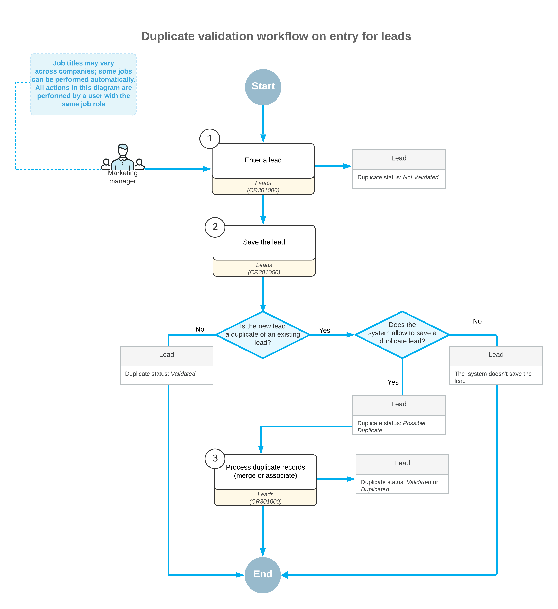

# Record Validation for Duplicates: General Information {#_4c9e26ee-36ca-48f3-87dc-f2449266ad1e .concept}

Duplicate records across your leads, contacts, customers, vendors, and business accounts can create data-quality issues that slow down your sales, marketing, and financial processes. Duplicates may lead to repeated customer communication, diminished productivity for your teams, and inaccurate reporting. Duplication is more likely when records are created manually, imported in bulk, or generated by extending an existing business account.

To help maintain clean and reliable information, Acumatica ERP provides flexible tools for identifying, preventing, and resolving duplicate records.

## Learning Objectives { .section}

In this chapter, you will do the following:

-   Become familiar with the process of duplicate validation, merging, and association of duplicate records
-   Validate individual leads for duplicates
-   Merge duplicate leads
-   Associate a lead with a duplicate contact
-   Validate multiple leads for duplicates

## Applicable Scenarios { .section}

You may want to learn how to validate records for duplicates in Acumatica ERP in scenarios that include the following:

-   You’re creating a new lead, customer, or vendor and need to check the record for duplicates and process any duplicate records.
-   You’ve imported to the system a batch of new leads, business accounts, or customers and need to check these records for duplicates.
-   You regularly validate all records in the system for duplicates, and it is time to again initiate this process.

## Using Record Pairs in Duplicate Validation {#_6e44cf9f-926b-48e8-b71d-932190e18d25 .section}

In Acumatica ERP, you can validate records for duplicates by using the rules specified on the [Duplicate Validation](CR_10_30_00.md) \(CR103000\) form for the following predefined record pairs:

-   **Lead to Lead**: The system searches for duplicates of a lead among other existing leads.
-   **Lead to Contact**: The system searches for duplicates of a lead among existing contacts.
-   **Lead to Account**: The system searches for duplicates of a lead among existing business accounts.
-   **Contact to Contact**: The system searches for duplicates of a contact among other existing contacts.
-   **Contact to Lead**: The system searches for duplicates of a contact among existing leads.
-   **Contact to Account**: The system searches for duplicates of a contact among existing business accounts.
-   **Account to Account**: The system searches for duplicates of a business account, customer, or vendor among other existing business accounts, customers, and vendors.

For details about duplicate validation rules, see [Duplicate Validation: Rules](../ImplementationGuide/config_CRM_Duplicate_Validation_Rules.md).

## Applying Duplicate Validation Rules { .section}

The system applies the duplicate validation rules specified for the record pairs on the [Duplicate Validation](CR_10_30_00.md) \(CR103000\) form when:

-   You manually validate an existing record by clicking **Check for Duplicates** on the More menu of the [Leads](CR_30_10_00.md) \(CR301000\), [Contacts](CR_30_20_00.md) \(CR302000\), [Business Accounts](CR_30_30_00.md) \(CR303000\), [Customers](AR_30_30_00.md) \(AR303000\), or [Vendors](AP_30_30_00.md) \(AP303000\) form.
-   You create a lead, contact, business account, customer, or vendor and attempt to save it for the first time.
-   You mass-validate records on the [Validate Records](CR_50_34_30.md) \(CR503430\) form. For details, see [Record Validation for Duplicates: Mass-Validation of Records](CRM_Mktg_Validating_Recs_Duplicates_Mass-Validating_Recs.md) and [Record Validation for Duplicates: To Validate Multiple Leads for Duplicates](CRM_Mktg_Validating_Recs_Duplicates_Validate_Multiple_Leads.md).

After record validation, the system inserts the *Validated* or *Possible Duplicate* status in the **Duplicate** box in the Summary area of the [Leads](CR_30_10_00.md), [Contacts](CR_30_20_00.md), or [Business Accounts](CR_30_30_00.md) form. The validation status of a customer or vendor is shown in the **Duplicate** box of the linked business account.

## Validating Records for Duplicates on Entry {#_3f34e222-85b8-4a5b-ae3e-cb911f1fab77 .section}

If the **Validate on Entry** check box is selected on the [Duplicate Validation](CR_10_30_00.md) \(CR103000\) form for a pair of records, the system validates the applicable records on entry. When you enter the settings \(including the address and contact information\) on the data entry form for the record from this pair and click **Save**, the system validates the records for duplicates.

**Tip:** *Address and contact information* refers to the settings on the **General** tab of the [Leads](CR_30_10_00.md), [Contacts](CR_30_20_00.md), [Customers](AR_30_30_00.md), [Vendors](AP_30_30_00.md), or [Business Accounts](CR_30_30_00.md) form. This information may include the first name, last name, company name, country, postal code, email address, or phone number.

If at least one duplicate has been found, depending on the settings specified on the [Duplicate Validation](CR_10_30_00.md) form for the record pair, the system does one of the following:

-   Saves the record without notifying you about the possible duplicate
-   Displays a warning dialog box asking if you want to save the duplicate record
-   Prevents you from saving a duplicate record and shows an error message

Also, the **Duplicates** tab appears on the data entry form where you create the record.

For details about validating new leads and contacts on entry, see [Record Validation for Duplicates: To Validate a Lead for Duplicates](CRM_Mktg_Validating_Recs_Duplicates_Validating_Lead.md).

## Managing Duplicates { .section}

If you’ve saved a record with a possible duplicate, you can do the following on the **Duplicates** tab of the applicable entry form:

-   Merge duplicate records of the same type \(only if they’re leads, contacts, or business accounts\) into one record. For details, see [Record Validation for Duplicates: Merging of Duplicate Records](CRM_Mktg_Validating_Recs_Duplicates_Merging_of_Records.md).
-   Merge the customer or vendor record with a duplicate business account record.
-   Associate records of different types \(only for leads, contacts, and business accounts\) with each other. For details, see [Record Validation for Duplicates: Association of Leads and Contacts](CRM_Mktg_Validating_Recs_Duplicates_Linking_Leads_Contacts.dita.md) and [Record Validation for Duplicates: Association of Leads with Business Accounts and Contacts](CRM_Mktg_Validating_Recs_Duplicates_Linking_Leads_with_Contacts_Accounts.md).

If the record on the **Duplicates** tab isn’t a duplicate, click **Mark as Validated** on the More menu to change the duplicate validation status of both records to *Validated*. If you validate a customer or vendor record, the *Validated* status will also be assigned to the linked business account.

Once the duplicates are merged or validated, the **Duplicates** tab disappears from the form.

## Workflow of Duplicate Validation on Entry for Leads { .section}

The following diagram illustrates the workflow of duplicate validation on entry for leads. Although the diagram illustrates the workflow for leads, duplicate validation for other records works similarly.

## Supporting User-Defined Fields During the Merge of Duplicate Records { .section}

If user-defined fields have been added to the forms of records validated for duplicates, you can display them in the tables on each form's **Duplicates** tab. To do this, open the Column Configuration dialog box for the applicable table and select the check boxes of the user-defined fields.

In the **Merge Conflicts** dialog box, the system lists user-defined fields that have the same attribute identifiers and different values in a target record and in a duplicate record. When you merge duplicate records in the **Merge Conflicts** dialog box, you can indicate to the system which settings to use: those of the target record, or those of the duplicate record.

**Parent topic:**[Validating Records for Duplicates](../UserGuide/CRM_Mktg_Validating_Recs_Duplicates_Mapref.md)

