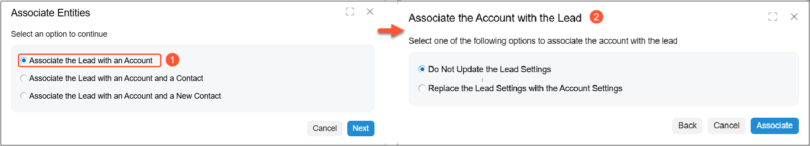
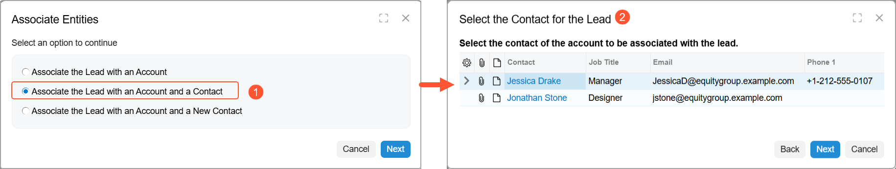
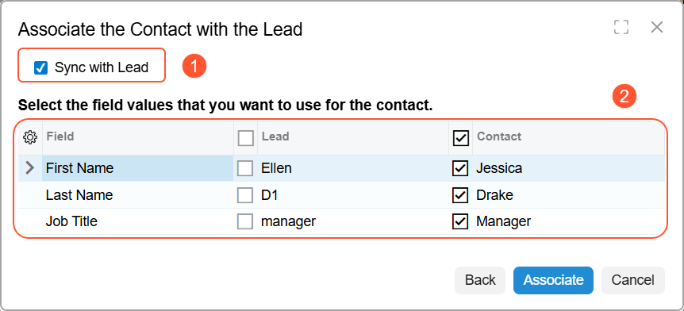
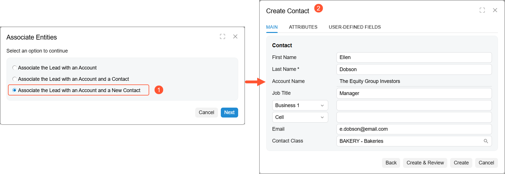

# Record Validation for Duplicates: Association of Leads with Business Accounts and Contacts {#_88857bb4-e683-4c07-8fc9-2d21aab936e3 .concept}

During the association of a lead to a business account, you can update specific contact settings in any contact associated with the business account, create a new contact and associate it with the lead, or associate the lead with the business account without contact creation.

## Association of Leads with Business Accounts and Contacts on the Duplicates Tab { .section}

When you have performed duplicate validation for an individual lead or a group of leads, and at least one duplicate business account for a lead has been found, you can associate the lead with a business account that is listed on the **Duplicates** tab of the [Leads](CR_30_10_00.md) \(CR301000\) form. The duplicate values of UI elements in the table are highlighted.

You start associating the lead with the business account by selecting a duplicate business account in the **Records for Association** table on the **Duplicates** tab and clicking **Associate** on the table toolbar. In the Associate Entities wizard, which opens, you can do any of the following:

-   Associate the lead with the business account without selecting or creating a contact.
-   Associate the lead with an existing contact of the business account. If any settings are in conflict, you can choose which settings are in use or leave the existing settings.
-   Create a new contact for the business account and associate the new contact with the lead.

In the wizard, if you select **Associate the Lead with an Account** \(Item 1 below\) and click **Next**, the Associate the Account with the Lead page \(Item 2\) opens. Select one of the following options:

-   *Do Not Update the Lead Settings*: In this case, when you click **Associate**, the lead is associated with the business account, but the contact and address settings of the lead remain unchanged after you save the changes.
-   *Replace the Lead Settings with the Account Settings*: In this case, when you click **Associate**, the lead is associated with the business account and the contact and address settings of the lead will be updated with the settings of the associated business account.

    

In the wizard, if you select **Associate the Lead with an Account and a Contact** \(Item 1 in the following screenshot\) and click **Next**, the Select the Contact for the Lead page opens \(Item 2\).

On the Select the Contact for the Lead page, you can do the following:

1.  Select the contact to be associated with the lead and click **Next**.

    

2.  On the Associate the Contact with the Lead page, which opens, associate the lead with the selected contact of the business account as follows:

    -   Select **Sync with Lead** check box \(Item 1 in the following screenshot\) if you want to synchronize the contact settings in the lead and the associated contact. Then select the needed settings in the table \(Item 2\), and click **Associate**. The wizard is closed. After you save the changes on the currently opened form, the lead is associated with the contact and the business account. In this case, the contact and address settings in the lead and the associated contact will be synchronized.
    -   Clear the **Sync with Lead** check box if you do not want to synchronize the contact settings in the lead and the associated contact. In this case, the settings in the table become unavailable. Click **Associate** and the wizard is closed. After you save the changes on the currently opened form, the lead is associated with the contact and the business account. In this case, the contact settings of the lead and the associated contact remain unchanged.
    

In the wizard, if you select **Associate the Lead with an Account and a New Contact** \(Item 1 in the following screenshot\) and click **Next**, the Create Contact page \(Item 2\) opens. On the page, you can specify the settings of the contact and create the contact by clicking **Create** or **Create and Review**.

The system creates the contact and associates this contact with the lead and the business account.

**Parent topic:**[Validating Records for Duplicates](../UserGuide/CRM_Mktg_Validating_Recs_Duplicates_Mapref.md)

