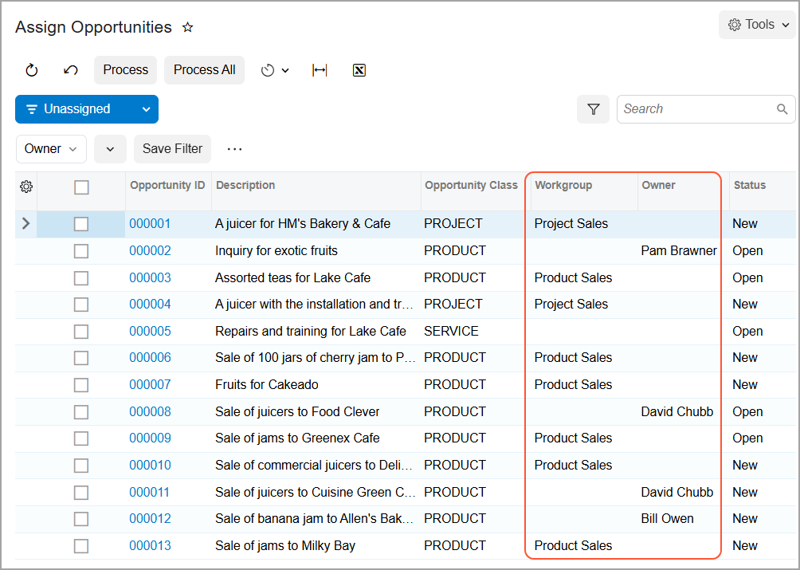

# Opportunity Assignment to Owners and Workgroups: Process Activity {#_2b5ff479-b8f1-4a60-8273-0a838e6df7fe .task}

The following activity demonstrates how to assign opportunities to owners and workgroups and how to set up the system to assign opportunities to owners automatically. The activity will show you how to define an opportunity class so that opportunities of the class are assigned to their creators by default. You will also practice manually assigning opportunities to the appropriate owners, both for an individual opportunity and by using the mass processing form to assign multiple users to the needed owners.

**Attention:** This activity is based on the *U100* dataset. If you are using another dataset or if any system settings have been changed in *U100*, these changes can affect the workflow of the activity and the results of the processing. To avoid issues, restore the *U100* dataset to its initial state.

## Story { .section}

Suppose that you are David Chubb, a sales manager of the SweetLife Fruits &amp; Jams company.You are going on vacation and you need to temporarily assign the opportunity you have started working on to your colleague, Pam Brawner.

You will also change the *SERVICE* opportunity class so that the user who creates a new opportunity is assigned to be its owner. Finally, you will mass-assign the unassigned opportunities of the *PRODUCT* and *PROJECT* opportunity classes to workgroups.

## Configuration Overview { .section}

In the *U100* dataset, for the purposes of this activity, the following tasks have been performed:

-   On the [Enable/Disable Features](CS_10_00_00.md) \(CS100000\) form, the *Customer Management* feature has been enabled. This feature provides the customer relationship management \(CRM\) functionality, including lead and customer tracking, as well as the handling of sales opportunities, contacts, marketing lists, and marketing campaigns.
-   On the [Company Tree](EP_20_40_61.md) \(EP204061\) form, the company tree has been configured. It includes the *Product Sales* and the *Project Sales* workgroups, as well as the employees in the *Sales* department.
-   On the [Employees](EP_20_30_00.md) \(P203000\) form, the *Pam Brawner*and *David Chubb* employees have been created , and included in the *Sales* department on the [Company Tree](EP_20_40_61.md) form.
-   On the [Opportunity Classes](CR_20_90_00.md) \(CR209000\) form, the *PRODUCT*, *PROJECT*, and *SERVICE* opportunity classes have been created.
-   On the [Assignment Maps](EP_20_50_10.md) \(EP205010\) form, the *Opportunity Assignment Map* has been created. According to the rules \(and their conditions and actions\) specified in this assignment map, the opportunities of the *PROJECT* opportunity class are assigned to the *Project Sales* workgroup in the *Sales* department. The opportunities of the *PRODUCT* opportunity class are assigned to the *Product Sales* workgroup in the SweetLife *Sales* department.
-   On the [Opportunities](CR_30_40_00.md) \(CR304000\) form, the opportunity with the *Inquiry for exotic fruits* description, has been created.

## Process Overview { .section}

In this activity, you will do the following:

1.  On the [Opportunities](CR_30_40_00.md) \(CR304000\) form, manually assign a particular opportunity to an owner.
2.  On the [Opportunity Classes](CR_20_90_00.md) \(CR209000\) form, specify how the system assigns the default owner of opportunities of a particular class.
3.  On the [Assign Opportunities](CR_50_31_10.md) \(CR503110\) form, assign selected opportunities to owners.

## System Preparation { .section}

Before you start assigning opportunities to owners, you should do the following:

1.  Launch the Acumatica ERP website with the *U100* dataset preloaded
2.  Sign in to the system as sales manager David Chubb by using the following credentials:
    -   **Username**: *chubb*
    -   **Password**: *123*
3.  Make sure that on the Company and Branch Selection menu, in the top pane of the Acumatica ERP screen, the *SweetLife Head Office and Wholesale Center* branch is selected.
4.  Make sure that on the [Customer Management Preferences](CR_10_10_00.md) \(CR101000\) form, in the **Opportunity Assignment Map** box of the **Assignment Settings** section of the **General** tab, *Opportunity Assignment Map* has been specified. If it has not, select this assignment map, and save your changes. The system will use this assignment map during the process of mass-assigning opportunities.

## Step 1: Assigning an Opportunity to an Owner { .section}

To manually assign an opportunity to another owner, do the following:

1.  Open the *Inquiry for exotic fruits* opportunity on the [Opportunities](CR_30_40_00.md) \(CR304000\) form.
2.  In the **Owner** box of the Summary area, select *Pam Brawner*.

    **Tip:** You can also manually assign a particular opportunity to a workgroup in the **Workgroup** box on the **Additional Info** tab.

3.  On the form toolbar, click **Save**.

You have manually assigned an opportunity to another owner.

## Step 2: Specifying a Default Owner for New Opportunities of the Class { .section}

In this step, you will specify the owner of a new opportunity of the *SERVICE* opportunity class as its creator.

To specify the default owner of an existing opportunity class and make sure the owner is assigned correctly to a new opportunity of the class, do the following:

1.  Open the *SERVICE* opportunity class record on the [Opportunity Classes](CR_20_90_00.md) \(CR209000\) form.
2.  On the **Details** tab \(**Data Entry Settings** section\), in the **Default Owner** box, select *Creator*.
3.  On the form toolbar, click **Save**.
4.  Make sure that the option that you have just specified assigns new opportunities to owners correctly by doing the following:
    1.  On the [Opportunities](CR_30_40_00.md) \(CR304000\) form, add a new record.
    2.  In the **Opportunity Class** box of the Summary area, select *SERVICE*.
    3.  In the **Owner** box, notice that *David Chubb* is inserted in the box. Because this is the user account to which you are signed in and you are the creator of the opportunity, the setting of the opportunity class is causing the system to assign the owner appropriately.
    4.  In the **Description** box, type `Juicer repair for Food Clever store`.
5.  On the form toolbar, click **Save**.

You have specified how the system determines the default owner for opportunities of the *SERVICE* opportunity class and then created a new opportunity to test the setting. The system has correctly inserted the default owner for the new opportunity. Each time a user creates an opportunity of the *SERVICE* opportunity class, the system will insert the employee name of the creator of the opportunity as the owner of the opportunity.

## Step 3: Assigning Multiple Opportunities to Workgroups { .section}

Suppose that at the request of the director of your sales department, you need to regularly mass-assign the unassigned opportunities of the *PRODUCT* and *PROJECT* opportunity classes to workgroups. The system will assign these opportunities by using the *Opportunity Assignment Map*, which has been specified on the [Customer Management Preferences](CR_10_10_00.md) \(CR101000\) form. Based on this assignment map, the system will assign the opportunities of the *PROJECT* class to the *Project Sales* workgroup and the opportunities of the *PRODUCT* opportunity class to the *Product Sales* workgroup.

To mass-assign multiple opportunities to workgroups, do the following:

1.  Open the [Assign Opportunities](CR_50_31_10.md) \(CR503110\) form.
2.  On the form toolbar, click the **Filter Settings** button.
3.  In the filtering area, which opens, click the predefined *Owner* filter.
4.  In the Quick Filter menu, which opens, do the following to filter opportunities with no owner specified:

    1.  Select the *Is Empty* filter condition.
    2.  Click **Apply**.
    In the filtering area, you can see the *Owner: Is Empty* quick filter applied.

5.  Drag the header of the **Opportunity Class** column to the filtering area. The **Opportunity Class** quick filter button appears in the filtering area.
6.  Click the **Opportunity Class** quick filter button and in the Quick Filter menu, which opens, specify the following filter settings:

    1.  Select the *Equals* filter condition.
    2.  In the unlabeled box at the bottom of the menu, specify *PRODUCT*.
    3.  Click **Apply**.
    The table displays only opportunities of the *PRODUCT* class.

7.  On the form toolbar, click **Process All**. The **Processing** dialog box opens, showing the progress and, as soon as the processing has completed, the results of assigning the opportunities.

    **Attention:** If an assignment map contains errors, the system will list these errors in the **Processing** dialog box. You can view the errors by clicking the More button on the **Errors** tile: In the **Message** column, the system displays the text of each applicable error message.

8.  Click **Close** to close the dialog box and return to the form. The system has cleared the filter for the opportunity class.
9.  Click the header of the **Opportunity Class** column.
10. In the Quick Filter menu, which opens, specify the following filter settings:

    1.  Select the *Equals* filter condition.
    2.  In the unlabeled box at the bottom of the menu, specify *PROJECT*.
    3.  Click **Apply**.
    The table displays only opportunities of the *PROJECT* class.

11. On the form toolbar, click **Process All**. The **Processing** dialog box opens, showing the progress and, as soon as the processing has completed, the results of assigning the opportunities.
12. Click **Close** to close the dialog box.
13. Open the Column Configuration dialog box and select the **Workgroup** check box.
14. Click **OK**. The **Workgroup** column appears in the table.
15. In the filtering area, remove the *Owner: Is Empty* quick filter.
16. Review the **Workgroup** and **Owner** column. For the opportunities that did not have owners, in the **Workgroup** column, you can see the name of the workgroup to which the system has assigned the opportunities, as shown in the following screenshot.

    

You have assigned the unassigned opportunities to workgroups and owners according to the rules specified in the *Opportunity Assignment Map* assignment map on the [Assignment Maps](EP_20_50_10.md) \(EP205010\) form.

**Parent topic:**[Assigning Opportunities to Owners and Workgroups](../UserGuide/CRM_Sales_Assigning_Opportunities_to_Owners_Mapref.md)

