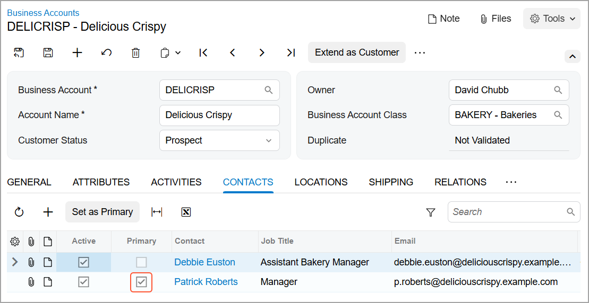

# Business Accounts: To Create a Business Account Manually {#_93074863-13bd-4db6-8a38-7a838246515f .task}

The following activity demonstrates how to manually create a business account, review and update the settings of the newly created account, and associate a primary contact with the account.

**Attention:** This activity is based on the *U100* dataset. If you are using another dataset or if any system settings have been changed in *U100*, these changes can affect the workflow of the activity and the results of the processing. To avoid issues, restore the *U100* dataset to its initial state.

## Story { .section}

Suppose that you are David Chubb, a sales manager of the SweetLife Fruits &amp; Jams company.You have received an inquiry submitted via the company’s website form by Debbie Euston, the assistant bakery manager at Delicious Crispy, a bakery that bakes pastries, usually with jam filling. Debbie is considering purchasing 100 jars of apple jam. You have created the lead in the system, emailed the company’s price list to Debbie, and called her, and Debbie confirmed her interest in purchasing the jam. You have created a contact, and now you need to create a business account in the system.

## Configuration Overview { .section}

In the *U100* dataset, for the purposes of this activity, the following tasks have been performed:

-   On the [Enable/Disable Features](CS_10_00_00.md) \(CS100000\) form, the following features have been enabled:
    -   *Customer Management*: This feature provides the customer relationship management \(CRM\) functionality, including lead and customer tracking, as well as the handling of sales opportunities, contacts, marketing lists, and campaigns.
    -   *Duplicate Validation* in the *Customer Management* group of features: This feature provides the duplicate validation functionality.
-   On the [Duplicate Validation](CR_10_30_00.md) \(CR103000\) form, duplicate validation settings for business accounts have been specified.
-   On the [Business Account Classes](CR_20_80_00.md) \(CR208000\) form, the *BAKERY* business account class has been defined in the system.
-   On the [Contacts](CR_30_20_00.md) \(CR302000\) form, the *Debbie Euston* and *Patrick Roberts* contacts have been created in the system.

## Process Overview { .section}

In this activity, you will do the following

1.  By using the [Contacts](CR_30_20_00.md) \(CR302000\) form as a starting point, create a business account manually based on a contact that has been added to the system.
2.  By using the [Business Accounts](CR_30_30_00.md) \(CR303000\) form, do the following:
    1.  Review and update the settings of the newly created business account.
    2.  Select a primary contact for the newly created business account.
    3.  Select an owner for the newly created business account.

## System Preparation { .section}

Before you start creating a business account, you should do the following:

1.  Launch the Acumatica ERP website with the *U100* dataset preloaded
2.  Sign in to the system as sales manager David Chubb by using the following credentials:
    -   **Username**: *chubb*
    -   **Password**: *123*
3.  Make sure that on the Company and Branch Selection menu, in the top pane of the Acumatica ERP screen, the *SweetLife Head Office and Wholesale Center* branch is selected.

## Step 1: Creating a Business Account Based on a Contact { .section}

To create a business account for the contact *Debbie Euston*, and specify additional settings for it \(its primary contact and its owner in your company who will work with the account\) do the following:

**Tip:** You can perform similar instructions to create a business account by using the [Leads](CR_30_10_00.md) \(CR301000\) form as a starting point.

1.  Open the *Debbie Euston* contact record on the [Contacts](CR_30_20_00.md) \(CR302000\) form.

    **Tip:** To search for a record in a list of records, you can enter a keyword or phrase in the Search box of the table toolbar. The system will find all the records that match your search criteria and display these records in the table.

2.  On the More menu, under **Record Creation**, click **Create Account**.

    **Tip:** You open the More menu by clicking the More button \(…\) on the form toolbar.

3.  In the **Create Account** dialog box, which opens, do the following:
    1.  On the **Main** tab of the dialog box, specify the settings of the business account as follows:
        1.  In the **Business Account ID** box, type `DELICRISP`.
        2.  In the **Business Account Class** box, select *BAKERY*.
    2.  Click **Create and Review**. The system creates a business account and opens the newly created account on the [Business Accounts](CR_30_30_00.md) \(CR303000\) form.
4.  On the **Contacts** tab of the form, notice that the row has been added for the *Debbie Euston* contact associated with the business account. Also notice that the **Primary** check box is cleared for the contact.
5.  On the **General** tab, in the **Name** box of the **Primary Contact** section, select the *Debbie Euston* contact. Notice that the **Primary Contact** section has become populated with the data from the associated contact.
6.  On the **Contacts** tab, you can see that the **Primary** check box has been selected for the *Debbie Euston* contact because the contact was defined as primary for the business account.
7.  On the **Relations** tab of the form, notice that the row has been added for the *Debbie Euston* contact associated with the business account. Also notice that the *Source* relational role is assigned to the contact meaning that the business account is created from the contact. For details, see [Managing Relations](CRM_Managing_Relations_Mapref.md).
8.  In the **Owner** box of the Summary area, select *David Chubb*, because this is the user account to which you are signed in and you are the employee in your company who will primarily work with this business account.
9.  Click Save and Close. The system returns you to the [Contacts](CR_30_20_00.md) form. In the **Business Account** box of the Summary area, you can see the name of the business account: *DELICRISP—Delicious Crispy*.

    **Tip:** In situations where you do not want to specify additional settings for the business account until later, you could click **Create** to close the **Create Account** dialog box. In this case, the new business account would be created. Also, the name of the business account would be inserted in the **Business Account** box of the Summary area on the [Contacts](CR_30_20_00.md) form, and the contact would be added to the **Contacts** tab of the [Business Accounts](CR_30_30_00.md) form, but no primary contact would be specified in this business account.

You have created a business account for the *Debbie Euston* contact.

## Step 2: Associating a New Contact with a Business Account { .section}

Suppose that Patrick Roberts, a new manager at Delicious Crispy has contacted you and asked to send him the SweetLife price list. You have created a new *Patrick Roberts* contact in the system and need to associate this contact with the *DELICRISP* business account.

To associate the *Patrick Roberts* contact with the *DELICRISP* business account, do the following:

1.  Open the *Patrick Roberts* contact record on the [Contacts](CR_30_20_00.md) \(CR302000\) form.

    **Tip:** To search for a record in a list of records, you can enter a keyword or phrase in the Search box of the table toolbar. The system will find all the records that match your search criteria and display these records in the table.

2.  In the Summary area of the form, in the **Business Account** box, click the magnifier button.
3.  In the lookup table that opens, select *DELICRISP*.
4.  On the form toolbar, click **Save**.

You have associated a new contact with the business account. The system has added this contact on the **Contacts** tab of the [Business Accounts](CR_30_30_00.md) \(CR303000\) form.

## Step 3: Changing the Primary Contact for the Business Account { .section}

Suppose that Debbie Euston has been promoted to another job in the company, and now you should contact her colleague, Patrick Roberts. You have created the *Patrick Roberts* contact and associated this contact with the *DELICRISP* business account as described in the previous step.

To change the primary contact for the *DELICRISP* business account, do the following:

1.  While you are still viewing the *Patrick Roberts* contact on the [Contacts](CR_30_20_00.md) \(CR302000\) form, in the Summary area, click the link in the **Business Account** box.
2.  On the **General** tab of the [Business Accounts](CR_30_30_00.md) \(CR303000\) form, which opens in a pop-up window, in the **Name** box of the **Primary Contact** section, click the magnifier button.
3.  In the lookup table, which opens, select *Patrick Roberts*. Notice that the **Primary Contact** section has become populated with the contact and address settings of the new primary contact. On the **Contacts** tab, you can see that the **Primary** check box has been selected for the *Patrick Roberts* contact because the contact was defined as primary for the business account \(see the following screenshot\).

    

4.  On the form toolbar, click **Save**.

You have changed the primary contact for the *DELICRISP* account to *Patrick Roberts*.

**Parent topic:**[Creating Business Accounts](../UserGuide/CRM_Sales_Creating_Bus_Accounts_Mapref.md)

