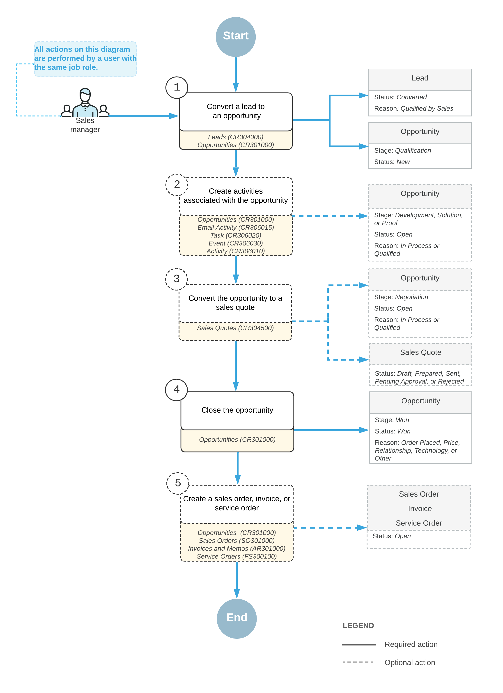
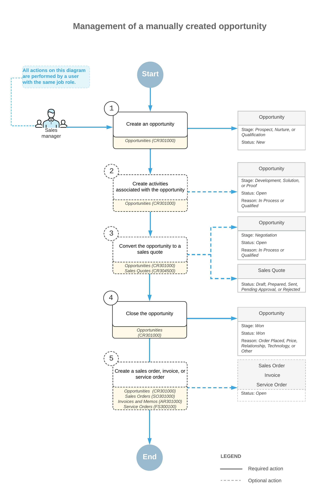

# Opportunity Management: General Information {#_d94fcfb0-b718-42ba-8f37-5bff44845d23 .concept}

Acumatica ERP helps you manage your opportunities for deals by using the workflow of opportunity management. With this workflow, you can estimate revenue by using opportunity stages and create documents associated with opportunities, such as sales quotes, sales orders, service orders, and invoices.

## Learning Objectives { .section}

In this chapter, you will learn how to do the following:

-   Make optimal use of the opportunity management capabilities of Acumatica ERP
-   Use opportunity stages to reflect in the system the advancement of an opportunity through your sales pipeline
-   Add products to an opportunity
-   Create a sales quote and send it to a customer
-   Select a primary quote for an opportunity
-   Open and close opportunities and process them through stages
-   Extend a business account of a prospect to be a customer
-   Create a sales order for an opportunity
-   Create an invoice for an opportunity
-   Send a sales order to a customer

## Applicable Scenarios { .section}

You may want to learn how to manage opportunities in Acumatica ERP in scenarios that include the following:

-   You sell products or services that require a continuous sales cycle, which may include product demos and the preparation of sales quotes, and you need to use the workflow of opportunity management.
-   You need to create an opportunity-based sales order and send it to your customer.

## Opportunity Management in Acumatica ERP { .section}

In Acumatica ERP, you can manage opportunities, including those for products or services that require a long sales cycle. During the sales cycle, an opportunity progresses through stages. You can define the needed opportunity stages to fit your company's business processes. Based on the defined opportunity stages, you specify the current stage of an opportunity in the **Stage** box of the Summary area on the [Opportunities](CR_30_40_00.md) \(CR304000\) form. For details, see [Opportunity Management: Opportunity Stages](CRM_Sales_Managing_Opportunities_Stages.md).

You can customize your opportunity management workflow so that an opportunity can be moved to a particular stage based on particular conditions. For example, an opportunity can be advanced to the *Qualification* stage only if the customer's budget for the opportunity has been specified in the system.

Depending on your company's sales processes, you can manage an opportunity by doing the following:

1.  Creating an opportunity through lead conversion or manually: For details, see [Qualifying Leads \(Sales\)](CRM_Sales_Qualifying_Leads_by_Sales_Mapref.md) and [Creating Opportunities](CRM_Sales_Creating_Opportunities_Mapref.md). You use the [Opportunities](CR_30_40_00.md) \(CR304000\) form for tracking the settings and details related to the opportunity.

    During the creation of the opportunity or at any later time, you can enter the list of products and services that your company is offering to the prospect or customer, including the prices for these products and services, on the **Details** tab of this form. You can apply discounts and calculate fees and taxes. For details, see [Opportunity Management: Products and Services in an Opportunity](CRM_Sales_Managing_Opportunities_Products_Services.md).

2.  Creating activities associated with an opportunity: In Acumatica ERP, you can track the prospect- or customer-related activities you perform to help your prospect or customer evaluate your products or services and make a decision to buy them. These activities may include creating emails, making phone calls, conducting meetings, or creating product demos to help your customer make an informed buying decision. You can create and track these activities by using the **Activities** tab of the [Opportunities](CR_30_40_00.md) form, as described in [Managing Emails and Activities](CRM_Mktg_Managing_Emails_Activities_Mapref.md). On this tab, activities related to an opportunity are listed, along with activities related to the sales quotes associated with the opportunity.
3.  Creating a sales quote: From the [Opportunities](CR_30_40_00.md) form, you can create a sales quote based on the opportunity, which causes the system to copy the relevant settings, including the products and services on the **Details** tab, to the [Sales Quotes](CR_30_45_00.md) \(CR304500\) form. You can then finish preparing the sales quote and send it to your prospect or customer, as described in [Opportunity Management: Sales Quotes](CRM_Sales_Managing_Opportunities_Sales_Quotes.md). If your company’s sales processes include the approval of sales quotes, you can approve the needed sales quote by using an approval map, as described in [Approval Configuration: Approval Maps](../ImplementationGuide/config_Approvals_Create_Approval_Maps.md).

    Then you discuss the offer with the prospect or the customer until it has been agreed upon or declined. If you need to create multiple sales quotes, you can mark one of them as a primary quote; the system uses the primary sales quote as the source of particular settings of the opportunity, such as the list of products, the currency and currency rate, the tax details, and the discount details.

4.  Closing the opportunity: The opportunity can be closed as won or lost. For details, see [Opportunity Management: To Create an Opportunity-Based Sales Order](CRM_Sales_Managing_Opportunities_To_Create_an_Oppty-Based_Sales_Order.md).
5.  Creating a sales order based on the opportunity \(optional\): For details, see [Opportunity Management: Sales Orders](CRM_Sales_Managing_Opportunities_Sales_Orders.md).
6.  Creating a service order based on the opportunity \(optional\): For details, see [Opportunity-Related Service Orders: General Information](ServMgmt_Service_Order_from_Opportunity_GeneralInfo.md).
7.  Creating an invoice based on the opportunity \(optional\): For details, see [Opportunity Management: Invoices](CRM_Sales_Managing_Opportunities_Invoices.md).

## Workflow of Opportunity Management { .section}

The following diagram illustrates the management of an opportunity that has been created through lead conversion.

The following diagram illustrates the management of a manually created opportunity.

## Template-Based Emails Related to Opportunities { .section}

A system administrator can configure Acumatica ERP to automatically send template-based emails related to opportunities. For example, the administrator might set up the system to send an email to the owner of an opportunity about the expiration of this opportunity. For details, see [Business Events: Subscribers](SA_Using_Business_Events_Subscribers_Concept.md).

**Parent topic:**[Managing Opportunities](../UserGuide/CRM_Sales_Managing_Opportunities_Mapref.md)

