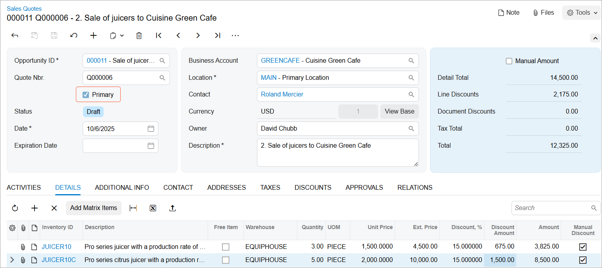

# Opportunity Management: To Create a Sales Quote {#_b235c9bd-d096-459f-a31c-8af8f5fccac5 .task}

The following activity demonstrates how to create a sales quote in Acumatica ERP.

**Attention:** This activity is based on the *U100* dataset. If you are using another dataset or if any system settings have been changed in *U100*, these changes can affect the workflow of the activity and the results of the processing. To avoid issues, restore the *U100* dataset to its initial state.

## Story { .section}

Suppose that you are David Chubb, a sales manager of the SweetLife Fruits &amp; Jams company.Your customer, the Cuisine Green Cafe chain in New York, would like to purchase juicers, and you have discussed the purchase with Roland Mercier, the cafe manager. You have created an opportunity in the system and added the details of the juicers to the opportunity. Now you need to create a sales quote to confirm the purchase with the customer and be sure both organizations are in agreement.

## Configuration Overview {#section_tz4_djx_cnb .section}

In the *U100* dataset, for the purposes of this activity, the following tasks have been performed:

-   On the [Enable/Disable Features](CS_10_00_00.md) \(CS100000\) form, the *Customer Management* feature has been enabled. This feature provides the customer relationship management \(CRM\) functionality, including lead and customer tracking, as well as the handling of sales opportunities, contacts, marketing lists, and marketing campaigns.
-   On the [Opportunities](CR_30_40_00.md) \(CR304000\) form, the *Sale of juicers to Cuisine Green Cafe* opportunity has been created.
-   On the [Business Accounts](CR_30_30_00.md) \(CR303000\) form, the *GREENCAFE* business account record has been created and extended as a customer, with its settings specified on the [Customers](AR_30_30_00.md) \(AR303000\) form.
-   On the [Stock Items](IN_20_25_00.md) \(IN202500\) form, the *JUICER10* and *JUICER10C* stock items, which hold the settings of two different professional series juicers, have been created.
-   On the **Details** tab of the [Opportunities](CR_30_40_00.md) form, three *JUICER10* and two *JUICER10C* stock items have been added to the *Sale of juicers to Cuisine Green Cafe* opportunity.

## Process Overview { .section}

In this activity, you will do the following:

1.  Create a sales quote on the [Opportunities](CR_30_40_00.md) \(CR304000\) form.
2.  Send the sales quote to the customer by email on the [Email Activity](CR_30_60_15.md) \(CR306015\) form.
3.  Create another sales quote that contains another set of products and discounts on the [Sales Quotes](CR_30_45_00.md) \(CR304500\) form, and set this sales quote as the primary sales quote, meaning that it contains the agreed-upon terms of the deal.

## System Preparation { .section}

Before you start creating a sales quote for an opportunity, you should do the following:

1.  Launch the Acumatica ERP website with the *U100* dataset preloaded
2.  Sign in to the system as sales manager David Chubb by using the following credentials:
    -   **Username**: *chubb*
    -   **Password**: *123*
3.  Make sure that on the Company and Branch Selection menu, in the top pane of the Acumatica ERP screen, the *SweetLife Head Office and Wholesale Center* branch is selected.

## Step 1: Creating a Sales Quote { .section}

To create a sales quote for the *Sale of juicers to Cuisine Green Cafe* opportunity, do the following:

1.  Open the *Sale of juicers to Cuisine Green Cafe* opportunity on the [Opportunities](CR_30_40_00.md) \(CR304000\) form.
2.  On the **Details** tab, notice that the *JUICER10* and *JUICER10C* stock items have been added, to represent the juicers in the proposed deal.
3.  On the form toolbar, click **Create Quote**.
4.  In the **Create Quote** dialog box, which opens, do the following:
    1.  In the **Quote Type** box, make sure that *Sales Quote* is selected.
    2.  Click **Create and Review**.

        The system closes the dialog box and opens the new sales quote with the *Draft* status on the [Sales Quotes](CR_30_45_00.md) \(CR304500\) form. On the **Details** tab, the system has added lines for the *JUICER10* and *JUICER10C* stock items, which it has copied from the opportunity.

5.  On the **Details** tab, do the following:
    1.  In the line with the *JUICER10* inventory item, in the **Discount, %** box, type `5`.
    2.  In the line with the *JUICER10C* inventory item, in the **Discount, %** box, type `5`.
6.  On the form toolbar, click **Save**.

You have created a sales quote. Notice that the system applied the discounts that you have entered and filled in the **Discount Amount** column for each product on the **Details** tab of the [Sales Quotes](CR_30_45_00.md) form. The system has also added a row with the sales quote to the table on the **Quotes** tab of the [Opportunities](CR_30_40_00.md) form.

## Step 2: Sending the Sales Quote to the Customer by Email { .section}

To send a sales quote to the customer by email, do the following:

1.  While you are still viewing the sales quote on the [Sales Quotes](CR_30_45_00.md) \(CR304500\) form, on the More menu, under **Other**, click **Print Quote**.

    **Tip:** You open the More menu by clicking the More button \(…\) on the form toolbar.

    The system opens the [Sales Quote](CR_60_45_00.md) \(CR604500\) report, which displays a ready-to-print version of the sales quote.

2.  On the report toolbar of the report, click **Send**.
3.  On the [Email Activity](CR_30_60_15.md) \(CR306015\) form, which opens in a pop-up window, enter a message for the customer, and on the form toolbar, click **Send**. This creates an email activity associated with the sales quote on the **Activities** tab of the [Sales Quotes](CR_30_45_00.md) form. A PDF file with the sales quote is attached to the email, which is added to the outgoing mail. If a schedule has been configured in the system, the email will be sent automatically to the customer email address from the default system email account the next time this schedule is executed.

    **Tip:** If the mailing settings have been specified and a template of the email has been created in the system, you can skip printing the sales quote and instead click **Send** on the More menu of the [Sales Quotes](CR_30_45_00.md) form. The system creates an email activity associated with the sales quote, adds the email on the **Activities** tab of the form, and sends it to the customer email address from the default system email account.

## Step 3: Copying a Sales Quote and Making the Sales Quote Primary { .section}

Suppose that your customer Roland Mercier has contacted you and informed you that the Cuisine Green Cafe would like to buy five *JUICER10C* juicers instead of two, but only if you give the company a 15 percent discount for the whole order. You have agreed to give the required discount. You need to create another sales quote and make this quote the primary one.

To copy a sales quote and define this sales quote as primary, do the following:

1.  Open the *Sale of juicers to Cuisine Green Cafe* sales quote on the [Sales Quotes](CR_30_45_00.md) \(CR304500\) form.
2.  On the More menu, under **Other**, click **Copy Quote**.
3.  In the **Copy Quote** dialog box, which opens, do the following:
    1.  In the **Description** box, correct the description as follows: `2. Sale of juicers to Cuisine Green Cafe`.
    2.  Click **OK**. The system closes the dialog box and opens the copied sales quote on the [Sales Quotes](CR_30_45_00.md) form.
    3.  On the **Details** tab, do the following:
        1.  In the row with the *JUICER10* inventory item, in the **Discount, %** column, type `15`.
        2.  In the row with the *JUICER10C* inventory item, do the following:
            1.  In the **Quantity** box, type `5`. This is the new quantity requested by the customer.
            2.  In the **Discount, %** box, type `15`.
4.  On the form toolbar, click **Save**.
5.  On the More menu, under **Other**, click **Set as Primary**.

You have created a sales quote and made it the primary sales quote, as shown in the following screenshot. Now you can send the new sales quote to the customer.

Notice that because this sales quote has become a primary quote for the *Sale of juicers to Cuisine Green Cafe* opportunity, the settings from the **Details** tab of the sales quote have been copied to the opportunity. You can view the opportunity on the [Opportunities](CR_30_40_00.md) form by clicking the link in the **Opportunity ID** box of the Summary area of the [Sales Quotes](CR_30_45_00.md) form.

**Parent topic:**[Managing Opportunities](../UserGuide/CRM_Sales_Managing_Opportunities_Mapref.md)

