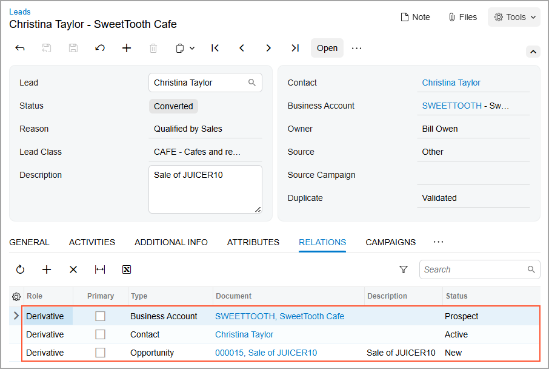

# Lead Qualification by Sales Teams: To Convert a Lead to an Opportunity {#_e0a41c8b-e20a-411f-b382-815bf4f72399 .task}

The following activity demonstrates how to convert a lead to an opportunity in Acumatica ERP.

**Attention:** This activity is based on the *U100* dataset. If you are using another dataset or if any system settings have been changed in *U100*, these changes can affect the workflow of the activity and the results of the processing. To avoid issues, restore the *U100* dataset to its initial state.

## Story { .section}

Suppose that you are David Chubb, a sales manager of the SweetLife Fruits &amp; Jams company. You have obtained a lead from the marketing team, which has qualified the lead and your manager has assigned the lead to you. Christina Taylor, a manager at SweetTooth Cafe, visited the company’s official website, chose a pro series juicer made by Squeezo Inc., and would like to buy the juicer. You need to get in touch with the lead and find out if Christina is interested in the product. If so, you need to convert the lead to an opportunity.

## Configuration Overview { .section}

In the *U100* dataset, for the purposes of this activity, the following tasks have been performed:

-   On the [Enable/Disable Features](CS_10_00_00.md) \(CS100000\) form, the *Customer Management* feature has been enabled.
-   On the [Lead Classes](CR_20_70_00.md) \(CR207000\) form, the *CAFE* lead class, which defines SweetLife's leads that represent employees from cafes and restaurants, has been created.
-   On the [Contact Classes](CR_20_50_00.md) \(CR205000\) form, the *CAFE* contact class has been created.
-   On the [Business Account Classes](CR_20_80_00.md) \(CR208000\) form, the *CAFE* business account class has been created.
-   On the [Opportunity Classes](CR_20_90_00.md) \(CR209000\) form, the *PRODUCT* opportunity class has been created.
-   On the [Leads](CR_30_10_00.md) \(CR301000\) form, the *Christina Taylor* lead has been created.

## Process Overview { .section}

In this activity, you will convert a lead to an opportunity on the [Leads](CR_30_10_00.md) \(CR301000\) form.

## System Preparation { .section}

Before you start converting the lead to an opportunity, you should do the following:

1.  Launch the Acumatica ERP website with the *U100* dataset preloaded
2.  Sign in to the system as sales manager David Chubb by using the following credentials:
    -   **Username**: *chubb*
    -   **Password**: *123*
3.  Make sure that on the Company and Branch Selection menu, in the top pane of the Acumatica ERP screen, the *SweetLife Head Office and Wholesale Center* branch is selected.

## Step: Converting a Lead to an Opportunity { .section}

To convert the *Christina Taylor* lead to an opportunity, do the following:

1.  Open the *Christina Taylor* lead record on the [Leads](CR_30_10_00.md) \(CR301000\) form.

    **Tip:** To search for a record in a list of records, you can enter a keyword or phrase in the Search box of the table toolbar. The system will find all the records that match your search criteria and display these records in the table.

2.  On the More menu, under **Processing**, click **Convert to Opportunity**.

    **Tip:** You open the More menu by clicking the More button \(…\) on the form toolbar.

3.  In the **Create Opportunity** dialog box, which opens, do the following:
    1.  In the **Subject** box of the **Opportunity** section of the **Main** tab, specify `Sale of JUICER10`.
    2.  In the **Opportunity Class** box, select *PRODUCT*.
    3.  In the **Business Account ID** box of the **Business Account** section, specify `SWEETTOOTH`.

        **Tip:** If for a lead class on the [Lead Classes](CR_20_70_00.md) \(CR207000\) form \(**Conversion Settings** section of the **Details** tab\) the **Require Account for Conversion to Opportunity** check box is cleared, a business account is not required in order to convert a lead to an opportunity. In this case, the dialog box does not contain the **Business Account** section.

    4.  In the **Business Account Class** box, select *CAFE*.
    5.  In the **Contact** section, notice that the system has inserted contact settings specified in the **Contact** section of the **General** tab of the [Leads](CR_30_10_00.md) form.

        **Tip:** You can change the settings of the contact or add any missing settings, if needed.

    6.  At the bottom of the dialog box, click **Create**.

        The system closes the dialog box, converts the lead to an opportunity that is created on the [Opportunities](CR_30_40_00.md) \(CR304000\) form, creates a contact and a business account for the lead, and returns you to the [Leads](CR_30_10_00.md) form. On the form, notice that the status of the lead is *Converted* and that values have been inserted in the **Contact** and **Business Account** boxes of the Summary area. Also notice that most of the settings in the Summary area and on the **General**, **Additional Info**, **Attributes**, **Campaigns**, and **Opportunities** tabs have become unavailable for editing.

        **Tip:** If you click **Create and Review** instead of **Create** in the **Create Opportunity** dialog box, the system closes the dialog box, converts the lead to an opportunity, creates a contact and a business account for the lead \(if these did not already exist and their settings have been specified in the dialog box\), and opens the [Opportunities](CR_30_40_00.md) form, on which you can view the settings of the opportunity, make any needed changes, and save the updated opportunity.

4.  On the **Relations** tab, in the table, view the summary information of the business account, contact, and opportunity associated with the lead, as shown in the following screenshot. For details, see [Managing Relations](CRM_Managing_Relations_Mapref.md).

    

You have converted the lead to an opportunity.

**Parent topic:**[Qualifying Leads \(Sales\)](../UserGuide/CRM_Sales_Qualifying_Leads_by_Sales_Mapref.md)

