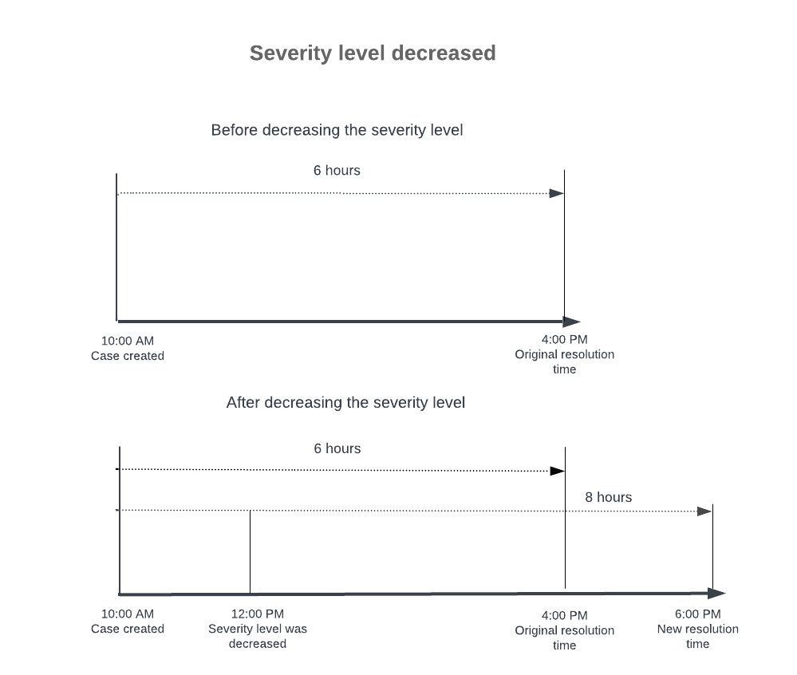
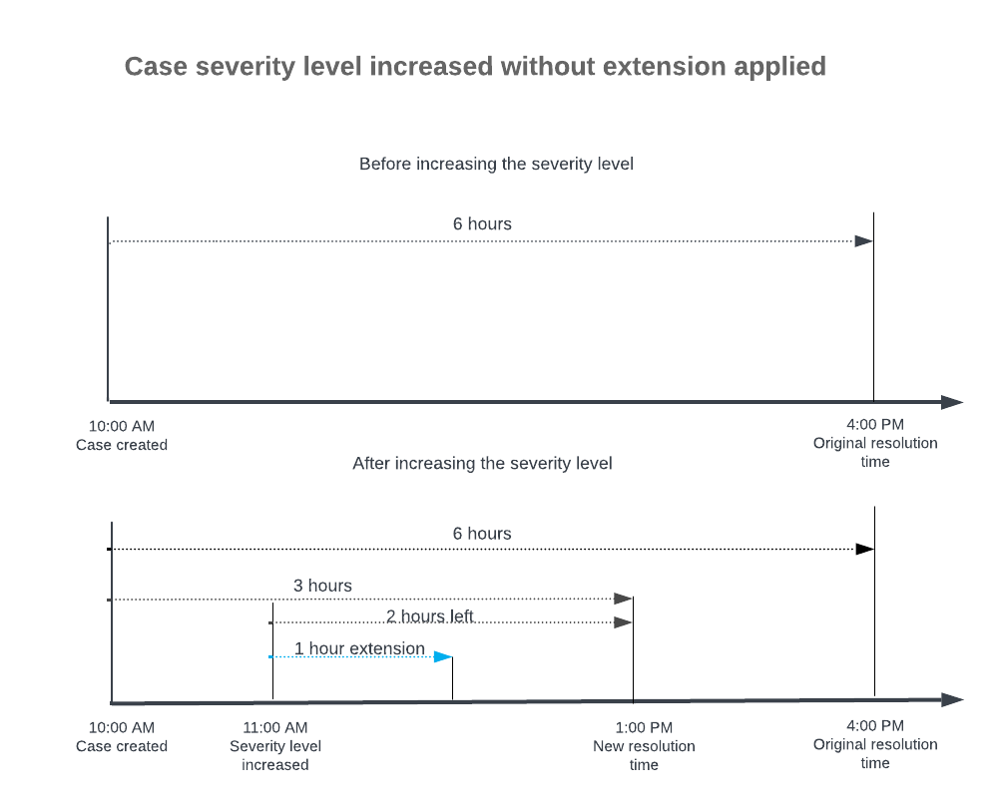
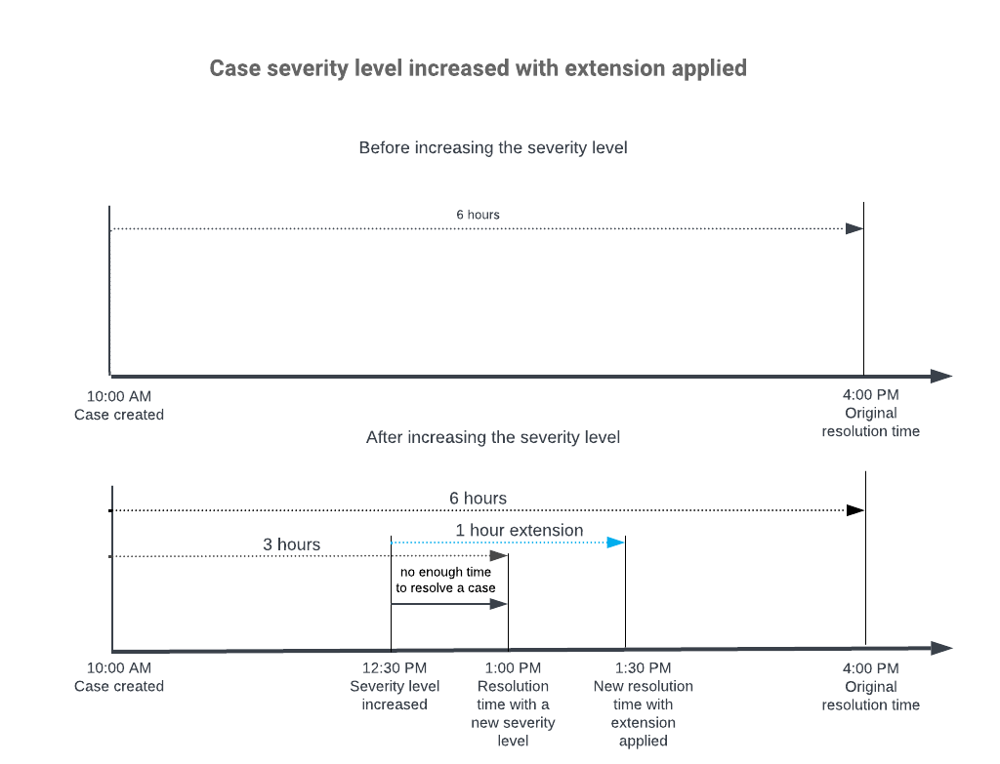
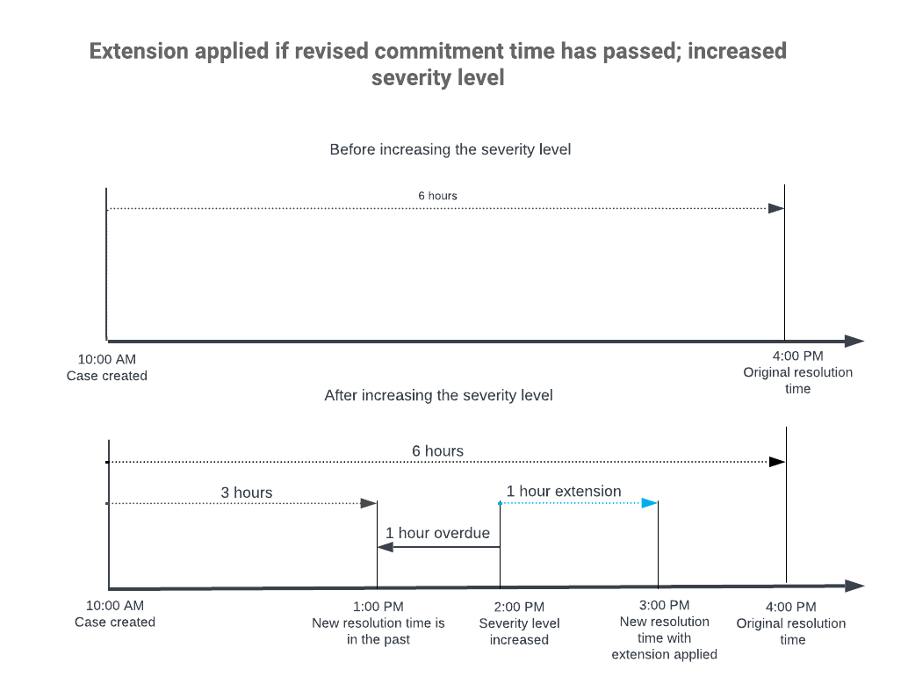

# Case Management: Time Extensions for Case Commitments {#_cf1cc9c3-9932-443f-922b-9ef0b793b8c9 .concept}

In Acumatica ERP, you can specify a time extension for any case commitment that you are tracking for the case class. The setting of time extensions and the scenarios in which they may or may not be applicable are described in the following sections.

## Time Extensions { .section}

For any class, you can specify the time extensions in addition to target times in the table on the **Commitments** tab of the [Case Classes](CR_20_60_00.md) \(CR206000\) form. For each severity listed in the table, you can specify a duration \(in hours, minutes, and seconds\) in any of the following columns:

-   **Initial Response Extension** if initial response times will be tracked for cases of the class with this severity. This column is available if the **Enable** check box with the **Initial Response Time Tracking** tooltip is selected.
-   **Response Extension** if response times will be tracked for cases of the class with this severity. This column is available if the **Enable** check box with the **Response Time Tracking** tooltip is selected.
-   **Resolution Extension** if resolution times will be tracked for cases of the class with this severity. This column is available if the **Enable** check box with the **Resolution Time Tracking** tooltip is selected.

These time extensions become applicable for a case of the class when the expected time to fulfill the commitment is reduced \(that is, the response or resolution must be delivered more quickly\). The extensions provide flexibility when more time may be needed due to changes in a case’s settings, such as an increase in a case’s severity or a change in the case class. In some scenarios, the customer service representative does not need to use the extension time, even if the commitment time has changed. For example, if the remaining time is enough to fulfill the commitment without the extension time.

The remaining sections of this topic describe how an extension time can work in a company that is tracking the time to resolve cases of a particular class.

## Example: Configuration of the Case Class { .section}

Suppose that a company has activated the tracking of the resolution time for the *High*, *Medium*, and *Low* case severity levels. For the case class, the administrative user began setting up this time tracking by selecting the **Enable** check box with the **Resolution Time Tracking** tooltip on the **Commitments** tab of the [Case Classes](CR_20_60_00.md) \(CR206000\) form. The company is expected to resolve the case during the following periods, depending on the severity level of the case:

-   *High*: Three working hours
-   *Medium*: Six working hours
-   *Low*: Eight working hours

The administrator specified these durations in the **Target Resolution Time** column of the **Commitments** tab in the rows with the corresponding severity levels. For cases with the *High* severity level, an extension of one working hour should be specified. Thus, in the row with the *High* severity level, the administrator has specified *000d 01h 00m* in the **Resolution Extension** column.

The following sections describe some scenarios that could occur during the case management workflow with these commitments specified for the class.

## Time Extension Not Applicable \(Decreased Severity Level\) { .section}

This scenario describes a situation in which the time to resolve a case of the class has increased after the severity level of the case has been decreased. \(A case with a lower severity can be resolved more slowly because it does not affect the company’s operations as seriously.\)

Suppose that a case with the *Medium* severity level was created today at 10:00 AM. Based on the resolution time commitment, the company must provide a solution for the case and close it by 4:00 PM. At 12:00 PM, the customer changed the severity level of the case to *Low*. Now the case must be resolved no later than 6:00 PM, so the time to resolve the case has increased. \(See the following diagram.\)

Given that the new resolution time is later than the original resolution time, the use of the extended time is not needed.

## Time Extension Not Applicable \(Increased Severity Level\) { .section}

This scenario describes a situation when the case severity level has increased, but no extension is applied. In this case, the configuration of target times gives the customer service representative enough time to resolve the case without an extension.

Suppose that a case with the *Medium* severity level was created today at 10:00 AM. Based on the resolution time commitment, the company must provide a solution for the case and close it by 4:00 PM. At 11:00 AM, the customer changed the severity level of the case to *High*, so the case must be resolved no later than 1:00 PM. Thus, from the moment the severity level was changed until the moment when the case should be closed, there are 2 hours remaining \(see the following diagram\).

Given that the remaining time \(two hours\) is greater than the specified extension of resolution time \(one hour\), the extension is not applicable.

## Time Extension Applied \(Increased Severity Level\) { .section}

This scenario describes the situation when the case severity level has increased, and the customer service representative does not have enough time to resolve the case due to a new resolution time. In this scenario, the time extension is applied to give the representative more time.

Suppose that a case with the *Medium* severity level was created today at 10:00 AM. Based on the resolution time commitment, the company must provide a solution for the case and close it by 4:00 PM. At 12:30 PM, the customer changed the severity level of the case to *High*; thus, the case must be resolved no later than 1:00 PM. Thus, from the time the severity level was changed \(12:30\) until the time when the case should be closed \(1:00\), there is not enough time remaining, and the use of the extended time is required. The system applies a one-hour time extension, setting the new resolution due time to 1:30 PM. The following diagram shows the change in the resolution time for the case.

The system also applies a time extension if the new severity level changes the commitment time to a time in the past. Suppose that in the previous scenario, the customer changed the severity level of the case to *High* at 2:00 PM. Thus, the case resolution time changes to 1:00 PM and the case becomes overdue. The system applies a one-hour time extension, setting the new resolution time to 3:00 PM, which is one hour after the time the level changed. \(See the following diagram.\)

**Parent topic:**[Managing Cases](../UserGuide/CRM_Support_Managing_Cases_Mapref.md)

