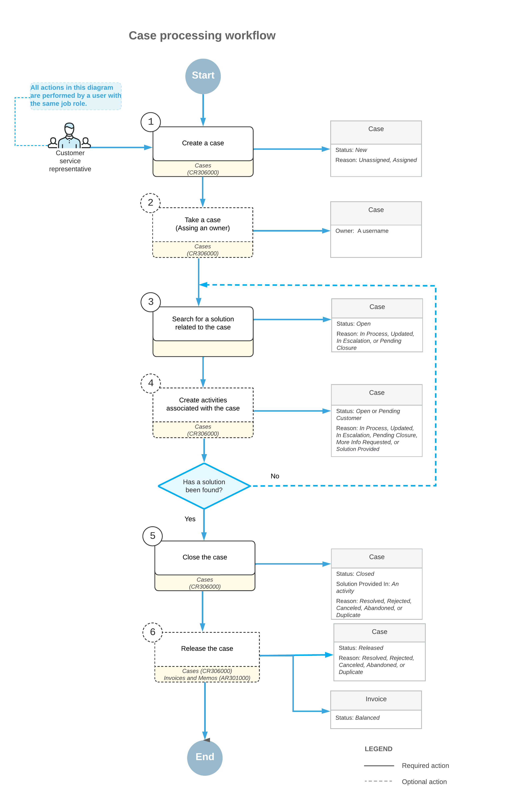

# Case Management: General Information {#_9a28dd64-008c-4a1e-9d6e-86194d0147c7 .concept}

Acumatica ERP provides tools that help your customer support team create, track, reassign, escalate, and resolve cases.

## Learning Objectives { .section}

In this chapter, you will learn how to do the following:

-   Make optimal use of the case management capabilities of Acumatica ERP
-   Develop a general understanding of billing settings for a case and case-related activities
-   Process a case and notice its statuses
-   Create an email and an activity associated with a case
-   Reassign a case to another owner
-   Escalate a case to another employee
-   Specify a case-related activity with a solution for a case
-   Track the time for fulfilling the company's commitments
-   Create a return order from a case
-   Become familiar with ways of associating a case with other cases
-   Prepare and review an accounts receivable invoice for a case

## Applicable Scenarios { .section}

You may want to learn how to manage cases in Acumatica ERP in scenarios that include the following:

-   You have investigated the issue related to a case and need to record your work on the case.
-   You had sent a request to clarify the information related to a case, but the customer did not answer before you left for vacation. Then you received the clarifying information on the case from the customer, but because you are on vacation, your manager needs to reassign it to another owner to continue work on the case.
-   You have explored a case and decided to escalate it to another employee or team with more information related to the issue in the case and a greater likelihood of resolving it quickly.
-   You have resolved a case and need to bill the customer for the work performed on it.
-   You need to monitor the company's commitments to ensure that they are fulfilled within the specified time.
-   You need to understand how many cases your team has in the backlog.

## Case Management in Acumatica ERP { .section}

In Acumatica ERP, you can create, process, and close cases. The processing of cases is described further in this topic. You can also associate a case with another case, if needed, as described in [Relationships Between Cases](#_d140fc2c-b988-4a90-82f8-f9e17c4e5d04).

Depending on your company's customer support processes, users involved in case management can manage a case by performing the following steps:

1.  Creating a case in the system: On the [Cases](CR_30_60_00.md) \(CR306000\) form, the appropriate employee creates a case to record the customer’s request or problem. For details, see [Creating Cases](CRM_Support_Creating_Cases_Mapref.md).
2.  Assigning a case to an owner: The case creator or another responsible user assigns the case to an owner. This user can begin work on the case or assign the case to another owner. For details, see [Case Assignment to Owners and Workgroups: General Information](CRM_Support_Assigning_Cases_to_Owners_GeneralInfo.md).
3.  Tracking the fulfillment times of the company's commitments \(optional, if configured for the case class\). For details, see [Case Management: Tracking of Case Commitment Times](CRM_Support_Managing_Cases_Tracking_Commitments_Time.md) and [Case Management: Time Extensions for Case Commitments](CRM_Support_Managing_Cases_Case_Commitments_Grace_Period.md).
4.  Escalating a case to another support level or team \(optional\): The owner of the case escalates the case if they have explored the problem and concluded that it needs to be transferred to a higher level of support that is better suited to find a solution, or to another team to perform some task for the case \(such as processing a customer return or refund\).
5.  Searching for a solution: This step may involve communication with the customer support team, your company, and the customer, as well as any needed external communication, in order to find the solution for the customer's request or problem.
6.  Creating activities associated with the case \(optional\): In Acumatica ERP, you can track the activities you perform to resolve the case. These activities may include creating emails, making phone calls, or conducting meetings. You can create and track these activities by using the **Activities** tab of the [Cases](CR_30_60_00.md) form. For details, see [Managing Emails and Activities](CRM_Mktg_Managing_Emails_Activities_Mapref.md). If an associated completed activity contains a solution for a case, you can mark it as a case solution on the form of its creation.
7.  Closing the case on the [Cases](CR_30_60_00.md) form.
8.  Releasing the case activities, the case, or both the case and the activities, and billing the customer by creating an invoice based on the case or the case activities \(optional\): Individual cases are billed once they are released on the [Cases](CR_30_60_00.md) form, and cases that are managed according to a contract are billed in batches when it is time to issue an invoice for the contract. For details, see [Case Management: Billable Cases](CRM_Support_Managing_Cases_Billable_Cases.md).

## Workflow of Case Processing { .section}

The following diagram illustrates the processing of a case in Acumatica ERP.

## Processing of a Case Through Statuses { .section}

In Acumatica ERP, as a case is being processed by a customer support team, it progresses through various statuses. The status is displayed in the **Status** box in the Summary area of the [Cases](CR_30_60_00.md) \(CR306000\) form. Because the system updates the status of the case during processing, the **Status** box is unavailable for editing. A user can initiate transitions between case statuses by clicking commands on the More menu or on the form toolbar of the [Cases](CR_30_60_00.md) form. The *expected next command*—the command that is the expected next step in the workflow—is displayed as a button on the form toolbar.

In Acumatica ERP, a case may be assigned one of the following statuses:

-   *New*: The case has been created in the system, but no work has been done on it yet. A case with this status can have the *Unassigned* or *Assigned* reason.
-   *Open*: The case is being worked on by the support team. A case with this status can have any of the following reasons: *Assigned*, *In Process*, *Updated*, *In Escalation*, or *Pending Closure*. If the case has been reopened by an incoming email, this status can also be assigned to the case along with the *Updated* reason.
-   *Pending Customer*: The support team is waiting for feedback or a response from a customer. A case with this status can have any of the following reasons: *More Info Requested*, *Solution Provided*, or *Pending Closure*.
-   *Closed*: The customer's problem has been resolved, a solution has been found, or no further work is expected to be done on the case. A case with this status can have any of the following reasons: *Resolved*, *Rejected*, *Canceled*, *Abandoned*, or *Duplicate*.
-   *Released*: The AR invoice for the work performed has been generated for the customer on the [Invoices and Memos](../Shared/../UserGuide/AR_30_10_00.md) \(AR301000\) form. A case with this status can have any of the following reasons: *Resolved*, *Rejected*, *Canceled*, *Abandoned*, or *Duplicate*.

You can analyze case processing and productivity-related metrics for your support team by generating support reports. For details, see [Support Report: General Information](CRM_Support_Reports_GeneralInfo.md).

## Relationships Between Cases {#_d140fc2c-b988-4a90-82f8-f9e17c4e5d04 .section}

A case can be associated with other cases. For example, a case might be defined so that it cannot be resolved until another case, known as a "blocker" case, is resolved.

**Tip:** The relations between cases can be specified only for informational purposes, so that your customer support team can track and enforce these relations; these relations are not enforced by the system.

On the **Related Cases** tab of the [Cases](CR_30_60_00.md) \(CR306000\) form, you can list cases related to the current case, and specify one of the following relation types for each listed case:

-   *Blocks*: The current case should not be closed before the listed case, which is a blocker case, has been closed.
-   *Depends On*: The listed case depends on the current case.
-   *Related*: There is a "peer" relation between the case with this relation and the current case. That is, neither case blocks or depends on the other case, but the two cases are related in some way.
-   *Duplicate Of*: The current case is a duplicate of the listed case.

## Template-Based Emails Related to Cases { .section}

A system administrator can configure Acumatica ERP to automatically send template-based emails related to cases. For example, the administrator might set up the system to send an email to a case owner about the assignment of a new case. For details, see [Business Events: Subscribers](SA_Using_Business_Events_Subscribers_Concept.md).

**Parent topic:**[Managing Cases](../UserGuide/CRM_Support_Managing_Cases_Mapref.md)

