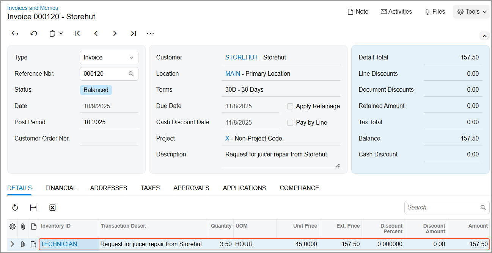

# Case Management: To Process a Billable Case {#_ce913b7d-0788-465e-abe6-96947096eb7b .task}

The following activity demonstrates how to process a billable case that has the *Per Case* billing mode in Acumatica ERP.

**Attention:** This activity is based on the *U100* dataset. If you are using another dataset or if any system settings have been changed in *U100*, these changes can affect the workflow of the activity and the results of the processing. To avoid issues, restore the *U100* dataset to its initial state.

## Story { .section}

Suppose that you are Jeffrey Vega, a technician at the SweetLife Fruits &amp; Jams company.You have received by email a request for the repair of a juicer from your customer Tonya Lawrence, a buyer at Storehut, a chain of supermarkets in New York. You have created a case in the system based on the email from Tonya and assigned the case to yourself. You need to repair the juicer, record the results of the repair in the system, and release the case for billing, causing an invoice to be created for the fixing of the juicer.

## Configuration Overview {#section_tz4_djx_cnb .section}

In the *U100* dataset, for the purposes of this activity, the following tasks have been performed:

-   On the [Enable/Disable Features](CS_10_00_00.md) \(CS100000\) form, the following features have been enabled:
    -   *Customer Management*: This feature provides the customer relationship management \(CRM\) functionality, including lead and customer tracking, as well as the handling of sales opportunities, contacts, marketing lists, and campaigns.
    -   *Case Management* in the *Customer Management* group of features: This feature gives customer support personnel the ability to create support cases, assign cases to owners, and process cases.
-   On the [Case Classes](CR_20_60_00.md) \(CR206000\) form, the *JREPAIR* case class, which defines cases related to the repair and maintenance of juicers, has been created. The *Per Case* billing mode has been specified for this case class.
-   On the [Cases](CR_30_60_00.md) \(CR306000\) form, a case has been created that has the *Request for juicer repair from Storehut* in the **Subject** column.
-   On the [Business Accounts](CR_30_30_00.md) \(CR303000\) form, the *STOREHUT* business account record has been created and extended as a customer, with its settings specified on the [Customers](AR_30_30_00.md) \(AR303000\) form.

## Process Overview { .section}

In this activity, you will do the following:

1.  Open the case on the [Cases](CR_30_60_00.md) \(CR306000\) form.
2.  Create a billable email on the [Email Activity](CR_30_60_15.md) \(CR306015\) form to record the results of the repair and inform the customer about fixing the juicer.
3.  Create a billable activity of the *Work Item* type on the [Activity](CR_30_60_10.md) \(CR306010\) form to record the results of delivering the repaired juicer to the client.
4.  Close the case on the [Cases](CR_30_60_00.md) form.
5.  Release the case for billing on the [Cases](CR_30_60_00.md) form, which causes the system to generate an AR invoice on the [Invoices and Memos](AR_30_10_00.md) \(AR301000\) form.
6.  View the AR invoice on the [Invoices and Memos](AR_30_10_00.md) form.

## System Preparation { .section}

Before you start working on the billable case, you should do the following:

1.  Launch the Acumatica ERP website with the *U100* dataset preloaded
2.  Sign in to the system as technician Jeffrey Vega by using the following credentials:
    -   **Username**: *vega*
    -   **Password**: *123*
3.  Make sure that on the Company and Branch Selection menu, in the top pane of the Acumatica ERP screen, the *SweetLife Head Office and Wholesale Center* branch is selected.
4.  Make sure that the business date in your system is set to 1/30/2026. If a different date is displayed, click the Business Date menu button in the top pane of the Acumatica ERP screen, and select 1/30/2026 in the calendar.

## Step 1: Opening the Case { .section}

To open the case for the request from the *STOREHUT* customer, do the following:

1.  Open the *Request for juicer repair from Storehut* case on the [Cases](CR_30_60_00.md) \(CR306000\) form.

    **Tip:** To search for a record in a list of records, you can enter a keyword or phrase in the Search box of the table toolbar. The system will find all the records that match your search criteria and display these records in the table.

2.  On the form toolbar, click **Open**.
3.  In the **Open** dialog box, which opens, click **OK**. The system closes the dialog box and returns you to the form.

You have opened the case. Notice that in the Summary area of the [Cases](CR_30_60_00.md) form, the system has inserted *Open* in the **Status** box and *In Process* in the **Reason** box.

## Step 2: Creating a Billable Email Associated with the Case { .section}

Suppose that you have fixed the juicer and need to record the billable time for the repair in the system and inform the customer about the result of the repair and the time for the delivery of the juicer. For simplicity, you will create one email for these purposes.

To create a billable email associated with the case, do the following:

1.  While you still viewing the case with the *Request for juicer repair from Storehut* subject on the [Cases](CR_30_60_00.md) \(CR306000\) form, on the More menu, under **Activities**, click **Create Email**.

    **Tip:** You open the More menu by clicking the More button \(…\) on the form toolbar.

    The [Email Activity](CR_30_60_15.md) \(CR306015\) form opens in a pop-up window. Notice that in the **To** box, the system has inserted the contact's name, *Tonya Lawrence*, and in the **Subject** box, the system has inserted the ID and the subject of the case.

2.  In the **From** box, select *support@sweetlife.example.com*.
3.  On the **Message** tab, type the text of the email body. As an example, you can type the following message:

    `Dear Tonya,`

    `The juicer JUICER15 has been repaired.`

    `The delivery is scheduled for tomorrow between 2 PM and 4 PM. Please confirm that the time range is suitable.`

4.  On the **Details** tab, do the following:
    1.  Select the **Track Time and Costs** check box. This causes the system to display additional UI elements on the tab.
    2.  In the **Project** box, select *X—Non-Project Code*.
    3.  Make sure that in the **Earning Type** box, *RG—Regular Hours* is selected, which means that you have performed the repair during your working hours.
    4.  Make sure that the **Billable** check box is selected.
    5.  In the **Time Spent** box, select *02:30*, which means that it took you two and a half hours to repair the juicer. Notice that in the **Billable Time** box, the system has inserted the time that you have specified in the **Time Spent** box.
5.  On the form toolbar, click **Save**.
6.  Click **Send**. The system closes the [Email Activity](CR_30_60_15.md) \(CR306015\) form and returns you to the [Cases](CR_30_60_00.md) form. Notice that a row with the *Email* type has been added to the table on the **Activities** tab of the [Cases](CR_30_60_00.md) form for the case.

    As a result, the email is generated by the system and added to the outgoing mail. If a schedule has been configured in the system, the email will be sent automatically the next time this schedule is executed.

    **Attention:** If the outgoing mail queue is too long, it may take time for the system to process and send all outgoing mail at once.

7.  On the **Activities** tab, in the **Summary** box, click the link to open the email.
8.  On the **Details** tab, in the **Status** box, select *Completed*.

    **Tip:** For simplicity, in this activity, you have changed the status of the email before receiving the confirmation from the customer. \(In actual case processing, you would change the status after receiving the confirmation.\) You can release a case \(which you will do later in this activity\) if all the activities associated with the case have the *Completed* status.

9.  On the form toolbar, click **Save**.
10. Close the form. The system returns you to the [Cases](CR_30_60_00.md) form with the case open.

## Step 3: Creating a Billable Activity of the Work Item Type Associated with the Case { .section}

Suppose that your customer has confirmed the delivery of the juicer that you have repaired and you need to record the time for the delivery in the system.

To create a billable activity of the *Work Item* type, do the following:

1.  While you are still viewing the case with the *Request for juicer repair from Storehut* subject on the [Cases](CR_30_60_00.md) \(CR306000\) form, on the table toolbar of the **Activities** tab, click **Create Activity** &gt; **Create Work Item**. The [Activity](CR_30_60_10.md) \(CR306010\) form opens in a pop-up window.
2.  In the **Summary** box, type a brief description of the activity: `Delivery of a juicer to Storehut`.
3.  In the **Status** box, select *Completed*.
4.  Make sure that the **Internal** check box is selected to hide the activity from the Self-Service Portal users.
5.  Select the **Track Time and Costs** check box. This causes the system to display additional UI elements in the Summary area.
6.  In the **Started On** box, specify the current date.
7.  In the **Project** box, select *X—Non-Project Code*.
8.  Make sure that in the **Earning Type** box, *RG—Regular Hours* is selected, which means that the juicer will be delivered during working hours.
9.  Make sure that the **Billable** check box is selected.
10. In the **Time Spent** box, select *01:00*, which means that it will take an hour to deliver the juicer. Notice that in the **Billable Time** box, the system has copied the time that you have specified in the **Time Spent** box.
11. In the text area of the **Description** tab, type your comments or any other information related to the delivery, such as `The courier Tim Fincher will deliver the juicer.`
12. On the form toolbar, click **Save**.
13. Close the form. The system returns you to the [Cases](CR_30_60_00.md) form. Notice that a row with the *Work Item* type has been added to the table on the **Activities** tab of the [Cases](CR_30_60_00.md) form for the case.

## Step 4: Closing the Case { .section}

To close the case for the *STOREHUT* customer, do the following:

1.  While you are still viewing the *Request for juicer repair from Storehut* case on the [Cases](CR_30_60_00.md) \(CR306000\) form, on the form toolbar, click **Close**.
2.  In the **Close** dialog box, which opens, do the following:
    1.  In the **Reason** box, select *Resolved*.
    2.  Click **OK**. The system closes the dialog box and returns you to the form.

You have closed the case. Now you can bill your customer for the repair of the juicer by releasing the case, which causes the system to create an invoice. Notice that in the Summary area of the [Cases](CR_30_60_00.md) form, the system has inserted *Closed* in the **Status** box and *Resolved* in the **Reason** box.

## Step 5: Releasing the Case { .section}

To release the *Request for juicer repair from Storehut* case, do the following:

1.  While you are still viewing the case on the [Cases](CR_30_60_00.md) \(CR306000\) form, open the **Activities** tab.
2.  On the table toolbar, click **Refresh** to make sure that all the activities are displayed.

    **Tip:** You need to refresh the data in the table if any automatic email notification related to case closure has been configured in the system and the corresponding notification template has been defined to save emails as activities on the **Activities** tab of the form. You may need to wait for a few moments until the system creates an email and lists this email on the **Activities** tab.

3.  In the **Status** column, make sure that all the rows have the *Completed* option.

    **Attention:** You can release a case if all the activities associated with the case have the *Completed* status.

4.  On the table toolbar, click **Release**.

    It may take some time for the system to release the case. When the case has been released, you will see a notification with a green vertical bar and a message indicating successful processing. In the **Status** box of the Summary area, the system changes the status of the case to *Released*. On the [Invoices and Memos](AR_30_10_00.md) \(AR301000\) form, the system creates an invoice associated with the case.

## Step 6: Viewing the Case-Based Invoice { .section}

To view the invoice associated with the *Request for juicer repair from Storehut* case, do the following:

1.  While you are still viewing the case on the [Cases](CR_30_60_00.md) \(CR306000\) form, on the More menu, under **Other**, click **View Invoice**.
2.  On the **Details** tab of the [Invoices and Memos](AR_30_10_00.md) \(AR301000\) form, which opens, notice one detail row with the following settings of the invoice \(see the following screenshot\):

    -   **Inventory ID**: The *TECHNICIAN* labor item
    -   **Unit Price**: The rate for the works performed
    -   **UOM**: HOUR
    -   **Quantity**: The number of hours that were spent to resolve the case
    

**Parent topic:**[Managing Cases](../UserGuide/CRM_Support_Managing_Cases_Mapref.md)

