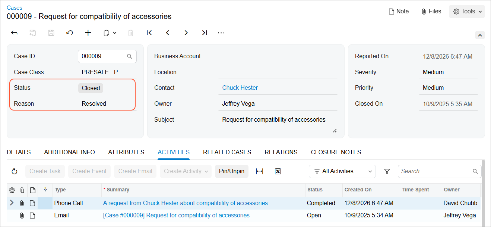

# Case Management: To Process a Non-Billable Case {#_175ed18f-9748-4683-a931-25654bc96c24 .task}

The following activity demonstrates how to process a non-billable case in Acumatica ERP.

**Attention:** This activity is based on the *U100* dataset. If you are using another dataset or if any system settings have been changed in *U100*, these changes can affect the workflow of the activity and the results of the processing. To avoid issues, restore the *U100* dataset to its initial state.

## Story { .section}

Suppose that you are Jeffrey Vega, a technician at the SweetLife Fruits &amp; Jams company. David Chubb, a sales manager, has created a case in the system based on a phone call from Chuck Hester, who is a purchase manager at Fruitland, a store in Baltimore. Chuck Hester is thinking of purchasing a commercial juicer from SweetLife, and Fruitland has a number of accessories for a similar juicer. Chuck needs to know if these accessories \(the feeder kit and the peel ejector kit\) suit the juicer that he might buy.

## Configuration Overview {#section_tz4_djx_cnb .section}

In the *U100* dataset, for the purposes of this activity, the following tasks have been performed:

-   On the [Enable/Disable Features](CS_10_00_00.md) \(CS100000\) form, the following features have been enabled:
    -   *Customer Management*: This feature provides the customer relationship management \(CRM\) functionality, including lead and customer tracking, as well as the handling of sales opportunities, contacts, marketing lists, and campaigns.
    -   *Case Management* in the *Customer Management* group of features: This feature gives customer support personnel the ability to create support cases, assign cases to owners, and process cases.
-   On the [Case Classes](CR_20_60_00.md) \(CR206000\) form, the *PRESALE* case class, which defines presales requests from potential clients and customers, has been created.
-   On the [Cases](CR_30_60_00.md) \(CR306000\) form, a case has been created that has *Request for compatibility of accessories* in the **Subject** column.
-   On the [Contacts](CR_30_20_00.md) \(CR302000\) form, the *Chuck Hester* contact has been created.

## Process Overview { .section}

In this activity, you will do the following:

1.  Open the case on the [Cases](CR_30_60_00.md) \(CR306000\) form.
2.  Create an email on the [Email Activity](CR_30_60_15.md) \(CR306015\) form to reply to the customer's request.
3.  Close the case on the [Cases](CR_30_60_00.md) \(CR306000\) form.

## System Preparation { .section}

Before you start working on the case, you should do the following:

1.  Launch the Acumatica ERP website with the *U100* dataset preloaded
2.  Sign in to the system as technician Jeffrey Vega by using the following credentials:
    -   **Username**: *vega*
    -   **Password**: *123*
3.  Make sure that on the Company and Branch Selection menu, in the top pane of the Acumatica ERP screen, the *SweetLife Head Office and Wholesale Center* branch is selected.

## Step 1: Opening the Case { .section}

To open the case for the request from the *Chuck Hester* contact, do the following:

1.  Open the *Request for compatibility of accessories* case on the [Cases](CR_30_60_00.md) \(CR306000\) form.

    **Tip:** To search for a record in a list of records, you can enter a keyword or phrase in the Search box of the table toolbar. The system will find all the records that match your search criteria and display these records in the table.

2.  On the form toolbar, click **Take Case**. Notice that in the **Owner** box, the system has inserted *Jeffrey Vega*.
3.  Click **Open**.
4.  In the **Open** dialog box, which opens, click **OK**. The system closes the dialog box and returns you to the form.

You have opened the case. Notice that in the Summary area of the [Cases](CR_30_60_00.md) form, the system has inserted *Open* in the **Status** box and *In Process* in the **Reason** box.

## Step 2: Creating the Case-Related Email { .section}

Suppose that you have verified that the feeder kit and the peel ejector kit are compatible with the *JUICER10C* model.

To send an email to Chuck Hester communicating this information, do the following:

1.  While you are still viewing the case on the [Cases](CR_30_60_00.md) \(CR306000\) form, on the More menu, under **Activities**, click **Create Email**. The [Email Activity](CR_30_60_15.md) \(CR306015\) form opens in a pop-up window. Notice that in the **To** box, the system has inserted the contact's name, *Chuck Hester*, and in the **Subject** box, the system has inserted the ID and the subject of the case.

    **Tip:** You open the More menu by clicking the More button \(…\) on the form toolbar.

2.  In the **From** box, select the *support@sweetlife.example.com*.
3.  Select the **Internal** check box to hide the email from the Self-Service Portal users.
4.  On the **Message** tab, type the text of the email body. As an example, you can type the following message:

    `Dear Chuck,`

    `I am happy to confirm that the feeder kit and the peel ejector kit are compatible with the JUICER10C. You can easily use them with the juicer at your convenience.`

5.  On the form toolbar, click **Save**.
6.  Click **Send**. The system closes the [Email Activity](CR_30_60_15.md) form and returns you to the [Cases](CR_30_60_00.md) form. Notice that a row with the *Email* type is added to the table on the **Activities** tab of the [Cases](CR_30_60_00.md) form.

As a result, the email is generated by the system and added to the outgoing mail. If a schedule has been configured in the system, the email will be sent automatically the next time this schedule is executed.

**Attention:** If the outgoing mail queue is too long, it may take time for the system to process and send all outgoing mail at once.

## Step 3: Closing the Case { .section}

To close the *Request for compatibility of accessories* case, do the following:

1.  While you are still viewing the case on the [Cases](CR_30_60_00.md) \(CR306000\) form, on the form toolbar, click **Close**.
2.  In the **Close** dialog box, which opens, do the following:
    1.  In the **Reason** box, select *Resolved*.
    2.  Click **OK**. The system closes the dialog box and returns you to the form.

You have closed the case. Notice that in the Summary area of the [Cases](CR_30_60_00.md) form, the system has inserted *Closed* in the **Status** box and *Resolved* in the **Reason** box, as shown in the following screenshot.

**Parent topic:**[Managing Cases](../UserGuide/CRM_Support_Managing_Cases_Mapref.md)

