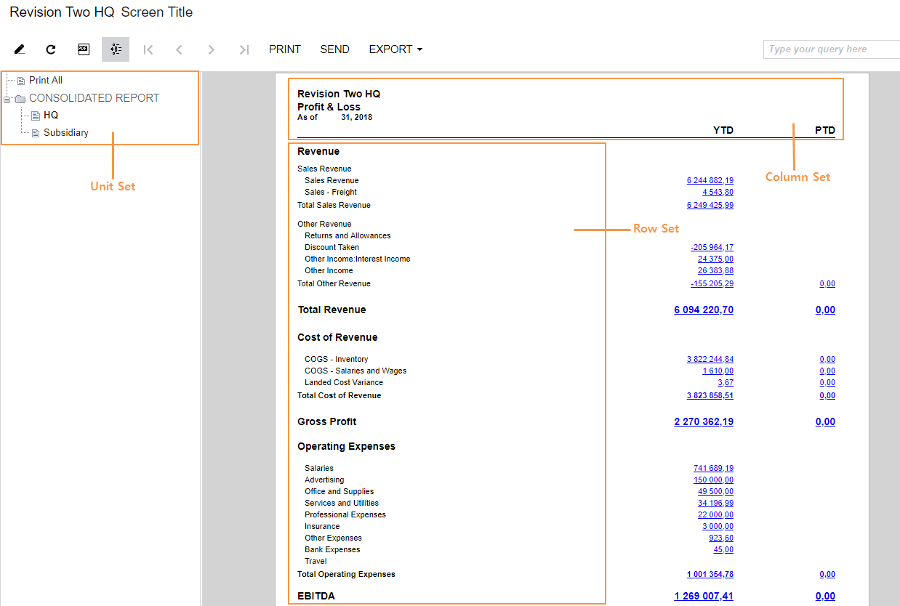

# Analytical Report Manager {#_3b87b2cb-7620-441b-bbf9-ae19ed966d5f .concept}

The Analytical Report Manager \(ARM\) is a web-based report access and management tool for creating and modifying analytical reports by retrieving ledger and project data.

You need no programming skills to use the ARM for modifying existing financial reports and developing new ones, such as Balance Sheet and Income Statement. You also need no knowledge about the structure of the Acumatica ERP database.

Report designers can design and run custom analytical reports by using advanced data selection criteria, data calculation rules, and customizable report layout design features. By using the Analytical Report Manager, you can perform the following tasks:

-   Create the layout and structure of an analytical report, based on your business requirements.
-   Define data selection criteria for the report with a high level of granularity. The entities specified as the data source could include, for example, a range of accounts, subaccounts, and financial periods.
-   Use advanced formulas to calculate values based on the information extracted from the data source.
-   Create consolidated reports based on the data from multiple data sources or analytical reports.
-   Localize the data used by a report if multilingual support of user input is configured.

## ARM and Report Designer { .section}

You can use the ARM toolkit rather than Acumatica Report Designer to create the following types of reports:

-   Financial reports that display data that is posted to the General Ledger accounts and accumulated in the General Ledger submodule
-   Project accounting reports that display data accumulated in the Projects submodule

## Report Creation { .section}

To create a report in ARM, do the following:

1.  Define your goals. You need to decide what kind of report to create and what data should be displayed in it.
2.  Design the report structure. For more information, see [Report Structure Design](CS__ARM_Designing_the_Report_Layout.md)
3.  Publish the report. For more information, see [To Publish the Analytical Report](CS__ARM_Publishing_the_Analytical_Report.md)
4.  Give access rights to the users that will use the report. For more information, see [ARM Access Rights](#_970e32a6-6b42-4f7d-8918-8754a6ec3432)

## Report Structure Elements { .section}

The structure of the analytical report determines the content to be presented and its appearance. To configure the report structure, you specify the units of the report and identify the rows and columns to be displayed. You define the report headers, and the headers for the individual columns and rows or for the specific groups of columns and rows. The formatting options can be defined for the entire report and for any particular row or column. By using formatting options, you can set up the report page layout, select font attributes, and visually emphasize rows or columns in the report.

The report in the following screenshot consists of a row set, a column set, and a unit set.

To design a report structure, you need to do the following:

-   Define the row set and column set
-   Optional: Specify the unit set for the report, if you want to split the report into sections
-   Optional: Specify the report formatting settings

For details about the particular structure elements, see [Row Sets](CS__ARM_Row_Set.md), [Column Sets](CS__ARM_Column_Set.md), and [Unit Sets](CS__ARM_Unit_Set.md).

For details about the design process, see [Report Structure Design](CS__ARM_Designing_the_Report_Layout.md).

For details about the formatting settings on every particular level, see [Row Sets](CS__ARM_Row_Set.md) and [Column Sets](CS__ARM_Column_Set.md)

For details about the formatting settings, see [Printing Style](CS__ARM_Printing_Style.md).

## Data Source Options { .section}

Data source options specify how the data will be selected for the report. Depending on the report structure, the data source can be defined for the whole report, and different data selection criteria can be used for the rows and columns in the data source editor. For detailed information about data source elements, see [Data Source](CS__ARM_Data_Source.md) and [Data Source Editor](CS__ref_Data_Source_Editor.md#)

## Data Transformation and Calculation Rules { .section}

To calculate the values in the report, you use formulas. Formulas describe data transformations and other operations performed with the data selected from the data source. The formulas can use the data selected from the data source as parameters. Depending on the report structure, formulas can be defined at the unit, row, or column level.

In [Formulas](CS__ARM_Formulas.md), you can find detailed descriptions of the formulas.

## Reports Based on the Data from Multiple Data Sources or Analytical Reports { .section}

You can use a unit set to organize the report structure when the groups of rows and columns included in the report use data from different data sources. For example, a unit set can include one unit or multiple units that specify how the data is selected, calculated, and displayed in reports. In the report, you can view data for each individual unit, which could be a branch or a cost center, as well as data consolidated for all the units. To define the data that should be included in the unit set and set up the formatting for the rows and columns, you can specify the values of the units in the unit set.

For details about the unit sets, see [Unit Sets](CS__ARM_Unit_Set.md).

## ARM Access Rights { .section}

When a report is published, the users who will generate the report must be granted access rights to this report.

In Acumatica ERP, you can customize the access rights of users to work with analytical reports. You can control their access to forms and operations based on each user's job responsibilities.

You can set up access to analytical reports by using the [Access Rights by Screen](SM_20_10_20.md) \(SM201020\) form; on this form, you select the **Site Map Location** of the published report form and then select the relevant level of access for a user role in **Access Rights** column. For more information on access rights, see [User Roles: General Information](User_Roles_GeneralInfo.md).

**Parent topic:**[Managing Analytical Reports](../UserGuide/GL__GL_ARM_Reports.md)

