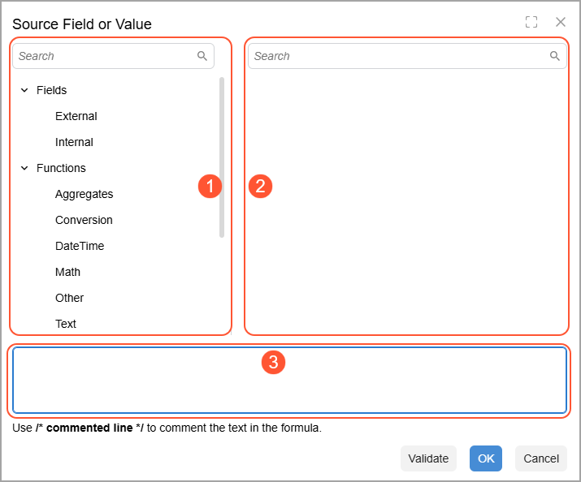

# Formulas {#_f03d234f-6813-4259-8f62-0a36a8320c2e .concept}

You can use formulas to calculate the values to be displayed in the rows and columns of each report. Formulas give you the ability to use advanced calculations and data transformation functions if some values in the report rows and columns are calculated or depend on the data from other sources \(such as rows, columns or individual cells included in the report\).

The formulas used in the analytical reports are much like the formulas used in Excel. You can define parameters and construct a formula by using operators and functions. You can select the parameters used in the formula from the list of predefined parameters or enter them into the formula.

## Editing of Formulas { .section}

To define formulas in analytical reports, you use the Formula Editor dialog box. You invoke this dialog box by clicking the magnifier icon in the appropriate **Value** cell on the [Row Sets](CS_20_60_10.md) \(CS206010\), [Column Sets](CS_20_60_20.md) \(CS206020\), or [Unit Sets](CS_20_60_30.md) \(CS206030\) form.

## Formula Editor Dialog Box { .section}

The Formula Editor dialog box, which is shown in the screenshot below, includes the following panes:

-   **Component Type pane** \(see Item 1\): Displays the types of operators, functions, and fields that can be used as formula components. You can search for the needed type by using the Search box at the top of the pane.

    Click any of the types to display the corresponding list of available components in the Component Selection pane.

-   **Component Selection pane** \(Item 2\): For the component type chosen in the Component Types pane, displays the list of available components.

    Click a component to add it to the formula at the bottom of the dialog box. You can search for the needed component by using the Search box at the top of the pane.

-   **Formula Text pane** \(Item 3\): Contains the text of the formula, which you can edit manually.

    The formula may include the selected components, arguments of manually inserted components, and other elements, all arranged in accordance with the syntax of the formula.

|Button|Description|
|------|-----------|
|**Validate**|Checks whether the formula typed in the Formula Text pane is valid.|
|**OK**|Inserts the formula you have created into the formula box or column and closes the dialog box.|
|**Cancel**|Closes the dialog box without saving your changes.|

**Parent topic:**[Managing Analytical Reports](../UserGuide/GL__GL_ARM_Reports.md)

