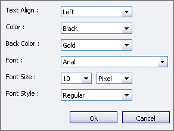

# Printing Style {#_cfe77fe2-5f9d-43ac-9037-c970bf122a61 .concept}

Printing style settings determine how the text in the report will be formatted and printed. The printing style parameters include the text formatting options you can specify for the report pages and for the individual rows and columns.

## Report Formatting Settings { .section}

You can set up the page structure \(including the report page and margin sizes\), select the font attributes \(the font name, size, style, and color\), and set up the text alignment and background color attributes for the text lines in the report. The formatting settings defined for the whole report include the report attributes for the page formatting, and the printing style for the report text. You specify the report formatting parameters, described in the following table, on the [Report Definitions](CS_20_60_00.md) \(CS206000\) form of the Analytical Report Manager.

|Report Layout Parameter|Description|
|-----------------------|-----------|
|**Margins**|Includes elements you can use to specify the margin size settings for the report page, which can be set in pixels, points, picas, centimeters, millimeters, or inches. You can specify the following margins:

 -   **Left**: The size of the left margin of the report page.
-   **Top**: The size of the top margin of the report page.
-   **Bottom**: The size of the bottom margin of the report page.
-   **Right**: The size of the right margin of the report page.

|
|**Print Area**|Includes elements you can use to specify the size of the report page, which can be set in pixels, points, picas, centimeters, millimeters, or inches. You can specify the following sizes:

 -   *Width*: The report page width.
-   *Height*: The report page height.

|
|**Default Font Style**|Includes elements you can use to specify the style parameters, including font formatting, background color, and text align options, for the report. These parameters are the same as the settings specified for the row and column **Style** parameters used to define the printing style for the rows and columns.|

## Row Formatting Parameters { .section}

On the [Row Sets](CS_20_60_10.md) \(CS206010\) form, you can set up any particular row in the report to visually emphasize it by using text alignment, font name, size, style, color, and background color. The formatting parameters defined on the row level include setting up the row attributes for the row formatting, and defining the printing style for the text in the row. To define the row formatting, set the following row parameters.

|Row Formatting Parameter|Description|
|------------------------|-----------|
|**Height**|The row height \(in pixels\).|
|**Indent**|The row indentation \(in pixels\).|
|**Style**|The style parameters for the row, including font formatting, background color, and text align options.|

## Column Formatting Parameters { .section}

On the [Column Sets](CS_20_60_20.md) \(CS206020\) form, you can set up any particular column in the report to visually emphasize it by using text alignment, font name, size, style, color, and background color attributes. The formatting parameters defined on the column level include setting up the column formatting, and defining the printing style for the text in the column. Column formatting is frequently used to highlight some columns in the report \(for example, when the highlighted columns display totals calculated for some reporting periods, and they must have a notable formatting\). To define the column formatting, set the following column attributes.

|Column Formatting Parameter|Description|
|---------------------------|-----------|
|**Width**|The column width \(in pixels\).|
|**Extra Space**|The indent defined for the column \(in pixels\).|
|**Style**|The style parameters for the column, including font formatting, background color, and text align options.|

## Style Parameters { .section}

Style parameters are the text formatting parameters specified for the entire report or for individual row or column.

You specify the text formatting parameters for a report, row, or column in the style section of the [Report Definitions](CS_20_60_00.md) \(CS206000\) form or in the style dialog box \(shown below\), which you invoke from the [Row Sets](CS_20_60_10.md) \(CS206010\) or [Column Sets](CS_20_60_20.md) \(CS206020\) form.

In the style dialog box, you can specify the following formatting parameters.

|Formatting parameter|Description|
|--------------------|-----------|
|**Text Align**|The alignment for the text in the report lines.|
|**Color**|The text color.|
|**Back Color**|The background color.|
|**Font**|The font name.|
|**Font Size**|The font size.|
|**Font Style**|The font style, which can be one of the following options: *Regular*, *Bold*, *Italic*, *Underline*, or *Strikeout*\).|

**Parent topic:**[ARM Reference](../UserGuide/RP__Tools_ARM_Form_Reference.md)

