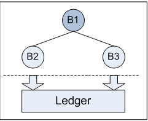
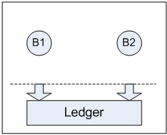
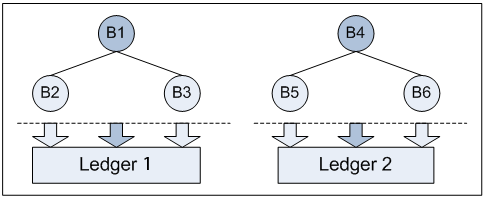
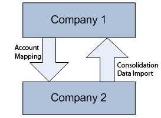

# Basic Models for Multibranch Organization {#_347a4a7a-f2da-4e84-afa6-59e2469304dd .concept}

In today’s global environment, an organization may have a hierarchic structure of subsidiaries or branches and complex multilevel reporting requirements. Such an organization may need tools for easy data consolidation, as well as better visibility into various layers of financial operations within the organization.

Acumatica ERP supports multibranch functionality and provides multiple basic one-level and two-level models, outlined in the sections below, for implementing the most typical organizational structures. For more complex organizations, such models may be combined to implement any structure.

CAUTION:

Choosing the model \(or combination of models\) that suits your organization best is an important decision that must be made before you start implementing Acumatica ERP.

## Model 1: Organization with Centralized Accounting { .section}

With Model 1, shown in the illustration below, the organization, which is a single legal entity, consists of two branches \(or locations\), each branch representing a company office. Transactions are posted to these branches.

To implement this model in Acumatica ERP, you have to create an additional branch that will represent the legal entity. You also have to have one posting ledger of the *Actual* type.

You need to specify the additional branch as the consolidating branch for the posting ledger by using the **Consolidation Branch** column on the [Ledgers](GL_20_15_00.md) \(GL201500\) form. The consolidating branch is used only in Form 1099-MISC and tax reports to represent the legal entity. No transactions are posted to the consolidating branch.

To be able to use automatic generation of interbranch balancing entries for documents that involve multiple branches, you need to enable the *Inter-Branch Transactions* feature on the [Enable/Disable Features](CS_10_00_00.md) \(CS100000\) form, configure the posting ledger by selecting the check box in the **Branch Accounting** column for this ledger on the [Ledgers](GL_20_15_00.md) \(GL201500\) form, and define the interbranch account mapping by using the [Inter-Branch Account Mapping](GL_10_10_10.md) \(GL101010\) form.

If the **Branch Accounting** check box is cleared for the ledger, you still can make transactions between the branches \(for example, transfer fixed assets from one branch to another\), but the system does not create interbranch balancing entries. The resulting batch remains unbalanced in each of the smaller branches, but the batch is balanced in the ledger that is assigned to the consolidating branch. In this case, the branches are not independent, and separate balance sheet reports cannot be prepared.

## Model 2: Autonomous Branches { .section}

In Model 2, illustrated below, the organization has a number of branches with a certain level of autonomy, with each branch being a legal entity. The organization and its branches share most of the vendors and customers but keep some of the trade partners as associated with a specific branch. Each branch keeps records of its own and has an accountant or accounting staff. The profitability of each branch can be equally important.

In Acumatica ERP, autonomous branches may use separate ledgers to post their transactions or they may post their transactions to a single ledger with no branch selected as a consolidation branch. If the branches post their transactions to separate ledgers, the system will generate interbranch transactions automatically. If the branches use the same ledger, to balance the original interbranch transactions in each branch, you should select for this ledger a check box in the **Branch Accounting** column on the [Ledgers](GL_20_15_00.md) \(GL201500\) form. This allows each branch to file reports as a separate legal entity.

A certain level of independence requires that some of branches have their own General Ledger accounts that cannot be used by another branch. You can use restriction groups to assign selected General Ledger accounts and subaccounts to a specific branch for use by this branch only.

## Model 3: Autonomous Multilocation Branches { .section}

An organization might include a number of related legal entities with complex structures. Each legal entity has its headquarters and locations or smaller branches that are not separate legal entities. In this case, each autonomous multilocation entity keeps its own records and performs all accounting procedures.

In Acumatica ERP, such an organization can be configured as a Model 3, which combines Model 1 and Model 2, functioning within one Company ID. \(See the following illustration.\) Each autonomous branch has its headquarters and locations \(or smaller branches that are not separate legal entities\) configured as branches. Each autonomous multilocation branch records its operations to a separate ledger with a *headquarters* branch specified as the *consolidation branch* for the ledger.

Generally, when transactions occur between any two non-independent branches in one ledger, no interbranch transactions are generated; however, if they are needed for any reason, you can select a check box in the **Branch Accounting** column on the [Ledgers](GL_20_15_00.md) \(GL201500\) form for the ledger.

When the interbranch transactions occur between any branches with different posting ledgers, balancing interbranch transactions will be generated automatically. You should create interbranch receivable and payable accounts in each ledger and specify the rules to be used by the system for generating balancing transactions by using the [Inter-Branch Account Mapping](GL_10_10_10.md) \(GL101010\) form.

## Model 4: Multinational or Just Multicurrency Organization { .section}

Small and midsize businesses sooner or later may face the problem of growth. They can grow by mergers or by creating local subsidiaries or branches in new regions or countries. Due to their locations, the organization subsidiaries use different base \(functional\) currency and should meet different reporting requirements \(including non-matching financial years\); their customers and vendors are not shared. For historical reasons, the organization subsidiaries may have different structures of accounts and subaccounts.

In Acumatica ERP, such subsidiaries can have separate tenant accounts with different Company IDs. The simplest structure is shown by Model 4, illustrated below. Although technically the parent organization and its subsidiaries may keep their data in the same database, they may have different base currencies, different financial year settings, and separate lists of trade partners. Such subsidiaries even can be hosted on different websites.

Acumatica ERP provides the consolidation-related functionality to be used by both sides: the parent organization and its subsidiaries. If different base currencies are used by the parent company and its subsidiary, such subsidiaries can translate their balances before they prepare the consolidation data for exporting. For details, see [GL Consolidation Configuration: General Information](Finance_GL_Consolidation_Config_GeneralInfo.md), [GL Consolidation: General Information](Finance_GL_Consolidation_GeneralInfo.md), and [Translation of Financial Statements: General Information](Multicurrency_TranslatingFinStatements_GeneralInfo.md).

If interbranch transactions take place, they should be eliminated manually during period-end or year-end routine procedures.

**Parent topic:**[Managing Companies and Branches](../UserGuide/OS__MNG_Companies_and_Branches.md)

