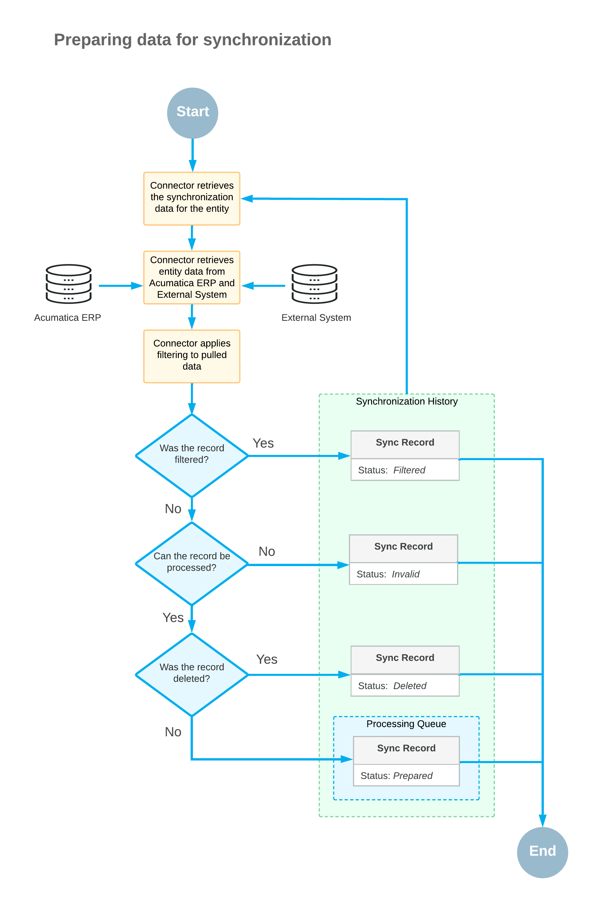
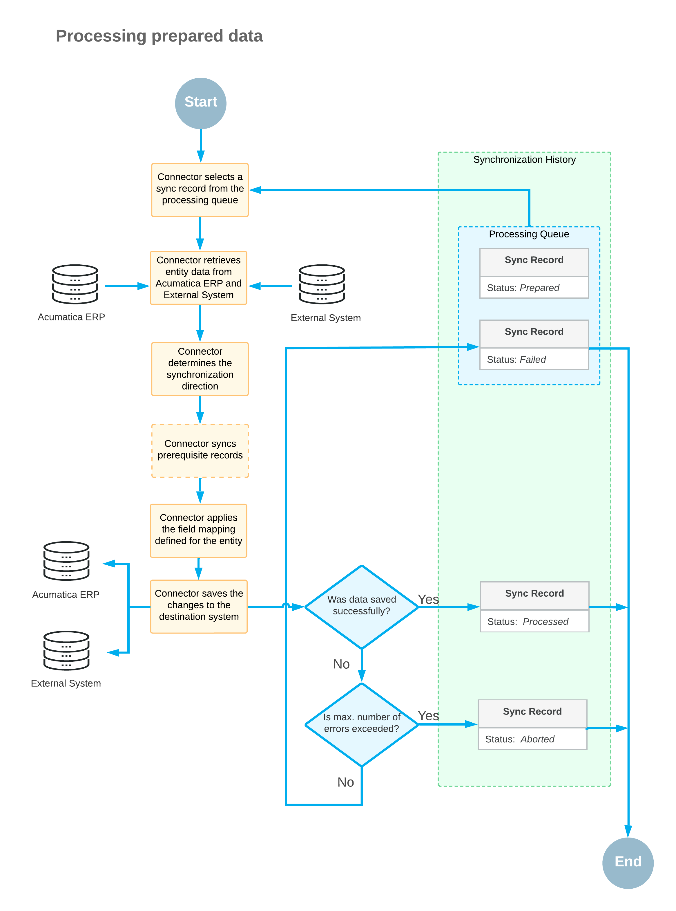

# Data Synchronization: General Information {#_b0d5b9ad-38e1-4cec-a39d-87addf905e1c .concept}

After the connection between Acumatica ERP and the Amazon seller account has been established and the initial configuration performed, you can start synchronizing data between the two systems.

## Learning Objectives { .section}

In this chapter, you will learn how data synchronization works and how to synchronize data manually.

## Stages of the Synchronization Process { .section}

The process of the synchronization of data between Acumatica ERP and the ecommerce system consists of the following stages:

1.  Preparing data for synchronization
2.  Processing out-of-sync data

## Preparation of Data for Synchronization {#_41e6f5ed-943b-4ebc-affc-46f7ed8c64b5 .section}

During the preparation of data for synchronization, the system receives the data that needs to be synchronized between Acumatica ERP and the ecommerce system and puts it in the processing queue. The following mechanisms can be used for obtaining data:

-   *Data preparation process*: The data preparation process pulls the data to be synchronized from Acumatica ERP and the ecommerce system through API calls and puts it in the processing queue. You determine which data should be included in the synchronization by selecting one of the following modes:

    -   *Full*: All records that have been created or modified during the specified date range are prepared, regardless of whether they have been processed previously or not. If no range is specified, all records are prepared.
    -   *Incremental*: Only the records that have been modified since the date of the last successful data preparation are prepared.
    -   *Incremental by Date*: Only records that have been modified during the specified date range and that have not yet been processed are prepared.
    The pulled data is then filtered according to the filtering criteria defined on the [Entities](BC_20_20_00.md) \(BC202000\) form and saved in the processing queue as synchronization records with the *Prepared* status, which indicates that these synchronization records have not yet been processed. The synchronization records are then processed.

    The data preparation process can be started in the following ways:

    -   Manually, on the [Prepare Data](BC_50_10_00.md) \(BC501000\) form. For information on manual synchronization, see [Data Synchronization: Manual Synchronization](Commerce_AZ_Data_Sync_Manual_Sync.md).
    -   By an automation schedule.

The following diagram shows the process of preparing data for synchronization.

## Processing of Out-of-Sync Data {#_a9afd843-28dd-41af-97e2-3d5f509403a7 .section}

During the data processing stage, the system processes the synchronization records in the processing queue according to the synchronization settings defined for the corresponding entity on the [Entities](BC_20_20_00.md) \(BC202000\) form or on the **Entities** tab of the [Amazon Stores](BC_20_10_20.md) \(BC201020\) form, and the synchronized data is saved in Acumatica ERP, in the external system, or in both systems.

During the processing of out-of-sync data, the system performs the following operations for each synchronization record:

1.  Pulling the record details from Acumatica ERP and the external ecommerce system.
2.  Determining the direction of the synchronization—that is, if data should be imported to Acumatica ERP, exported to the external system, or synchronized in both directions.

    The synchronization direction is displayed for each entity on the **Entities** tab of the [Amazon Stores](BC_20_10_20.md) form and in the Summary area of the [Entities](BC_20_20_00.md) \(BC202000\) form.

3.  Determining if any other records should be synchronized as a prerequisite for the synchronization of the current record, and attempting to synchronize the prerequisite records.
4.  Applying the standard field mapping for the entity.
5.  Applying the field mapping configured for the entity on the [Entities](BC_20_20_00.md) form.
6.  Saving the synchronized data in the destination system or systems.
7.  Changing the status of the synchronization record to *Processed*.

The processing of out-of-sync data can be started as follows:

-   Manually, on the [Process Data](BC_50_15_00.md) \(BC501500\) form. For information on manual synchronization, see [Data Synchronization: Manual Synchronization](Commerce_AZ_Data_Sync_Manual_Sync.md).
-   By an automation schedule.

In the following diagram, you can see the flow of the processing of data prepared for synchronization.

## Preparation of Deleted Records { .section}

If a previously processed entity record is deleted in Acumatica ERP, in the external system, or in both systems, its synchronization record is assigned the *Deleted* status on the [Sync History](../Shared/../UserGuide/BC_30_10_00.md) \(BC301000\) form. When the entity is prepared, the synchronization record is assigned the *Prepared* status in the following cases:

-   If the entity record was deleted in the primary system or in both systems and then was restored in the primary system
-   If the entity record was deleted only in the secondary system and then was modified in the primary system

During the entity preparation, synchronization records that were never processed and were manually assigned the *Deleted* status on the [Sync History](../Shared/../UserGuide/BC_30_10_00.md) form, are assigned the *Prepared* status regardless of the changes to the entity records in either of the systems.

**Parent topic:**[Overview of Data Synchronization](../UserGuide/Commerce_AZ_Data_Sync_Mapref.md)

