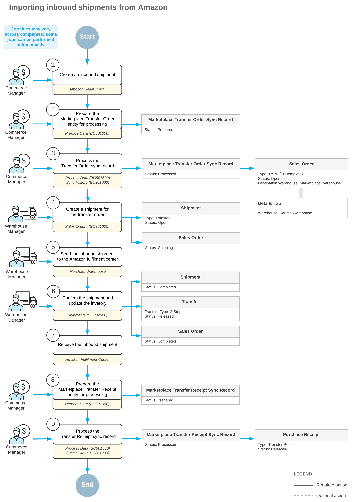

# Inbound Shipments: General Information {#_a3f90c5a-eb29-4247-2ea0-0dc2b6415da9 .concept}

Acumatica ERP provides you with the ability to import marketplace-fulfilled orders from Amazon. To fulfill these orders, you send *inbound shipments* with stock items that you sell to Amazon fulfillment centers, and Amazon uses the stock sent to handle the order fulfillment. You have the ability to import these inbound shipments to Acumatica ERP to streamline inventory management and improve inventory accounting.

## Learning Objectives {#_2d17801d-5397-4a97-9fb3-f815abbe79e5 .section}

In this chapter, you will learn how to do the following:

-   Configure the synchronization of inbound shipments between the Amazon seller account and Acumatica ERP
-   Import inbound shipments form the Amazon seller account to Acumatica ERP

## Applicable Scenarios {#_babea2db-3c58-435a-9052-c0a9372bc31b .section}

You might want to synchronize inbound shipments to track available quantities of items that you send from the company warehouse to the Amazon fulfillment center.

## Configuration of the Store { .section}

To import inbound shipments from the Amazon seller account \(also referred to as the *store* in Acumatica ERP\), you need to configure the store. To do this, perform the following general steps on the [Amazon Stores](BC_20_10_20.md) \(BC201020\) form:

1.  Activate the following entities on the **Entities** tab:
    -   *Marketplace Transfer Order*
    -   *Marketplace Transfer Receipt*
2.  Specify an order type in the **Order Type for Import** box on the **Inventory** tab.

    The selected order type must have the *TR - Transfer* order template specified on the [Order Types](SO_20_10_00.md) \(SO201000\) form. The system will use the specified order type to create transfer orders during the import of inbound shipments.

3.  Specify a date in the **Earliest Shipment Date** box on the **Inventory** tab.

    The system will import inbound shipments from the Amazon seller account if they have been created on or after the specified date.

4.  Specify a company warehouse in the **Source Warehouse** box on the **Inventory** tab.

    This is the warehouse from which stock items are shipped to the Amazon fulfillment center. The source warehouse must differ from the marketplace warehouse specified on the **Orders** tab for the store.

5.  Specify the warehouse that represents the Amazon fulfillment center in the **Marketplace Warehouse** box on the **Orders** tab.

    You send stock items to that warehouse, and Amazon fulfills your orders from it. The marketplace warehouse must differ from the source warehouse specified on the **Inventory** tab for the store.

6.  If the carrier names from the Amazon seller account do not match the ship-via codes from Acumatica ERP, configure the matching of the names and codes with a substitution list on the [Substitution Lists](SM_20_60_26.md) \(SM206026\) form. Specify the substitution list in the **Ship-Via Codes to Carriers** box on the **Inventory** tab.

## Import of Inbound Shipments from Amazon { .section}

To import inbound shipments sent from the company warehouse to the Amazon fulfillment center, you perform the following general steps:

1.  Prepare the data for the *Marketplace Transfer Order* entity on the [Prepare Data](BC_50_10_00.md) \(BC501000\) form.

    The system creates a *Marketplace Transfer Order* sync record for each inbound shipment created on or after the date specified in the **Earliest Shipment Date** box on the **Inventory** tab of the [Amazon Stores](BC_20_10_20.md) \(BC201020\) form.

2.  Process the data prepared for the *Marketplace Transfer Order* entity on the [Process Data](BC_50_15_00.md) \(BC501500\) form.

    For each processed sync record, the system creates a transfer order on the [Sales Orders](SO_30_10_00.md) \(SO301000\) form with the type specified in the **Order Type for Import** box on the **Inventory** tab of the [Amazon Stores](BC_20_10_20.md) form. For the created transfer order, the system inserts the marketplace warehouse specified for the Amazon store to the **Destination Warehouse** box in the Summary area of the [Sales Orders](SO_30_10_00.md) form. In each line on the **Details** tab, the system inserts the source warehouse specified for the Amazon store in the **Warehouse** column.

3.  Create a shipment of the *Transfer* type for the transfer order on the [Shipments](SO_30_20_00.md) \(SO302000\) form, and release the shipment.
4.  Update inventory for the shipment.

    The system creates a transfer of the *2-Step* type on the [Transfers](IN_30_40_00.md) \(IN304000\) form and releases the transfer.

5.  Prepare the data for the *Marketplace Transfer Receipt* entity on the [Prepare Data](BC_50_10_00.md) form.

    The system creates a *Marketplace Transfer Receipt* sync record for each imported transfer order if the following conditions are met:

    -   The corresponding inbound shipment in Amazon is being received \(has the *Receiving* status\) or has been received \(has the *Closed* status\).
    -   The transfer order has been processed and has a released transfer of the *2-Step* type created on the [Transfers](IN_30_40_00.md) form.
6.  Process the data prepared for the *Marketplace Transfer Receipt* entity on the [Process Data](BC_50_15_00.md) form.

    For each processed sync record, the system creates a purchase receipt of the *Transfer Receipt* type on the [Purchase Receipts](PO_30_20_00.md) \(PO302000\) form.

    **Tip:** If the Amazon fulfillment center receives an inbound shipment gradually in multiple steps, the system creates a purchase receipt for each.

The following diagram shows the process of importing inbound shipments from the Amazon seller account to Acumatica ERP.

## Import of Shipments with Lot- or Serial-Tracked Items { .section}

The synchronization of inbound shipments with lot- or serial-tracked inventory items is automated partially because Amazon does not provide any information about the lot or serial numbers of the received items.

While you prepare and process the data for the *Marketplace Transfer Order* entity on the [Prepare Data](BC_50_10_00.md) \(BC501000\) and [Process Data](BC_50_15_00.md) \(BC501500\) forms, the system creates a transfer order for an inbound shipment with lot- or serial-tracked items without information about lot or serial numbers. You need to manually process the transfer order to add lot or serial numbers for the shipping items.

After the processing of the transfer order is finished and a transfer of the *2-Step* type has been created and released on the [Transfers](IN_30_40_00.md) \(IN304000\) form, you skip the synchronization of the *Marketplace Transfer Receipt* entity. Instead, you manually create a purchase receipt of the *Transfer Receipt* type on the [Purchase Receipts](PO_30_20_00.md) \(PO302000\) form for the transfer.

## Import of Shipments with Non-Stock Kits { .section}

The synchronization of inbound shipments with non-stock kits is automated partially.

While you process a transfer order created for an inbound shipment with a non-stock kit, the system creates a transfer on the [Transfers](IN_30_40_00.md) \(IN304000\) form and adds the components of the non-stock kit to that transfer based on the kit specification from the [Kit Specifications](IN_20_95_00.md) \(IN209500\) form. You skip the synchronization of the *Marketplace Transfer Receipt* entity. Instead, you manually create a purchase receipt of the *Transfer Receipt* type on the [Purchase Receipts](PO_30_20_00.md) \(PO302000\) form for the kit components from the transfer.

## Reconciliation of Discrepancies During the Import of Shipments { .section}

Consider that an inbound shipment has been imported to Acumatica ERP and then the Amazon fulfillment center has received it—that is, the inbound shipment has been assigned the *Closed* status. Also, consider that the received quantity of an item of the inbound shipment differs from the initially shipped quantity imported to Acumatica ERP. During the processing of the *Marketplace Transfer Receipt* entity for the shipment, the system does not add that item to the purchase receipt created on the [Purchase Receipts](PO_30_20_00.md) \(PO302000\) form. You need to manually process the item.

You create a purchase receipt of the *Transfer Receipt* type on the [Purchase Receipts](PO_30_20_00.md) form for the initially shipped quantity of the item. For the discrepancy between the shipped and received quantities, you create an inventory adjustment on the [Adjustments](IN_30_30_00.md) \(IN303000\) form with a positive value for the exceeded quantity or with a negative value for the insufficient quantity.

## Limitations of Importing Inbound Shipments { .section}

The following limitations apply to the import of inbound shipments:

-   The system can import inbound shipments that have been created only within the last 18 months. To avoid data inconsistencies, we recommend specifying a date within the past 18 months in the **Earliest Shipment Date** box on the **Inventory** tab of the [Amazon Stores](BC_20_10_20.md) \(BC201020\).
-   When you process the data for the *Marketplace Transfer Order* entity on the [Prepare Data](BC_50_10_00.md) \(BC501000\) form, the system creates sync records with the *Invalid* status for inbound shipments that have not been imported yet but have already been closed in Amazon. These records are excluded from further processing. If you need to import these inbound shipments, you need to force-synchronize the corresponding sync records on the [Sync History](BC_30_10_00.md) \(BC301000\) form.
-   The system may experience delays with the processing of adjustments made in Amazon to already-imported inbound shipments because Amazon does not provide the date of the shipment modification.

    As an example, consider an inbound shipment that has been imported to Acumatica ERP, and then some changes have been made to the shipment in Amazon. If you need to receive these changes in Acumatica ERP as soon as possible, you should force-synchronize the sync record of the inbound shipment on the [Sync History](BC_30_10_00.md) form.

-   To comply with the limitations of the Amazon API and to optimize the system load, we recommended preparing and processing of the data for the *Marketplace Transfer Order* and *Marketplace Transfer Receipt* entities once a day, at nighttime.

**Parent topic:**[Synchronizing Inbound Shipments](../UserGuide/Commerce_AZ_Syncing_Inbound_Shipments_Mapref.md)

