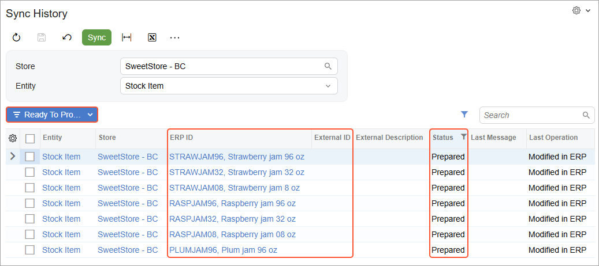
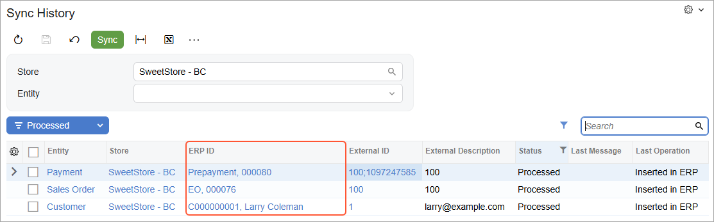
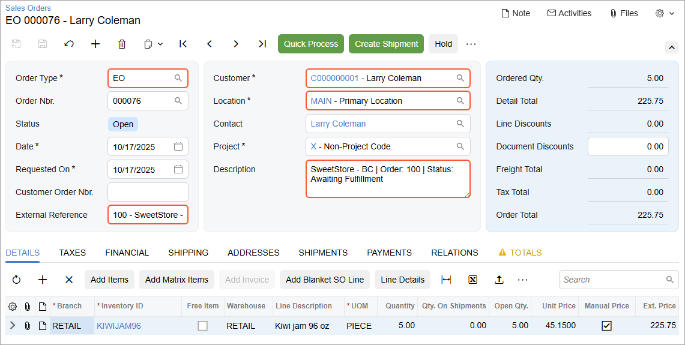

# Data Synchronization: To Perform the First Synchronization {#_2f56a2c1-af17-4547-a5b6-97ed29a1181c .task}

The following activity will walk you through the process of manually exporting items from Acumatica ERP to the BigCommerce store. You will also perform the instructions to place a test order online in the BigCommerce store and then synchronize the order with Acumatica ERP. Finally, you will create a shipment for the order in Acumatica ERP and synchronize the created shipment with the BigCommerce store.

**Attention:** The following activity is based on the *U100* dataset.

## Story { .section}

Suppose that you are an implementation consultant helping the SweetLife Fruits &amp; Jams company to set up an online store. You have completed the minimum initial configuration of the integration with BigCommerce and now want to explore how synchronization works. You will configure synchronization for and then synchronize a subset of stock items that are maintained in Acumatica ERP \(stock items of the *Jam* item class\) with the BigCommerce store, where the term *products* describes what are called *items* in Acumatica ERP. You will then perform a test purchase of one of the synchronized products and explore how the online order is processed in the BigCommerce store and in Acumatica ERP.

## Process Overview { .section}

In this activity, you will perform the following steps:

1.  On the [Stock Items](IN_20_25_00.md) \(IN202500\) form of Acumatica ERP, review the stock items that need to be exported to the BigCommerce store.
2.  On the [Entities](BC_20_20_00.md) \(BC202000\) form, configure the filtering options for the *Stock Item* entity to include in the synchronization only the stock items of the *Jam* item class.
3.  On the [Prepare Data](BC_50_10_00.md) \(BC501000\) form, start the data preparation process for the *Stock Item* entity to prepare out-of-sync data for export.
4.  On the [Sync History](BC_30_10_00.md) \(BC301000\) form, review the result of the data preparation process.
5.  On the [Process Data](BC_50_15_00.md) \(BC501500\) form, start data processing for the *Stock Item* entity to save the synchronized product data in the BigCommerce store.
6.  On the [Sync History](BC_30_10_00.md) form, review the results of data processing.
7.  In the BigCommerce store, review the products that have been imported from Acumatica ERP.
8.  By using the control panel of the store, place an order for one of the products that have been imported from Acumatica ERP.
9.  On the [Prepare Data](BC_50_10_00.md) form of Acumatica ERP, start the data preparation process for the *Sales Order* entity to prepare out-of-sync order data for import; on the [Process Data](BC_50_15_00.md) form, synchronize the prepared sales order data.
10. On the [Sync History](BC_30_10_00.md) form, review the results of data synchronization.
11. On the [Sales Orders](SO_30_10_00.md) \(SO301000\) form, review the details of the imported sales order.
12. On the [Sales Orders](SO_30_10_00.md) form, create a shipment for the imported order, and on the [Shipments](SO_30_20_00.md) \(SO302000\) form, confirm the shipment.
13. On the [Prepare Data](BC_50_10_00.md) form, start the data preparation process for the *Shipment* entity; on the [Process Data](BC_50_15_00.md) form, synchronize the prepared shipment data.
14. In the control panel of the BigCommerce store, review the updated order details and the shipment exported from Acumatica ERP.

## System Preparation { .section}

Do the following:

1.  Make sure that the following prerequisites have been met:
    -   The BigCommerce store has been created and configured, as described in [Initial Configuration: To Set Up a BigCommerce Store](Commerce_BC_Initial_Configuration_To_Set_Up_a_BC_Store.md).
    -   The connection to the BigCommerce store has been established and the initial configuration has been performed, as described in [Initial Configuration: To Establish and Configure the Store Connection](Commerce_BC_Initial_Configuration_Implem_Activity.md).
2.  Launch the Acumatica ERP website, and sign in as an administrator by using the following credentials:
    -   **Username**: *gibbs*
    -   **Password**: *123*
3.  Sign in to the control panel of the BigCommerce store as the store administrator.

## Step 1: Finding and Reviewing the Stock Items to Be Sold Online { .section}

To find and review the stock items that will be sold online, do the following:

1.  Open the Stock Items \(IN2025PL\) form.
2.  Filter the stock items to display only the items of the *Jam* item class as follows:

    1.  In the **Item Class** column, click the column header.
    2.  In the menu that opens, select the *Equals* filter condition.
    3.  In the box at the bottom of the menu, type `Jam`.
    4.  Click **OK** to apply the filter.
    Now all stock items of the *Jam* item class are displayed. Notice how many items are in the class; scan the list so you are familiar with the stock items that you need to export to the BigCommerce store.

## Step 2: Configuring the Export of a Subset of Stock Items { .section}

To configure a filtering condition for the *Stock Item* entity to export only stock items of the *Jam* item class to the BigCommerce store, do the following:

1.  On the [Entities](BC_20_20_00.md) \(BC202000\) form, specify the following settings in the Summary area:

    -   **Store Name**: *SweetStore - BC*
    -   **Entity**: *Stock Item*
    Notice that the *Export* option is selected in the **Sync Direction** box meaning that the entity can be exported to the BigCommerce store but not imported to Acumatica ERP.

2.  To create a filtering condition for stock items to be exported to the BigCommerce store, on the **Export Filtering** tab, click **Add Row** on the table toolbar, and specify the following settings in the row:
    -   **Active**: Selected
    -   **Field Name**: *Item Class*
    -   **Condition**: *Equals*
    -   **Value**: `Jam`
3.  On the form toolbar, click **Save** to save your changes.

    Now when you prepare and process the *Stock Item* entity, only the stock items of the *Jam* item class will be exported to the BigCommerce store.

    **Note:** Filtering rules are not applied to data that has already been synchronized. For example, if you synchronize the *Stock Item* entity without filters \(which will result in exporting all stock items to the online store\), apply the filter described above, and prepare and process the *Stock Item* entity again, all previously synchronized stock items that no longer match the filtering conditions will remain synchronized.

## Step 3: Preparing the Product Data for Synchronization { .section}

To prepare the stock item data that needs to be synchronized to the BigCommerce store, do the following:

1.  On the [Prepare Data](BC_50_10_00.md) \(BC501000\) form, specify the following settings in the Summary area:
    -   **Store**: *SweetStore - BC*
    -   **Prepare Mode**: *Incremental*

        This setting controls which data will be loaded. *Incremental* indicates that the system will load only the data that has been modified since the previous data synchronization. Because you are starting the data preparation process for the *Stock Item* for the first time, all stock item data will be prepared.

2.  In the table, select the check box in the unlabeled column in the row of the *Stock Item* entity, and on the form toolbar, click **Prepare**.
3.  In the **Processing** dialog box, which opens, review the results of the processing, and click **Close** to close the dialog box.

    In the table on the form, notice that the **Ready to Process** column shows the number of synchronization records that have been prepared and are ready to be processed. The **Processed Records** column shows the number of records that have been processed \(that is, records that have been successfully synchronized and assigned the *Processed* status.

    **Tip:** You can click the link in the **Ready to Process** column to open the [Process Data](../Shared/../UserGuide/BC_50_15_00.md) \(BC501500\) form with the store and the entity selected; you can click the link in the **Processed Records** column to open the [Sync History](../Shared/../UserGuide/BC_30_10_00.md) \(BC301000\) form with the store and the entity selected and the list of processed synchronization records \(that is, records that have been successfully synchronized and assigned the *Processed* status\) displayed on the **Drilldown** filter tab.

## Step 4: Reviewing the Results of Data Preparation { .section}

To review the results of the preparation of data for synchronization, do the following:

1.  While you are still viewing the [Prepare Data](BC_50_10_00.md) \(BC501000\) form, click the link in the **Total Records** in the row of the *Stock Item* entity. The [Sync History](BC_30_10_00.md) \(BC301000\) form opens in a new browser tab with the *SweetStore - BC* store and the *Stock Item* entity selected in the Summary area.
2.  In the Filter List drop-down menu above the table, select *Filtered*. In the table, notice that all synchronization records on this tab have the *Filtered* status. These are the stock items that were excluded from synchronization based on the filtering conditions that you specified for stock items on the [Entities](BC_20_20_00.md) \(BC202000\) form.
3.  In the Filter List drop-down menu, select *Ready to Process*.

    Notice that the table is displaying the list of stock item synchronization records with the *Prepared* status, as shown in the screenshot below. This status means that the data for these items has been prepared and the items are now ready to be processed. The **Ready to Process** filter tab shows only the items with the *JAM* item class.

    For each of these items, the **ERP ID** column displays a link with the item description that you can click to open the item on the [Stock Items](IN_20_25_00.md) \(IN202500\) form. Notice that the **External ID** column currently does not display any values because the stock items have not yet been exported to the BigCommerce store.

    

## Step 5: Processing the Prepared Product Data { .section}

To process the *Stock Item* entity, do the following:

1.  On the [Process Data](BC_50_15_00.md) \(BC501500\) form, select the following settings in the Summary area:

    -   **Store**: *SweetStore - BC*
    -   **Entity**: *Stock Item*
    The table displays only the list of stock items that have been prepared for synchronization.

2.  On the form toolbar, click **Process All** to process all synchronization records displayed on the form.
3.  In the **Processing** dialog box, which opens, click **Close** to close the dialog box.

## Step 6: Reviewing the Synchronization Status of the Product Data { .section}

To again review the synchronization status of the product data, do the following:

1.  On the [Sync History](BC_30_10_00.md) \(BC301000\) form, specify the following settings in the Summary area:
    -   **Store**: *SweetStore - BC*
    -   **Entity**: *Stock Item*
2.  In the Filter List drop-down menu above the table, select *Processed*.

    The table shows the list of items that have been synchronized with the BigCommerce store. For each item, there is now a product identifier in the **External ID** column. In the table, the **Last Operation** value has changed to *Inserted Externally* and the time stamp in the **Last Attempt** column has changed to the date and time when you ran data processing on the [Process Data](BC_50_15_00.md) \(BC501500\) form.

## Step 7: Viewing an Exported Product in the BigCommerce Store { .section}

To view the *KIWIJAM96* stock item \(which has the description *Kiwi jam 96 oz*\) in the BigCommerce store, do the following:

1.  While you are still viewing the [Sync History](BC_30_10_00.md) \(BC301000\) form, click the link in the **External ID** column in the row of the synchronization record for the *Kiwi jam 96 oz* item.

    The product management page for the *Kiwi jam 96 oz* item in the BigCommerce store opens in a new browser tab.

2.  Scan the product details that have been exported to the BigCommerce store.

    Notice that the following information has been imported for *Kiwi jam 96 oz* from Acumatica ERP:

    -   The product description \(*Kiwi jam 96 oz*\) in the **Product Name** box in the **Basic Information** section
    -   The item's inventory ID \(*KIWIJAM96*\) in the **SKU** box
    -   The default price \(*45.15*\) in the **Default Price \(excluding tax\)** box
    -   The package weight \(*2.84*\) in the **Weight** box
    -   The product description \(*Thick and sweet kiwi jam – goes great on toast or on pancakes.*\) in the **Description** section
    -   The product image in the **Images** subsection of the **Images &amp; Videos** section

## Step 8: Placing an Order from the Control Panel { .section}

To purchase a 96-ounce jar of kiwi jam, while you are still signed in to the control panel of your BigCommerce store, do the following:

1.  In the left pane of the control panel, click **Orders** &gt; **Add**. The **Add an order** page opens.
2.  On the **Add an order** &gt; **Customer info** page, create the order as follows:
    1.  In the **Customer information** section, select the **New Customer** option button right of **Order for**.
    2.  In the **Account details** subsection, specify the following settings:
        -   **Email Address**: `larry@example.com`
        -   **Password**: `!Q123456`
        -   **Confirm Password**: `!Q123456`
    3.  In the **Billing information** section, specify the following details:
        -   **First Name**: `Larry`
        -   **Last Name**: `Coleman`
        -   **Address Line 1**: `1970 Duncan Avenue`
        -   **Suburb/City**: `New York`
        -   **Country**: *United States*
        -   **State/Province**: *New York*
        -   **Zip/Postcode**: `10016`
        -   **Save to customer's address book**: Selected
3.  In the lower right, click **Next**.
4.  On the **Add an order** &gt; **Items** page, under **Add products**, do the following:
    1.  In the **Search** box, start typing `kiwi`, and in the list of search results, select *KIWIJAM96*.
    2.  In the row of the *Kiwi jam 96 oz* product, change the quantity to `5`.
    3.  In the lower right, click **Next**.
5.  On the **Add an order** &gt; **Fulfillment** page, in the **Shipping method** section, click the *Fetch shipping quotes* link.
6.  In the box with the list of shipping options that appears, click *Free Shipping \($0.00\)*. The *Free Shipping* option is available for the order because its total amount is greater than $100.
7.  In the lower right, click **Next**.

    The **Add an order** &gt; **Payment** page opens. The information about the customer's billing address is displayed in the **Customer billing details** section, the shipping address, shipping method and the items included in the order are displayed in the **Fulfillment details** section, and the order amount is displayed in the **Summary** section.

8.  In the **Payment** section, select the *Manual payment* payment method.

    This payment method is used to record payments accepted outside of the BigCommerce store.

9.  Click **Save &amp; process payment**.
10. On the **View orders** page, which opens, make a note of the reference number of the created order in the **Order ID** column. You will review and process this order in Acumatica ERP further in this activity. Notice that the order status is *Awaiting Fulfillment*.

## Step 9: Importing the Sales Order Data to Acumatica ERP { .section}

To import sales orders from the BigCommerce store to Acumatica ERP, do the following:

1.  On the [Prepare Data](../Shared/../UserGuide/BC_50_10_00.md) \(BC501000\) form, specify the following settings in the Summary area:
    -   **Store**: *SweetStore - BC*
    -   **Prepare Mode**: *Incremental*
2.  In the table, select the check box in the unlabeled column in the row of the *Sales Order* entity, and on the form toolbar, click **Prepare**.
3.  In the **Processing** dialog box, which opens, review the results of the processing, and click **Close** to close the dialog box.

    Notice that the **Ready to Process** column now shows *1* in the row of the *Sales Order* entity because you have created only one order in the BigCommerce store.

4.  In the row of the *Sales Order* entity, click the link in the **Ready to Process** column.

    The system opens the [Process Data](BC_50_15_00.md) \(BC501500\) form with the *SweetStore - BC* store and the *Sales Order* entity selected in the Summary area. Notice that the **External ID** column of the table displays the order identifier assigned to the order in the BigCommerce store.

5.  Select the unlabeled check box in the only row, and on the form toolbar, click **Process**.
6.  In the **Processing** dialog box, which opens, click **Close** to close the dialog box.

## Step 10: Reviewing the Synchronization Status of the Imported Sales Order { .section}

To review the synchronization status of the order you imported in the previous step, do the following:

1.  On the [Sync History](BC_30_10_00.md) \(BC301000\) form, select the following settings in the Summary area:
    -   **Store**: *SweetStore - BC*
    -   **Entity**: Leave empty
2.  In the Filter List drop-down menu above the table, select *Processed*.

    In the table, review the synchronization records that were created during the import of the sales order \(shown in the following screenshot\).

    

    Notice the following:

    -   *Sales Order*: The sales order that you placed in the BigCommerce store. The **ERP ID** column displays the order type \(*EO*\) and the order ID. The order type is based on the value selected in the **Order Type for Import** box on the **Orders** tab of the [BigCommerce Stores](BC_20_10_00.md) \(BC201000\) form. The **External ID** column displays the order number assigned to the order in BigCommerce.
    -   *Customer*: The customer that you created during the placement of the order in the BigCommerce store. The **ERP ID** column displays the customer ID and the name of the customer. The customer ID was assigned to the customer record based on the numbering sequence specified in the **Customer Numbering Sequence** box on the **Customers** tab of the [BigCommerce Stores](BC_20_10_00.md) form. The customer name was imported from the BigCommerce store.
    -   *Payment*: The payment used to pay the order in the BigCommerce store. The **ERP ID** column displays the payment type \(*Prepayment*\) and the payment identifier.

        The payment has been imported because the payment method you used to pay the order has been mapped to an Acumatica ERP payment method and the mapping has been activated on the **Payments** tab of the [BigCommerce Stores](BC_20_10_00.md) form.

## Step 11: Reviewing the Imported Sales Order { .section}

To review the details of the imported sales order, do the following:

1.  While you are still viewing the synchronization results on the [Sync History](BC_30_10_00.md) \(BC301000\) form, click the link in the **ERP ID** column for the sales order you imported.
2.  On the [Sales Orders](SO_30_10_00.md) \(SO301000\) form, which opens in a pop-up window, review the details of the order, as shown in the following screenshot.

    

    In the Summary area, notice the following:

    -   The imported order has the *EO* type \(shown in the **Order Type**\), which is configured on the [BigCommerce Stores](BC_20_10_00.md) \(BC201000\) form to be assigned to all sales orders imported from the *SweetStore - BC* store.
    -   In the **External Reference** box, the order number assigned to the order in the BigCommerce store and the name of the store are displayed.
    -   The **Date** of the sales order is the same as the date on which the order was created in the BigCommerce store.
    -   In the **Description** box, the store name, the order number, and the payment status of the order are displayed.
    -   The **Customer** and **Location** boxes display the information about the customer and customer location that were created in Acumatica ERP during the import of the sales order; both were created during the order placement in the BigCommerce store.
    On the **Details** tab, review the only line in the table. Notice the following:

    -   **Branch** is set to *RETAIL*, which is the default branch configured on the [BigCommerce Stores](BC_20_10_00.md) form to appear on sales orders imported from the *SweetStore - BC* store.
    -   The inventory ID, quantity, unit price, and extended price of the item are exactly the same as the values on the order in the BigCommerce store.
    On the **Payments** tab, notice that a prepayment in the order amount has been applied to the sales order.

## Step 12: Creating and Confirming a Shipment { .section}

To process a shipment for the imported order, do the following:

1.  While you are still viewing the sales order on the [Sales Orders](SO_30_10_00.md) \(SO301000\) form, on the form toolbar, click **Create Shipment**.
2.  In the **Specify Shipment Parameters** dialog box, which opens, make sure the current date and the *RETAIL* warehouse are selected, and click **OK**.

    The system creates a shipment and opens it on the [Shipments](SO_30_20_00.md) \(SO302000\) form in the same pop-up window.

3.  On the form toolbar, click **Confirm Shipment**.

    The shipment is assigned the *Confirmed* status. The sales order is assigned the *Completed* status.

4.  Close the pop-up window with the [Shipments](SO_30_20_00.md) form.

## Step 13: Synchronizing the Shipment with the BigCommerce Store { .section}

To synchronize with the *SweetStore - BC* store the shipment that you created and confirmed in the previous steps, do the following:

1.  On the [Prepare Data](../Shared/../UserGuide/BC_50_10_00.md) \(BC501000\) form, specify the following settings in the Summary area:
    -   **Store**: *SweetStore - BC*
    -   **Prepare Mode**: *Incremental*
2.  In the table, select the check box in the unlabeled column for the *Shipment* entity.
3.  On the form toolbar, click **Prepare**.
4.  In the **Processing** dialog box, which opens, click **Close** to close the dialog box.
5.  Click the link in the **Ready to Process** \(which shows *1* because only one shipment has been created\) in the row of the *Shipment* entity.

    The [Process Data](BC_50_15_00.md) \(BC501500\) form opens with the *SweetStore - BC* store and the *Shipment* entity selected.

6.  Select the unlabeled check box for the only row of the table, and click **Process** on the form toolbar.
7.  In the **Processing** dialog box, which opens, click **Close** to close the dialog box.

## Step 14: Reviewing the Updated Order and Shipment in BigCommerce { .section}

To check whether the shipment and the updated order have been imported to the BigCommerce store correctly, do the following:

1.  On the [Sync History](BC_30_10_00.md) \(BC301000\) form, specify the following settings in the Summary area:
    -   **Store**: *SweetStore - BC*
    -   **Entity**: *Shipment*
2.  In the Filter List drop-down menu above the table, select *Processed*.

    Notice that the synchronization record of the shipment is now displayed in the only row of the table. The **External ID** column displays the identifier of the shipment in BigCommerce, which consists of two parts—the identifier of the order and the identifier of the shipment.

3.  Click the link in the **External ID** column.

    The order page of the BigCommerce store opens in a new browser tab. Notice that the status of the order has changed to *Shipped*. The rightmost column now displays the summary information about the shipment.

    **Tip:** You can click the link with the shipment number in the rightmost column to view the shipment details.

You have now performed the first manual synchronization of products, sales orders, and shipments.

**Parent topic:**[Overview of Data Synchronization](../UserGuide/Commerce_BC_Data_Sync_Mapref.md)

