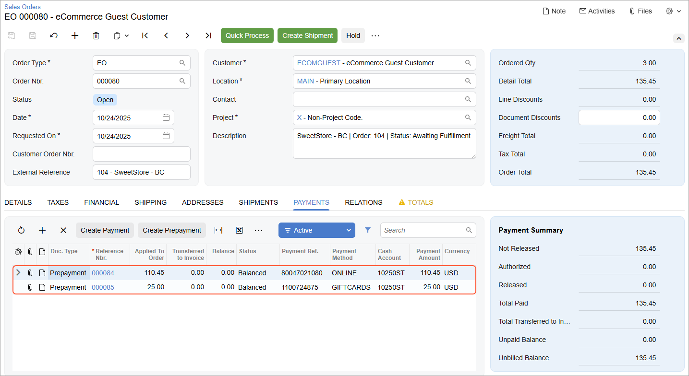

# Gift Certificates: Process Activity {#_67ebfd50-74e0-40e5-9201-c4d3e498a08d .task}

In this activity, you will learn how to implement gift certificates in the BigCommerce store and explore how gift certificates can be used to pay, in full or in part, for an online purchase in the BigCommerce store.

**Attention:** The following activity is based on the *U100* dataset.

## Story { .section}

Suppose that a sales manager of SweetLife wants to give its online customers the ability to purchase gift certificates and use these certificates when purchasing goods in the SweetLife online store. You also want to track payments made with gift certificates in Acumatica ERP by using a dedicated payment method.

As an implementation consultant, you need to set up a non-stock item that will be used to record a sale of a gift certificate as well as a payment method that will be used to track payments made with gift certificates.

## Configuration Overview { .section}

In the *U100* dataset, the following tasks have been performed to support this activity:

-   On the [Non-Stock Items](IN_20_20_00.md) \(IN202000\) form, the *GIFTCERT* non-stock item has been created to represent gift certificates sold in the online store.
-   On the [Payment Methods](CA_20_40_00.md) \(CA204000\) form, the *GIFTCARDS* payment method has been created.

## Process Overview { .section}

You will do the following:

1.  On the [BigCommerce Stores](BC_20_10_00.md) \(BC201000\) form, configure the gift certificate settings.
2.  In the control panel of the BigCommerce store, enable the gift certificate functionality and define gift certificates in various amounts to be sold in the online store.
3.  On the storefront, purchase a gift certificate.
4.  In the control panel of the BigCommerce store, capture the payment and complete the order \(after which the system will send the certificate to its recipient\).
5.  On the [Prepare Data](BC_50_10_00.md) \(BC501000\) form, prepare the sales order data for synchronization, and on the [Process Data](BC_50_15_00.md) \(BC501500\) form, you will process the prepared data.
6.  On the [Sales Orders](SO_30_10_00.md) \(SO301000\) form, review the imported sales order.
7.  On the storefront, you will create an order and pay part of it with the purchased gift certificate.
8.  On the [Prepare Data](BC_50_10_00.md) form, prepare the sales order data for synchronization, and on the [Process Data](BC_50_15_00.md) form, you will process the prepared data.
9.  On the [Sales Orders](SO_30_10_00.md) form, review the imported sales order corresponding to your order on the storefront that was partially paid for with the gift certificate.

## System Preparation { .section}

Before you start configuring the gift certificates, do the following:

1.  Make sure the connection to the BigCommerce store is established and the minimum configuration is performed as described in [Initial Configuration: To Establish and Configure the Store Connection](Commerce_BC_Initial_Configuration_Implem_Activity.md).
2.  Make sure that the *PLUMJAM08* stock item has been exported to the BigCommerce store during the synchronization of the *Stock Item* entity \(as described in [Product Synchronization: To Synchronize Non-Stock Items with Attributes](Commerce_BC_Syncing_Products_To_Export_NonStockItems_with_Attributes.md)\).
3.  Make sure that integration with Authorize.Net has been implemented as described in [Order Synchronization: To Configure and Import Authorize.Net Payments](Commerce_BC_Syncing_Orders_To_Use_AuthNet_Payments_25r1.md).
4.  Sign in to the Acumatica ERP instance with the *U100* dataset preloaded by using the following credentials:
    -   **Username**: *gibbs*
    -   **Password**: *123*

## Step 1: Configuring the Store Settings { .section}

To specify the gift certificate settings in Acumatica ERP, perform the following instructions:

1.  On the [BigCommerce Stores](../Shared/../UserGuide/BC_20_10_00.md) \(BC201000\) form, select the *SweetStore - BC* store.
2.  On the **Orders** tab \(**Order** section\), in the **Gift Certificate Item** box, select *GIFTCERT*.

    All purchases of gift certificates in the online store will be recorded in Acumatica ERP as purchases of this item.

3.  In the table of the **Payments** tab, in the row of the *GIFTCERTIFICATE \(GIFT\_CERTIFICATE\)* store payment method, specify the following settings:
    -   **Active**: Selected
    -   **ERP Payment Method**: *GIFTCARDS*
    -   **Cash Account**: *10250ST*
    -   **Release Payments and Refunds**: Cleared \(default state\)
4.  On the form toolbar, click **Save**.

## Step 2: Configuring Gift Certificates in the Store { .section}

To enable the gift certificate functionality, in the BigCommerce store, do the following:

1.  In the left pane of the control panel, click **Marketing** &gt; **Gift certificates**.
2.  On the **Gift Certificates** page \(**Gift Certificate Settings** section\), in the **Select a currency** box, make sure *US Dollar -USD* is selected.
3.  Right of **Enable Gift Certificates?**, select the **Yes, enable the gift certificate system** check box.
4.  Right of **Gift Certificate Values**, make sure the **Specify a list of allowed gift certificate amounts** option button is selected. In the box that is located under the option button, specify the following values \(each value in a separate row of the box\):
    -   `10.00`
    -   `25.00`
5.  In the lower right, click **Save** to save your changes.

## Step 3: Purchasing a Gift Certificate { .section}

To create an order in which you purchase a $25 gift certificate in the BigCommerce store, while you are still signed in to the control panel of the BigCommerce store, do the following:

1.  At the upper right, click **View storefront** to open the storefront.
2.  On the storefront, at the upper right, click **Gift Certificates**.
3.  On the **Gift Certificates** page which opens, on the **Purchase Gift Certificate** tab, specify the following information:
    -   **Your Name**: `Danny Heady`
    -   **Your Email**: `dheady@example.com`
    -   **Recipient's Name**: `Melody Keys`
    -   **Recipient's Email**: `melody@example.com`

        **Tip:** In this box, you can specify a real email address to which you have access to receive the gift certificate.

    -   **Amount**: *$25.00*
    -   **I agree that Gift Certificates are nonrefundable**: Selected
    -   **Gift Certificate Theme**: *Celebration*
4.  Click **Add Gift Certificate to Cart**.
5.  In the cart, click **Check out**.
6.  On the checkout page, complete the process of creating the order as follows:
    1.  In the **Customer** section, in the **Email** box, specify `dheady@example.com`, and click **Continue**.
    2.  In the **Billing** section, fill in the shipping address boxes as follows:
        -   **First Name**: `Danny`
        -   **Last Name**: `Heady`
        -   **Address**: `2779 Cantebury Drive`
        -   **City**: `New York`
        -   **Country**: *United States*
        -   **State/Province**: *New York*
        -   **Postal Code**: `10005`
    3.  Click **Continue**.
    4.  In the **Payment** section, select the **Authorize.Net** option button, and specify the following card details:
        -   **Credit Card Number**: `4242 4242 4242 4242`
        -   **Expiration**: `12/27`
        -   **Name on Card**: `Danny Heady`
    5.  Click **Place Order** to place your order.

        Your order has been created, and on the confirmation page, the order number is displayed. Note the number because you will process the order with this number further in this activity.

7.  Return to the control panel of the BigCommerce store, and in the left pane, click **Orders** &gt; **All orders**.
8.  On the **View orders** page, which opens, click the plus button next to the order of *Danny Heady* that you have just created and which number you have noted to expand the order details.

    The order has the *$25.00* value in the **Total** column and the **Status** of the order is set to *Completed*. An email with the gift certificate code has been sent to the gift certificate recipient's email address \(**Recipient's Email**\) that you specified in the order with the certificate.

## Step 4: Importing the Order with the Gift Certificate { .section}

To import the order to Acumatica ERP, do the following:

1.  On the [Prepare Data](../Shared/../UserGuide/BC_50_10_00.md) \(BC501000\) form, specify the following settings in the Summary area:
    -   **Store**: *SweetStore - BC*
    -   **Prepare Mode**: *Incremental*
2.  In the table, select the check box in the unlabeled column in the row of the *Sales Order* entity, and on the form toolbar, click **Prepare**.
3.  In the **Processing** dialog box, which opens, click **Close** to close the dialog box.
4.  In the row of the *Sales Order* entity, click the link with the number of prepared synchronization records in the **Ready to Process** column.
5.  On the [Process Data](BC_50_15_00.md) \(BC501500\) form, which opens with the store and the *Sales Order* entity selected, select the unlabeled check box in the row of the order that you created earlier in this activity, which you can identify by the order number in the **External ID** column and by the empty **ERP ID** column.
6.  On the form toolbar, click **Process**.
7.  In the **Processing** dialog box, which opens, click **Close** to close the dialog box.

## Step 5: Reviewing the Imported Order { .section}

To review the details of the imported sales order in Acumatica ERP, do the following:

1.  On the [Sync History](BC_30_10_00.md) \(BC301000\) form, specify the following settings in the Summary area:
    -   **Store**: *SweetStore - BC*
    -   **Entity**: *Sales Order*
2.  In the Filter List drop-down menu above the table, select *Processed*.
3.  In the table, in the row of the sales order that you have just imported \(which you can locate by its external ID\), click the link in the **ERP ID** column.
4.  On the [Sales Orders](SO_30_10_00.md) \(SO301000\) form, which opens with the imported order in a pop-up window, review the order details.

    On the **Details** tab, notice one line that corresponds to the *GIFTCERT* non-stock item, which you specified as the **Gift Certificate Item** box on the **Orders** tab of the [BigCommerce Stores](BC_20_10_00.md) \(BC201000\) form. The **Order Total** in the Summary area is *25.00*.

5.  Close the pup-up window with the [Sales Orders](SO_30_10_00.md) form.

## Step 6: Paying for the Order with a Gift Certificate { .section}

To create an order and pay for part of it with the gift certificate, in the control panel of the BigCommerce store, do the following:

1.  In the left pane, click **Orders** &gt; **Gift certificates**.
2.  On the **All gift certificates** tab of the **Gift certificates** page, which opens, in the row with *Danny Heady* customer, memorize the gift certificate code in the **Code** column.
3.  At the upper right, click **View storefront** to open the storefront.
4.  On the storefront, click **Search** in the upper right, and then start typing `kiwi` in the search box that appears.
5.  In the search results, click *Kiwi jam 96 oz*.
6.  On the page for the *Kiwi jam 96 oz* product, which opens, select a quantity of *3*, and click **Add to Cart**.
7.  In the pop-up window that opens, click **Proceed to checkout**.
8.  On the checkout page, in the **Order Summary** section, click *Coupon/Gift Certificate*.
9.  In the box that appears, enter the gift certificate code, and click **Apply**.

    Notice that the order amount has been decreased by the gift certificate amount \($25\).

10. Complete the order settings as follows:
    1.  In the **Customer** section, in the **Email Address** box, specify `melody@example.com`, and click **Continue**.
    2.  In the **Shipping** section, fill in the shipping address boxes as follows:
        -   **First Name**: `Melody`
        -   **Last Name**: `Keys`
        -   **Address**: `3402 Angus Road`
        -   **City**: `New York`
        -   **Country**: *United States*
        -   **State/Province**: *New York*
        -   **Postal Code**: `10003`
        -   **My billing address is the same as my shipping address**: Selected \(default state\)
    3.  In the **Shipping Method** section, make sure that the *Free Shipping* option is selected, and click **Continue**.
11. In the **Payment Method** section, select the **Authorize.Net** option button, and specify the following card settings:
    -   **Credit Card Number**: `4111 1111 1111 1111`
    -   **Expiration**: `12/27`
    -   **Name on Card**: *Melody Keys*
12. Click **Place Order** to place your order.

    On the confirmation page, notice that the reference number of the created order.

## Step 7: Importing the Sales Order Paid with the Gift Certificate { .section}

To import the sales order, in Acumatica ERP, do the following:

1.  On the [Prepare Data](../Shared/../UserGuide/BC_50_10_00.md) \(BC501000\) form, specify the following settings in the Summary area:
    -   **Store**: *SweetStore - BC*
    -   **Prepare Mode**: *Incremental*
2.  In the table, select the check box in the unlabeled column in the row of the *Sales Order* entity, and on the form toolbar, click **Prepare**.
3.  In the **Processing** dialog box, which opens, click **Close** to close the dialog box.
4.  In the row of the *Sales Order* entity, click the link with the number of prepared synchronization records in the **Ready to Process** column.
5.  On the [Process Data](BC_50_15_00.md) \(BC501500\) form, which opens with the *SweetStore - BC* store and the *Sales Order* entity selected, select the unlabeled check box in the row of the order that you created in the previous step, which you can identify by the order number in the **External ID** column and by the empty **ERP ID** column.
6.  On the form toolbar, click **Process**.
7.  In the **Processing** dialog box, which opens, click **Close** to close the dialog box.

## Step 8: Reviewing the Imported Sales Order { .section}

To review the settings of the imported sales order, do the following:

1.  On the [Sync History](BC_30_10_00.md) \(BC301000\) form, specify the following settings in the Summary area:
    -   **Store**: *SweetStore - BC*
    -   **Entity**: *Sales Order*
2.  In the Filter List drop-down menu above the table, select *Processed*.
3.  In the table, in the row of the sales order that you have just imported \(which you can locate by its external ID\), click the link in the **ERP ID** column.
4.  On the [Sales Orders](SO_30_10_00.md) \(SO301000\) form, which opens in a pop-up window, review the settings of the order \(as shown in the screenshot below\).

    On the **Payments** tab, notice that two prepayments have been applied to the order: a credit card payment \(mapped to the *ONLINE* payment method\) and a gift card payment \(mapped to the *GIFTCARDS* payment method\).

    

5.  In the row of the gift card payment, which has an applied amount of $25, click the link in the **Reference Nbr.** column.
6.  On the [Payments and Applications](AR_30_20_00.md) \(AR302000\) form, which opens in a pop-up window, review the payment details.

    Notice that in the **Payment Ref.** box of the Summary area, the payment identifier assigned to the payment in the BigCommerce store is displayed. The **Description** box contains the store payment method, the code of the gift certificate that was applied to the order, the order number, and the payment ID.

    The prepayment has the *Balanced* status because the **Release Payments and Refunds** check box was cleared for the *GIFTCARDS* payment method in the mapping table on the **Payments** tab of the [BigCommerce Stores](BC_20_10_00.md) \(BC201000\) form.

7.  Close the pup-up windows with the [Payments and Applications](AR_30_20_00.md) and [Sales Orders](SO_30_10_00.md) form.

**Parent topic:**[Selling and Accepting Gift Certificates](../UserGuide/Commerce_BC_Gift_Certificates_Mapref.md)

