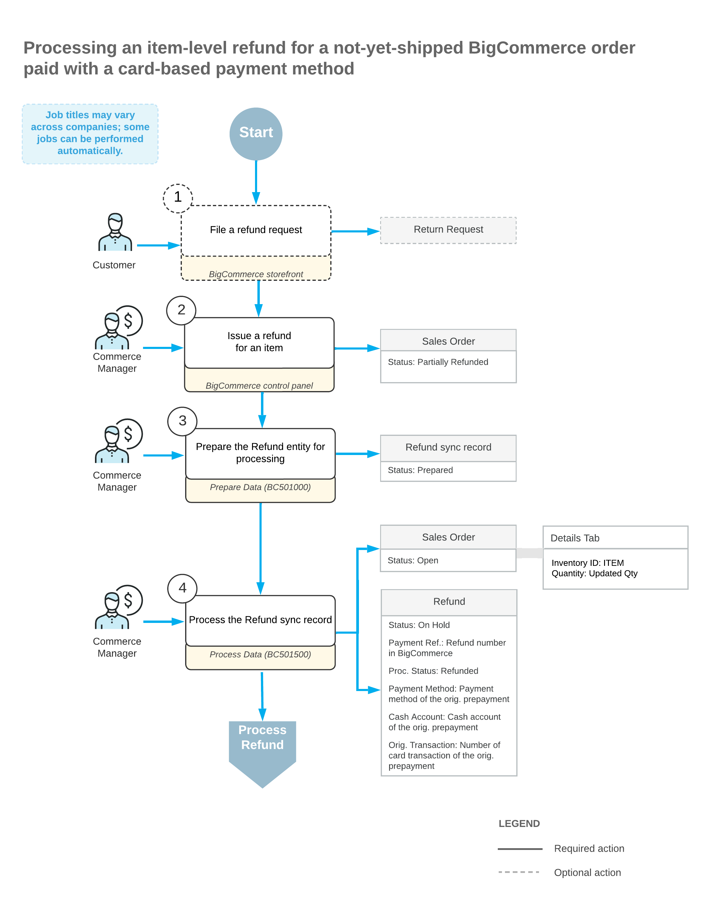
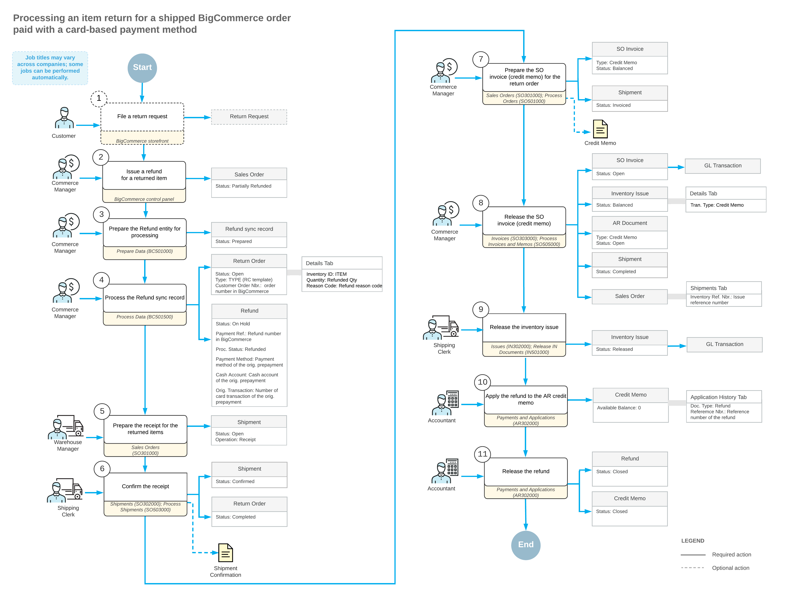

# Importing Card Refunds: Item-Level Refunds {#_ea283063-67fb-4cad-af67-e36ec77447da .concept}

A refund of an ordered item may be issued if, for example, a customer wants to amend the order to decrease the quantity of a purchased item or because they want to return the item whose condition or performance is unsatisfactory.

During the import of item refunds, if the original sales order has the *Open* or *On Hold* status, the following actions occur:

-   On the [Payments and Applications](AR_30_20_00.md) \(AR302000\) form, the system creates a payment of the *Refund* type in the refunded amount and applies it to the original payment.
-   In the original sales order, on the **Details** tab of the [Sales Orders](SO_30_10_00.md) \(SO301000\) form, the system updates the order line or lines to decrease the item quantities. Discounts and taxes, if applied, are recalculated accordingly.
-   If the sales order is fully refunded or canceled and the processing status of the original payment is *Authorized*, then the original payment is voided.
-   If the sales order is fully refunded or canceled and the processing status of the original payment is *Captured* or *Settled*, then a new voided payment is created against the original payment.

The following diagram illustrates the processing of an item return for a card-based payment method that is issued before the sales order has been shipped.

If the original sales order has the *Completed* status, the following actions occur:

-   On the [Sales Orders](SO_30_10_00.md) form, the system creates a return order of the type that was specified in the **Return Order Type** box on the **Orders** tab of the [BigCommerce Stores](BC_20_10_00.md) \(BC201000\) form. In the **External Reference** box of the Summary area, the system inserts the identifier of the refund in the BigCommerce store.
-   In the return order, on the **Details** tab of the [Sales Orders](SO_30_10_00.md) form, the system inserts a line with the applicable quantity of the returned item. In the **Reason Code** column, the system inserts the reason code that was specified on the **Orders** tab of the [BigCommerce Stores](BC_20_10_00.md) form.
-   In the return order, on the **Details** tab of the [Sales Orders](SO_30_10_00.md) form, the system inserts a line with the non-stock item that was specified in the **Refund Amount Item** box on the **Orders** tab of the [BigCommerce Stores](BC_20_10_00.md) form. In the **Unit Price** and **Ext. Price** columns, the system inserts the refund amount. In the **Reason Code** column, the system inserts the reason code that was specified on the **Orders** tab of the [BigCommerce Stores](BC_20_10_00.md) form.
-   On the [Payments and Applications](AR_30_20_00.md) \(AR302000\) form, creates a payment of the *Refund* type in the refunded amount and links it to the return order.

The following diagram illustrates the processing of an item return for a non-card payment method that is issued after the sales order has been shipped.

If the original sales order has a status other than *Open*, *On Hold*, or *Completed*, the system displays an error message saying that the refund cannot be applied.

**Parent topic:**[Importing Card Refunds](../UserGuide/Commerce_BC_Importing_CC_Refunds_Mapref.md)

