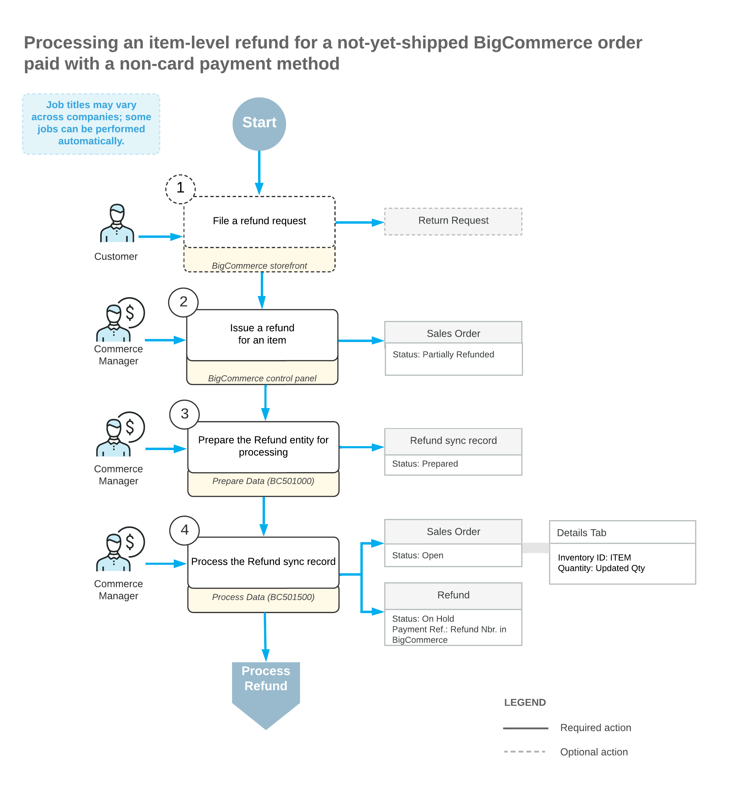
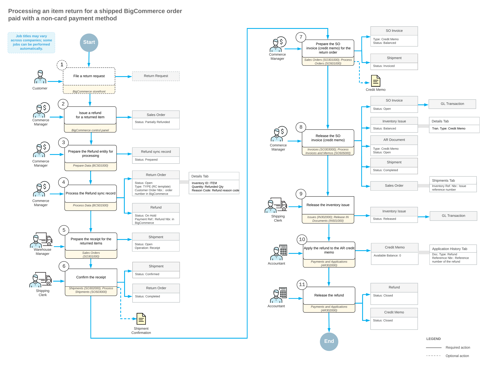

# Importing Non-Card Refunds: Item-Level Refunds {#_693642db-6186-48dc-b977-6e13f10a52f9 .concept}

A refund of an ordered item may be issued if, for example, a customer wants to amend a not-yet-shipped order to decrease the quantity of a purchased item or because they want to return the item whose condition or performance is unsatisfactory.

During the import of item refunds, if the original sales order has the *Open* or *On Hold* status on the [Sales Orders](SO_30_10_00.md) \(SO301000\) form, the system does the following:

-   On the [Payments and Applications](AR_30_20_00.md) \(AR302000\) form, creates a payment of the *Refund* type in the refunded amount and applies it to the original payment.
-   In the original sales order, on the **Details** tab of the [Sales Orders](SO_30_10_00.md) form, updates the order line or lines to decrease the item quantities. If discounts and taxes have been applied, they are recalculated accordingly.

The following diagram illustrates the processing of an item refund for a non-card payment method when the refund is issued before the sales order has been shipped.

If the original sales order has the *Completed* status on the [Sales Orders](SO_30_10_00.md) form, the following actions occur:

-   On the [Sales Orders](SO_30_10_00.md) form, the system creates a return order of the type that was specified in the **Return Order Type** box on the **Orders** tab of the [BigCommerce Stores](BC_20_10_00.md) \(BC201000\) form. In the **External Reference** box of the Summary area, the system inserts the identifier of the refund that is used in the BigCommerce store.
-   In the return order, on the **Details** tab of the [Sales Orders](SO_30_10_00.md) form, the system inserts a line with the applicable quantity of the returned item. In the **Reason Code** column, the system inserts the reason code that was specified on the **Orders** tab of the [BigCommerce Stores](BC_20_10_00.md) form.
-   On the [Payments and Applications](AR_30_20_00.md) \(AR302000\) form, creates a payment of the *Refund* type in the refunded amount and links it to the return order.

The following diagram illustrates the processing of an item return for non-card payment methods when this return is issued after the sales order has been shipped.

If the original sales order has a status other than *Open*, *On Hold*, or *Completed* on the [Sales Orders](SO_30_10_00.md) form, the system displays an error message saying that the refund cannot be applied.

**Parent topic:**[Importing Non-Card Refunds](../UserGuide/Commerce_BC_Importing_nonCC_Refunds_Mapref.md)

