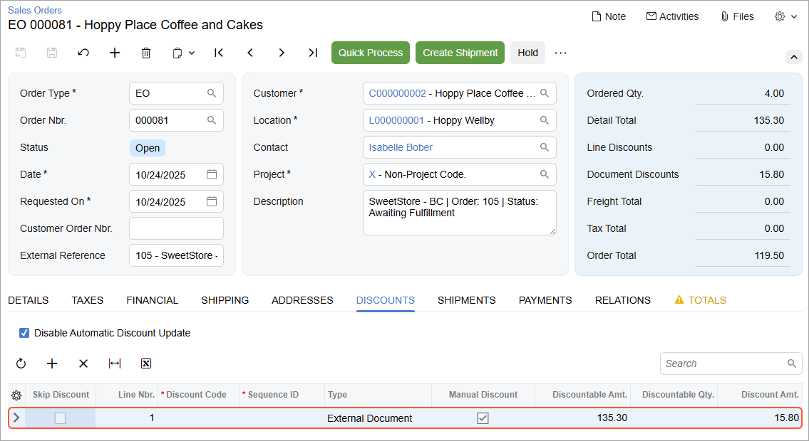

# Import of Orders with Discounts: Process Activity {#_fb901059-530c-4525-a5c3-b74e2fe4c3eb .task}

The following activity will walk you through the process of importing orders that contain items with discounts.

**Attention:** The following activity is based on the *U100* dataset.

## Story { .section}

Suppose that SweetLife decided to offer discounts for some of the products that the company sells in its BigCommerce store. Starting from today, the company provides the following discounts:

-   An extra gift item for purchases of 96-ounce jar of banana jam
-   A 10 percent discount on purchases of 96-ounce jar of plum jam
-   A 5 percent discount on orders of $100 or more

As SweetLife's implementation consultant, you need to define these discounts in the BigCommerce store and make sure that orders that contain discounts or items with discounts are imported to Acumatica ERP with the discounts applied correctly.

## Configuration Overview {#section_tz4_djx_cnb .section}

In the *U100* dataset, on the [Stock Items](IN_20_25_00.md) \(IN202500\) form, the *BANJAM96* and *PLUMJAM96* stock items have been created for the purposes of this activity.

## Process Overview { .section}

In this activity, you will do the following:

1.  On the [BigCommerce Stores](BC_20_10_00.md) \(BC201000\) form, update the discount-related settings.
2.  In the control panel of the BigCommerce store, define three discounts of different types.
3.  In the control panel, create a sales order with the automatically applied discounts.
4.  On the [Prepare Data](BC_50_10_00.md) \(BC501000\) form, prepare the sales order data for synchronization; on the [Process Data](BC_50_15_00.md) \(BC501500\) form, process the sales order data prepared for synchronization.
5.  On the [Sales Orders](SO_30_10_00.md) \(SO301000\) form, review the imported sales order and applied discounts.

## System Preparation { .section}

Before you complete the instructions in this activity, do the following:

1.  Make sure that the following prerequisite activities have been performed:
    -   [Initial Configuration: To Establish and Configure the Store Connection](Commerce_BC_Initial_Configuration_Implem_Activity.md)
    -   [Synchronizing Customers: To Perform Bidirectional Synchronization](Commerce_BC_Syncing_Customers_To_Perform_Bidirectional_Sync.md)
    -   [Price Synchronization: To Export Base Prices](Commerce_BC_Syncing_Prices_To_Sync_Base_Prices.md)
    -   [Synchronizing Customers: To Synchronize Customers with Multiple Locations](Commerce_BC_Syncing_Customers_To_Sync_Customers_with_Locations.md).
2.  Launch the Acumatica ERP website with the *U100* dataset preloaded, and sign in with the following credentials:
    -   **Username**: *gibbs*
    -   **Password**: *123*
3.  On the [Enable/Disable Features](CS_10_00_00.md) \(CS100000\) form, enable the *Customer Discounts* feature.

## Step 1: Updating Discount-Related Settings { .section}

To review the settings specified in Acumatica ERP for the import of online orders with discounts, do the following:

1.  On the [BigCommerce Stores](../Shared/../UserGuide/BC_20_10_00.md) \(BC201000\) form, select the *SweetStore - BC* store.
2.  On the **Orders** tab \(**Order** section\), in the **Show Discounts As** box, select *Document Discounts*.

    With this option selected, the system aggregates discounts applied to particular lines of the order in the BigCommerce store and displays these discounts at the document level.

    If the *Line Discounts* option were selected, the system would show all discounts in the imported orders on the **Details** tab split between order lines.

3.  On the form toolbar, click **Save**.

## Step 2: Defining the First Discount { .section}

In this step, you will define the first discount, a "buy one, get one free" discount that will be applied to the *Banana jam 96 oz* product.

In the control panel of the BigCommerce store, do the following:

1.  In the left pane, click **Marketing** &gt; **Promotions**.

    The **Promotions** page opens.

2.  In the upper right of the **Automatic** tab, click **Create** &gt; **With standard editor**.

    The **Create Promotion** page opens.

3.  In the **Promotion name** box \(**Summary** section\), type `Buy one, get one free (Banana jam 96 oz)`.
4.  Under **Schedule**, make sure that the date and time inserted by default are earlier than the current date and time. The discount should be effective when you create an order with this item later in this activity.
5.  In the **Rules** section, click **Add rule**.
6.  In the **Choose a rule for your promotion** dialog box, click the **Buy one, get one free** option button and click **Apply template**.
7.  On the **Create Promotion** &gt; **Rules** page, define the promotion rule as follows:
    -   **If the customer**: *Buys Products*
    -   **Reaching a**: *Quantity* `1` products
    -   **Including products**: *Individual Products* *Banana jam 96 oz*
    -   **Then reward**: *A gift in their cart* *Once* per cart
    -   **Include**: `1` *Banana jam 96 oz* in the customer's cart for free.
8.  In the lower right, click **Add rule to promotion** to save the rule and return to the **Create Promotion** page.
9.  In the lower right, click **Create promotion**.

## Step 3: Define a Second Discount { .section}

To define a 10% discount that will be applied to the price of the *Plum jam 96 oz* product, do the following:

1.  While you are viewing the **Promotions** page \(**Automatic** tab\), click **Create** &gt; **With standard editor**.

    The **Create Promotion** page opens.

2.  In the **Promotion name** box \(**Summary** section\), type `10% off Plum jam 96 oz`.
3.  Under **Schedule**, make sure that the date and time inserted by default are earlier than the current date and time. The discount should be effective when you create an order with this item later in this activity.
4.  In the **Rules** section, click **Add rule**.
5.  In the **Choose a rule for your promotion** dialog box, make sure the **Custom rules** option button is selected, and click **Apply template**.
6.  On the **Create Promotion** &gt; **Rules** page, define the promotion rule as follows:
    -   **If the customer**: *No conditions*
    -   **Then reward**: *Discount on products*
    -   **By a**: *Percentage* `10` % from *Each product's price*
    -   **Applied on**: *All* products
    -   **Including products already on sale**: Cleared
    -   **Including products**: *Individual Products* *Plum jam 96 oz*
7.  In the lower right, click **Add rule to promotion** to save the rule and return to the **Create Promotion** page.
8.  In the lower right, click **Create promotion**.

## Step 4: Defining a Third Discount { .section}

To define a discount that will be applied to all orders that exceed the $100 threshold, do the following:

1.  While you are viewing the **Promotions** page \(**Automatic** tab\), click **Create** &gt; **With standard editor**.

    The **Create Promotion** page opens.

2.  In the **Promotion name** box \(**Summary** section\), type `5% discount on orders of $100 or more`.
3.  Under **Schedule**, make sure that the date and time inserted by default are earlier than the current date and time. The discount should be effective when you create an order with this item later in this activity.
4.  In the **Rules** section, click **Add rule**.
5.  In the **Choose a rule for your promotion** dialog box, click the **Discount order subtotal** option button and click **Apply template**.
6.  On the **Create Promotion** &gt; **Rules** page, define the promotion rule as follows:
    -   **If the customer**: *Reaches an order sub-total*
    -   **Spending at least**: `100` on the order
    -   **Then reward**: *Discount on order sub-total* *Once* per cart
    -   **Discounting by a**: *Percentage* `5` from the order sub-total
7.  In the lower right, click **Add rule to promotion** to save the rule and return to the **Create Promotion** page.
8.  In the lower right, click **Create promotion**.

## Step 5: Creating a Sales Order { .section}

To create an order for the *Banana jam 96 oz* and *Plum jam 96 oz* products \(to which the first and second discounts apply\), do the following:

1.  In the left pane of the control panel of the BigCommerce store, click **Orders** &gt; **Add**.
2.  On the **Add an order** &gt; **Customer info** page, complete the order as follows:
    1.  In the **Customer information** section, select the **Existing customer** option button to the right of **Order for**.
    2.  In the **Search** box, start typing the customer's name, `Isabelle`, and select *Isabelle Bober* in the list of search results.
    3.  In the **Billing information** section, click *Use this address* right of the address details for *William Duncan*.

        The billing address elements are filled with the settings from the previously saved address of this customer.

    4.  Clear the **Save to customer's address book** check box.
    5.  In the lower right, click **Next**.
3.  On the **Add an order** &gt; **Items** page, under **Add products**, do the following:
    1.  In the **Search** box, start typing `plum`, and in the list of search results, select *Plum jam 96 oz*.
    2.  In the only row for *Plum jam 96 oz*, in the **Qty** column, make sure *1* is specified.

        Notice that in the **Price** column, the price of the product is *$45.15*, which is the default price, but the **Total** is $40.63, which is the price after the second product discount has been applied.

    3.  In the **Search** box, start typing `banana`, and in the list of search results, select *Banana jam 96 oz*.

        Notice that two lines have been added for the *Banana jam 96 oz* product. The price and total in the first line are $45. In the second line, the price and total are zero, because this is the free item that you specified for the first discount.

    4.  In the line of the *Plum jam 96 oz*, change the quantity to *2*.
    5.  Notice that the amount in the **Total** column has changed for the items \(except the free item\)—$76.91 for *Plum jam 96 oz* and $42.59 for *Banana jam 96 oz*—because the order total now exceeds the $100 threshold and the order-level discount has been applied. The order subtotal is *$135.30*.
    6.  In the lower right, click **Next**.
4.  On the **Add an order** &gt; **Fulfillment** page, do the following:
    1.  In the **Shipping Method** section, click the *Fetch shipping quotes* link.
    2.  In the box with the list of shipping options, click *Free Shipping \($0.00\)*.
    3.  In the lower right, click **Next**.
5.  On the **Add an order** &gt; **Payment** page, do the following:
    1.  Review the information in the **Customer billing details**, **Fulfillment Details**, and **Summary** sections, and make sure that the order grand total after applying all discounts is *$119.50* and the discount amount is *$15.80*.
    2.  In the **Payment** section, select the *Manual payment* payment method.
    3.  In the lower right, click **Save &amp; process payment**.
6.  On the **View orders** page, which opens, make a note of the reference number of the created order.

## Step 6: Importing the Sales Order { .section}

To import the sales order, in Acumatica ERP, do the following:

1.  On the [Prepare Data](../Shared/../UserGuide/BC_50_10_00.md) \(BC501000\) form, specify the following settings in the Summary area:
    -   **Store**: *SweetStore - BC*
    -   **Prepare Mode**: *Incremental*
2.  In the table, in the row of the *Sales Order* entity, select the check box in the unlabeled column.
3.  On the form toolbar, click **Prepare**.
4.  In the **Processing** dialog box, which opens, click **Close** to close the dialog box.
5.  In the row of the *Sales Order* entity, click the link in the **Ready to Process** column.
6.  On the [Process Data](BC_50_15_00.md) \(BC501500\) form, which opens with the *SweetStore - BC* store and the *Sales Order* entity selected, select the unlabeled check box in the row of the sales order you created in this activity.
7.  On the form toolbar, click **Process**.
8.  In the **Processing** dialog box, which opens, click **Close** to close the dialog box.

## Step 7: Reviewing the Discounts in the Imported Sales Order { .section}

To review how the discounts are displayed in the imported sales order, do the following:

1.  On the [Sync History](BC_30_10_00.md) \(BC301000\) form, specify the following settings in the Summary area:
    -   **Store**: *SweetStore - BC*
    -   **Entity**: *Sales Order*
2.  In the Filter List drop-down menu above the table, select *Processed*.
3.  In the table, in the row of the sales order that you have just imported \(which you can locate by its external ID\), click the link in the **ERP ID** column.
4.  On the [Sales Orders](SO_30_10_00.md) \(SO301000\) form, which opens, review the settings of the order.

    On the **Details** tab, notice that for the free item, *Banana jam 96 oz*, a separate line has been created with the *0* extended price. In the **Discount Amount** and **Discount Percent** column, the system has inserted zeros in all lines.

    On the **Discounts** tab, notice that one line has been created for all discounts applied to the order in the BigCommerce store \(as shown in the following screenshot\). The text in the **Type** column \(*External Document*\) reflects the fact that the discounts were not applied in Acumatica ERP but were instead imported from an external system. The amount in the **Discount Amt.** column corresponds to the **Discount** value of the order in the BigCommerce store \($15.80\).

    

5.  Close the pop-up window with the [Sales Orders](SO_30_10_00.md) form.

You have created automatic discounts of different types in the BigCommerce store, explored how they are applied to an order in the store, and reviewed how they are displayed on the order after it has been imported to Acumatica ERP. If you were to continue processing the order, you would also notice that the document-level discounts are posted to a separate expense account specified for the customer in the **Discount Account** box on the **GL Accounts** tab of the [Customers](AR_30_30_00.md) \(AR303000\) form.

## Step 8: Deactivating the Discounts { .section}

To deactivate the discounts that you have set up in this activity, while you are signed in to the control panel of the BigCommerce store, do the following:

1.  In the left pane, click **Marketing** &gt; **Promotions**.
2.  On the **Automatic** tab, switch off the toggle in the **Active?** column for each of the discounts.

**Parent topic:**[Importing Orders with Discounts](../UserGuide/Commerce_BC_Orders_with_Discounts_Mapref.md)

