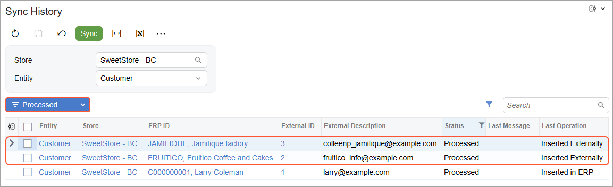

# Synchronizing Customers: To Perform Bidirectional Synchronization {#_d29ca3d4-440f-49d7-b189-ba31cbc8910b .task}

The following activity will walk you through the process of setting up the bidirectional synchronization of customers and performing the synchronization of customers between Acumatica ERP and the BigCommerce store.

**Attention:** The following activity is based on the *U100* dataset.

## Story { .section}

Suppose that the SweetLife Fruits &amp; Jams company has multiple corporate customers from the United States and Canada in the system. The company management wants customer records for US customers to be exported from Acumatica ERP to the BigCommerce store. At the same time, new customers that place orders in the BigCommerce store should be imported to Acumatica ERP.

Because an email address is a key field for a customer in BigCommerce, customers that do not have it specified in Acumatica ERP will not be saved in the BigCommerce store during the export.

Acting as an implementation consultant helping SweetLife to set up the integration of Acumatica ERP with the BigCommerce store, you need to configure the bidirectional synchronization of customers, and configure the filtering conditions to export only records for US customers that have an email specified.

## Configuration Overview {#section_tz4_djx_cnb .section}

In the *U100* dataset, the following tasks have been performed to support this activity:

-   On the [Customer Classes](AR_20_10_00.md) \(AR201000\) form, the *COMMERCEBB* and *ECCUSTOMER* customer classes have been configured. The *COMMERCEBB* customer class is assigned to local \(US\) customers that need to be exported to the external system.
-   On the [Customers](AR_30_30_00.md) \(AR303000\) form, the following customer records have been created and assigned the *COMMERCEBB* customer class:
    -   *FRUITICO*: On the **General** tab, notice that no details have been specified in the boxes of the **Primary Contact** section. In the **Additional Account Info** section, the account's email address and phone number have been specified.
    -   *JAMIFIQUE*: On the **General** tab, notice that in the **Primary Contact** section, the name of the contact \(*Colleen Plunkett*\) has been filled in. In the **Additional Account Info** section, the account's email address and phone number have been specified.
-   On the [Numbering Sequences](CS_20_10_10.md) \(CS201010\) form, the *ECCUSTOMER* numbering sequence has been defined.

## Process Overview { .section}

In this activity, you will perform the following steps:

1.  On the [BigCommerce Stores](BC_20_10_00.md) \(BC201000\) form, review the settings of the *Customer* entity.
2.  On the [Entities](BC_20_20_00.md) \(BC202000\) form, configure the filtering condition for the export of customers from Acumatica ERP to the BigCommerce store.
3.  On the [Prepare Data](BC_50_10_00.md) \(BC501000\) form, start the data preparation process for the *Customer* entity to prepare out-of-sync data for export.
4.  On the [Process Data](BC_50_15_00.md) \(BC501500\) form, start data processing for the *Customer* entity to save the synchronized customer data in the BigCommerce store.
5.  On the [Sync History](BC_30_10_00.md) \(BC301000\) form, review the synchronization status of the processed synchronization records.
6.  In the BigCommerce store, review the customers that have been imported from Acumatica ERP.

## System Preparation { .section}

Before you complete the instructions in this activity, do the following:

1.  Make sure that the following prerequisites have been met:
    -   The BigCommerce store has been created and configured, as described in [Initial Configuration: To Set Up a BigCommerce Store](Commerce_BC_Initial_Configuration_To_Set_Up_a_BC_Store.md).
    -   The connection to the BigCommerce store has been established and the initial configuration has been performed, as described in [Initial Configuration: To Establish and Configure the Store Connection](Commerce_BC_Initial_Configuration_Implem_Activity.md).
2.  Launch the Acumatica ERP website with the *U100* dataset preloaded, and sign in with the following credentials:
    -   **Username**: *gibbs*
    -   **Password**: *123*
3.  Sign in to the control panel of the BigCommerce store as the store administrator.

## Step 1: Reviewing the Synchronization Settings of the Customer Entity { .section}

To review the synchronization settings of the *Customer* entity, do the following:

1.  Open the [BigCommerce Stores](BC_20_10_00.md) \(BC201000\) form, select the *SweetStore - BC* store.
2.  On the **Entities** tab, in the row with the *Customer* entity, make sure that the following settings have been specified:
    -   **Active** Selected
    -   **Sync Direction**: *Bidirectional*
    -   **Primary System**: *External System*
3.  On the **Customers** tab, make sure that the following settings have been specified:
    -   **Customer Class**: *ECCUSTOMER*

        When a new customer is imported from the BigCommerce store to Acumatica ERP, its default settings will be defined based on the customer class selected in this box.

    -   **Customer Numbering Sequence**: *ECCUSTOMER*

        Each new customer imported from the BigCommerce store will be assigned an identifier based on the numbering sequence selected in this box.

4.  If you have changed any of the settings, click **Save** on the form toolbar to save your changes.

## Step 2:Configuring the Filtering Condition { .section}

To configure the export of only customer records that are assigned to the *COMMERCEBB* customer class, do the following:

1.  On the [Entities](BC_20_20_00.md) \(BC202000\) form, specify the following settings in the Summary area:
    -   **Store Name**: *SweetStore - BC*
    -   **Entity**: *Customer*
2.  To create a first filtering condition, on the **Export Filtering** tab, click **Add Row** on the table toolbar, and specify the following settings in the row:
    -   **Active**: Selected
    -   **Field Name**: *Customer Class*
    -   **Condition**: *Equals*
    -   **Value**: `COMMERCEBB`
    -   **Operator**: *And*
3.  To create a second filtering condition, and another row and specify the following settings in the row:
    -   **Active**: Selected
    -   **Field Name**: *Email*
    -   **Condition**: *Is Not Empty*
4.  On the form toolbar, click **Save** to save your changes.

    Now when you prepare the *Customer* entity for synchronization and process the prepared customer data, only the customers that have the *COMMERCEBB* customer class and an email address specified will be exported to the *SweetStore - BC* store.

## Step 3: Preparing the Customer Data for Synchronization { .section}

To prepare the customer data for synchronization, do the following:

1.  On the [Prepare Data](../Shared/../UserGuide/BC_50_10_00.md) \(BC501000\) form, specify the following settings in the Summary area:
    -   **Store**: *SweetStore - BC*
    -   **Prepare Mode**: *Incremental*
2.  In the table, select the check box in the unlabeled column in the row of the *Customer* entity, and on the form toolbar, click **Prepare**.
3.  In the **Processing** dialog box, which opens, review the results of the processing, and click **Close** to close the dialog box and return to the [Prepare Data](../Shared/../UserGuide/BC_50_10_00.md) form.

    Notice that the **Prepared Records** column shows the number of synchronization records that have been prepared and are ready to be processed.

## Step 4: Processing the Prepared Customer Data { .section}

To process the customer data you have prepared for synchronization, do the following:

1.  While you are still viewing the [Prepare Data](BC_50_10_00.md) \(BC501000\) form, click the link in the **Ready to Process** column of the row with the *Customer* entity.

    The [Process Data](BC_50_15_00.md) \(BC501500\) form opens with the *SweetStore - BC* store and the *Customer* entity selected in the Summary area. The table displays all synchronization records of the *Customer* entity that the system has prepared in the previous step.

2.  On the form toolbar, click **Process All** to process both synchronization records displayed in the table.
3.  In the **Processing** dialog box, which opens, click **Close** to close the dialog box.

## Step 5:Reviewing the Synchronization Status { .section}

To review the synchronization status of the synchronization records that you processed in the previous step, do the following:

1.  On the [Sync History](BC_30_10_00.md) \(BC301000\) form, specify the following settings in the Summary area:
    -   **Store**: *SweetStore - BC*
    -   **Entity**: *Customer*
2.  In the Filter List drop-down menu above the table, select *Processed*.

    The table shows the items that have been synchronized with the *SweetStore - BC* store \(see the following screenshot\). For each customer of the *COMMERCEBB* customer class that you processed, the system displays an identifier in the **External ID** column. The **Last Operation** column is set to *Inserted Externally* and the time stamp in the **Last Attempt** column now shows the date and time when you ran data processing on the [Process Data](BC_50_15_00.md) \(BC501500\) form.

    

## Step 6:Viewing Exported Customer Records { .section}

1.  While you are still viewing the [Sync History](BC_30_10_00.md) \(BC301000\) form, locate the row with *JAMIFIQUE, Jamifique factory* in the **ERP ID** column, and click the link in the **External ID** column of that row.

    The **Customer details** tab of the **Edit customer** page of the control panel of the BigCommerce store opens for *Colleen Plunkett*, who is the primary contact of the *JAMIFIQUE* customer.

    **Attention:** If you are not signed in to the control panel of the BigCommerce store in the same browser, you will need to enter your sign-in credentials.

    Notice that the details that have been filled in for the customer based on the information from the **General** tab of the [Customers](AR_30_30_00.md) \(AR303000\) form. The name from the **Primary Contact** section has been imported as the customer's first name and last name \(*Colleen* and *Plunkett*, respectively\). The **Email** and **Phone** boxes have been filled in with the email address and the phone number from the **Additional Contact Information** section of the same tab. The **Company name** box has been filled in with the account name from the Summary area.

2.  Go to the **Customer address book** tab.

    Notice that no addresses have been added for the customer. Because the *Customer Location* entity was not activated on the **Entities** tab of the [BigCommerce Stores](BC_20_10_00.md) \(BC201000\) form, the location information has not been imported to the BigCommerce store for this customer and other customers synchronized in the previous steps of this activity.

3.  In the left pane, click **Customers** &gt; **All Customers**.
4.  On the **View customers** page, which opens, review the list of customers that have been exported.

    Because you have configured the filtering condition so that the system exports from Acumatica ERP only the customers of the *COMMERCEBB* customer class, only the customers of that customer class and the customers created directly in the BigCommerce store are displayed on the **View Customers** page.

5.  Click the row of *Fruitico Coffee and Cakes*.

    The **Edit customer** page opens. Because the **Name** box of the **Primary Contact** section was empty for this customer on the [Customers](AR_30_30_00.md) \(AR303000\) form, the **First name** and **Last name** boxes on the **Customer details** tab have been filled in with the information from the **Legal Name** box of the **Account Information** section on the [Customers](AR_30_30_00.md) form \(*Fruitico* and *Coffee and Cakes*, respectively\).

**Parent topic:**[Synchronizing Customers](../UserGuide/Commerce_BC_Syncing_Customers_Mapref.md)

