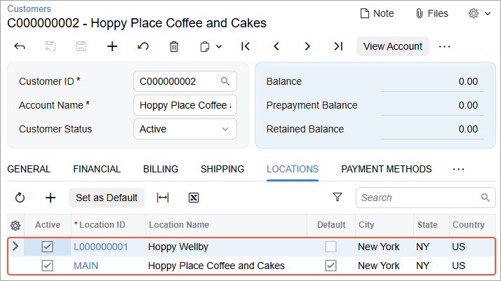

# Synchronizing Customers: To Synchronize Customers with Multiple Locations {#_54e4a1f7-a552-4675-851b-c571602e10cd .task}

The following activity will walk you through the process of setting up the synchronization of customer locations and performing the synchronization of customers with locations between Acumatica ERP and the BigCommerce store.

**Attention:** The following activity is based on the *U100* dataset.

## Story {#section_jq1_f4h_gtb .section}

Suppose that the SweetLife Fruits &amp; Jams company works with corporate customers that order items to be delivered to multiple locations. The company's sales managers keep track of customer addresses by using the customer address book functionality in the BigCommerce store and need the addresses from the BigCommerce store to be in sync with customer locations in Acumatica ERP.

Acting as an implementation consultant helping SweetLife to set up the integration of Acumatica ERP with the BigCommerce store, you need to set up the synchronization of customer locations between the two systems, as well as test it and explore how the synchronization works in both systems.

## Configuration Overview {#section_tz4_djx_cnb .section}

In the *U100* dataset, the following tasks have been performed to support this activity:

-   On the [Enable/Disable Features](CS_10_00_00.md) \(CS100000\) form, the *Business Account Locations* feature has been enabled.
-   On the [Customer Classes](AR_20_10_00.md) \(AR201000\) form, the *ECCUSTOMER* customer class has been defined.
-   On the [Numbering Sequences](CS_20_10_10.md) \(CS201010\) form, the *ECCUSTOMER* and *ECLOCATION* numbering sequences have been defined.

## Process Overview { .section}

In this activity, you will do the following:

1.  On the [BigCommerce Stores](BC_20_10_00.md) \(BC201000\) form, update the settings of the *Customer* and *Customer Locations* entities.
2.  In the control panel of the BigCommerce store, create a new customer with two addresses.
3.  On the [Prepare Data](BC_50_10_00.md) \(BC501000\) form, prepare the customer and customer address data for synchronization.
4.  On the [Process Data](BC_50_15_00.md) \(BC501500\) form, process the customer and customer address data prepared for synchronization.
5.  On the [Customers](AR_30_30_00.md) \(AR303000\) form, review the imported customer data.
6.  On the [Customer Locations](AR_30_30_20.md) \(AR303020\) form, review the imported customer address data and update one of the customer locations.
7.  By using the [Sync History](BC_30_10_00.md) \(BC301000\) form, synchronize the updated customer location with the BigCommerce store.
8.  In the control panel of the BigCommerce store, review the updated customer address.

## System Preparation {#section_lq1_f4h_gtb .section}

Before you perform the instructions in this activity, do the following:

1.  Make sure that the following prerequisites have been met:
    -   The BigCommerce store has been created and configured, as described in [Initial Configuration: To Set Up a BigCommerce Store](Commerce_BC_Initial_Configuration_To_Set_Up_a_BC_Store.md).
    -   The connection to the BigCommerce store has been established and the initial configuration has been performed, as described in [Initial Configuration: To Establish and Configure the Store Connection](Commerce_BC_Initial_Configuration_Implem_Activity.md).
2.  Launch the Acumatica ERP website with the *U100* dataset preloaded, and sign in with the following credentials:
    -   **Username**: *gibbs*
    -   **Password**: *123*
3.  Sign in to the control panel of the BigCommerce store as the store administrator.

## Step 1: Configuring the Synchronization Settings of the Customer and Customer Location Entities {#section_mq1_f4h_gtb .section}

To review the synchronization settings of the *Customer* and *Customer Locations* entities, do the following:

1.  On the [BigCommerce Stores](../Shared/../UserGuide/BC_20_10_00.md) \(BC201000\) form, select the *SweetStore - BC* store.
2.  On the **Entities** tab, do the following:
    1.  In the row of the *Customer* entity, make sure that **Sync Direction** is set to *Bidirectional*.
    2.  In the row of the *Customer Location* entity, select the **Active** check box.

        **Tip:** All settings of the *Customer Location* entity \(including the synchronization direction\) are the same as those of the *Customer* entity and cannot be edited.

3.  On the **Customers** tab, make sure that the following settings have been specified:
    -   **Customer Class**: *ECCUSTOMER*

        When a new customer is imported from the BigCommerce store to Acumatica ERP, its default settings are defined based on the customer class selected in this box.

    -   **Customer Numbering Sequence**: *ECCUSTOMER*

        Each new customer imported from the BigCommerce store will be assigned an identifier based on the numbering sequence selected in this box.

    -   **Location Numbering Sequence**: *ECLOCATION*

        Each new customer location imported from the BigCommerce store will be assigned an identifier based on the numbering sequence selected in this box.

4.  On the form toolbar, click **Save** to save your changes.

## Step 2: Creating a Customer in the BigCommerce Store { .section}

To create a customer with two addresses, in the control panel of the BigCommerce store, do the following:

1.  Open the control panel of the BigCommerce store.
2.  In the left pane, click **Customers** &gt; **Add** to open the **Add customer** page.
3.  In the **Customer details** section of the **Customer details** tab, specify the following details:
    -   **First name**: `Isabelle`
    -   **Last name**: `Bober`
    -   **Company name**: `Hoppy Place Coffee and Cakes`
    -   **Email**: `hoppy_info@example.com`
4.  In the **Password** section, specify the following settings:
    -   **Password**: `!Q123456`
    -   **Confirm password**: `!Q123456`
5.  In the lower right, click **Add customer** to save the new customer record.

## Step 3: Adding Two Addresses for the Customer {#section_oq1_f4h_gtb .section}

To add the first address for the customer record that you created in the previous step, do the following in the BigCommerce store:

1.  While you are still signed in to the control panel of the BigCommerce store, on the **View customers** page, click the row of *Isabelle Bober*.
2.  On the **Edit customer** page, which opens with the details of *Isabelle Bober*, on the **Customer address book** tab, click **Add an address**.
3.  On the **Add address** page, which opens, specify the following settings:
    -   **First name**: `Isabelle`
    -   **Last name**: `Bober`
    -   **Company name**: `Hoppy Place Coffee and Cakes`
    -   **Phone number**: `212-555-0143`
    -   **Address line 1**: `3690 Taylor Street`
    -   **Suburb/City**: `New York`
    -   **Country**: *United States*
    -   **State/Province**: *New York*
    -   **Zip/Postcode**: `10007`
    -   **Type**: **Commercial**
4.  In the lower right, click **Save and Add Another**.
5.  To add a second address for the customer, on the **Add address** page, which opens, specify the following settings:
    -   **First name**: `William`
    -   **Last name**: `Duncan`
    -   **Company name**: `Hoppy Wellby`
    -   **Phone number**: `212-555-0164`
    -   **Address line 1**: `2671 Simons Hollow Road`
    -   **Suburb/City**: `New York`
    -   **Country**: *United States*
    -   **State/Province**: *New York*
    -   **Zip/Postcode**: `10001`
6.  In the lower right, click **Save**.

    The system saves the second address.

7.  In the left pane, click **Customers** &gt; **All Customers** to open the **Add customer** page.
8.  On the **View customers** page, which opens, click the row of *Isabelle Bober*.
9.  On the **Edit customer** page, which opens with the details of *Isabelle Bober*, click the **Customer address book** tab and review the list of addresses that you have added.

## Step 4: Preparing the Customer and Customer Location Data {#section_pq1_f4h_gtb .section}

To prepare the customer and customer location data for synchronization, in the Acumatica ERP instance, do the following:

1.  On the [Prepare Data](BC_50_10_00.md) \(BC501000\) form, specify the following settings in the Summary area:

    -   **Store**: *SweetStore - BC*
    -   **Prepare Mode**: *Incremental*
    This setting controls which data will be loaded. *Incremental* indicates that only the customer records that match the filtering conditions and have been modified since the previous processing of the data have been prepared for synchronization.

2.  In the table, select the check box in the unlabeled column in the row of the *Customer* entity, and on the form toolbar, click **Prepare**.

    Because customer locations are synchronized automatically along with customers during the synchronization of the *Customer* entity, the *Customer Location* entity is not listed in the table and cannot be prepared separately.

3.  In the **Processing** dialog box, which opens, review the results of the processing, and click **Close** to close the dialog box and return to the [Prepare Data](../Shared/../UserGuide/BC_50_10_00.md) form.

    Notice that the **Prepared Records** column shows the number of synchronization records that have been prepared and are ready to be processed.

## Step 5: Processing the Prepared Customer and Customer Location Data {#section_qq1_f4h_gtb .section}

To process the customer and customer location data you have prepared for synchronization, do the following:

1.  While you are still viewing the [Prepare Data](BC_50_10_00.md) \(BC501000\) form, click the link in the **Ready to Process** column of the row with the *Customer* entity.

    The [Process Data](BC_50_15_00.md) \(BC501500\) form opens with the *SweetStore - BC* store and the *Customer* entity selected in the Summary area.

2.  In the table, select the unlabeled check box in the only row, which has a number in the **External ID** column but does not have any value in the **ERP ID** column.

    **Tip:** The empty **ERP ID** indicates that the record has been created in the BigCommerce store but has not yet been synchronized with Acumatica ERP.

3.  On the form toolbar, click **Process** to process the selected synchronization record.
4.  In the **Processing** dialog box, which opens, click **Close** to close the dialog box.

## Step 6: Reviewing the Imported Customers and Customer Locations {#section_rq1_f4h_gtb .section}

Perform the following instructions to review the customers and customer locations that have been imported to Acumatica ERP:

1.  Open the Customers \(AR3030PL\) form.
2.  In the list of customers, in the **Customer Name** column, locate the *Hoppy Place Coffee and Cakes* customer, which you created in the BigCommerce store, and click the link for this customer in the **Customer ID** column.
3.  On the [Customers](AR_30_30_00.md) \(AR303000\) form, which opens for *Hoppy Place Coffee and Cakes*, on the **Locations** tab, review the locations the system created when the customer record was synchronized.

    Notice that the table displays the following locations \(shown in the screenshot below\):

    -   The location with the *MAIN* identifier, which is the location that you have created first for the customer in the BigCommerce store. This location is also marked as the default \(that is, the **Default** check box is selected for this location\).
    -   The location with the identifier that the system assigned to it based on the numbering sequence selected for locations in the store settings on the [BigCommerce Stores](BC_20_10_00.md) \(BC201000\) form.
    

4.  Click the *MAIN* link in the **Location ID** column.

    On the [Customer Locations](AR_30_30_20.md) \(AR303020\) form, which the system has opened in a pop-up window, on the **General** tab, review the location details that have been imported from the BigCommerce store.

    Notice that the **Company Name** value from the address in BigCommerce has been imported as the **Location Name** of the **Location Info** section and the **Account Name** box of the **Additional Location Info** section.

    The address lines, city, state, country, and postal code have been imported to the appropriate boxes of the **Location Address** section.

    The first and last name of the address in BigCommerce have been imported to the **Attention** box of the **Additional Location Info** section.

## Step 7: Updating the Customer Location {#section_sq1_f4h_gtb .section}

Suppose that you need to update the contact and address details of the *MAIN* customer location of the *Hoppy Place Coffee and Cakes* customer. Do the following:

1.  While you are still viewing the *MAIN* customer location on the [Customer Locations](AR_30_30_20.md) \(AR303020\) form, on the **General** tab, in the **Additional Location Info** section, type `Gail Anderson` in the **Attention** box.
2.  In the **Location Address** section, change **Address Line 1** to `3650 Taylor Street`.
3.  On the form toolbar, click **Save &amp; Close** to save your changes and close the pop-up window.

## Step 8: Synchronizing the Updated Location with the BigCommerce Store {#section_tq1_f4h_gtb .section}

To synchronize the updated customer location with the BigCommerce store in order to update the address in the store, do the following:

1.  On the [Sync History](BC_30_10_00.md) \(BC301000\) form, in the Selection area, specify the following settings:
    -   **Store**: *SweetStore - BC*
    -   **Entity**: *Customer Location*
2.  In the Filter List drop-down menu above the table, select *Processed*.
3.  In the table, select the unlabeled check box in the row of the *MAIN, Hoppy Place Coffee and Cakes* location, and on the form toolbar, click **Sync**.

    **Tip:** When you change a location of a customer, the ecommerce connector recognizes the customer record as having been modified as well. So in this step, you could have selected the synchronization record for the *Hoppy Place Coffee and Cakes* customer and clicked **Sync**, and the updated customer location would have been synchronized as part of the customer synchronization process. Alternatively, you could have prepared the *Customer* entity for synchronization on the [Prepare Data](BC_50_10_00.md) \(BC501000\) form and then processed the prepared synchronization records on the [Process Data](BC_50_15_00.md) \(BC501500\) form.

## Step 9: Reviewing the Updated Customer Address in the BigCommerce Store {#section_vq1_f4h_gtb .section}

To review the updated customer address in the BigCommerce store, do the following:

1.  While you are still viewing the [Sync History](BC_30_10_00.md) \(BC301000\) form, in the row of the *MAIN, Hoppy Place Coffee and Cakes*, click the link in the **External ID** column.

    The **Edit address** page of the control panel of the BigCommerce store opens for the corresponding address of the *Hoppy Place Coffee and Cakes* customer.

    **Attention:** If you are not signed in to the control panel of the BigCommerce store in the same browser, you will need to enter your sign-in credentials.

2.  In the **Customer address details** section, review the updated details of the customer address.

    Notice that the **First name** box now displays *Gail*, **Last name** is set to *Anderson*, and the **Address line 1** has been changed to *3650 Taylor Street*.

**Parent topic:**[Synchronizing Customers](../UserGuide/Commerce_BC_Syncing_Customers_Mapref.md)

