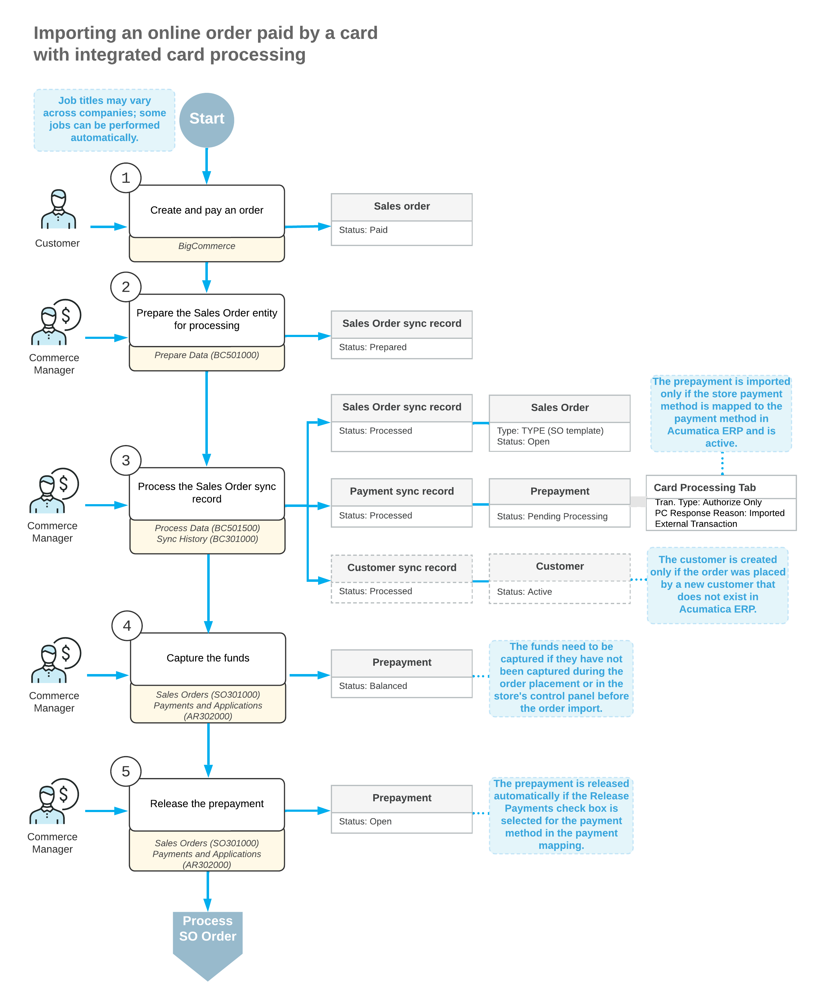

# Order Synchronization: Card Payments {#_c2977167-6fb9-4249-a134-7d2446b17014 .concept}

In Acumatica ERP Retail Edition, users can import and, if necessary, process debit and credit card payments from external ecommerce systems through integration with payment gateways. The ability to use card-processing features, such as authorization, capture, voiding, and refunding card transactions, is available if the *Integrated Card Processing* feature is enabled on the [Enable/Disable Features](CS_10_00_00.md) \(CS100000\) form. This topic explains how to configure a payment provider for processing of payments made in the BigCommerce store after they are imported to Acumatica ERP.

## Mapping of Card-Based Payment Methods { .section}

During the configuration of a connection to the BigCommerce store, one of the steps you perform is the mapping of payment methods configured in Acumatica ERP with payment methods configured in the BigCommerce store. You define payment method mapping in the table on the **Payments** tab of the [BigCommerce Stores](BC_20_10_00.md) \(BC201000\) form.

For the Authorize.Net store payment method, you specify the following:

-   **ERP Payment Method**: The identifier of the payment method in Acumatica ERP that was configured to use the same processing center as was used for setting up the payment provider in the online store.
-   **Cash Account**: A cash account that was specified for the payment method on the **Allowed Cash Accounts** tab on the [Payment Methods](CA_20_40_00.md) \(CA204000\) form.
-   **Proc. Center ID**: The identifier of the processing center configured for the payment method on the **Processing Centers** tab of the [Processing Centers](CA_20_50_00.md) \(CA205000\) form.
-   **Active**: A check box that you select for a payment method to indicate that payments made in the ecommerce system that are based on should be imported to Acumatica ERP.
-   **Release Payments and Refunds**: A check box that you select to indicate that the payment should be immediately released after it is imported to Acumatica ERP. If this check box is selected for a card-based payment method associated with a credit card processing center in Acumatica ERP \(that is, for the payment method for which a processing center is selected in the **Proc. Center ID** column\), only payments that have been captured in the store will be automatically released on import. Payments that have been authorized but not captured in the store need to be processed after import and then released manually or by using the [Release AR Documents](AR_50_10_00.md) \(AR501000\) form.
-   **Process Refunds**: A check box that indicates \(if selected\) that refunds made to the payment method should be imported to Acumatica ERP. This check box is selected and unavailable for card payment methods for which a processing center is specified, which indicates that all refunds made to such payment methods must be imported to Acumatica ERP.

## Configuring the Acumatica Payments Payment Method { .section}

Acumatica Payments is a payment provider available to BigCommerce customers as an app. Before payments based on Acumatica Payments can be imported from the BigCommerce store to Acumatica ERP, you need to configure payment processing via Acumatica Payments as follows:

1.  Set up an offline payment method in your BigCommerce store on the **Payment methods** page \(**Settings** &gt; **Payments**\), and specify the **Display Name** for that payment method.
2.  Set up Acumatica Payments in your BigCommerce store.

    You install the Acumatica Payments app form the BigCommerce App marketplace. Then configure the app and complete the following steps:

    -   Enter the name of the offline payment method in the **Payment Method Display Name** box
    -   Provide the user ID, API key, and the location and product IDs obtained from the payment gateway
    -   Select the *Developer \(Test\)* or *Production* environment type, depending on how you plan to use the app
    -   Select the *Authorize* or *Sale* action best fits your workflow
3.  Enable the *Acumatica Payments* feature on the [Enable/Disable Features](CS_10_00_00.md) \(CS100000\) form.
4.  Activate integrated card processing, configure a processing center for Acumatica Payments, and configure a card-based payment method in Acumatica ERP as described in [To Configure Acumatica Payments](AR__HOW_To_Configure_Acumatica_Payments.md). When configuring the processing center, use the same payment gateway credentials as in BigCommerce.
5.  Map the payment method with the Acumatica Payments store payment method.

    You activate the *ACUMATICA PAYMENTS* store payment method and specify the ERP payment method, cash account, and processing center you've configured on the **Payments** tab of the [BigCommerce Stores](BC_20_10_00.md) \(BC201000\) form.

When a payment is imported from the BigCommerce store to Acumatica ERP, a prepayment is created on the [Payments and Applications](AR_30_20_00.md) \(AR302000\) form based on the payment method from Acumatica ERP that was mapped to the payment method used for payment in the BigCommerce store.

Using Acumatica Payments has the following limitations:

-   The Acumatica Payments app supports only one currency per connected store.
-   ACH transactions can be imported only as cash or check transactions. The connector imports only the transaction data that BigCommerce provides through its standard order transaction APIs. As a result, ACH Void and ACH Refund transactions are not synchronized unless the order contains a corresponding offline transaction in BigCommerce.

## Mapping of the Authorize.Net Payment Method { .section}

Because the support of the Authorize.Net plug-in has been deprecated in Acumatica ERP, you can no longer create new transactions with Authorize.Net. If you continue using Authorize.Net in the BigCommerce store, you can import the payments processed with this payment method only as non-card payments. You need to specify the following settings for the Authorize.Net store payment method on the **Payments** tab of the [BigCommerce Stores](BC_20_10_00.md) \(BC201000\) form:

-   **ERP Payment Method**: A *Cash/Check* payment method of Acumatica ERP.
-   **Cash Account**: A cash account that was specified for the payment method on the **Allowed Cash Accounts** tab on the [Payment Methods](CA_20_40_00.md) \(CA204000\) form.
-   **Proc. Center ID**: Cleared
-   **Active**: A check box that you select for a payment method to indicate that payments made in the ecommerce system that are based on should be imported to Acumatica ERP.
-   **Release Payments and Refunds**: A check box that you select to indicate that the payment should be immediately released after it is imported to Acumatica ERP.
-   **Process Refunds**: A check box that indicates \(if selected\) that refunds made to the payment method should be imported to Acumatica ERP.

In the BigCommerce store, on the **Settings** &gt; **Payments** page, on the **Authorize.Net Settings** tab, we recommend you to select *Authorize &amp; Capture* in the **Transaction Type** box. This setting prevents the *Open* status from being assigned to a non-captured payment imported to Acumatica ERP, which is an incorrect status for a payment with unfinished processing.

For step-by-step instructions on configuring and importing payments based on the Authorize.Net payment method, see [Order Synchronization: To Configure and Import Authorize.Net Payments](Commerce_BC_Syncing_Orders_To_Use_AuthNet_Payments_25r1.md).

With these settings, credit card payments processed with Authorize.Net in the BigCommerce store will be imported to Acumatica ERP as non-card payments. These payments can be captured, voided, or refunded only in the BigCommerce store. For more details on processing non-card payments for BigCommerce, see [Order Synchronization: Non-Card Payments](Commerce_BC_Syncing_Orders_Payments.md).

Refunds created for these payments will be imported as non-card refunds. For more details on processing non-card refunds for BigCommerce, see [Importing Non-Card Refunds](Commerce_BC_Importing_nonCC_Refunds_Mapref.md).

## Import of Payments Based on Credit Cards { .section}

A customer who has signed in to the BigCommerce store can save credit card details during checkout. When this customer selects a payment method, enters the details of a new card, selects the **Save this card for future transactions** check box, and then places an order, the details of the credit card are saved in the processing center configured in the BigCommerce store.

When the payment is imported from BigCommerce to Acumatica ERP \(as part of the synchronization of the *Sales Order* entity or the *Payment* entity\), on the [Payments and Applications](AR_30_20_00.md) \(AR302000\) form, the system creates a document of the *Prepayment* type with the *Pending Processing* status. In the Summary area of the created document, the system inserts the following information:

-   **Payment Method**: The payment method that has been mapped to the store payment method on the **Payments** tab of the [BigCommerce Stores](BC_20_10_00.md) \(BC201000\) form
-   **Cash Account**: The cash account selected for the mapped payment method
-   **Payment Ref.**: The number of the related credit card transaction in the processing center
-   **Processing Status**: The processing status of the credit card transaction. Depending on the last successful operation with the transaction, the processing status can be one of the following:
    -   *Pre-Authorized*: The payment has been authorized but the funds have not been captured. The last successful operation was *Authorize Only*.
    -   *Captured*: The funds have been captured. The last successful operation with the credit card transaction was either *Authorize and Capture* or *Capture Authorized*.
    -   *Pre-Auth./Capture Pending Validation*: The last successful operation with the credit card transaction is unknown. To get the correct processing status of the credit card transaction, you can use the **Validate Card Payment** action on the [Payments and Applications](AR_30_20_00.md) form.

On the **Card Processing** tab on the [Payments and Applications](AR_30_20_00.md) form, the system creates a row for the last successful operation with the credit card transaction. In the **Proc. Center Response Reason** box, *Imported External Transaction* indicates that the information about the credit card transaction operation has been imported from the external ecommerce system.

In the **Tran. Type** box, the transaction operation can have one of the following types:

-   *Authorize Only*: The payment was authorized when the order was placed but has not yet been captured.
-   *Authorize and Capture*: The payment was captured when the order was placed.
-   *Capture Authorized*: The payment was authorized when the order was placed, and then the funds were captured in the control panel of the store.
-   *Unknown*: The status of the operation with the credit card transaction is unknown.

The following diagram illustrates the workflow of importing a sales order to Acumatica ERP from a BigCommerce store where it was placed and paid by a card based on a payment method for which integrated card processing has been configured in Acumatica ERP.

## Deferred Processing of Imported Credit Card Payments { .section}

Credit card transactions created in Acumatica ERP during the import of payments based on credit card payment methods require validation in the following cases:

-   If the customer used a previously saved credit card
-   If the customer entered the details of a new card and selected the **Save this card for future transactions** check box during checkout
-   If the last operation on the credit card transaction has the *Unknown* status

External credit card transactions that require validation are displayed on the **Deferred Processing Required** tab of the [Validate Card Payments](AR_51_30_00.md) \(AR513000\) form and have the **Load Payment Profile** check box selected.

When the validation process is started, the system performs the following actions:

1.  On the [Customer Payment Methods](AR_30_30_10.md) \(AR303010\) form, creates a customer payment method based on the payment profile from the processing center.
2.  Links the customer payment method to the credit card transaction.
3.  Links the customer payment method to the imported payment.
4.  Requests the status of the credit card transaction, and updates the processing status of the transaction and the status of the prepayment, if necessary.

    If the updated processing status of the transaction is *Captured*, the status of the prepayment changes to *Balanced*. If on the **General** tab of the [Accounts Receivable Preferences](AR_10_10_00.md) \(AR101000\) form, the **Enable Integrated CC Processing** check box is selected, the system releases the prepayment.

Customizations may support forced validation of all imported credit card transactions. In this case, all credit card transactions imported from external systems will be displayed on the **Deferred Processing Required** tab of the [Validate Card Payments](AR_51_30_00.md) form and will need to be validated.

**Tip:** A sales order can be fulfilled only if the credit card payment imported for it from an external ecommerce system has been validated. To streamline shipping of orders, you can set up an automation schedule on the [Validate Card Payments](../Shared/../UserGuide/AR_51_30_00.md) form to regularly process imported card transactions that require validation. For information about automation schedules, see [Automated Processing: General Information](../Shared/../UserGuide/SA_Scheduling_Automated_Processing_GeneralInfo.md).

**Parent topic:**[Synchronizing Orders](../UserGuide/Commerce_BC_Syncing_Orders_Mapref.md)

