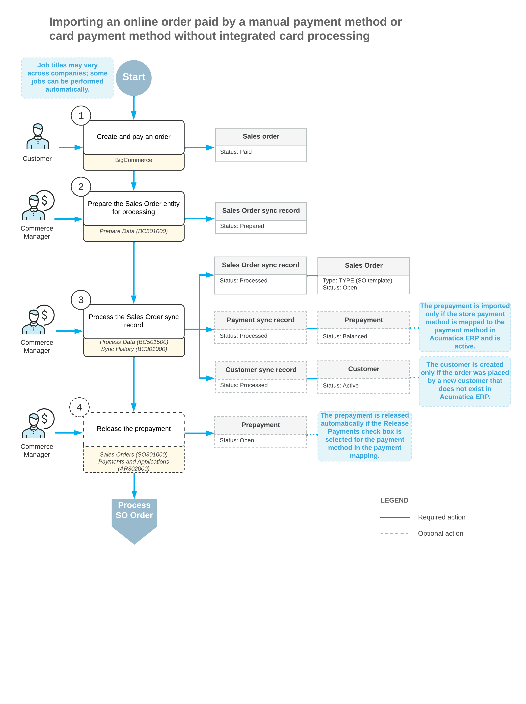

# Order Synchronization: General Information {#_768a9f42-92b5-4db3-a2e4-ac0b29155dc4 .concept}

You can import sales orders placed in the BigCommerce store to Acumatica ERP for further processing.

## Learning Objectives { .section}

In this chapter, you will learn how to do the following:

-   Configure the synchronization of orders between Acumatica ERP and the BigCommerce store
-   Configure the synchronization of payments between Acumatica ERP and the BigCommerce store
-   Import sales orders with payments from the BigCommerce store to Acumatica ERP
-   Configure the card payment processing in Acumatica ERP and BigCommerce

## Applicable Scenarios { .section}

The synchronization of orders is the main scenario for the integration between an ERP system and an external ecommerce system. You set up the import of orders from the BigCommerce store to Acumatica ERP so that you can process the imported orders further, for example, create a shipment for it, invoice the customer, and process the payment.

## Minimal Configuration of Order Synchronization {#_65ecd054-d7e0-4630-93e2-d977470c8503 .section}

To start importing sales orders from the BigCommerce store, you need to activate the required entities and specify the minimal settings for the activated entities on the [BigCommerce Stores](BC_20_10_00.md) \(BC201000\) form.

On the **Entities** tab, you activate the *Sales Order* and *Customer* entities, as well as the *Stock Item* entity, *Non-Stock Item* entity, or both entities. You specify the minimal required settings for the activated entities as follows:

-   *Customer*: You specify the settings for customer synchronization on the **Customers** tab. For information, see [Synchronizing Customers: General Information](Commerce_BC_Syncing_Customers_GeneralInfo.md).
-   *Stock Item* and *Non-Stock Item*: You specify the settings for the synchronization of stock and non-stock items on the **Inventory** tab. For details, see [Product Synchronization: General Information](Commerce_BC_Syncing_Products_GeneralInfo.md).
-   *Sales Order*: On the **Orders** tab, in the **Branch** box, you specify the branch the system will insert in imported sales orders. In the **Order Type for Import** box, you specify the order type that will be assigned to and provide the default settings for the imported sales orders. In the **Refund Amount Item** box, you specify a non-stock item to represent refund amounts in imported sales orders. On the **Shipping** tab, you map each shipping option \(which is a combination of a shipping zone and shipping method\) defined in the BigCommerce store with the ship via code and, optionally, shipping zone and shipping terms defined in Acumatica ERP.

If shipments created and processed in Acumatica ERP for the imported order should be synchronized with the BigCommerce store, you need to activate the *Shipment* entity.

## Import of Orders Without Customers { .section}

If you do not need to process the customer data in Acumatica ERP, you can import orders from the BigCommerce store without importing customers using a generic guest customer instead.

To configure the synchronization of orders without customers for the BigCommerce store, you should perform the steps described in the [Minimal Configuration of Order Synchronization](#_65ecd054-d7e0-4630-93e2-d977470c8503) topic above with the following differences on the [BigCommerce Stores](BC_20_10_00.md) \(BC201000\) form:

-   Selecting *Import* in the **Sync Direction** column for the *Sales Order* entity on the **Entities** tab.
-   Skipping the activation of the *Customer* entity on the **Entities** tab. That is, the **Active** check box remains cleared for the *Customer* entity, and no steps are performed to activate the entity.
-   Specifying a guest customer in the **Generic Guest Customer** box on the **Customers** tab,

When the system imports orders from the BigCommerce store, the guest customer is assigned as the customer for each created sales order. The system does not import customers from the store and does not create new customer records. On the **Addresses** tab of the [Sales Orders](SO_30_10_00.md) \(SO301000\), the system selects the **Override Contact** and **Override Address** check boxes and fills in the ship-to and bill-to information with the corresponding customer's data from the BigCommerce store.

## The Order Time Zone { .section}

While you are performing the initial configuration of the BigCommerce store, on the **Orders** tab of the [BigCommerce Stores](BC_20_10_00.md) \(BC201000\) form, you should specify the **Order Time Zone** that the system will use for each sales order imported from the BigCommerce store when it is created in Acumatica ERP. The order time zone is needed to determine the correct date and time of the order if Acumatica ERP and the BigCommerce store are located in different time zones.

## Limiting the Date Range for Order Import { .section}

If you have had the BigCommerce store for a while before implementing Acumatica ERP, you might want to prevent old orders from being imported to Acumatica ERP when you start synchronizing orders. On the **Orders** tab of the [BigCommerce Stores](BC_20_10_00.md) \(BC201000\) form, you specify the **Earliest Order Date**. Orders created before this date in the BigCommerce store are excluded from synchronization between Acumatica ERP and the BigCommerce store. Payments and shipments created for such orders are excluded from synchronization too.

## Tracking Imported Sales Orders in the BigCommerce Store { .section}

You might want to have information about the orders that have already been imported to Acumatica ERP available in the BigCommerce store. On the **Orders** tab of the [BigCommerce Stores](BC_20_10_00.md) \(BC201000\) form, you select the **Tag Ext. Order with ERP Order Nbr.** check box. When a sales order is imported from the BigCommerce store and assigned an order number in Acumatica ERP, the Acumatica ERP order number is exported and saved as a metafield of the sales order in BigCommerce.

## Mapping of Shipping Options { .section}

You define the mapping of each shipping option \(which is a combination of a shipping zone and shipping method\) defined in BigCommerce to the ship via code, and optionally, shipping zone and shipping terms defined in Acumatica ERP the table on the **Shipping** tab of the [BigCommerce Stores](BC_20_10_00.md) \(BC201000\) form. The **Store Shipping Zone** and **Store Shipping Method** columns of the table are populated with the settings from BigCommerce automatically for shipping options defined in the BigCommerce store.

## Synchronization of Sales Orders and Payments { .section}

Orders are imported from a BigCommerce store during the synchronization of the *Sales Order* entity. During the data processing stage of the order import, the system does the following in Acumatica ERP:

1.  Creates a sales order on the [Sales Orders](SO_30_10_00.md) \(SO301000\) form. For information about the details and settings that the system inserts in the created sales order, see [Sales Order Entity](Commerce_BC_Mapping_SalesOrder.md).

    **Attention:** Note that orders that have the *Archived* status in the BigCommerce store are filtered during the order import. That is, for each order with this status, the system creates a synchronization record and assigns it the *Filtered* status on the [Sync History](BC_30_10_00.md) \(BC301000\) form.

2.  Searches for products \(that is, stock and non-stock items\) included in the sales order.

    Products included in a sales order must be synchronized with or created in Acumatica ERP. During the import of a sales order, the system searches for an inventory ID of an inventory item in Acumatica ERP that matches the product's SKU in the BigCommerce store. If no matching inventory ID has been found, the system continues to search for a matching alternate ID. An alternate ID is an additional identifier of the item, which can be an identifier used by your company's customer or vendor, that is specified on the **Cross-Reference** tab of the [Stock Items](IN_20_25_00.md) \(IN202500\) form for a stock item and of the [Non-Stock Items](IN_20_20_00.md) \(IN202000\) form for a non-stock item. If the matching alternate ID has been found, the system inserts in the imported order an inventory item associated with this alternate ID.

3.  Searches for a customer that placed the order, and inserts it in the sales order. If the customer has been updated in the BigCommerce store, updates the customer record in Acumatica ERP. If the customer has not been found, creates a new customer on the [Customers](AR_30_30_00.md) \(AR303000\) form, and inserts it in the sales order.
4.  Creates a document of the *Prepayment* type on the [Payments and Applications](AR_30_20_00.md) \(AR302000\) form, if the payment method used for paying the sales order in the BigCommerce store has an active mapping with a payment method defined in Acumatica ERP on the [BigCommerce Stores](BC_20_10_00.md) \(BC201000\) form, and applies it to the sales order.

    If the mapping of the store payment method is inactive or has not been configured, the system creates a synchronization record for the payment on the [Sync History](BC_30_10_00.md) form and assigns it the *Filtered* status. In this case, the prepayment document is not created on the [Payments and Applications](AR_30_20_00.md) form.

    For information about the synchronization of payments, see [Order Synchronization: Non-Card Payments](Commerce_BC_Syncing_Orders_Payments.md) and [Order Synchronization: Card Payments](Commerce_BC_Syncing_Orders_Card_Payments.md).


## Workflow of Importing a Sales Order with a Manual Payment { .section}

The following diagram illustrates the workflow of importing a sales order to Acumatica ERP from a BigCommerce store where it was placed and paid by a manual payment method or a card payment method without integrated card processing.



## Use of the Guest Customer Account { .section}

If you want to allow placing orders in your store without providing the customer's phone number or email address and want to import such orders into Acumatica ERP, you need to fill in the **Generic Guest Customer** box on the **Customer Settings** tab of the [BigCommerce Stores](../Shared/../UserGuide/BC_20_10_00.md) \(BC201000\) form. This customer account appears on imported sales orders that have been placed in the BigCommerce store without customer details.

The customer record selected in the **Generic Guest Customer** box is not exported to the BigCommerce store during the synchronization of customers.

You can also configure the system to change a guest customer account after a particular number of sales orders have been created for this account. You do so by selecting the **Use Multiple Guest Accounts** check box. When the maximum allowed number of sales orders is exceeded, the system creates a new customer and inserts its identifier in the **Generic Guest Customer** box. The settings of the new customer account are copied from the previous generic guest customer account, and its identifier is generated based on the numbering sequence specified in the **Customer Numbering Sequence** box.

By default, the allowed number of sales orders per guest customer account is limited to 10,000. You can override this number by adding the `MaxOrdersPerGuestAccount` key to the &lt;appSettings&gt; section of the `web.config` file. For example, to change the guest customer account after every 500 sales orders, add the following key:

```
<add key="MaxOrdersPerGuestAccount" value="500"/>
```

For more information about creating a customer, see [Customers: General Information](../Shared/../UserGuide/Customer_GeneralInfo.md).

**Parent topic:**[Synchronizing Orders](../UserGuide/Commerce_BC_Syncing_Orders_Mapref.md)

