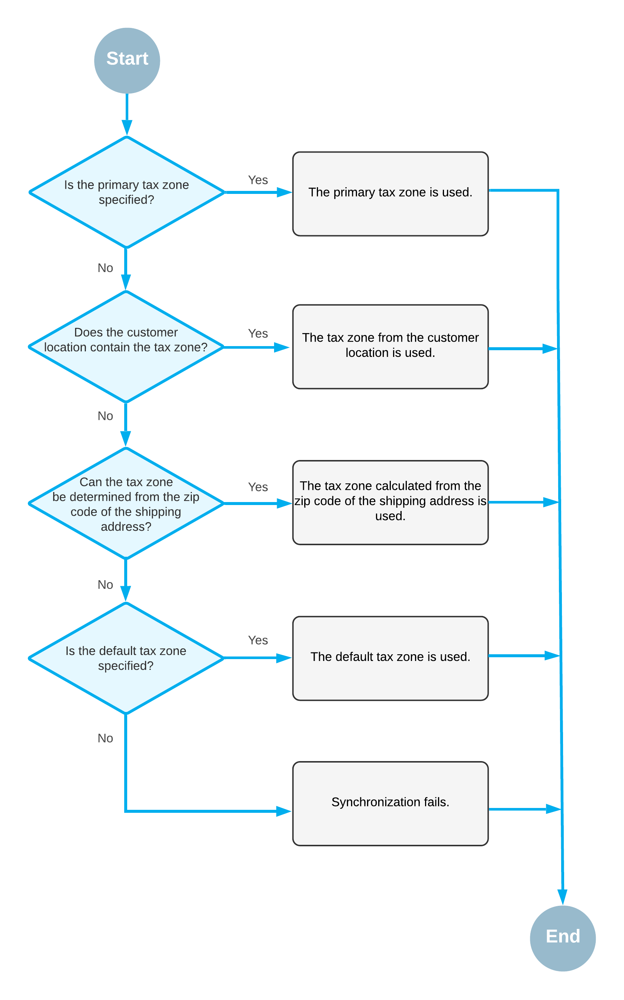

# Import of Taxes: General Information {#_0502a23e-7c1f-4018-9937-4f415144bdba .concept}

During the implementation of the integration between Acumatica ERP and the BigCommerce store, you decide if taxes should be synchronized during the export or import of sales orders.

## Learning Objectives { .section}

In this chapter, you will learn how to set up tax synchronization if you collect tax on products you sell in the BigCommerce store.

## Applicable Scenarios { .section}

You set up tax synchronization during the configuration of the connection between Acumatica ERP and the BigCommerce store to make sure that taxes collected on online orders are reflected in an imported order and, if necessary, correctly recalculated when a shipment and an invoice are created for the order.

## Configuration of Tax Synchronization for Manual Tax Setup {#_5065662b-4301-4a56-a71d-8028dd44517e .section}

If you plan to use only Acumatica ERP \(without a dedicated tax calculation provider\) for tax calculation and reporting, you perform the following general steps:

1.  Configure manual tax calculation rules in the BigCommerce store. For information, see [Manual Tax Setup](https://support.bigcommerce.com/s/article/Manual-Tax-Setup) in the BigCommerce documentation.
2.  Implement the tax functionality by configuring a tax agency, tax zones, tax categories, and sales taxes.

    For detailed information about configuring sales taxes in Acumatica ERP, see [Implementing Taxes](../ImplementationGuide/config_Mapref_TX.md).

    **Important:**

    The manual tax configuration should match in the BigCommerce store and in Acumatica ERP, otherwise issues might occur during the synchronization of entities. Tax categories and taxes in Acumatica ERP should be configured in the same way as tax classes and tax rates in BigCommerce. If you use different names for a tax or a tax category in both systems, you should map tax IDs by using substitution lists, as described in [Import of Taxes: Substitution Lists](Commerce_BC_Syncing_Taxes_Substitution_Lists.md).

    Taxes that have the same name in the BigCommerce store and Acumatica ERP \(or that have been mapped via the substitution list\) should be defined with exactly the same rates. Although an order for which the taxes have different rates will be imported successfully, when an invoice is prepared for this imported sales order, the taxes are recalculated based on the tax settings configured in Acumatica ERP. If the tax rates differ, there will be a discrepancy between the amount of the invoice created in Acumatica ERP and the amount of the order created in the BigCommerce store.

3.  Specify the tax synchronization settings on the **Orders** tab of the [BigCommerce Stores](BC_20_10_00.md) \(BC201000\) form as follows:
    -   **Tax Synchronization**: Selected
    -   **Default Tax Zone**: The tax zone that the system will assign to the order if no tax zone has been identified during the order import.
    -   **Use as Primary Tax Zone**: Cleared

During the import of an order, the system searches for the tax zone that should be used for tax calculation as follows, stopping the search when it finds a qualifying tax zone:

1.  The system searches for the primary tax zone.
2.  The system searches for the tax zone of the customer location.
3.  The system tries to determine the tax zone based on the zip code of the shipping address.
4.  The system searches for the default tax zone.

This process is illustrated in the following diagram.

## Handling of Long Tax Names { .section}

If an external tax provider is used for tax calculation, sometimes tax names returned by the external tax provider can exceed the maximum allowed length of tax IDs supported by Acumatica ERP, \(which is currently 60 characters\). Long tax IDs are processed as follows:

-   If there is no hyphen in the tax ID, any characters that exceed the maximum length are truncated.
-   If there is a hyphen in the tax ID, the tax ID is processed as follows:
    -   If the tax ID contains the word *SPECIAL*, the part of the ID to the right of the hyphen is used. Any characters that still exceed the maximum length are truncated.
    -   If the tax ID does not contain the word *SPECIAL*, the part of the ID to the left of the hyphen is used. Any characters that still exceed the maximum length are truncated.

## Tax Calculation Mode in Imported Sales Orders { .section}

In BigCommerce, you can indicate whether the prices of products are entered in the control panel of the store inclusive or exclusive of tax. However, information about this setting is not passed during the import of sales orders from BigCommerce to Acumatica ERP. If the *Net/Gross Entry Mode* feature is enabled on the [Enable/Disable Features](CS_10_00_00.md) \(CS100000\) form, for sales orders imported from the BigCommerce store, the system inserts *Tax Settings* in the **Tax Calculation Mode** box on the **Financial** tab of the [Sales Orders](SO_30_10_00.md) \(SO301000\) form. This option is inserted regardless of the price settings in the BigCommerce store and the configuration of tax calculation in Acumatica ERP.

**Parent topic:**[Importing Orders with Taxes](../UserGuide/Commerce_BC_Orders_with_Taxes_Mapref.md)

