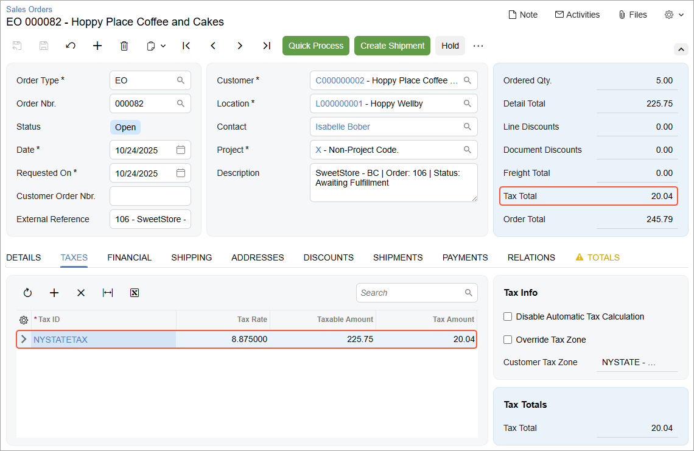

# Import of Taxes: Process Activity {#_635dc0ec-e87f-48f7-878f-bdd061e1d129 .task}

The following activity will walk you through the process of configuring the synchronization of taxes between the BigCommerce store and Acumatica ERP.

**Attention:** The following activity is based on the *U100* dataset.

## Story { .section}

Suppose that SweetLife is using only Acumatica ERP \(without an external tax provider\) for calculating and reporting taxes on the goods and services it sells. As an implementation consultant helping SweetLife to set up a BigCommerce store, you need to set up taxes in the store and then make sure that the taxes on online sales orders are correctly passed to Acumatica ERP when the orders are imported.

## Configuration Overview {#section_tz4_djx_cnb .section}

In the *U100* dataset, the following tasks have been performed to support this activity:

-   On the [Tax Zones](TX_20_60_00.md) \(TX206000\) form, the *NYSTATE* tax zone has been configured.
-   On the [Tax Categories](TX_20_55_00.md) \(TX205500\) form, the *TAXABLE* and *EXEMPT* tax categories have been configured. These tax categories have been assigned to item classes on the [Item Classes](IN_20_10_00.md) \(IN201000\) form, and to individual stock and non-stock items on the [Stock Items](IN_20_25_00.md) \(IN202500\) and [Non-Stock Items](IN_20_20_00.md) \(IN202000\) forms, respectively.
-   On the [Taxes](TX_20_50_00.md) \(TX205000\) form, the *NYSTATETAX* tax has been set up.

## Process Overview { .section}

In this activity, you will do the following:

1.  In the control panel of the BigCommerce store, define a sales tax that you will collect on products sold to customers in New York State.
2.  On the [Tax Categories](TX_20_55_00.md) \(TX205500\), [Tax Zones](TX_20_60_00.md) \(TX206000\), and [Taxes](TX_20_50_00.md) \(TX205000\) forms, review some of the tax-related entities that have been predefined in the *U100* dataset.
3.  On the [BigCommerce Stores](BC_20_10_00.md) \(BC201000\) form, specify the tax synchronization settings for your BigCommerce store.
4.  On the [Substitution Lists](SM_20_60_26.md) \(SM206026\) form, map tax categories in Acumatica ERP to tax classes in the BigCommerce store.
5.  Also on the [Substitution Lists](SM_20_60_26.md) form, map the sales tax defined in Acumatica ERP to the sales tax defined in the BigCommerce store.
6.  On the [Entities](BC_20_20_00.md) \(BC202000\) form, update the export filtering settings to include stock items of one more item class.
7.  On the [Prepare Data](BC_50_10_00.md) \(BC501000\) form, prepare the stock item data for synchronization; on the [Process Data](BC_50_15_00.md) \(BC501500\) form, process the prepared data.
8.  In the control panel of the BigCommerce store, review the exported items.
9.  To make sure that the tax applied to a sales order in the BigCommerce store is imported to Acumatica ERP correctly, create an online order in the control panel of the BigCommerce store.
10. Import the sales order to Acumatica ERP by using the [Prepare Data](BC_50_10_00.md) and [Process Data](BC_50_15_00.md) forms.
11. On the [Sales Orders](SO_30_10_00.md) \(SO301000\) form, review the imported sales order.

## System Preparation { .section}

Do the following:

1.  Make sure that the following prerequisites have been met:
    1.  The connection to the BigCommerce store has been established and the initial configuration has been performed, as described in [Initial Configuration: To Establish and Configure the Store Connection](Commerce_BC_Initial_Configuration_Implem_Activity.md).
    2.  Customers have been created and synchronized with the BigCommerce store, as described in [Synchronizing Customers: To Synchronize Customers with Multiple Locations](Commerce_BC_Syncing_Customers_To_Sync_Customers_with_Locations.md).
2.  Sign in to the control panel of the BigCommerce store as the store administrator.

## Step 1: Configuring the Sales Tax in BigCommerce { .section}

To configure the sales tax for New York in the BigCommerce store, do the following:

1.  In the left pane of the control panel, click **Settings**.
2.  On the **Settings** page, in the **Setup** section, click **Tax**.
3.  On the **Tax** page, which opens, in the **Tax rules** section, click **Edit**.

    On the **General** tab, notice that *Basic Tax* has been enabled.

4.  On the **Tax classes** tab, review the default tax classes.

    Tax classes in BigCommerce correspond to tax categories in Acumatica ERP. You should not delete any of the default classes, even though you do not collect tax on shipping or gift wrapping.

5.  On the **Tax rates and zones** tab, click **Add a tax zone**.
6.  On the **Add a tax zone** page, specify the following settings:
    -   **Tax zone name**: `New York State`
    -   **This tax zone is based on one or more**: *Subdivisions*
    -   **Country**: *United States*
    -   **Subdivisions**: *New York*
    -   **Tax zone applies to**: *All customers in my store*
    -   **Enable this tax zone**: Selected
7.  In the lower right, click **Save**.
8.  On the **Tax rates** tab of the **Edit New York State**, which opens, click **Add a tax rate**.

    **Tip:** A *tax rate* in BigCommerce corresponds to a *tax* in Acumatica ERP.

9.  In the **Add a tax rate** section, which appears, specify the following settings:
    -   **Tax rate name**: `NYSTATETAX`
    -   **% for products marked as "Default Tax Class"**: `8.875`
    -   **% for products marked as "Non-Taxable"**: `0`
    -   **% for products marked as "Shipping"**: `0`
    -   **% for products marked as "Gift Wrapping"**: `0`
    -   **Enable this tax rate**: Selected
10. In the lower right, click **Save**.

    For the purposes of this activity, you do not need to add any other tax rates.

## Step 2: Reviewing the Tax Configuration in Acumatica ERP { .section}

To review the taxes that have been predefined, in Acumatica ERP, do the following:

1.  Open the Tax Categories \(TX2055PL\) form.

    Tax categories in Acumatica ERP correspond to tax classes in BigCommerce. Notice that there are only two tax categories on the form \(*TAXABLE* and *EXEMPT*\).

2.  On the [Tax Zones](TX_20_60_00.md) \(TX206000\) form, select the *NYSTATE* tax zone.
3.  On the **Applicable Taxes** tab, in the row of *NYSTATETAX*, click the link in the **Tax ID** column.

    The system opens the [Taxes](TX_20_50_00.md) \(TX205000\) form in a pop-up window. Review the settings of the *NYSTATETAX* tax and notice the following:

    -   On the **Tax Schedule** tab, the current tax rate \(effective starting *1/1/2026*\) is *8.875*.
    -   On the **Categories** tab, the *TAXABLE* category has been added for this tax.
    -   On the **Zones** tab, the *NYSTATE* tax zone has been added for the tax.
    With these settings, the *NYSTATETAX* tax is applied to all taxable items \(that is, items assigned to the *TAXABLE* tax category\) sold to customers assigned to the *NYSTATE* tax zone.

4.  Close the pop-up window with the [Taxes](TX_20_50_00.md) form.

## Step 3: Configuring Tax Synchronization { .section}

To configure the synchronization of taxes between Acumatica ERP and the BigCommerce store, do the following:

1.  On the [BigCommerce Stores](../Shared/../UserGuide/BC_20_10_00.md) \(BC201000\) form, select the *SweetStore - BC* store.
2.  On the **Orders** tab \(**Taxes** section\), specify the following settings:
    -   **Tax Synchronization**: Selected
    -   **Default Tax Zone**: *NYSTATE*

        With this setting specified, if a tax zone cannot be determined during the import of an order from the BigCommerce store, the *NYSTATE* tax zone will be used.

3.  In the **Substitution Lists** section, note the substitution lists used for taxes \(*BCСTAXCODES*\) and tax categories \(*BCCTAXCLASSES*\). These substitution lists are predefined and are inserted as the default values in these boxes. For the purposes of this activity, you do not need to change the selected values; you will instead update these substitution lists. However, in a production environment, you can create other substitution lists on the [Substitution Lists](SM_20_60_26.md) \(SM206026\) form and specify them in these boxes.
4.  On the form toolbar, click **Save**.

## Step 4: Updating the Substitution List for Tax Categories { .section}

As you may have noticed while completing Steps 1 and 2, in Acumatica ERP, two tax categories \(*TAXABLE* and *EXEMPT*\) have been defined, whereas in the BigCommerce store, there are four tax classes—*Default Tax Class*, *Non-Taxable Products*, *Shipping*, and *Gift Wrapping*. To make sure that stock and non-stock items exported from Acumatica ERP are assigned the correct tax class in the BigCommerce store, do the following:

1.  On the [Substitution Lists](SM_20_60_26.md) \(SM206026\) form, select the *BCCTAXCLASSES* substitution list.

    Notice that the table contains the only row with **Original Value** set to *TAXABLE* and **Substitution Value** set to *Default Tax Class*.

2.  In the table, add one more row with the following settings:

    -   **Original Value**: `EXEMPT`
    -   **Substitution Value**: `Non-Taxable Products`
    With these settings, non-stock and stock items that have the *TAXABLE* tax category in Acumatica ERP will be assigned the *Default Tax Class* tax class in the BigCommerce store when they are exported. Non-stock and stock items of the *EXEMPT* category will be assigned the *Non-Taxable Products* tax class.

3.  On the form toolbar, click **Save**.

## Step 5: Updating the Substitution List for Taxes { .section}

For smooth import of online orders on which you collect taxes from the *SweetStore - BC* store to Acumatica ERP, the tax names defined in both systems must be the same. In Step 1, you created the *New York State Tax* tax rate in the BigCommerce store. \(A tax rate is defined in BigCommerce; in Acumatica ERP, a tax is the entity you define.\) The same tax has the name *NYSTATETAX* in Acumatica ERP. To make the import of sales orders work, you can either update the tax names \(in either system or both systems\) so that they match, or map the different tax names in a substitution list. The mappings of tax names between the BigCommerce store and Acumatica ERP are specified in the predefined *BCCTAXCODES* substitution list, which by default is specified on the [BigCommerce Stores](BC_20_10_00.md) \(BC201000\) form as the tax substitution list to be used for synchronization with the store.

To map tax names in a substitution list, do the following:

1.  While you are still viewing the [Substitution Lists](SM_20_60_26.md) \(SM206026\) form, in the **Substitution List** box, select *BCCTAXCODES*.
2.  On the table toolbar, click **Add Row**, and in the added row, specify the following values:

    -   **Original Value**: `New York State Tax`
    -   **Substitution Value**: `NYSTATETAX`
    With this mapping, when *New York State Tax* is applied to products in an online order in the *SweetStore - BC* store, its name will be replaced with *NYSTATETAX* in the order imported from the BigCommerce store to Acumatica ERP.

3.  On the form toolbar, click **Save** to save your changes.

## Step 6: Exporting the Stock Items { .section}

1.  On the [Prepare Data](BC_50_10_00.md) \(BC501000\) form, specify the following settings in the Summary area:
    -   **Store**: *SweetStore - BC*
    -   **Prepare Mode**: *Full*
    -   **Date Range**: Cleared
2.  In the table, select the check box in the row of the *Stock Item* entity.
3.  On the form toolbar, click **Prepare**.
4.  In the **Processing** dialog box, which opens, click **Close** to close the dialog box.
5.  In the row of the *Stock Item* entity, click the link in the **Ready to Process** column.
6.  On the [Process Data](BC_50_15_00.md) \(BC501500\) form, which opens with the *SweetStore - BC* store and the *Stock Item* entity selected, click **Process All** on the form toolbar.
7.  In the **Processing** dialog box, which opens, click **Close** to close the dialog box.

**Tip:** To avoid discrepancies between the tax amount calculated in the BigCommerce store when an order is placed and the tax amount calculated in Acumatica ERP when an invoice is generated for an imported order, make sure that product data \(which includes the information about the product's tax category\) is in sync between the two systems before the order is created.

## Step 7: Viewing the Synchronized Stock Items in the Store { .section}

To review the items that have been synchronized between Acumatica ERP and the BigCommerce store and verify that they have been exported to the BigCommerce store with the correct tax category, do the following:

1.  In the left pane of the control panel of the BigCommerce store, click **Products** &gt; **All products**.
2.  In the list of products, for the *KIWIJAM96* product, click the link in the **Name** column.
3.  On the product management page, which opens, review the details of the *Kiwi jam 96 oz.* product.

    Notice that in the **Pricing** section, the **Tax Class** is set to *Default Tax Class*. The system assigned this tax class to the product because the *KIWIJAM96* stock item has the *TAXABLE* tax category in Acumatica ERP.

    You can verify that the tax category is assigned correctly to non-stock items by completing instructions similar to those described above.

## Step 8: Creating an Online Order { .section}

To make sure that the taxes applied to taxable products in an online order are imported correctly during the order synchronization, you need to create an order in the BigCommerce store and import it to Acumatica ERP.

To create an order with the taxable products, while you are signed in to the control panel of the BigCommerce store, do the following:

1.  In the left pane, click **Orders** &gt; **Add**.
2.  On the **Add an order** page \(**Customer info** step\), create the order as follows:
    1.  In the **Customer information** section, select the **Existing customer** option button right of **Order for**.
    2.  In the **Search** box, start typing the customer's name, `Isabelle`, and select *Isabelle Bober* in the list of search results.
    3.  In the **Billing Information** section, click *Use this address* right of the address details for *William Duncan*.

        The billing address elements are filled with the settings from the previously saved address of this customer.

    4.  Clear the **Save to customer's address book** check box.
    5.  In the lower right, click **Next**.
3.  On the **Add an order** &gt; **Items** page, under **Add products**, do the following:
    1.  In the **Search** box, start typing `kiwi`, and in the list of search results, select *KIWIJAM96* and specify the quantity of *5*.
    2.  In the lower right, click **Next**.
4.  On the **Add an order** &gt; **Fulfillment** page, do the following:
    1.  In the **Shipping method** section, click the *Fetch shipping quotes* link.
    2.  In the box with the list of shipping options, click *Free Shipping \($0.00\)*.
    3.  In the lower right, click **Next**.
5.  On the **Add an order** &gt; **Payment** page, do the following:
    1.  Review the information in the **Customer billing details**, **Fulfillment Details**, and **Summary** sections. Make a note of the amount of the tax applied to the order \(*$20.04*\).
    2.  In the **Payment** section, select the *Manual payment* payment method.
    3.  In the lower right, click **Save &amp; process payment**.
6.  On the **View orders** page, which opens, make a note of the reference number of the created order.

## Step 9: Importing the Sales Order to Acumatica ERP { .section}

To import the sales order, in Acumatica ERP, do the following:

1.  On the [Prepare Data](../Shared/../UserGuide/BC_50_10_00.md) \(BC501000\) form, specify the following settings in the Summary area:
    -   **Store**: *SweetStore - BC*
    -   **Prepare Mode**: *Incremental*
2.  In the table, in the row of the *Sales Order* entity, select the check box in the unlabeled column.
3.  On the form toolbar, click **Prepare**.
4.  In the **Processing** dialog box, which opens, click **Close** to close the dialog box.
5.  In the row of the *Sales Order* entity, click the link in the **Ready to Process** column.
6.  On the [Process Data](BC_50_15_00.md) \(BC501500\) form, which opens with the *SweetStore - BC* store and the *Sales Order* entity selected, select the unlabeled check box in the row of the sales order that you created earlier in this activity, and on the form toolbar, click **Process**.
7.  In the **Processing** dialog box, which opens, click **Close** to close the dialog box.

## Step 10: Reviewing the Taxes in the Imported Sales Order { .section}

To review how the taxes are displayed in the imported sales order, do the following:

1.  On the [Sync History](BC_30_10_00.md) \(BC301000\) form, specify the following settings in the Summary area:
    -   **Store**: *SweetStore - BC*
    -   **Entity**: *Sales Order*
2.  In the Filter List drop-down menu above the table, select *Processed*.
3.  In the table, in the row of the sales order that you have just imported \(which you can locate by its external ID\), click the link in the **ERP ID** column.
4.  On the [Sales Orders](SO_30_10_00.md) \(SO301000\) form, which opens in a pop-up window, review the order that have been imported.

    In the Summary area, notice that the **Tax Total** amount matches the tax amount of the order in the BigCommerce store \($20.04\), as shown in the following screenshot. On the **Taxes** tab, which lists all taxes applied to individual order lines, notice that the *NYSTATETAX* is displayed.

    

    On the **Details** tab, notice that for the only line with the *KIWIJAM96* item, **Tax Category** is set to *TAXABLE*. The tax category that appears in the sales order is copied from the **Tax Category** box of the **General** tab of the [Stock Items](IN_20_25_00.md) \(IN202500\) form and is not imported from the tax class assigned to the item in the BigCommerce store.

5.  Close the pop-up window with the [Sales Orders](SO_30_10_00.md) form.

**Parent topic:**[Importing Orders with Taxes](../UserGuide/Commerce_BC_Orders_with_Taxes_Mapref.md)

