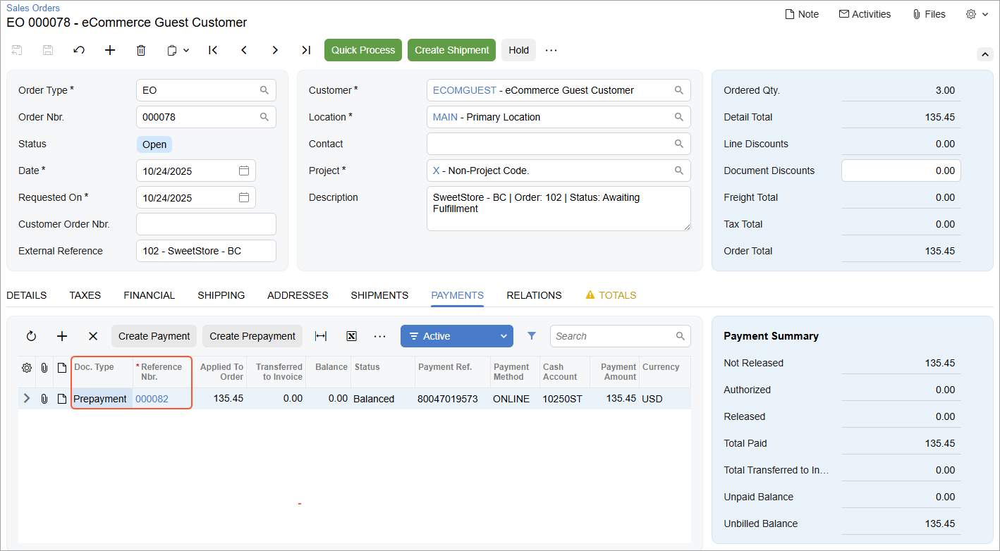

# Order Synchronization: To Configure and Import Authorize.Net Payments {#_46a6adba-d21d-4bf8-b9b4-8f436169ca18 .task}

The following activity will walk you through the process of configuring the system so that you can import card payments from the BigCommerce store to Acumatica ERP and then further process them, if necessary.

**Attention:** The following activity is based on the *U100* dataset.

## Story { .section}

Suppose that the SweetLife Fruits &amp; Jams company wants to accept card payments in the BigCommerce store. The company already has the Authorize.Net account for processing card payments.

Acting as an implementation consultant helping SweetLife to set up the integration of Acumatica ERP with the BigCommerce store, you need to configure Authorize.Net as a card payment provider in the BigCommerce store, and then configure the import of card payments from the BigCommerce store to Acumatica ERP.

**Important:** Because the support of the Authorize.Net plug-in has been deprecated in Acumatica ERP, you can import the payments processed with Authorize.Net only as non-card payments.

## Configuration Overview { .section}

In the *U100* dataset, the following tasks have been performed to support this activity:

-   On the [Enable/Disable Features](CS_10_00_00.md) \(CS100000\) form, the *Integrated Card Processing* feature has been enabled.
-   On the [Cash Accounts](CA_20_20_00.md) \(CA202000\) form, the *10250ST* cash account has been created.
-   On the [Payment Methods](CA_20_40_00.md) \(CA204000\) form, the *ONLINE* payment method has been set up to be used with the *10250ST* cash account.

## Process Overview { .section}

In this activity, you will do the following:

1.  In the control panel of the BigCommerce store, enable the Authorize.Net payment gateway for accepting card payments.
2.  On the [BigCommerce Stores](BC_20_10_00.md) \(BC201000\) form, map the Authorize.Net store payment method with a *Cash/Check* payment method defined in Acumatica ERP.
3.  On the storefront of the BigCommerce store, create a test order paid by card.
4.  In the control panel of the BigCommerce store, review the created test sales order.
5.  On the [Prepare Data](BC_50_10_00.md) \(BC501000\) form, prepare the sales order for synchronization; on the [Process Data](BC_50_15_00.md) \(BC501500\) form, process the sales order data prepared for synchronization.
6.  On the [Sales Orders](SO_30_10_00.md) \(SO301000\) form, review the imported sales order.

## System Preparation { .section}

Before you complete the instructions in this activity, do the following:

1.  Sign up for an Authorize.Net sandbox account at [https://developer.authorize.net/hello\_world/sandbox.html](https://developer.authorize.net/hello_world/sandbox.html). After you create an account, you will get the credentials to use in payment processing \(API Login ID and Transaction Key\). You will use these credentials in this activity.

    **Important:** In your Authorize.Net sandbox account, make sure that you enable *Live* transaction processing mode. However, you will enable test mode when you configure the Authorize.Net payment method in your BigCommerce store and when you set up the Authorize.Net processing center in Acumatica ERP.

2.  Make sure that the following prerequisites have been met:
    -   The BigCommerce store has been created and configured, as described in [Initial Configuration: To Set Up a BigCommerce Store](Commerce_BC_Initial_Configuration_To_Set_Up_a_BC_Store.md).
    -   The connection to the BigCommerce store has been established and the initial configuration has been performed, as described in [Initial Configuration: To Establish and Configure the Store Connection](Commerce_BC_Initial_Configuration_Implem_Activity.md).
3.  Launch the Acumatica ERP website with the *U100* dataset preloaded, and sign in with the following credentials:
    -   **Username**: *gibbs*
    -   **Password**: *123*
4.  Sign in to the control panel of the BigCommerce store as the store administrator.

## Step 1: Defining the Authorize.Net Payment Gateway in the BigCommerce Store { .section}

To define the Authorize.Net payment method that the store will accept for the United States Dollar \(USD\) currency, in the BigCommerce control panel, do the following:

1.  In the left pane, click **Settings**.
2.  On the **Settings** page, in the **Setup** section, click **Payments**.
3.  On the **Payment Methods** page, which opens, on the **Payment Configuration** tab, in the **Show payment methods for** box, make sure *USD \(US Dollar\)* is selected.

    The system displays the **Checkout Payment Settings** tab and a tab for each payment method activated for the selected currency.

4.  Under **Additional providers**, expand the **Online Payment Methods** group.
5.  In the row of *Authorize.Net*, click **Set up**.
6.  On the **Authorize.Net** tab, which appears, specify the following settings:
    -   **API Login ID**: The API Login ID of your Authorize.Net sandbox account
    -   **Transaction Key**: The Transaction Key of your Authorize.Net sandbox account

        You should use **API Login ID** and **Transaction Key** that you used when you configured the connection to Authorize.Net payment gateway.

    -   **Transaction Type**: *Authorize &amp; Capture*
    -   **Test Mode**: *Yes*
7.  In the lower right, click **Save** to save your changes.

## Step 2: Creating the Mapping for the Authorize.Net Store Payment Method { .section}

To configure the mapping for the Authorize.Net store payment method in Acumatica ERP, do the following:

1.  On the [BigCommerce Stores](../Shared/../UserGuide/BC_20_10_00.md) \(BC201000\) form, select the *SweetStore - BC* store.
2.  In the table of the **Payments** tab, update the settings in the row with the *AUTHORIZENET \(CREDIT\_CARD\)* payment method as follows:

    -   **Active**: Selected
    -   **Store Currency**: *USD*
    -   **ERP Payment Method**: *ONLINE*
    -   **Cash Account**: *10250ST*
    Because the support of the Authorize.Net plug-in has been deprecated in Acumatica ERP, you can map it only with a *Cash/Check* payment method and import the payments processed with Authorize.Net as non-card payments.

3.  On the form toolbar, click **Save** to save your changes.

## Step 3: Creating an Order Through the Storefront { .section}

To purchase a jar of jam, so that you can later import the order and review the credit card payment, in the BigCommerce control panel, do the following:

1.  At the upper right, click **View storefront** to open the storefront.
2.  On the storefront, click **Search** in the upper right, and then start typing `plum` in the search box that appears.
3.  In the search results, click the tile of the *Plum jam 96 oz* product.
4.  On the page for the *Plum jam 96 oz* product, which opens, select a quantity of *3*, and click **Add to Cart**.
5.  In the pop-up window that opens, click **Proceed to checkout**.
6.  On the checkout page, specify the needed settings as follows:
    1.  In the **Customer** section, in the **Email** box, specify `melody@example.com`, and click **Continue**.
    2.  In the **Shipping** section, fill in the shipping address boxes as follows:
        -   **First Name**: `Melody`
        -   **Last Name**: `Keys`
        -   **Address**: `3402 Angus Road`
        -   **City**: `New York`
        -   **Country**: *United States*
        -   **State/Province**: *New York*
        -   **Postal Code**: `10003`
        -   **My billing address is the same as my shipping address**: Selected \(default state\)
    3.  In the **Shipping Method** section, make sure that the *Free Shipping* option is selected, and click **Continue**.
7.  In the **Payment** section, make sure the **Authorize.Net** option button is selected, and specify the following card settings:
    -   **Credit Card Number**: `4111 1111 1111 1111`
    -   **Expiration**: `12/27`
    -   **Name on Card**: `Melody Keys`
8.  Click **Place Order** to place your order.

    Your order has been created, and on the confirmation page, the order number is displayed. You will process the order with this order number further in this activity.

## Step 4: Reviewing the Sales Order in the Control Panel { .section}

To review the sales order that you placed in the previous step, in the BigCommerce control panel, do the following:

1.  In the left pane, click **Orders** &gt; **All orders**.
2.  On the **View orders** page, which opens, click the plus button next to the order of *Melody Keys* that you have just created to expand the order details.

    Notice that the **Status** of the order is set to *Awaiting Fulfillment*. The payment funds have been already captured because you have configured the *Authorize.Net* payment option to authorize and capture the payment amount when the order is placed.

## Step 5: Importing the Sales Order { .section}

To prepare the sales order data for synchronization and then process it, do the following:

1.  On the [Prepare Data](../Shared/../UserGuide/BC_50_10_00.md) \(BC501000\) form, specify the following settings in the Summary area:
    -   **Store**: *SweetStore - BC*
    -   **Prepare Mode**: *Incremental*
2.  In the table, select the check box in the unlabeled column in the row of the *Sales Order* entity, and on the form toolbar, click **Prepare**.
3.  In the **Processing** dialog box, which opens, click **Close** to close the dialog box.
4.  In the row of the *Sales Order* entity, click the link with the number of prepared synchronization records in the **Ready to Process** column. The [Process Data](BC_50_15_00.md) \(BC501500\) form opens with the *SweetStore - BC* store and the *Sales Order* entity selected.
5.  In the table on the [Process Data](BC_50_15_00.md) form, select the unlabeled check box for the only row, and click **Process** on the form toolbar.
6.  In the **Processing** dialog box, which opens, click **Close** to close the dialog box.

## Step 6: Reviewing the Imported Sales Order { .section}

To review the settings of the imported sales order, do the following:

1.  On the [Sync History](BC_30_10_00.md) \(BC301000\) form, specify the following settings in the Summary area:
    -   **Store**: *SweetStore - BC*
    -   **Entity**: *Sales Order*
2.  In the Filter List drop-down menu above the table, select *Processed*.
3.  In the table, in the row of the sales order that you have just imported \(which you can locate by its external ID\), click the link in the **ERP ID** column.
4.  On the [Sales Orders](SO_30_10_00.md) \(SO301000\) form, which opens for the imported order in a pop-up window, review the settings of the order.

    In the Summary area, notice that the **External Reference** and **Description** boxes include the order number from BigCommerce. In the **Customer** box, the system has inserted the ID of the generic guest customer that you have selected on the [BigCommerce Stores](BC_20_10_00.md) \(BC201000\) form.

5.  On the **Payments** tab, review the details of the created payment document.

    Notice that the payment document has the *Prepayment* type. It includes the external credit card transaction associated with the purchase. The number of the transaction is displayed in the **Payment Ref.** column.

    

6.  Click the link in the **Reference Nbr.** column to open the payment.
7.  On the [Payments and Applications](AR_30_20_00.md) \(AR302000\) form, which opens in a pop-up window, review the payment details.

    Notice that in the **Payment Ref.** box of the Summary area, the payment identifier assigned to the payment in the BigCommerce store is displayed. The **Description** box contains the store payment method, the order number, and the payment ID.

    The prepayment has the *Balanced* status because the **Release Payments and Refunds** check box was cleared for the *AUTHORIZENET \(CREDIT\_CARD\)* payment method in the mapping table on the **Payments** tab of the [BigCommerce Stores](BC_20_10_00.md) \(BC201000\) form.

8.  Close the pup-up windows with the [Payments and Applications](AR_30_20_00.md) and [Sales Orders](SO_30_10_00.md) forms.

Next you would proceed to create and confirm the related shipment, prepare the related invoice, release the payment, and synchronize the shipment back to the BigCommerce store. For the purposes of this activity, you do not have to perform any of these operations.

**Parent topic:**[Synchronizing Orders](../UserGuide/Commerce_BC_Syncing_Orders_Mapref.md)

