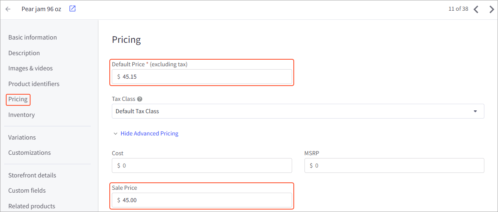

# Price Synchronization: To Export Base Prices {#_9dbeedff-8124-40f2-b37f-1c32cdc5e064 .task}

In this activity, you will explore how sales prices of the *Base* type are exported from Acumatica ERP to and saved in the BigCommerce store.

**Attention:** The following activity is based on the *U100* dataset.

## Story { .section}

Suppose that SweetLife Fruits &amp; Jams wants to maintain all of its sales prices, including the prices of products sold in the BigCommerce store, in Acumatica ERP.

SweetLife's pricing manager has added a new base price for 96-ounce jars of pear jam \($45\) and the following quantity-specific prices for 96-ounce jars of banana jams:

-   From 1 to 4 pieces: $45
-   From 5 to 9 pieces: $43
-   More than 9 pieces: $40

The new prices are effective as of July 1, 2025.

As an implementation consultant, you want to export the effective sales prices for the jams from Acumatica ERP to the BigCommerce store.

## Configuration Overview { .section}

In the *U100* dataset, the following tasks have been performed to support this activity:

-   On the [Enable/Disable Features](CS_10_00_00.md) \(CS100000\) form, the *Volume Pricing* feature has been enabled.
-   On the [Stock Items](IN_20_25_00.md) \(IN202500\) form, the *PEARJAM96* and *BANJAM96* stock items have been created.
-   On the [Sales Prices](AR_20_20_00.md) \(AR202000\) form, the sales prices listed in the following table have been defined.

|Inventory ID|Price Type|Price Code|UOM|Break Qty|Price|
|------------|----------|----------|---|---------|-----|
|*PEARJAM96*|*Base*|Empty|*PIECE*|*0*|*45.00*|
|*BANJAM96*|*Base*|Empty|*PIECE*|*0*|*45.00*|
|*BANJAM96*|*Base*|Empty|*PIECE*|*5*|*43.00*|
|*BANJAM96*|*Base*|Empty|*PIECE*|*10*|*40.00*|

## Process Overview { .section}

In this activity, you will do the following:

1.  On the [BigCommerce Stores](BC_20_10_00.md) \(BC201000\) form, activate the *Base Sales Price* entity.
2.  On the [Sales Prices](AR_20_20_00.md) \(AR202000\) form, review the sales prices of the *Base* type, including volume-dependent prices, defined for particular items.
3.  On the [Prepare Data](BC_50_10_00.md) \(BC501000\) form, prepare the base sales price data for synchronization; on the [Process Data](BC_50_15_00.md) \(BC501500\) form, process the prepared data.
4.  In the control panel of the BigCommerce store, review the exported prices of items.

## System Preparation { .section}

Before you start this activity, do the following:

1.  Make sure that the following prerequisite activities have been performed:
    1.  [Initial Configuration: To Establish and Configure the Store Connection](Commerce_BC_Initial_Configuration_Implem_Activity.md)
    2.  [Data Synchronization: To Perform the First Synchronization](Commerce_BC_Data_Sync_First_Sync.md)
2.  Sign in to the control panel of the BigCommerce store as the store administrator.
3.  Sign in to the Acumatica ERP instance with the *U100* dataset preloaded by using the following credentials:
    -   **Username**: *gibbs*
    -   **Password**: *123*
4.  Open the [BigCommerce Stores](BC_20_10_00.md) \(BC201000\) form.
5.  On the **Entities** tab, select the **Active** check box in the row of the *Base Sales Price* entity.

    When you process this entity, the sales prices of the *Base* type defined on the [Sales Prices](AR_20_20_00.md) \(AR202000\) form are exported.

6.  On the form toolbar, click **Save**.

## Step 1: Reviewing the Base Sales Prices Defined for Stock Items { .section}

To review the sales prices of the *Base* type defined for stock items in Acumatica ERP, do the following:

1.  On the [Sales Prices](AR_20_20_00.md) \(AR202000\) form, specify the following settings in the Selection area:

    -   **Price Type**: *Base*
    -   **Inventory ID**: *PEARJAM96*
    In the table, notice that there is one effective price of the *Base* type for this stock item \(*$45.00*\), which is effective for all customers starting from 7/1/2025.

2.  In the **Inventory ID** box of the Selection area, select *BANJAM96*.

    Notice that for the *BANJAM96* stock item, the table contains three different prices of the *Base* type, which depend on the value in the **Break Qty** column. When a customer buys 1 to 4 jars of banana jam, each jar will cost $45; for the purchase of 5 to 9 jars, the effective price will be $43, and if a customer buys 10 or more jars, each will cost $40.

## Step 2: Synchronizing the Prices of Stock Items { .section}

To synchronize the base sales prices, do the following:

1.  On the [Prepare Data](../Shared/../UserGuide/BC_50_10_00.md) \(BC501000\) form, specify the following settings in the Summary area:
    -   **Store**: *SweetStore - BC*
    -   **Prepare Mode**: *Incremental*
2.  In the table, select the check box in the unlabeled column for the *Base Sales Price* entity, and on the form toolbar, click **Prepare**.
3.  In the **Processing** dialog box, which opens, click **Close** to close the dialog box.
4.  In the row of the *Base Sales Price* entity, click the link in the **Ready to Process** column.
5.  On the [Process Data](BC_50_15_00.md) \(BC501500\) form, which opens with the *SweetStore - BC* store and the *Base Sales Price* entity selected in the Summary area, on the form toolbar, click **Process All**.
6.  In the **Processing** dialog box, which opens, click **Close** to close the dialog box.

## Step 3: Reviewing the Exported Base Prices { .section}

To view the exported prices of the *PEARJAM96* item, in the control panel of the BigCommerce store, do the following:

1.  In the left pane, click **Products** &gt; **All products**.
2.  On the **View Products** page, which opens, locate the *PEARJAM96* item in the list of products, and in the row of this item, click the link in the **Name** column.
3.  On the product management page, which opens, in the **Pricing** section, click the *Show Advanced Pricing* link.

    Notice that for this product two prices are specified \(as shown in the following screenshot\):

    -   The default price shown in the **Default Price** box. This is the price, which was defined for the item on the **Price/Cost** tab of the [Stock Items](IN_20_25_00.md) \(IN202500\) form was exported during the synchronization of the *Stock Item* entity.
    -   The sales price shown in the **Sale Price** box. This is the base sales price, which was exported during the synchronization of the *Base Sales Price* entity.
    

4.  At the top of the page, next to the product name, click **View on Storefront**.

    On the product page, which opens with the *Pear jam 96 oz.* product, notice the price that is displayed for shoppers \($45.00\).

## Step 4: Reviewing the Exported Volume-Based Prices { .section}

To view the sales prices of the *BANJAM96* item that depend on the quantity being purchased, do the following:

1.  Return to the control panel of the BigCommerce store.
2.  In the left pane, click **Products** &gt; **All products**.
3.  On the **View Products** page, in the list of products, locate the *BANJAM96* item, and in the row of this item, click the link in the **Name** column.
4.  On the product management page, which opens, in the **Pricing** section, click the *Show Advanced Pricing* link.

    Notice the price in the **Sale Price** box, *$45.00*, which corresponds to the price with a break quantity of *0* defined on the [Sales Prices](AR_20_20_00.md) \(AR202000\) form of Acumatica ERP. In the **Bulk Pricing** subsection, review the two rows of bulk pricing options, which correspond to the two sales prices with break quantities of *5* and *10* defined for the item on the [Sales Prices](AR_20_20_00.md) form.

5.  At the top of the page, next to the product name, click **View on Storefront**.
6.  On the product page, which opens, notice that *$45.00* is displayed as the item's price.
7.  Click *Buy in bulk and save* under **Bulk Pricing**.
8.  In the **Bulk discount rates** dialog box, which opens, review the description and the following bulk discount options:
    -   *Buy 5 - 9 and pay only $43.00 each*
    -   *Buy 10 or above and pay only $40.00 each*
9.  Close the dialog box.
10. Leave the quantity of *1* and click **Add to Cart**.
11. On the confirmation page, click **View or edit your cart**.

    In the row of *Banana jam 96 oz*, notice that the price for 1 jar of jam is $45.

12. Change the quantity to *7*.

    You might need to click elsewhere on the page to refresh the price and the total. Notice that the price has changed to $43, and the total is now $301.

13. Change the quantity to *10*.

    Notice that the price has changed to $40, and the total is now $400.

You have exported base sales prices, including volume-based sales prices, to the BigCommerce store.

**Parent topic:**[Synchronizing Sales Prices](../UserGuide/Commerce_BC_Syncing_Prices_Mapref.md)

