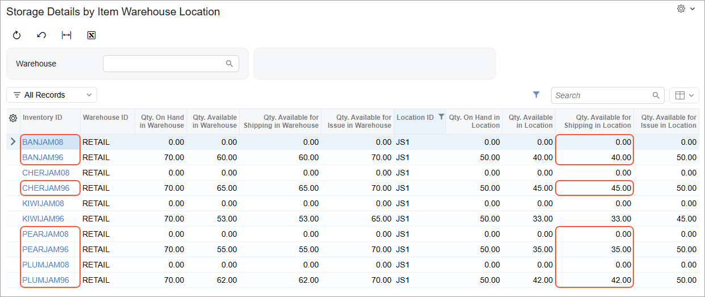

# Product Availability: To Export Product Availability Data {#_eec04634-b92c-42ce-8c23-9135c9d6d148 .task}

In this activity, you will specify the default availability settings for the BigCommerce store, specify the availability settings for particular stock items, export product availability data to the BigCommerce store, and review the results of the export.

**Attention:** The following activity is based on the *U100* dataset.

## Story { .section}

Suppose that the SweetLife Fruits &amp; Jams company sells several kinds of jams in its online store. The jams can be ordered in the online store as follows:

-   Banana jams \(*BANJAM96* and *BANJAM08*\) should always be available for purchase, regardless of the quantity in stock.
-   Pear jams \(*PEARJAM96* and *PEARJAM08*\) should be available for purchase only if there is a sufficient quantity in stock. If there is no quantity in stock, the item is unavailable for purchase.
-   Plum jams \(*PLUMJAM96* and *PLUMJAM08*\) should be available for purchase when there is a sufficient quantity in stock. If there is no quantity in stock, the availability of the item for purchase should be determined by the settings specified for the item on the product management page in the BigCommerce store.
-   Cherry jam in 96-ounce jars \(*CHERJAM96*\) is currently unavailable for purchase. You expect it to be restocked soon and want to accept orders for it regardless of its available quantities.

Item quantities are available for purchase in the online store only if they are available for shipping from the *JS1* location in the *RETAIL* warehouse.

Acting as an implementation consultant helping SweetLife to set up the integration of Acumatica ERP with the BigCommerce store, you need to configure the system so that the items' availability will be tracked according to the company's preferences.

## Configuration Overview { .section}

In the *U100* dataset, the following tasks have been performed to support this activity:

-   On the [Enable/Disable Features](CS_10_00_00.md) \(CS100000\) form, the following features have been enabled:
    -   *Multiple Warehouses*, which provides the functionality of working with several warehouses \(including virtual warehouses\)
    -   *Multiple Warehouse Locations*, which supports multiple locations for each warehouse
-   On the [Warehouses](IN_20_40_00.md) \(IN204000\) form, the *RETAIL* warehouse and the *JS1* warehouse location have been configured.
-   On the [Stock Items](IN_20_25_00.md) \(IN202500\) form, the stock items have been created in the system and assigned the availability settings as listed in the following table.

    |Stock Item|Availability|When Qty. Unavailable|
    |----------|------------|---------------------|
    |*BANJAM96*|*Store Default*|*Store Default*|
    |*BANJAM08*|*Store Default*|*Store Default*|
    |*PEARJAM96*|*Set as Available \(Track Qty.\)*|*Set as Unavailable*|
    |*PEARJAM08*|*Set as Available \(Track Qty.\)*|*Set as Unavailable*|
    |*PLUMJAM96*|*Set as Available \(Track Qty.\)*|*Do Nothing*|
    |*PLUMJAM08*|*Set as Available \(Track Qty.\)*|*Do Nothing*|
    |*CHERJAM96*|*Set as Pre-Order*|*Store Default*|

## Process Overview { .section}

In this activity, you will do the following:

1.  On the [BigCommerce Stores](BC_20_10_00.md) \(BC201000\) form, update the default availability settings for the BigCommerce store.
2.  On the [Storage Details by Item Warehouse Location](IN_40_80_55.md) \(IN408055\) form, review the quantities of stock items available in the *RETAIL* warehouse.
3.  On the [Prepare Data](BC_50_10_00.md) \(BC501000\) form, prepare the product availability data for synchronization, and on the [Process Data](BC_50_15_00.md) \(BC501500\) form, process the prepared product availability data.
4.  In the BigCommerce store, review the availability settings and quantities of the exported stock items.

## System Preparation { .section}

Before you complete the instructions in this activity, do the following:

1.  Make sure that the following prerequisites have been met:
    -   The BigCommerce store has been created and configured, as described in [Initial Configuration: To Set Up a BigCommerce Store](Commerce_BC_Initial_Configuration_To_Set_Up_a_BC_Store.md).
    -   The connection to the BigCommerce store has been established and the initial configuration has been performed, as described in [Initial Configuration: To Establish and Configure the Store Connection](Commerce_BC_Initial_Configuration_Implem_Activity.md).
2.  Launch the Acumatica ERP website with the *U100* dataset preloaded, and sign in with the following credentials:
    -   **Username**: *gibbs*
    -   **Password**: *123*
3.  Sign in to the control panel of the BigCommerce store as the store administrator.
4.  On the [BigCommerce Stores](../Shared/../UserGuide/BC_20_10_00.md) \(BC201000\) form, select the *SweetStore - BC* store.
5.  On the **Entities** tab, select the **Active** check box in the row of the *Product Availability* entity.
6.  On the form toolbar, click **Save**.

## Step 1: Updating the Default Availability Settings { .section}

Now you need to specify the availability settings that the system will apply by default to stock items and non-stock items exported from Acumatica ERP to the BigCommerce store. While you are viewing the [BigCommerce Stores](BC_20_10_00.md) \(BC201000\) form for the *SweetStore - BC* store, do the following:

1.  On the **Inventory** tab, specify the following settings:
    -   **Default Availability**: *Set as Available \(Track Qty.\)*

        With this setting, by default, a stock item exported to the BigCommerce store will be available for purchase through the storefront, and its quantity will be tracked.

    -   **When Qty. Unavailable**: *Set as Pre-Order*

        With this setting, after the synchronization of the *Product Availability* entity, if the stock item's quantity becomes 0, the stock item will no longer be available for purchase in the BigCommerce store, but customers will be able to place pre-orders.

    -   **Availability Mode**: *Available for Shipping*
    -   **Warehouse Mode**: *Specific Warehouses*
2.  In the **Warehouse Mapping for Inventory Export** table, add a new row and specify the following settings:

    -   **Warehouse**: *RETAIL*
    -   **Location ID**: *JS1*
    -   **BigCommerce Location**: *Default location*
    For each item, only its quantity available for shipping at the *JS1* location in the *RETAIL* warehouse is synchronized with the default location of the BigCommerce store.

3.  On the form toolbar, click **Save** to save the settings.

## Step 2: Reviewing the Available Quantities of Items { .section}

To review the availability quantity of the stock items, do the following:

1.  In the Selection area of the [Storage Details by Item Warehouse Location](IN_40_80_55.md) \(IN408055\) form, select the *RETAIL* warehouse.

    The system displays the quantities of all items stored in the *RETAIL* warehouse.

2.  Click the header of the **Location ID** column, and in the dialog box that opens, select *Equals*, type `JS1` in the box below, and click **OK**.

    The system now displays only the items that are stored in the *JS1* warehouse location. Because you have set the **Availability Mode** setting to *Available for Shipping*, the quantities of the items displayed in the **Qty. Available for Shipping in Location** column \(which is shown in the following screenshot\) will be synchronized with the BigCommerce store. Notice that the *BANJAM96*, *CHERJAM96*, *PEARJAM96*, and *PLUMJAM96* stock items are available at the *JS1* location \(a nonzero quantity is displayed for each of these items in the **Qty. Available for Shipping in Location** column\), whereas the *BANJAM08*, *PEARJAM08*, and *PLUMJAM08* stock items have quantities of 0.

    

## Step 3: Synchronizing the Product Availability Data { .section}

To synchronize the availability settings and the quantities of the stock items, do the following:

1.  On the [Prepare Data](../Shared/../UserGuide/BC_50_10_00.md) \(BC501000\) form, specify the following settings in the Summary area:
    -   **Store**: *SweetStore - BC*
    -   **Prepare Mode**: *Incremental*
2.  In the table, select the check box in the unlabeled column in the row with the *Product Availability* entity.
3.  On the form toolbar, click **Prepare**.
4.  In the **Processing** dialog box, which opens, click **Close** to close the dialog box.
5.  Click the link in the **Ready to Process** column in the row with the *Product Availability* entity.

    The [Process Data](BC_50_15_00.md) \(BC501500\) form opens with the *SweetStore - BC* store and the *Product Availability* entity selected in the Summary area.

6.  On the form toolbar, click **Process All** to process the prepared synchronization records of the stock items you updated in the previous steps.
7.  In the **Processing** dialog box, which opens, click **Close** to close the dialog box.

## Step 4: Reviewing the Synchronized Data { .section}

To review the synchronized availability data in the BigCommerce store, do the following:

1.  In the left pane of the control panel, click **Products** &gt; **All products**.
2.  On the **View products** page, which opens, review the *BANJAM96* and *BANJAM08* products.

    In the **Current Stock** column, notice that for the *BANJAM96* product, the current stock quantity is *40*. That indicates that the product's quantity is tracked and the product is in stock. For *BANJAM08*, the column contains *—*, meaning that the product's quantity is not tracked.

    Considering the available quantities of the items \(40 for *BANJAM96*, and 0 for *BANJAM08*\), the system has specified the inventory and purchasability settings for both products based on the following availability settings specified at the store level on the **Inventory** tab of the [BigCommerce Stores](BC_20_10_00.md) \(BC201000\): *Set as Available \(Track Qty.\)* if the item is available and *Set as Pre-Order* if it is unavailable.

    The system used the store-level settings based on the item-level visibility, which was set to *Store Default* for both items on the **eCommerce** tab of the [Stock Items](IN_20_25_00.md) \(IN202500\) form.

3.  To review the *BANJAM96* product, do the following:
    1.  Click the *Banana jam 96 oz.* link in the **Name** column.

        On the **View products** page, which opens for the *Banana jam 96 oz.* product, notice the following settings, which have been assigned to the product based on the availability setting because its available quantity is greater than 0:

        -   In the **Inventory** section, the **Track inventory** check box is selected.
        -   The current stock quantity, which is tracked on the product level, is *40*.
        -   In the **Purchasability** section, the **This product can be purchased in my online store** option button is selected.
    2.  In the left pane of the control panel, click **Products** &gt; **All products**.
4.  On the **View products** page, to which you return, do the following to review the *BANJAM08* product:
    1.  Click the *Banana jam 8 oz.* link in the **Name** column.

        On the **View products** page, which opens for the *Banana jam 8 oz.* product, notice the following settings, which have been assigned to the product based on the unavailability setting because its available quantity is 0:

        -   In the **Inventory** section, the **Track inventory** check box is cleared.
        -   In the **Purchasability** section, the **This product is coming soon but I want to take pre-orders** option button is selected.
    2.  In the left pane of the control panel, click **Products** &gt; **All products**.
5.  On the **View products** page, to which you return, review the *PEARJAM96* and *PEARJAM08* products.

    In the **Current Stock** column, notice that for the *PEARJAM96* product, the current stock quantity is *35*. That indicates that the product's quantity is tracked and the product is in stock. For *PEARJAM08*, the current stock quantity is *0* and a red dot is shown left to the quantity. That means that the product's quantity is tracked and the item is currently out of stock.

    Considering the available quantities of the items \(35 for *PEARJAM96*, and 0 for *PEARJAM08*\), the system has specified the inventory and purchasability settings for both products based on the following availability settings specified at the item level on the **eCommerce** tab of the [Stock Items](IN_20_25_00.md) form: *Set as Available \(Track Qty.\)* if the item is available and *Set as Unavailable* if it is unavailable.

6.  To review the *PEARJAM96* product, do the following:
    1.  Click the *Pear jam 96 oz.* link in the **Name** column.

        On the **View products** page, which opens for the *Pear jam 96 oz.* product, notice the following settings, which have been assigned to the product based on the availability setting because its available quantity is greater than 0:

        -   In the **Inventory** section, the **Track inventory** check box is selected.
        -   The current stock quantity, which is tracked on the product level, is *35*.
        -   In the **Purchasability** section, the **This product can be purchased in my online store** option button is selected.
    2.  In the left pane of the control panel, click **Products** &gt; **All products**.
7.  On the **View products** page, to which you return, do the following to review the *PEARJAM08* product:
    1.  Click the *Pear jam 8 oz.* link in the **Name** column.

        On the **View products** page, which opens for the *Pear jam 8 oz.* product, notice the following settings, which have been assigned to the product based on the unavailability setting because its available quantity is 0:

        -   In the **Inventory** section, the **Track inventory** check box is selected.
        -   The current stock quantity, which is tracked on the product level, is *0*.
        -   In the **Purchasability** section, the **This product cannot be purchased in my online store** option button is selected.
    2.  In the left pane of the control panel, click **Products** &gt; **All products**.
8.  On the **View products** page, to which you return, review the *PLUMJAM96* and *PLUMJAM08* products.

    In the **Current Stock** column, notice that for the *PLUMJAM96* product, the current stock quantity is *42*. That indicates that the product's quantity is tracked and the product is in stock. For *PLUMJAM08*, the current stock quantity is *0* and a red dot is shown left to the quantity. That means that the product's quantity is tracked and the item is currently out of stock.

    The system has specified the inventory and purchasability settings for both products based on the availability settings \(*Set as Available \(Track Qty.\)* if the item is available, and *Do Nothing* if it is unavailable\) specified at the item level on the **eCommerce** tab of the [Stock Items](IN_20_25_00.md) form. The system did not change the inventory and purchasability settings depending on the available quantity because of the *Do Nothing* setting for unavailable items.

9.  To review the *PLUMJAM08* product, do the following:

    1.  Click the *Plum jam 8 oz.* link in the **Name** column.

        On the **View products** page, which opens for the *Plum jam 8 oz.* product, notice the following settings, which have been assigned to the product based on the availability setting:

        -   In the **Inventory** section, the **Track inventory** check box is selected.
        -   The current stock quantity, which is tracked on the product level, is *0*.
        -   In the **Purchasability** section, the **This product can be purchased in my online store** option button is selected.
        Despite the *Plum jam 8 oz.* product being out of stock, the product can still be purchased.

    2.  In the left pane of the control panel, click **Products** &gt; **All products**.
    The *Plum jam 8 oz.* product, which is out of stock, has the same inventory and purchasability settings as *Plum jam 96 oz.* because for these products, the settings do not rely on the available quantity.

10. On the **View products** page, to which you return, review the *CHERJAM96* product.

    In the **Current Stock** column, notice the *—* option, meaning that the product's quantity is not tracked.

    The system has specified the inventory and purchasability settings for the product based on the availability settings \(*Set as Pre-Order* if the item is available, and *Set as Pre-Order* if it is unavailable\). The system does not consider the available quantity because of these availability settings, and *Cherry jam 96 oz.* can be pre-ordered regardless of the available quantity.

11. Click the *Cherry jam 96 oz.* link in the **Name** column.

    On the **View products** page, which opens for the *Cherry jam 96 oz.* product, notice the following settings, which have been assigned to the product based on the availability setting:

    -   In the **Inventory** section, the **Track inventory** check box is cleared.
    -   In the **Purchasability** section, the **This product is coming soon but I want to take pre-orders** option button is selected.

You have now configured the synchronization of product availability data and exported the items' availability settings and available quantities to the BigCommerce store.

**Parent topic:**[Synchronizing Product Availability](../UserGuide/Commerce_BC_Syncing_Product_Availability_Mapref.md)

