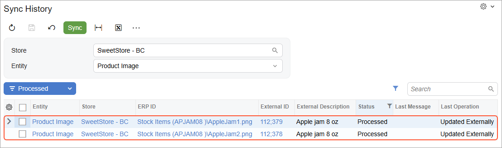

# Product Synchronization: To Export Product Images {#_c39ffa15-00d4-4b9a-a696-b2550bf41be1 .task}

The following activity will walk you through the process of synchronizing product images.

**Attention:** The following activity is based on the *U100* dataset.

## Story {#section_asd_lph_gtb .section}

Suppose that the SweetLife Fruits &amp; Jams company stores product images in Acumatica ERP as attachments to items. Acting as an implementation consultant helping SweetLife to set up the integration of Acumatica ERP with the BigCommerce store, you want to set up the export of images stored in Acumatica ERP to the BigCommerce store.

## Configuration Overview {#section_tz4_djx_cnb .section}

In the *U100* dataset, for the purposes of this activity, on the [Stock Items](IN_20_25_00.md) \(IN202500\) form, the *APJAM08* stock item of the *JAM* item class been created.

## Process Overview {#section_bsd_lph_gtb .section}

In this activity, you will do the following:

1.  In the BigCommerce store, locate WebDAV credentials needed for the synchronization of product images.
2.  On the [BigCommerce Stores](BC_20_10_00.md) \(BC201000\) form, activate the *Product Image* entity.
3.  On the [Prepare Data](BC_50_10_00.md) form, prepare the product image data for synchronization.
4.  On the [Process Data](BC_50_15_00.md) form, process the product image data prepared for synchronization.
5.  In the control panel of the BigCommerce store, review the exported images.

## System Preparation { .section}

Before you complete the instructions in this activity, do the following:

1.  Make sure that the following prerequisites have been met:
    -   The BigCommerce store has been created and configured, as described in [Initial Configuration: To Set Up a BigCommerce Store](Commerce_BC_Initial_Configuration_To_Set_Up_a_BC_Store.md).
    -   The connection to the BigCommerce store has been established and the initial configuration has been performed, as described in [Initial Configuration: To Establish and Configure the Store Connection](Commerce_BC_Initial_Configuration_Implem_Activity.md).
    -   The initial synchronization of stock items with the BigCommerce store has been performed, as described in [Data Synchronization: To Perform the First Synchronization](Commerce_BC_Data_Sync_First_Sync.md).
2.  Download the `AppleJam1.png` and `AppleJam2.png` files to your device.
3.  Launch the Acumatica ERP website with the *U100* dataset preloaded, and sign in with the following credentials:
    -   **Username**: *gibbs*
    -   **Password**: *123*
4.  Sign in to the control panel of the BigCommerce store as the store owner.

## Step 1: Obtaining the WebDAV Credentials { .section}

To find the information that is required to set up file transfer between Acumatica ERP and the online store over the WebDAV protocol, do the following in the BigCommerce store:

1.  In the left pane of the control panel, select **Settings**.
2.  On the **Settings** page, in the **Advanced** section, click **File access \(WebDAV\)**.

    On the **File Access** page, which opens, notice the following WebDAV information:

    -   WebDAV Path
    -   WebDAV Username
    -   WebDAV Password
3.  Save this information to a file. You will need it in the next step.

## Step 2: Activating the Needed Entity { .section}

To activate the *Product Image* entity and specify the required information, do the following:

1.  On the [BigCommerce Stores](../Shared/../UserGuide/BC_20_10_00.md) \(BC201000\) form, select the *SweetStore - BC* store.
2.  On the **General** tab, fill in the **WebDAV Username** and **WebDAV Password** boxes with the information you saved in the previous step.

    Note that the **WebDAV Path** box is filled in by the system automatically.

3.  On the **Entities** tab, select the **Active** check box in the row of the *Product Image* entity.
4.  On the form toolbar, click **Save**.

## Step 3: Adding an Image to the Stock Item { .section}

To add an image to the *APJAM08* stock item, do the following:

1.  On the [Stock Items](IN_20_25_00.md) \(IN202500\) form, select the *APJAM08* stock item.
2.  On the **Description** tab, drag the files you downloaded to the Image area.

    The files are attached to the form. You can browse them in the Image area or access them by clicking **Files** in the form title bar. The image that is visible in the Image area, after being exported, will be the main image of the product in the BigCommerce store.

3.  On the form toolbar, click **Save**.

## Step 4: Preparing the Image Data for Synchronization { .section}

To prepare the image data for synchronization, do the following:

1.  On the [Prepare Data](../Shared/../UserGuide/BC_50_10_00.md) \(BC501000\) form, specify the following settings in the Summary area:

    -   **Store**: *SweetStore - BC*
    -   **Prepare Mode**: *Incremental*
    This setting controls which data will be loaded. *Incremental* indicates that the system will load only the data that has been modified since the previous data synchronization.

2.  In the table, select the check box in the unlabeled column in the row of the *Product Image* entity, and on the form toolbar, click **Prepare**.

    **Note:** Note that images are synchronized only for stock and non-stock items that have been already synchronized with the BigCommerce store. If an item has not been synchronized, images added to it will not be exported during the synchronization of the *Product Image* entity.

3.  In the **Processing** dialog box, which opens, review the results of the processing, and click **Close** to close the dialog box and return to the [Prepare Data](../Shared/../UserGuide/BC_50_10_00.md) form.

    Notice that the **Prepared Records** column shows the number of synchronization records that have been prepared and are ready to be processed.

## Step 5: Processing the Prepared Image Data { .section}

To process the image data prepared for synchronization, do the following:

1.  While you are still viewing the [Prepare Data](BC_50_10_00.md) \(BC501000\) form, click the link in the **Ready to Process** column in the row of the *Product Image* entity.

    The [Process Data](BC_50_15_00.md) \(BC501500\) form opens with the *SweetStore - BC* store and the *Product Image* entity selected in the Summary area. The table displays synchronization records of the *Product Image* entity.

    **Tip:** The **ERP ID** column displays the item type \(stock item\) and identifier \(*APJAM08*\) followed by the backslash and then the name of the image file. You can click the link in this column to open the file details on the [File Maintenance](SM_20_25_10.md) \(SM202510\) form.

2.  In two rows of images of the *APJAM08* stock item, select the unlabeled check box, and on the form toolbar, click **Process**.
3.  In the **Processing** dialog box, which opens, click **Close** to close the dialog box.

## Step 6: Reviewing the Synchronized Images { .section}

To review the images that have been exported for the *Apple jam 8 oz.* product, do the following:

1.  On the [Sync History](BC_30_10_00.md) \(BC301000\) form, specify the following settings in the Summary area:
    -   **Store**: *SweetStore - BC*
    -   **Entity**: *Product Image*
2.  In the Filter List drop-down menu above the table, select *Processed*.

    The table displays two synchronization records of the *Product Image* entity, as shown in the following screenshot. In the **External ID** column, notice that the identifier of each image in the BigCommerce store consists of two parts—the identifier of the product and the identifier of the image.

    

3.  In the first row of the table, click the link in the **External ID** column to review the item in the BigCommerce store. The product management page opens for the *Apple jam 8 oz.* product.

    **Attention:** If you are not signed in to the control panel of the BigCommerce store in the same browser, you will need to enter your sign-in credentials.

    Notice that the **Images** section \(under **Images &amp; Videos**\) now contains two images that you uploaded in this activity. The main product image \(for which the **Thumbnail** option button is selected\) is the image that is visible in the Image area of the **Description** tab.

4.  At the top of the page, next to the product name, click **View on Storefront**.

    The storefront page for the *Apple jam 8 oz.* product opens. Notice that a thumbnail image is displayed for this product, and review how the other image is displayed.

**Parent topic:**[Synchronizing Products](../UserGuide/Commerce_BC_Syncing_Products_Mapref.md)

