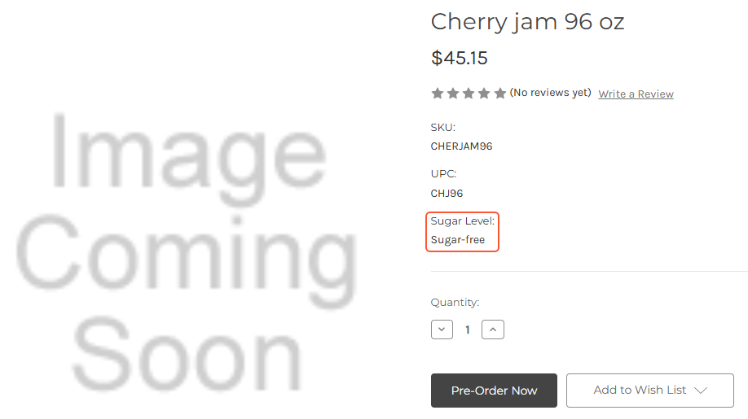

# Product Synchronization: To Synchronize Stock Items with Attributes {#_791edb40-a873-4f0f-8b56-043ce6b76af5 .task}

The following activity will walk you through the processes of creating an attribute for a stock item and synchronizing this item with the BigCommerce store.

**Attention:** The following activity is based on the *U100* dataset.

## Story { .section}

Suppose that the SweetLife Fruits &amp; Jams company wants to display the sugar levels of jams it sells in the online store on the product detail pages on the storefront.

Acting as an implementation consultant helping SweetLife to set up the integration of Acumatica ERP with the BigCommerce store, you need to define an attribute for the sugar level and then export these sugar levels to the BigCommerce store.

## Configuration Overview {#section_tz4_djx_cnb .section}

In the *U100* dataset, the following tasks have been performed to support this activity:

-   On the [Item Classes](IN_20_10_00.md) \(IN201000\) form, the *JAM* item class has been defined.
-   On the [Stock Items](IN_20_25_00.md) \(IN202500\) form, the *CHERJAM96* stock item of the *JAM* item class has been created.

## Process Overview { .section}

In this activity, you will perform the following:

1.  On the [Attributes](CS_20_50_00.md) form, create an attribute for the sugar level of the products.
2.  On the [Item Classes](IN_20_10_00.md) form, add the attribute to the *JAM* item class.
3.  On the [Stock Items](IN_20_25_00.md) \(IN202500\) form, assign a value to the created attribute for a particular stock item.
4.  On the [Entities](BC_20_20_00.md) form, map the attribute field with a product field in the BigCommerce store.
5.  On the [Prepare Data](BC_50_10_00.md) \(BC501000\) form, prepare stock item data for synchronization.
6.  On the [Process Data](BC_50_15_00.md) \(BC501500\) form, process the data prepared for synchronization.
7.  In the control panel of the BigCommerce store, review the exported product.

## System Preparation { .section}

Before performing the instructions of this activity, do the following:

1.  Make sure that the following prerequisites have been met:
    -   The BigCommerce store has been created and configured, as described in [Initial Configuration: To Set Up a BigCommerce Store](Commerce_BC_Initial_Configuration_To_Set_Up_a_BC_Store.md).
    -   The connection to the BigCommerce store has been established and the initial configuration has been performed, as described in [Initial Configuration: To Establish and Configure the Store Connection](Commerce_BC_Initial_Configuration_Implem_Activity.md).
2.  Launch the Acumatica ERP website with the *U100* dataset preloaded, and sign in with the following credentials:
    -   **Username**: *gibbs*
    -   **Password**: *123*
3.  Sign in to the control panel of the BigCommerce store as the store administrator.

## Step 1: Creating an Attribute { .section}

To create an attribute that will indicate the sugar level of products, do the following:

1.  On the [Attributes](CS_20_50_00.md) \(CS205000\) form, add a new record.
2.  In the Summary area, specify the following settings:
    -   **Attribute ID**: `SUGARLEVEL`
    -   **Description**: `Sugar Level`
    -   **Control Type**: *Text*
3.  On the form toolbar, click **Save**.

## Step 2: Adding the Attribute to the Needed Item Class { .section}

To add the *Sugar Level* attribute to the *JAM* item class, do the following:

1.  Open the [Item Classes](IN_20_10_00.md) \(IN201000\) form.
2.  In the **Item Class Tree** pane, select the *JAM* item class.
3.  In the upper table on the **Attributes** tab, click **Add Row** on the table toolbar.
4.  In the added row, in the **Attribute ID** column, select *SUGARLEVEL*.
5.  On the form toolbar, click **Save**.

## Step 3: Assigning a Value to the Added Attribute { .section}

To assign a specific value to the created attribute for the *CHERJAM96* stock item, do the following:

1.  On the [Stock Items](IN_20_25_00.md) \(IN202500\) form, select the *CHERJAM96* item.
2.  In the **Attributes** table on the **Attributes** tab, in the row with the *Sugar Level* attribute, enter `Sugar-free` as the **Value**.
3.  On the form toolbar, click **Save**.

## Step 4: Mapping the Attribute to a Field in the BigCommerce Store { .section}

To map the *Sugar Level* attribute with the BigCommerce field, do the following:

1.  On the [Entities](BC_20_20_00.md) \(BC202000\) form, specify the following settings in the Summary area:
    -   **Store Name**: *SweetStore - BC*
    -   **Entity**: *Stock Item*
2.  On the **Export Mapping** tab, click **Add Row**, and in the added row, specify the following settings:
    -   **Active**: Selected
    -   **External Object**: *Product → Custom Fields*
    -   **External Field**: *&lt;&lt;Auto\_Mapping&gt;&gt;*
    -   **ERP Object**: *Stock Item → Attributes*
    -   **ERP Field / Value**: *Sugar Level*
3.  On the form toolbar, click **Save**.

## Step 5: Preparing Product Data for Synchronization { .section}

To prepare the product data for synchronization, do the following:

1.  On the [Prepare Data](../Shared/../UserGuide/BC_50_10_00.md) \(BC501000\) form, specify the following settings in the Summary area:

    -   **Store**: *SweetStore - BC*
    -   **Prepare Mode**: *Incremental*
    This setting controls which data will be loaded. *Incremental* indicates that the system will load only the data that has been modified since the previous data synchronization.

2.  In the table, select the check box in the unlabeled column in the row of the *Stock Item* entity, and on the form toolbar, click **Prepare**.
3.  In the **Processing** dialog box, which opens, review the results of the processing, and click **Close** to close the dialog box.

    Notice that the **Ready to Process** column shows the number of synchronization records that have been prepared and are ready to be processed. The **Processed Records** column shows the number of records that have been processed \(that is, records that have been successfully synchronized\).

## Step 6: Processing the Prepared Product Data { .section}

To process the product data that has been prepared for synchronization, do the following:

1.  While you are still viewing the [Prepare Data](BC_50_10_00.md) \(BC501000\) form, click the link in the **Ready to Process** column in the row of the *Stock Item* entity.

    The [Process Data](BC_50_15_00.md) \(BC501500\) form opens with the *SweetStore - BC* store and the *Stock Item* entity selected in the Summary area. The table displays all synchronization records of the *Stock Item* entity that the system prepared in the previous step.

2.  In the row of the *CHERJAM96, Cherry jam 96 oz* stock item, select the unlabeled check box, and on the form toolbar, click **Process**.
3.  In the **Processing** dialog box, which opens, click **Close** to close the dialog box.

## Step 7: Viewing the Exported Products { .section}

To view the exported product data in the BigCommerce store, do the following:

1.  On the[Sync History](BC_30_10_00.md) \(BC301000\) form, specify the following settings in the Summary area:
    -   **Store**: *SweetStore - BC*
    -   **Entity**: *Stock Item*
2.  In the Filter List drop-down menu above the table, select *Processed*.
3.  In the row of the *CHERJAM96, Cherry jam 96 oz* item, click the link in the **External ID** column.

    **Attention:** If you are not signed in to the control panel of the BigCommerce store in the same browser, you will need to enter your sign-in credentials.

4.  On the **View products** page, which opens for the *Cherry jam 96 oz* product in the BigCommerce control panel, review the details of the exported item.

    Notice that in the **Custom Fields** section, the *Sugar Level* custom field has been created and set to *Sugar-free*.

5.  At the top of the page, next to the product name, click **View on Storefront**.

    The storefront page for the *Cherry jam 96 oz* product opens. Notice that the name of the custom field \(**Sugar Level**\) and the assigned value \(*Sugar-free*\) are displayed, as shown in the following screenshot.

**Parent topic:**[Synchronizing Products](../UserGuide/Commerce_BC_Syncing_Products_Mapref.md)

