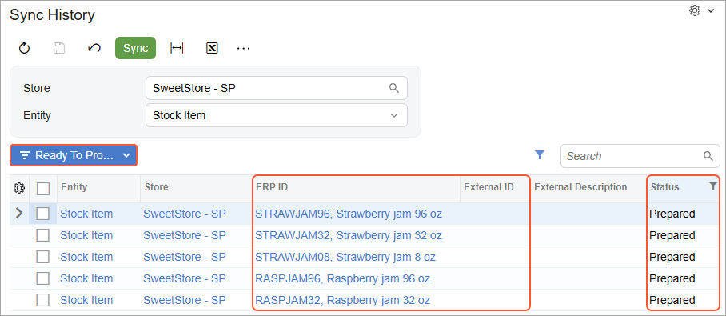
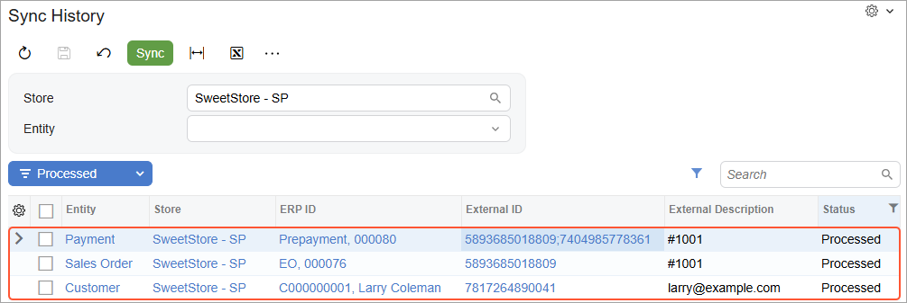
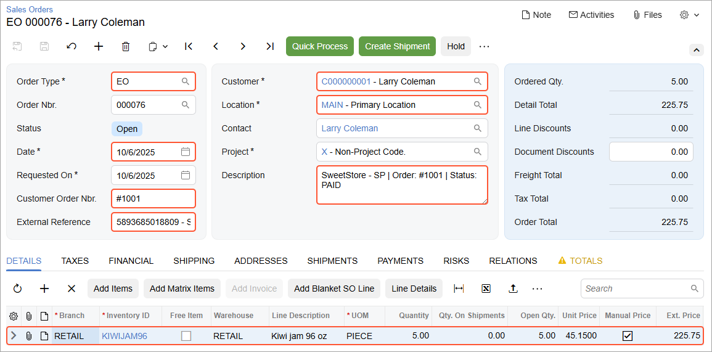

# Data Synchronization: To Perform the First Synchronization {#_b084298d-f963-4864-84ff-581be84bb071 .task}

The following activity will walk you through the process of manually exporting items from Acumatica ERP to the Shopify store. You will also perform the instructions to place a test order online in the Shopify store and then synchronize the order and the payment with Acumatica ERP. Finally, you will create a shipment for the order in Acumatica ERP and synchronize the created shipment with the Shopify store.

**Attention:** The following activity is based on the *U100* dataset.

## Story { .section}

Suppose that you are an implementation consultant helping the SweetLife Fruits &amp; Jams company to set up an online store. You have completed the minimum initial configuration of the integration with Shopify and now want to explore how synchronization works. You will configure synchronization for and then synchronize a subset of stock items that are maintained in Acumatica ERP \(stock items of the *Jam* item class\) with the Shopify store. You will then place a test order for one of the synchronized products and explore how the online order is processed in the Shopify store and in Acumatica ERP.

## Process Overview { .section}

In this activity, you will perform the following steps:

1.  On the [Stock Items](IN_20_25_00.md) \(IN202500\) form of Acumatica ERP, review the stock items that need to be exported to the Shopify store.
2.  On the [Entities](BC_20_20_00.md) \(BC202000\) form, configure the filtering options for the *Stock Item* entity to include in the synchronization only the stock items of the *Jam* item class.
3.  On the [Prepare Data](BC_50_10_00.md) \(BC501000\) form, start the data preparation for the *Stock Item* entity to prepare the stock item data for export.
4.  On the [Sync History](BC_30_10_00.md) \(BC301000\) form, review the result of the data preparation process.
5.  On the [Process Data](BC_50_15_00.md) \(BC501500\) form, start data processing for the *Stock Item* entity to save the synchronized product data in the Shopify store.
6.  On the [Sync History](BC_30_10_00.md) form, review the results of the data processing.
7.  In the admin area of the Shopify store, review the products that have been imported from Acumatica ERP.
8.  By using the admin area of the Shopify store, place an order for one of the products that have been imported from Acumatica ERP.
9.  On the [Prepare Data](BC_50_10_00.md) form of Acumatica ERP, start the data preparation process for the *Sales Order* entity to prepare the order data for import; on the [Process Data](BC_50_15_00.md) form, process the prepared sales order data.
10. On the [Sync History](BC_30_10_00.md) form, review the synchronization status of the imported order data.
11. On the [Sales Orders](SO_30_10_00.md) \(SO301000\) form, review the details of the imported sales order.
12. On the [Sales Orders](SO_30_10_00.md) form, create a shipment for the imported order.
13. On the [Shipments](SO_30_20_00.md) \(SO302000\) form, confirm the shipment.
14. On the [Prepare Data](BC_50_10_00.md) form, start the data preparation for the *Shipment* entity; on the [Process Data](BC_50_15_00.md) form, start data processing for the shipment.
15. In the admin area of the Shopify store, review the updated order details and the shipment exported from Acumatica ERP.

## System Preparation { .section}

Do the following:

1.  Make sure that the following prerequisites have been met:
    -   The Shopify store has been created and configured, as described in [Initial Configuration: To Set Up a Shopify Store](Commerce_SP_Initial_Configuration_To_Set_Up_a_Shopify_Store.md).
    -   The connection to the Shopify store has been established and the initial configuration has been performed, as described in [Initial Configuration: To Configure the Store Connection](Commerce_SP_Initial_Configuration_Implem_Activity.md).
2.  Launch the Acumatica ERP website, and sign in as an administrator by using the following credentials:
    -   **Username**: *gibbs*
    -   **Password**: *123*
3.  Sign in to the admin area of the Shopify store as the store administrator in the same browser.

## Step 1: Finding and Reviewing the Stock Items to Be Sold Online { .section}

To find and review the stock items that will be sold online, on the Stock Items \(IN2025PL\) form, filter the stock items to display only the items of the *Jam* item class as follows:

1.  In the **Item Class** column, click the column header.
2.  In the menu that opens, select the *Equals* filter condition.
3.  In the box at the bottom of the menu, type `Jam`.
4.  Click **OK** to apply the filter.

Now all stock items of the *Jam* item class are displayed. In the table footer, notice how many items are in the class; scan the list so you are familiar with the stock items that you need to export to the Shopify store.

## Step 2: Configuring the Export of a Subset of Stock Items { .section}

To configure the *Stock Item* entity to export to the Shopify store only stock items of the *Jam* item class, do the following:

1.  On the [Entities](BC_20_20_00.md) \(BC202000\) form, specify the following settings in the Summary area:

    1.  **Store Name**: *SweetStore - SP*
    2.  **Entity**: *Stock Item*
    Notice that the entity can only be exported to the Shopify store \(that is, **Sync Direction** is set to *Export*\).

2.  To create a filtering condition for the export of stock items, on the **Export Filtering** tab, click **Add Row** on the table toolbar, and specify the following settings in the row:
    -   **Active**: Selected
    -   **Field Name**: *Item Class*
    -   **Condition**: *Equals*
    -   **Value**: `Jam`
3.  On the form toolbar, click **Save** to save your changes.

    Now when you synchronize the *Stock Item* entity, only the stock items of the *Jam* item class will be exported to the Shopify store.

    **Note:** Filtering rules are not applied to data that has already been synchronized. For example, if you synchronize the *Stock Item* entity without filters \(which will result in exporting all stock items to the online store\), apply the filter described above, and prepare and process the *Stock Item* entity again, all previously synchronized stock items that no longer match the filtering conditions will remain synchronized.

## Step 3: Preparing the Product Data for Synchronization { .section}

To prepare the stock item data that needs to be synchronized to the Shopify store, do the following:

1.  On [Prepare Data](BC_50_10_00.md) \(BC501000\) form, specify the following settings in the Summary area :
    -   **Store**: *SweetStore - SP*
    -   **Prepare Mode**: *Incremental*

        This setting controls which data will be loaded. *Incremental* indicates that the system will load only the data that has been modified since the previous data synchronization. Because you start the data preparation process for the *Stock Item* for the first time, all stock item data will be prepared.

2.  In the table, select the check box in the unlabeled column in the row of the *Stock Item* entity.
3.  On the form toolbar, click **Prepare**.
4.  In the **Processing** dialog box, which opens, review the results of the processing, and click **Close** to close the dialog box.

    In the table on the form, notice that the **Ready to Process** column shows the number of synchronization records that have been prepared and are ready to be processed. Notice that this number matches the total number of the items with the *Jam* class you reviewed in Step 1.

    The **Processed Records** column shows the number of records that have been processed \(that is, records that have been successfully synchronized and assigned the *Processed* status\). This number is now *0* because you have not processed any record yet.

    **Tip:** You can click the link in the **Ready to Process** column to open the [Process Data](../Shared/../UserGuide/BC_50_15_00.md) \(BC501500\) form with the store and the entity selected; you can click the link in the **Processed Records** column to open the [Sync History](../Shared/../UserGuide/BC_30_10_00.md) \(BC301000\) form with the store and the entity selected and the list of processed synchronization records \(that is, records that have been successfully synchronized and assigned the *Processed* status\) displayed on the **Drilldown** filter tab.

## Step 4: Reviewing the Results of Data Preparation { .section}

To review the results of preparation of product data for synchronization, do the following:

1.  While you are still viewing the [Prepare Data](BC_50_10_00.md) \(BC501000\) form, click the link in the **Total Records** in the row of the *Stock Item* entity.

    The [Sync History](BC_30_10_00.md) \(BC301000\) form opens in a new browser tab with the *SweetStore - SP* store and the *Stock Item* entity selected in the Summary area.

2.  Make sure that *Ready to Process* is selected in the Filter List drop-down menu above the table.

    Notice that the table is displaying only synchronization records with the *Prepared* status, as shown in the screenshot below. This status means that these records have been prepared and are now ready to be processed.

    For each of these items, the **ERP ID** column displays a link that you can click to open the item on the [Stock Items](IN_20_25_00.md) \(IN202500\) form. Notice that the **External ID** column currently does not display any values because the stock items have not yet been exported to the Shopify store.

    

3.  In the Filter List drop-down menu, select *Filtered*.

    Notice that the table is displaying only synchronization records with the *Filtered* status. These are the stock items that were excluded from synchronization based on the filtering conditions that you configured earlier.

## Step 5: Processing the Prepared Product Data { .section}

To process the prepared product data \(that is, to synchronize it with the Shopify store\), do the following:

1.  On the [Process Data](BC_50_15_00.md) \(BC501500\) form, select the following settings in the Summary area:

    -   **Store**: *SweetStore - SP*
    -   **Entity**: *Stock Item*
    The table displays only the list of the items that you have prepared for synchronization \(that is, the items with the *Prepared* status\).

2.  On the form toolbar, click **Process All** to synchronize all the records displayed in the table.

    Wait until the processing finishes.

3.  In the **Processing** dialog box, which opens, click **Close** to close the dialog box.

## Step 6: Reviewing the Synchronization Status of the Product Data { .section}

To again review the synchronization status of the product data, do the following:

1.  On the [Sync History](BC_30_10_00.md) \(BC301000\) form, select the following settings in the Summary area:
    -   **Store**: *SweetStore - SP*
    -   **Entity**: *Stock Item*
2.  In the Filter List drop-down menu above the table, select *Ready to Process*.

    Notice that the table contains no records because you have already processed all the prepared records.

3.  In the Filter List drop-down menu, select *Processed*.

    The table shows the list of items that have been processed—that is, synchronized with the Shopify store. For each item, there is now a product identifier in the **External ID** column. In the table, the **Last Operation** value has changed to *Inserted Externally* and the time stamp in the **Last Attempt** column has changed to the date and time when you ran data processing on the [Process Data](BC_50_15_00.md) \(BC501500\) form.

## Step 7: Viewing an Exported Product in the Shopify Store { .section}

To view the *KIWIJAM96* stock item \(which has the description *Kiwi jam 96 oz*\) in the Shopify store, do the following:

1.  While you are still viewing the [Sync History](BC_30_10_00.md) \(BC301000\) form, click the link in the **External ID** column in the row of the synchronization record for the *Kiwi jam 96 oz* item.

    The product management page for the *Kiwi jam 96 oz* product \(which is a page in the admin area of the Shopify store where you manage details of a particular product\) opens in a new browser tab.

2.  Scan the product details that have been exported to the Shopify store.

    Notice that the following information has been imported for *Kiwi jam 96 oz* from Acumatica ERP:

    -   The item description \(*Kiwi jam 96 oz*\) in the **Title** box
    -   The extended item description \(*Thick and sweet kiwi jam – goes great on toast or on pancakes.*\) in the **Description** box
    -   The product image in the **Media** section
    -   The default price \(*45.15*\) in the **Price** section
    -   The item inventory ID \(*KIWIJAM96*\) in the **SKU** box \(**Inventory** section\)
    -   The item class \(*Jam*\) in the **Type** box \(**Product organization** section\)

## Step 8: Placing an Order from the Admin Area { .section}

To create an order for five 96-ounce jars of kiwi jam from the admin area of your Shopify store, do the following:

1.  While you are still viewing the admin area of the Shopify store, in the left menu, click **Orders**.
2.  On the **Orders** page, which opens, click **Create order**.
3.  On the **Create order** page, which opens, in the **Products** section, start typing `Kiwi jam` in the search product box.
4.  In the list of search results, which are shown in a pop-up window, select the check box next to *Kiwi jam 96 oz*, and click **Add** in the lower right.
5.  In the row of the *Kiwi jam 96 oz* product, change the quantity to `5`.
6.  In the **Customer** section, click in the search box and in the menu that opens, select **Create a new customer**.
7.  In the **New customer** pop-up window, which opens, specify the following details in the **Customer overview** section:
    -   **First name**: `Larry`
    -   **Last name**: `Coleman`
    -   **Email**: `larry@example.com`
8.  In the **Default address** section, click **Add address**.
9.  In the **Add default address** pop-up window, which opens, fill in the boxes as follows:
    -   **Country/region**: *United States* \(inserted by default\)
    -   **First name**: `Larry` \(inserted by default based on the information specified in the customer overview section\)
    -   **Last name**: `Coleman` \(inserted by default based on the information specified in the customer overview section\)
    -   **Address**: `1970 Duncan Avenue`
    -   **City**: `New York`
    -   **State**: *New York*
    -   **ZIP code**: `10016`
10. In the lower right, click **Save** to save the address.

    The system closes the pop-up window and adds the primary address for the customer.

11. In the upper right click **Save**.

    The system creates the customer and close the pop-up window.

12. In the **Payment** section of the **Create order** page, to which you return, click **Mark as paid**.
13. In the **Mark as paid** dialog box, which appears, click **Create order**.

    The system closes the **Mark as paid** dialog box and creates the order. At the top of the page, notice that the system has assigned the order an order number, the *Paid* payment status, and the *Unfulfilled* fulfillment status.

**Tip:** Shopify assigns each order an order number, which by default is represented by the prefix *\#* and a numbering sequence. The order number is displayed at the top of the order page next to the order's payment status and fulfillment status. If needed, you can change the format of the order number on the **General** settings page in the Shopify admin area.

Each order is also assigned a numeric identifier, which you can see in the URL of the Shopify order page.

On the [Process Data](../Shared/../UserGuide/BC_50_15_00.md) \(BC501500\) and [Sync History](../Shared/../UserGuide/BC_30_10_00.md) \(BC301000\) forms, the order identifier is displayed in the **External ID** column, and the order number is displayed in the **External Description** column.

## Step 9: Importing the Sales Order Data to Acumatica ERP { .section}

To import the order from the Shopify store to Acumatica ERP, do the following:

1.  On the [Prepare Data](../Shared/../UserGuide/BC_50_10_00.md) \(BC501000\) form, specify the following settings in the Summary area:
    -   **Store**: *SweetStore - SP*
    -   **Prepare Mode**: *Incremental*
2.  In the table, select the check box in the unlabeled column in the row of the *Sales Order* entity.
3.  On the form toolbar, click **Prepare**.
4.  In the **Processing** dialog box, which opens, click **Close** to close the dialog box.
5.  In the row of the *Sales Order* entity, click the link in the **Ready to Process** column \(which shows *1* because you have created only one order in the Shopify store\).

    The [Process Data](BC_50_15_00.md) \(BC501500\) form opens with the *SweetStore - SP* store and the *Sales Order* entity selected.

    Notice that the order identifier and the order number assigned to the order in Shopify are displayed in the **External ID** and **External Description** columns, respectively.

6.  Select the unlabeled check box in the only row of the table, and on the form toolbar, click **Process**.
7.  In the **Processing** dialog box, which opens, click **Close** to close the dialog box.

## Step 10: Reviewing the Synchronization Status of the Imported Data { .section}

To review the synchronization status of the order you imported in the previous step, do the following:

1.  On the [Sync History](BC_30_10_00.md) \(BC301000\) form, specify the following settings in the Summary area:
    -   **Store**: *SweetStore - SP*
    -   **Entity**: Leave empty
2.  In the Filter List drop-down menu above the table, select *Processed*.

    In the table, notice that three synchronization records were created when the sales order was processed \(see the screenshot below\):

    -   *Sales Order*: The sales order that you placed in the Shopify store. The **ERP ID** column displays the order type \(*EO*\) and the order ID. The order type is based on the value selected in the **Order Type for Import** box on the **Orders** tab of the [Shopify Stores](BC_20_10_10.md) \(BC201010\) form.
    -   *Customer*: The customer that you created in the Shopify store when placing the order. The **ERP ID** column displays the customer ID and the name of the customer. The customer ID was assigned to the customer record based on the numbering sequence specified in the **Customer Numbering Sequence** box on the **Customers** tab of the [Shopify Stores](BC_20_10_10.md) form. The customer name was imported from the Shopify store.
    -   *Payment*: The payment used to pay the order in the Shopify store. The **ERP ID** column displays the payment type \(*Prepayment*\) and the payment identifier.

        The payment has been imported because the payment method you used to pay the order has been mapped to an Acumatica ERP payment method and the mapping has been activated on the **Payments** tab of the [Shopify Stores](BC_20_10_10.md) form.

    

    **Tip:** For each of the entities created in the system during the synchronization, you can open the appropriate form with the entity selected by clicking the link in the **ERP ID** column of the table.

## Step 11: Reviewing the Imported Sales Order { .section}

To review the details of the imported sales order, do the following:

1.  While you are still viewing the synchronization results on the [Sync History](BC_30_10_00.md) \(BC301000\) form, click the link in the **ERP ID** column for the sales order you imported.
2.  On the [Sales Orders](SO_30_10_00.md) \(SO301000\) form, which opens in a pop-up window, review the details of the order \(which are shown in the following screenshot\).

    

    In the Summary area, notice the following:

    -   The imported order has the *EO* type \(shown in the **Order Type** box\), which is configured on the [Shopify Stores](BC_20_10_10.md) \(BC201010\) form to be assigned to all sales orders imported from the *SweetStore - SP* store.
    -   In the **Customer Order Nbr.** box, the order number assigned to the order in the Shopify store is displayed.
    -   In the **External Reference** box, the order identifier assigned to the order in the Shopify store and the name of the store are displayed.
    -   The **Date** of the sales order is the same as the date on which the order was created in the Shopify store.
    -   In the **Description** box, the store name, the order number and the payment status of the order are displayed.
    -   The **Customer** and **Location** boxes display the information about the customer and customer location that were created in Acumatica ERP during the import of the sales order; both were created during the order placement in the Shopify store.
    On the **Details** tab, review the only line in the table. Notice the following:

    -   **Branch** is set to *RETAIL*, which is the default branch configured to appear on sales orders imported from the *SweetStore - SP* store on the [Shopify Stores](BC_20_10_10.md) form.
    -   The inventory ID, quantity, unit price, and extended price of the item are exactly the same as the values on the order in the Shopify store.
    On the **Payments** tab, notice that a prepayment in the order amount has been applied to the sales order.

## Step 12: Creating and Confirming a Shipment { .section}

To process a shipment for the imported sales order, do the following:

1.  While you are still viewing the sales order on the [Sales Orders](SO_30_10_00.md) \(SO301000\) form, on the form toolbar, click **Create Shipment**.
2.  In the **Specify Shipment Parameters** dialog box, which opens, make sure the current date and the *RETAIL* warehouse are selected, and click **OK**. The system creates a shipment and opens it on the [Shipments](SO_30_20_00.md) \(SO302000\) form in the same pop-up window.
3.  On the form toolbar, click **Confirm Shipment**.

    The shipment is assigned the *Confirmed* status; the sales order is assigned the *Completed* status.

4.  Close the pop-up window with the [Shipments](SO_30_20_00.md) form.

## Step 13: Synchronizing the Shipment with the Shopify Store { .section}

To export the shipment to the *SweetStore - SP* store, do the following:

1.  In the Summary area on the [Prepare Data](BC_50_10_00.md) \(BC501000\) form, select the following settings:
    -   **Store**: *SweetStore - SP*
    -   **Prepare Mode**: *Incremental*
2.  In the table, select the check box in the unlabeled column for the *Shipment* entity.
3.  On the form toolbar, click **Prepare**.
4.  In the **Processing** dialog box, which opens, click **Close** to close the dialog box.
5.  Click the link in the **Ready to Process** \(which shows *1* because only one shipment has been created\) in the row of the *Shipment* entity.

    The [Process Data](BC_50_15_00.md) \(BC501500\) form opens with the *SweetStore - SP* store and the *Shipment* entity selected.

6.  Select the unlabeled check box for the only row in the table.
7.  On the form toolbar, and click **Process**.
8.  In the **Processing** dialog box, which opens, click **Close** to close the dialog box.

## Step 14: Reviewing the Updated Order and Shipment in Shopify { .section}

To check whether the shipment and the updated sales order have been exported to the Shopify store correctly, do the following:

1.  On the [Sync History](BC_30_10_00.md) \(BC301000\) form, specify the following settings in the Summary area:
    -   **Store**: *SweetStore - SP*
    -   **Entity**: *Shipment*
2.  In the Filter List drop-down menu above the table, select *Processed*.

    Notice that the synchronization record of the shipment is displayed in the only row of the table. The **External ID** column displays the identifier of the shipment in Shopify, which consists of two parts—the identifier of the order and the identifier of the shipment.

3.  Click the link in the **External ID** column.
4.  On the order page of the Shopify store, which opens in a new browser tab, notice the following:
    -   The fulfillment status of the order has been changed to *Fulfilled*. Notice the fulfillment number next to the *Fulfilled* status above the fulfilled items.
    -   The order has been archived. By default, orders that have been fully paid and fulfilled are automatically assigned the *Archived* status.

        **Tip:** You can change the default behavior on the **Checkout** settings page in the admin area of the Shopify store.

    -   In the **Tags** section, two tags have been added to the order—*ERP* and a tag with the sales order number from Acumatica ERP. Both tags were created during the order synchronization in Step 9.

You have now performed the first manual synchronization of products, sales orders, and shipments.

**Parent topic:**[Overview of Data Synchronization](../UserGuide/Commerce_SP_Data_Sync_Mapref.md)

