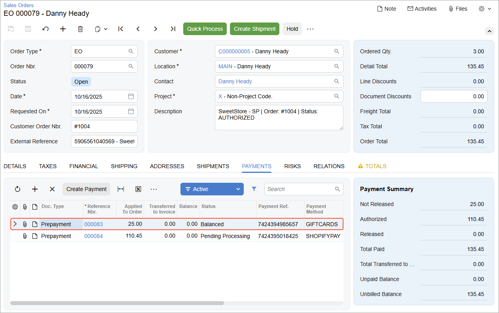

# Gift Cards: Process Activity {#_00b153fc-c613-4301-9168-a33234845149 .task}

In this activity, you will learn how to implement gift cards in the Shopify store and explore how gift cards can be used to pay, in full or in part, for an online purchase in the Shopify store.

**Attention:** The following activity is based on the *U100* dataset.

## Story { .section}

Suppose that SweetLife wants to give its online customers the ability to purchase gift cards and use these cards when purchasing goods in the SweetLife online store. As an implementation consultant, you need to configure the gift card functionality—that is, the ability to sell gift cards as items and use the cards as payment methods—and test it.

## Configuration Overview { .section}

In the *U100* dataset, for the purposes of this activity, on the [Non-Stock Items](IN_20_20_00.md) \(IN202000\) form, the *GIFTCERT* non-stock item has been created to represent gift cards sold in the online store. All purchases of gift cards in the online store will be recorded in Acumatica ERP as purchases of this item.

## Process Overview { .section}

You will do the following:

1.  In the admin area of the Shopify store, enable the gift card functionality and create gift cards in various amounts to be sold in the online store.
2.  On the storefront, purchase a gift card.
3.  In the admin area of the Shopify store, send the gift card to the customer.
4.  On the [Shopify Stores](BC_20_10_10.md) \(BC201010\) form, review the gift card settings.
5.  On the [Prepare Data](BC_50_10_00.md) \(BC501000\) form, prepare the sales order data for synchronization, and on the [Process Data](BC_50_15_00.md) \(BC501500\) form, process the prepared data.
6.  On the [Sales Orders](SO_30_10_00.md) \(SO301000\) form, review the imported sales order.
7.  On the storefront, create an order and pay part of it with the purchased gift card.
8.  In the admin area of the Shopify store, review the order.
9.  On the [Prepare Data](BC_50_10_00.md) form, prepare the sales order data for synchronization, and on the [Process Data](BC_50_15_00.md) form, process the prepared data.
10. On the [Sales Orders](SO_30_10_00.md) form, review the imported sales order that was partially paid for with the gift card.

## System Preparation { .section}

Before you start configuring the gift cards, do the following:

1.  Make sure the connection to the Shopify store is established and the minimum configuration is performed as described in [Initial Configuration: To Configure the Store Connection](Commerce_SP_Initial_Configuration_Implem_Activity.md).
2.  Make sure that the *PLUMJAM96* stock item has been exported to the Shopify store during the synchronization of the *Stock Item* entity, as described in [Data Synchronization: To Perform the First Synchronization](Commerce_SP_Data_Sync_Activity_First_Sync.md).
3.  Make sure that the integration with the Shopify Payments payment provider has been implemented, as described in [Order Synchronization: To Configure and Import Shopify Payments](Commerce_SP_Syncing_Orders_To_Use_Shopify_Payments.md).
4.  Sign in to the admin area of the Shopify store as the store administrator in the same browser.

## Step 1: Configuring Gift Cards in the Store { .section}

To enable the gift card functionality, in the Shopify store, do the following:

1.  In the left menu, click **Products** &gt; **Gift cards**.
2.  On the **Gift cards** page, click **Add gift card product**.
3.  On the **Create gift card product** page, specify the following settings:

    -   **Title**: `SweetStore Gift Card`
    -   **Status**: *Active*
    In the **Denominations** section, review the default balances of the gift cards \($10, $25, $50, and $100\). Leave all other settings as they are.

4.  In the lower right, click **Save gift card product** to save your changes.

## Step 2: Purchasing a Present and a Gift Card { .section}

To create an order in which you purchase a $25 gift card, in the Shopify store, do the following:

1.  In the left menu, hover over the **Online Store** sales channel, and click the **View your online store** icon, which appears right to the channel name, to open the storefront.
2.  On the storefront, locate the *SweetStore Gift Card* product.
3.  On the **SweetStore Gift Card** page, under **Denominations**, click *$25.00*, and then click **Add to cart**.
4.  In the upper right, click the cart icon, and in the **Cart** pop-up, click **Check out**.
5.  On the order creation page, which opens, specify the settings as follows:
    1.  In the **Contact** section, in the **Email or mobile phone number** box, specify your email address.

        **Important:** Specify a real email address to which you have access. The gift card will be sent to this email address after the order is completed.

    2.  In the **Payment** section, specify the following settings under **Credit card**:
        -   **Card number**: `4242 4242 4242 4242`
        -   **Expiration date**: `12/26`
        -   **Security code**: `123`
        -   **Name on card**: *Melody Keys*
    3.  In the **Billing address** section, fill in the address boxes as follows:
        -   **Country/region**: *United States*
        -   **First name**: `Melody`
        -   **Last name**: `Keys`
        -   **Address**: `3402 Angus Road`
        -   **City**: `New York`
        -   **State**: *New York*
        -   **ZIP code**: `10003`
6.  In the **Remember me** section, clear the **Save my information for a faster checkout** check box.
7.  Click **Pay now** to place and pay your order. The confirmation page with the order number opens.

## Step 3: Updating the Order Settings { .section}

To update the gift card settings, in Acumatica ERP, perform the following instructions:

1.  On the [Shopify Stores](../Shared/../UserGuide/BC_20_10_10.md) \(BC201010\) form, select the *SweetStore - SP* store.
2.  On the **Orders** tab, in the **Gift Certificate Item** box, select *GIFTCERT*.
3.  On the form toolbar, click **Save**.

## Step 4: Importing the Order with the Gift Card { .section}

To import the created order, in Acumatica ERP, do the following:

1.  On the [Prepare Data](../Shared/../UserGuide/BC_50_10_00.md) \(BC501000\) form, specify the following settings in the Summary area:
    -   **Store**: *SweetStore - SP*
    -   **Prepare Mode**: *Incremental*
2.  In the table, select the check box in the unlabeled column in the row of the *Sales Order* entity.
3.  On the form toolbar, click **Prepare**.
4.  In the **Processing** dialog box, which opens, click **Close** to close the dialog box.
5.  In the row of the *Sales Order* entity, click the link with the number of prepared synchronization records in the **Ready to Process** column.
6.  On the [Process Data](BC_50_15_00.md) \(BC501500\) form, which opens with the *SweetStore - SP* store and the *Sales Order* entity selected, in the row of the order you created \(which you can find by its identifier in the **External ID** column and empty **ERP ID**\), select the unlabeled check box.
7.  On the form toolbar, click **Process**.
8.  In the **Processing** dialog box, which opens, click **Close** to close the dialog box.

## Step 5: Reviewing the Imported Order { .section}

To review the details of the imported sales order in Acumatica ERP, do the following:

1.  On the [Sync History](BC_30_10_00.md) \(BC301000\) form, specify the following settings in the Summary area:
    -   **Store**: *SweetStore - SP*
    -   **Entity**: *Sales Order*
2.  In the Filter List drop-down menu above the table, select *Processed*.
3.  In the table, in the row of the sales order that you have just imported, click the link in the **ERP ID** column.
4.  On the [Sales Orders](SO_30_10_00.md) \(SO301000\) form, which opens for the imported order, review the order details.

    On the **Details** tab, notice the line with the *GIFTCERT* non-stock item, which you specified as the **Gift Certificate Item** on the **Orders** tab of the [Shopify Stores](BC_20_10_10.md) \(BC201010\) form. The **Line Description** column shows the description of the gift card in the Shopify store and the card denomination.

For the purposes of this activity, you do not need to process the created sales order further.

## Step 6: Sending the Gift Card to the Customer { .section}

To send the gift card to the customer, in the admin area of the Shopify store, do the following:

1.  In the left menu, click **Orders**.
2.  On the **Orders** page, which opens, click the row of the order for *Melody Keys* that you have created.
3.  In the **Unfulfilled** section with the *SweetStore Gift Card*, click **Send gift card**.
4.  On the **Fulfill item** page, which opens, click **Fulfill item**.

    An email with the gift card code is sent to the email address that you have specified earlier in this activity.

## Step 7: Updating the Payment Settings { .section}

To update the payment settings, in Acumatica ERP, perform the following instructions:

1.  On the [Shopify Stores](../Shared/../UserGuide/BC_20_10_10.md) \(BC201010\) form, select the *SweetStore - SP* store.
2.  On the **Payments** tab, in the existing row of the *GIFT\_CARD* store payment method, specify the following settings:
    -   **Active**: Selected
    -   **ERP Payment Method**: *GIFTCARDS*
    -   **Cash Account**: *10250ST*
3.  On the form toolbar, click **Save**.

## Step 8: Paying for the Order with the Gift Card { .section}

**Tip:** Before you perform this step, make sure that you have the code of the gift card ready.

To create an order and pay for part of it with the gift card, in the admin area of the Shopify store, do the following:

1.  In the left menu, hover over the **Online Store** sales channel, and click the **View your online store** icon, which appears right to the channel name, to open the storefront.
2.  On the storefront, start typing `plum` in the search bar and then select *Plum jam 96 oz* from the list of search results.
3.  On the page of *Plum jam 96 oz*, specify a quantity of *3*, and click **Add to cart**.
4.  In the upper right, click the cart icon, and in the **Cart** pop-up, click **Check out**.

    The order creation page opens.

5.  In the **Contact** section, in the **Email or mobile phone number** box, specify `dheady@example.com`.
6.  In the **Delivery** section, fill in the shipping address boxes as follows:
    -   **Country/region**: *United States*
    -   **First name**: `Danny`
    -   **Last name**: `Heady`
    -   **Address**: `2779 Cantebury Drive`
    -   **City**: `New York`
    -   **State**: *New York*
    -   **ZIP code**: `10005`
7.  In the **Shipping method** section, make sure that *Economy* is selected.
8.  In the **Payment** section, specify the following settings under **Credit card**:
    -   **Card number**: `4242 4242 4242 4242`
    -   **Expiration date**: `12/26`
    -   **Security code**: `123`
    -   **Name on card**: `Danny Heady` \(inserted by default\)
    -   **Use shipping address as billing address**: Selected
9.  In the **Remember me** section, clear the **Save my information for a faster checkout** check box.
10. In the **Gift card** box, enter the code of the gift card that you received, and click **Apply**.

    Notice that the order total has been reduced by the amount of the gift card \($25\).

    **Tip:** If you have not received the gift card by email, as a workaround, you can issue a new gift card on the **Gift cards** page, which you open by clicking **Products** &gt; **Gift cards** in the left menu of the admin area. To generate a new gift card code, you click **Create gift card** in the upper right, specify the card balance, specify the optional expiration date, and then click **Save**. Make sure to copy the generated gift card code because you will not be able to access it once you close the page.

11. Click **Pay now** to place and pay your order. The order confirmation page opens.

## Step 9: Reviewing the Sales Order { .section}

To review the sales order, in the admin area of the Shopify store, do the following:

1.  In the left menu, click **Orders**.
2.  On the **Orders** page, which opens, click the row of the order for *Danny Heady*.

    On the order details page, which opens, review the order details and notice the order number at the top of the page.

3.  In the **Timeline** section at the bottom of the page, expand the link of the gift card payment, and then expand the *Information from the gateway* link.

    Under **Gift card**, notice the identifier of the gift card; under **Gift card last characters**, notice the last four characters of the gift card that was used to pay the order.

## Step 10: Importing the Sales Order Paid with the Gift Card { .section}

To import the sales order, in Acumatica ERP, do the following:

1.  On the [Prepare Data](../Shared/../UserGuide/BC_50_10_00.md) \(BC501000\) form, specify the following settings in the Summary area:
    -   **Store**: *SweetStore - SP*
    -   **Prepare Mode**: *Incremental*
2.  In the table, select the check box in the unlabeled column in the row of the *Sales Order* entity.
3.  On the form toolbar, click **Prepare**.
4.  In the **Processing** dialog box, which opens, click **Close** to close the dialog box.
5.  In the row of the *Sales Order* entity, click the link in the **Ready to Process** column.
6.  On the [Process Data](BC_50_15_00.md) \(BC501500\) form, which opens with the *SweetStore - SP* and the *Sales Order* entity selected, in the row of the order you created \(which you can find by its identifier in the **External ID** column and empty **ERP ID**\), select the unlabeled check box.
7.  On the form toolbar, click **Process**.
8.  In the **Processing** dialog box, which opens, click **Close** to close the dialog box.

## Step 11: Reviewing the Imported Sales Order { .section}

To review the settings of the imported sales order, do the following:

1.  On the [Sync History](BC_30_10_00.md) \(BC301000\) form, specify the following settings in the Summary area:
    -   **Store**: *SweetStore - SP*
    -   **Entity**: *Sales Order*
2.  In the Filter List drop-down menu above the table, select *Processed*.
3.  In the table, in the row of the sales order that you have just imported, click the link in the **ERP ID** column.
4.  On the [Sales Orders](SO_30_10_00.md) \(SO301000\) form, which opens in a pop-up window, review the settings of the order, as shown in the following screenshot.

    

    On the **Payments** tab, notice that two prepayments have been applied to the order: a credit card payment \(mapped to the *SHOPIFYPAY* payment method\) in the amount of $110.45 and a gift card payment \(mapped to the *GIFTCARDS* payment method\) in the amount of $25.

5.  In the row of the gift card payment, which has an applied amount of $25, click the link in the **Reference Nbr.** column.

    On the [Payments and Applications](AR_30_20_00.md) \(AR302000\) form, which opens in a pop-up window, review the payment details.

    Notice that the **Description** box contains the order number assigned to the related order in the Shopify store and the identifier of the gift card used to pay the order.

    The prepayment has the *Balanced* status because the **Release Payments and Refunds** check box was cleared in the mapping of the *GIFT\_CARD* payment method in the table on the **Payments** tab of the [Shopify Stores](BC_20_10_10.md) \(BC201010\) form.

6.  Close the pop-up windows with the [Payments and Applications](AR_30_20_00.md) and [Sales Orders](SO_30_10_00.md) forms.

You have finished processing a payment for the sales order with a gift certificate. In a production setting, you would release the prepayment, which is beyond the scope of this activity.

**Parent topic:**[Selling and Accepting Gift Cards](../UserGuide/Commerce_SP_Gift_Cards_Mapref.md)

