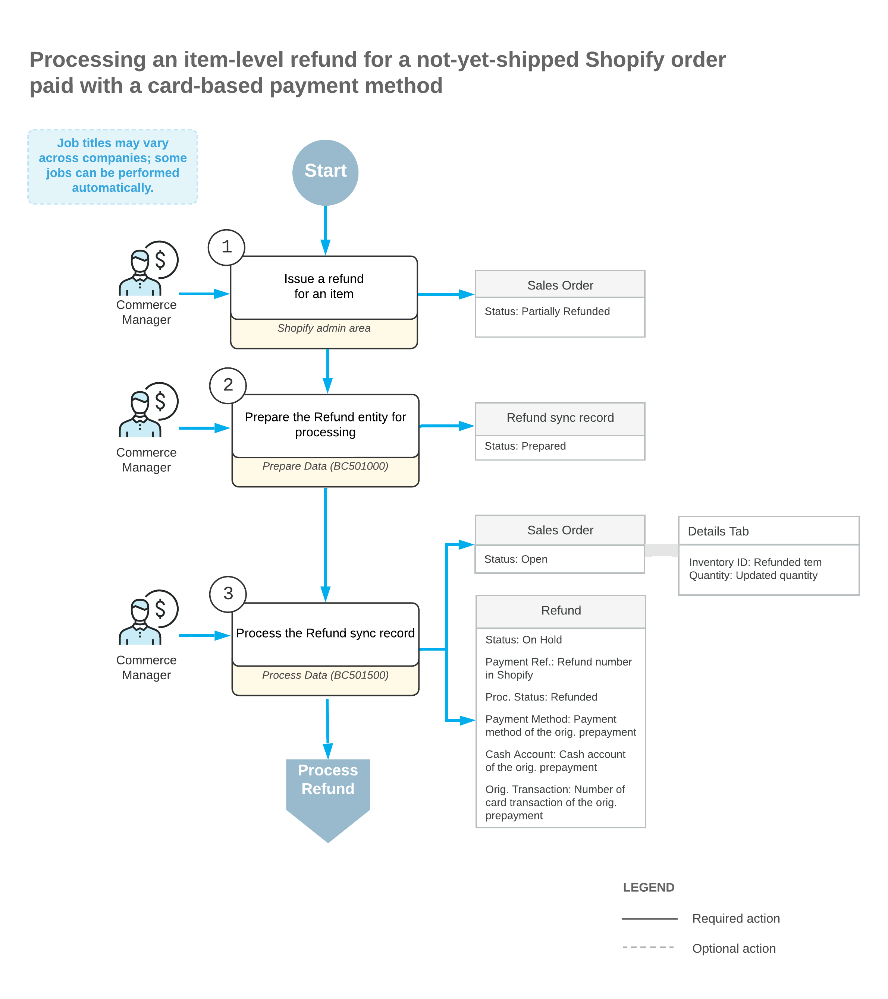
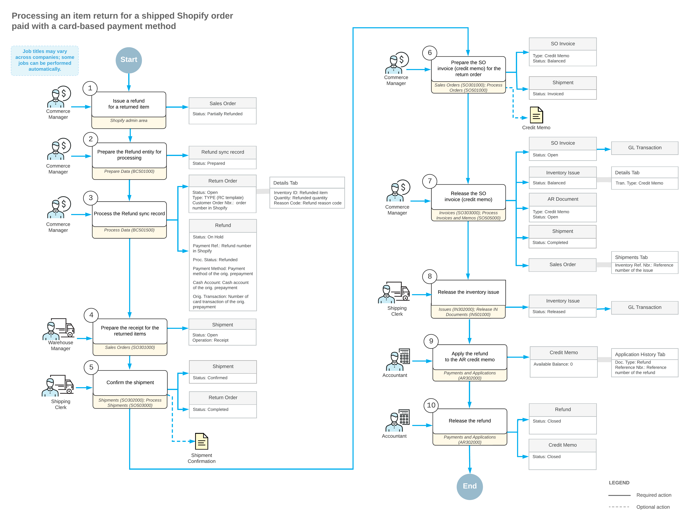

# Importing Card Refunds: Item-Level Refunds {#_afcffbcc-34e8-4a64-903e-d3ea1130249b .concept}

A refund of an ordered item may be issued if, for example, a customer wants to amend the order to decrease the quantity of a purchased item or because they want to return the item whose condition or performance is unsatisfactory.

## Import of Refunds for Not-Yet-Shipped Orders { .section}

During the import of item refunds, if the original sales order has not been shipped \(that is, it has the *Open* or *On Hold* status on the [Sales Orders](SO_30_10_00.md) \(SO301000\) form\), the following actions occur:

-   In the original sales order, on the **Details** tab of the [Sales Orders](SO_30_10_00.md) form, the system updates the order line or lines to decrease the item quantities. Discounts and taxes, if applied, are recalculated accordingly.
-   If the processing status of the original payment is *Captured*, the system creates a payment of the *Refund* type in the refunded amount on the [Payments and Applications](AR_30_20_00.md) \(AR302000\) form, assigns it the *Closed* status, and applies it to the original payment.
-   If the original payment is refunded in full, it is assigned the *Closed* status.
-   If the sales order is fully refunded or canceled and the processing status of the original payment is *Authorized*, then the original payment is voided.

The following diagram illustrates the processing of an item return for a card-based payment method that is issued before the sales order has been shipped.

## Import of Refunds for Fully Shipped Orders { .section}

If the original sales order has been fully shipped \(that is, it has the *Completed* status on the [Sales Orders](SO_30_10_00.md) \(SO301000\) form\) and the processing status of the original payment is *Open* or *Closed* on the [Payments and Applications](AR_30_20_00.md) \(AR302000\) form, the following actions occur when an item refund is being imported to Acumatica ERP:

-   On the [Sales Orders](SO_30_10_00.md) form, the system creates a return order of the type that was specified in the **Return Order Type** box on the **Orders** tab of the [Shopify Stores](BC_20_10_10.md) \(BC201010\) form. In the **External Reference** box of the Summary area, the system inserts the identifier of the refund in the Shopify store.
-   In the return order, on the **Details** tab of the [Sales Orders](SO_30_10_00.md) form, the system inserts a line with the applicable quantity of the returned item. In the **Reason Code** column, the system inserts the reason code that was specified on the **Orders** tab of the [Shopify Stores](BC_20_10_10.md) form.
-   If the processing status of the original payment is *Captured*, the system creates a payment of the *Refund* type in the refunded amount on the [Payments and Applications](AR_30_20_00.md) form, and links it to the return order.
-   If the processing status of the original payment is *Authorized*, then the original payment is voided.

The following diagram illustrates the processing of an item return for a card-based payment method that is issued after the sales order has been fully shipped.

## Import of Refunds for Partially Shipped Orders { .section}

When an item refund that has been issued for a partially shipped order is being imported from Shopify to Acumatica ERP, the following actions occur:

-   For a not-yet-shipped item, the system adjusts the item quantity in the original sales order on the [Sales Orders](SO_30_10_00.md) \(SO301000\) form.
-   The system creates a refund for the full order amount on the [Payments and Applications](AR_30_20_00.md) \(AR302000\) form, and applies the part of the refund amount related to the not-yet-shipped items to the original payment.
-   For a shipped item, the system creates a return order on the [Sales Orders](SO_30_10_00.md) form. You have to process the order manually, create and release a credit memo, and apply the refund to the credit memo.
-   The original payment assigned the *Closed* status if an invoice has been already created for the shipped items and released.

The process is similar to the import of item refunds for not-yet-shipped orders and the import of item refunds for fully shipped orders, which are described in the sections above.

**Important:** To avoid issues with the import of refunds for partially shipped orders, make sure to select the **Restock item** check box when you initiate a return of an item in the Shopify store.

**Parent topic:**[Importing Card Refunds](../UserGuide/Commerce_SP_Importing_CC_Refunds_Mapref.md)

