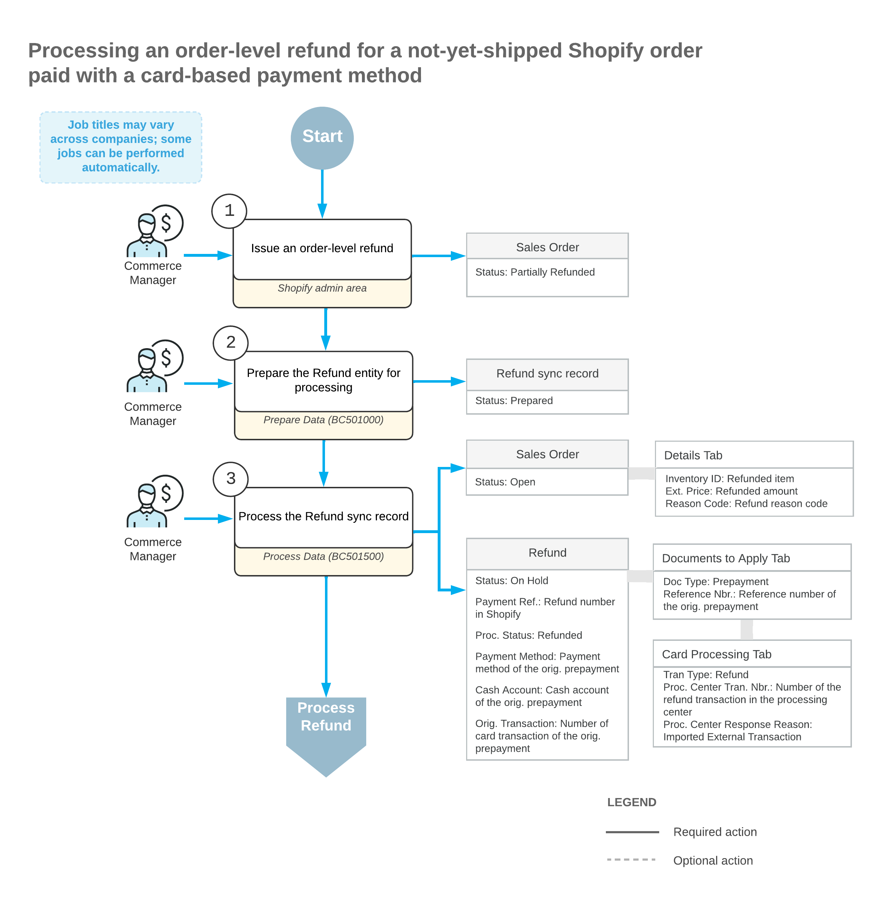
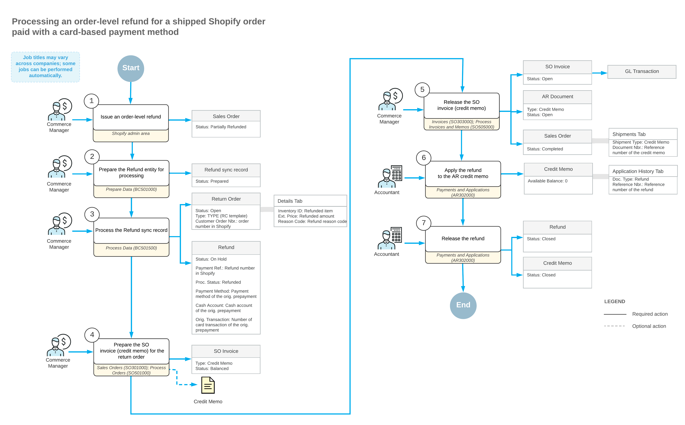

# Importing Card Refunds: Order-Level Refunds {#_02da9cb0-9c1e-40a3-8197-161647bee64b .concept}

An order-level refund may be issued, for example, if a customer has been overcharged or is not content with the quality of the product or service and needs to be partially reimbursed.

## Import of Order-Level Refunds for Not-Yet-Shipped Orders { .section}

During the import of refunds on order amounts, if the original sales order has not been shipped \(that is, it has the *Open* or *On Hold* status on the [Sales Orders](SO_30_10_00.md) \(SO301000\) form\), the system does the following:

-   On the [Payments and Applications](AR_30_20_00.md) \(AR302000\) form, the system creates a payment of the *Refund* type in the refunded amount and applies it to the original payment. If the sales order is fully refunded or canceled and the processing status of the original payment is *Authorized*, the original payment is voided.
-   In the original sales order, on the **Details** tab of the [Sales Orders](SO_30_10_00.md) form, the system inserts a line for the non-stock item that was specified in the **Refund Amount Item** box on the **Orders** tab of the [Shopify Stores](BC_20_10_10.md) \(BC201010\) form. In the **Unit Price** and **Ext. Price** columns, the system inserts the reversed refund amount \(that is, the amount with the minus sign\). In the **Reason Code** column, the system inserts the reason code that was specified on the **Orders** tab of the [Shopify Stores](BC_20_10_10.md) form.

The following diagram illustrates the processing of an order-level refund for a card-based payment method that is issued before the sales order has been shipped.

## Import of Order-Level Refunds for Shipped Orders { .section}

If the original sales order has been fully shipped \(that is, it has the *Completed* status on the [Sales Orders](SO_30_10_00.md) \(SO301000\) form\), the following actions occur when an order-level refund is being imported to Acumatica ERP:

-   On the [Sales Orders](SO_30_10_00.md) form, the system creates a return order of the type selected in the **Return Order Type** box on the **Orders** tab of the [Shopify Stores](BC_20_10_10.md) form. In the **External Reference** box of the Summary area, the system inserts the identifier of the refund in the Shopify store.
-   In the return order, on the **Details** tab, the system inserts a line with the non-stock item that was specified in the **Refund Amount Item** box on the **Orders** tab of the [Shopify Stores](BC_20_10_10.md) form. In the **Unit Price** and **Ext. Price** columns, the system inserts the refund amount. In the **Reason Code** column, the system inserts the reason code that was specified on the **Orders** tab of the [Shopify Stores](BC_20_10_10.md) form.
-   On the [Payments and Applications](AR_30_20_00.md) \(AR302000\) form, creates a payment of the *Refund* type in the refunded amount and links it to the return order.

The following diagram illustrates the processing of an order-level refund for a card-based payment method that is issued after the sales order has been shipped.

**Parent topic:**[Importing Card Refunds](../UserGuide/Commerce_SP_Importing_CC_Refunds_Mapref.md)

