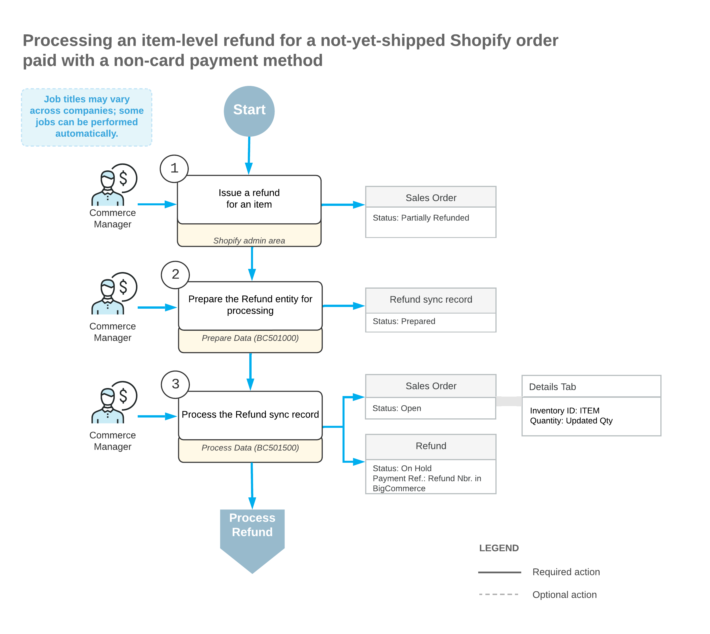
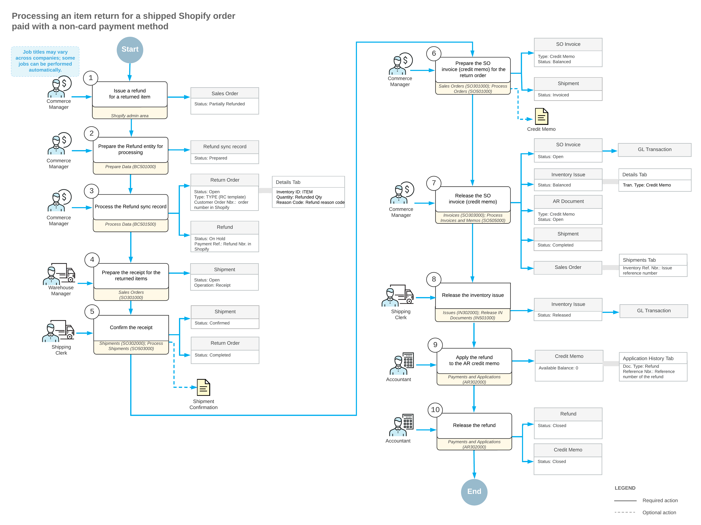

# Importing Non-Card Refunds: Item-Level Refunds {#_4f03b496-b8dc-4fad-85b5-0258a87b7922 .concept}

An item-level refund may be issued if, for example, a customer wants to amend a not-yet-shipped order to decrease the quantity of a purchased item or because they want to return the item whose condition or performance is unsatisfactory.

## Import of Item Refunds for Not-Yet-Shipped Orders { .section}

During the import of item refunds, if the original sales order that has not been shipped \(that is, that has the *Open* or *On Hold* status of the [Sales Orders](SO_30_10_00.md) \(SO301000\) form\), the following actions occur:

-   On the [Payments and Applications](AR_30_20_00.md) \(AR302000\) form, the system creates a payment of the *Refund* type in the refunded amount and applies it to the original payment.
-   In the original sales order, on the **Details** tab of the [Sales Orders](SO_30_10_00.md) form, the system updates the order line or lines to decrease the item quantities. If discounts and taxes have been applied, they are recalculated accordingly.

The following diagram illustrates the processing of an item refund for a non-card payment method when the refund is issued before the sales order has been shipped.

## Import of Item Refunds for Fully Shipped Orders { .section}

If the original sales order has been shipped in full \(that is, it has the *Completed* status on the [Sales Orders](SO_30_10_00.md) form\), the following actions occur when an item refund is being imported to Acumatica ERP:

-   On the [Sales Orders](SO_30_10_00.md) form, the system creates a return order of the type that was specified in the **Return Order Type** box on the **Orders** tab of the [Shopify Stores](BC_20_10_10.md) form. In the **External Reference** box of the Summary area, the system inserts the identifier of the refund that is used in the Shopify store.
-   In the return order, on the **Details** tab, the system inserts a line with the applicable quantity of the returned item. In the **Reason Code** column, the system inserts the reason code that was specified on the **Orders** tab of the [Shopify Stores](BC_20_10_10.md) form.
-   On the [Payments and Applications](AR_30_20_00.md) \(AR302000\) form, creates a payment of the *Refund* type in the refunded amount and links it to the return order.

The following diagram illustrates the processing of an item return for non-card payment methods when the refund is issued after the sales order has been fully shipped.

## Import of Refunds for Partially Shipped Orders { .section}

When an item refund that has been issued for a partially shipped order is being imported from Shopify to Acumatica ERP, the following actions occur:

-   For not-yet-shipped items, the system adjusts the item quantity in the original sales order on the [Sales Orders](SO_30_10_00.md) \(SO301000\) form, creates a refund on the [Payments and Applications](AR_30_20_00.md) \(AR302000\) form, and applies the refund to the original payment.
-   For shipped items, the system creates a return order on the [Sales Orders](SO_30_10_00.md) form and a refund on the [Payments and Applications](AR_30_20_00.md) form, and applies the refund to the return order.

The process is similar to the import of item refunds for not-yet-shipped orders and the import of item refunds for fully shipped orders, which are described in the sections above.

**Important:** To avoid issues with the import of refunds for partially shipped orders, make sure to select the **Restock item** check box when you initiate a return of an item in the Shopify store.

**Parent topic:**[Importing Non-Card Refunds](../UserGuide/Commerce_SP_Importing_nonCC_Refunds_Mapref.md)

