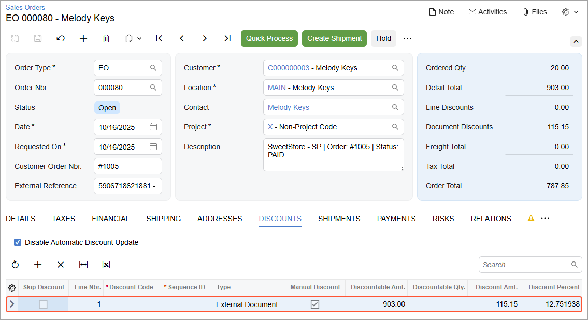

# Import of Orders with Discounts: Process Activity {#_9995da67-5dda-4ca4-861a-4b7e8da94661 .task}

The following activity will walk you through the process of importing orders that contain items with discounts.

**Attention:** The following activity is based on the *U100* dataset.

## Story { .section}

Suppose that the SweetLife sales manager decided to offer discounts for some of the products that the company sells in its Shopify store. Starting from today, the company provides the following discounts:

-   A 10% discount on the purchase of a 96-ounce jar of plum jam
-   A five-dollar discount on the purchase of a 96-ounce jar of banana jam
-   An additional discount in the amount of $20 for the orders of $500 or more

As SweetLife's implementation consultant, you need to create an order with discounts of multiple types, import it to Acumatica ERP, and then explore how the applied discounts are displayed in the imported order.

## Configuration Overview {#section_tz4_djx_cnb .section}

In the *U100* dataset, for the purposes of this activity, the *PLUMJAM96* and *BANJAM96* stock items have been created on the [Stock Items](IN_20_25_00.md) \(IN202500\) form.

## Process Overview { .section}

In this activity, you will do the following:

1.  On the [Enable/Disable Features](CS_10_00_00.md) \(CS100000\) form, activate the *Customer Discounts* feature.
2.  On the [Shopify Stores](BC_20_10_10.md) \(BC201010\) form, review the discount-related settings.
3.  In the admin area, create an order and apply multiple discounts to it.
4.  On the [Prepare Data](BC_50_10_00.md) \(BC501000\) form, prepare the sales order data for synchronization; on the [Process Data](BC_50_15_00.md) \(BC501500\) form, process the sales order data prepared for synchronization.
5.  On the [Sales Orders](SO_30_10_00.md) \(SO301000\) form, review the imported sales order and applied discount.

## System Preparation { .section}

Before you complete the instructions in this activity, do the following:

1.  Make sure that the following prerequisites have been met:
    -   The Shopify store has been created and configured, as described in [Initial Configuration: To Set Up a Shopify Store](Commerce_SP_Initial_Configuration_To_Set_Up_a_Shopify_Store.md).
    -   The connection to the Shopify store has been established and the initial configuration has been performed, as described in [Initial Configuration: To Configure the Store Connection](Commerce_SP_Initial_Configuration_Implem_Activity.md).
    -   Make sure that the *PLUMJAM96* and *BANJAM96* stock items have been exported to the Shopify store during the synchronization of the *Stock Item* entity, as described in [Data Synchronization: To Perform the First Synchronization](Commerce_SP_Data_Sync_Activity_First_Sync.md).
    -   Make sure that the integration with the Shopify Payments payment provider has been implemented, as described in [Order Synchronization: To Configure and Import Shopify Payments](Commerce_SP_Syncing_Orders_To_Use_Shopify_Payments.md).
2.  Launch the Acumatica ERP website with the *U100* dataset preloaded, and sign in with the following credentials:
    -   **Username**: *gibbs*
    -   **Password**: *123*
3.  Open the [Enable/Disable Features](CS_10_00_00.md) \(CS100000\) form.
4.  On the form toolbar, click **Modify**, and select the **Customer Discounts** check box under **Advanced Financials**.
5.  On the form toolbar, click **Enable**.
6.  Sign in to the admin area of the Shopify store as the store administrator in the same browser.

## Step 1: Configuring Discount-Related Settings { .section}

To update the store settings for the import of online orders with discounts, in Acumatica ERP, do the following:

1.  On the [Shopify Stores](../Shared/../UserGuide/BC_20_10_10.md) \(BC201010\) form, select the *SweetStore - SP* store.
2.  On the **Orders** tab \(**Order** section\), in the **Show Discounts As** box, select *Document Discounts*.

    With this option selected, the system aggregates discounts applied to particular lines of the order in the Shopify store and displays these discounts at the document level in the imported sales orders—that is, on the **Discounts** tab of the [Sales Orders](SO_30_10_00.md) \(SO301000\) form.

3.  On the form toolbar, click **Save**.

## Step 2: Creating a Sales Order { .section}

To create an order for ten 96-ounce jars of plum jam and ten 96-ounce jars of banana jam, in the Shopify admin area, do the following:

1.  In the left menu, click **Orders**.
2.  On the **Orders** page, which opens, in the upper right, click **Create order**.

    The **Create order** page opens.

3.  To add ten 96-ounce jars of plum jam to the order, do the following:
    1.  In the **Products** section, start typing `plum jam` in the search bar.
    2.  In the **All products** dialog box, which opens with the search results, select the unlabeled check box in the row with the *Plum jam 96 oz* product, and click **Add**.
    3.  In the row of the *Plum jam 96 oz* product, change the quantity to `10`.
4.  To add ten 96-ounce jars of banana jam to the order, do the following:
    1.  In the **Products** section, start typing `banana jam` in the search bar.
    2.  In the **All products** dialog box, select the unlabeled check box in the row with the *Banana jam 96 oz*, and click **Add**.
    3.  In the row of the *Banana jam 96 oz* product, change the quantity to `10`.
5.  In the **Customer** section, click in the search bar and in the menu that opens, select *Melody Keys*.
6.  To add a 10% discount on the purchase of a 96-ounce jar of plum jam, do the following:

    1.  In the **Products** section, click the price of the *Plum jam 96 oz* product \(*$45.15*\).
    2.  In the **Add discount** dialog box, which opens, in the **Discount type** box, select *Percentage*, in the **Value \(per unit\)** box, enter `10`, and click **Done**.
    Notice that the discount has been applied and the product price has changed to *$40.64*.

7.  To add a $5 discount on the purchase of a 96-ounce jar of banana jam, do the following:

    1.  In the **Products** section, click the price of the *Banana jam 96 oz* product \(also *$45.15*\).
    2.  In the **Add discount** dialog box, which opens, in the **Discount type** box, leave *Amount*, in the **Value \(per unit\)** box, enter `5`, and click **Done**.
    Notice that the discount has been applied and the product price has changed to *$40.15*.

8.  To add an additional discount in the amount of $20 for orders of $500 or more, do the following:

    1.  In the **Payment** section, click **Add discount** to add an order-level discount.
    2.  In the **Add discount** dialog box, which opens, specify the following settings:
        -   **Add custom order discount**: Selected
        -   **Discount type**: *Amount* \(selected by default\)
        -   **Value**: `20`
    3.  Click **Done**.

        The system closes the dialog box and applies the $20 discount to the order.

    For the purposes of this activity, assume that the payment was received outside Shopify.

9.  In the **Payment** section, click **Collect payment** &gt; **Mark as paid**.
10. In the **Mark as paid** dialog box, which opens, click **Create order**.

    The system closes the dialog box and creates the order. At the top of the page, notice that the system has assigned the order an order number, the *Paid* payment status, and the *Unfulfilled* fulfillment status.

You have created an order and applied two line-level discounts and one order-level discount to it. In the next step, you will import this order to Acumatica ERP.

## Step 3: Importing the Sales Order { .section}

To import the sales order, in Acumatica ERP, do the following:

1.  On the [Prepare Data](../Shared/../UserGuide/BC_50_10_00.md) \(BC501000\) form, specify the following settings in the Summary area:
    -   **Store**: *SweetStore - SP*
    -   **Prepare Mode**: *Incremental*
2.  In the table, select the check box in the unlabeled column in the row of the *Sales Order* entity.
3.  On the form toolbar, click **Prepare**.
4.  In the **Processing** dialog box, which opens, click **Close** to close the dialog box.
5.  In the row of the *Sales Order* entity, click the link with the number of prepared synchronization records in the **Ready to Process** column.
6.  On the [Process Data](BC_50_15_00.md) \(BC501500\) form, which opens with the *SweetStore - SP* store and the *Sales Order* entity selected, in the row of the order you created \(which you can find by its identifier in the **External ID** column and empty **ERP ID**\), select the unlabeled check box.
7.  On the form toolbar, click **Process**.
8.  In the **Processing** dialog box, which opens, click **Close** to close the dialog box.

## Step 4: Reviewing the Discount in the Imported Sales Order { .section}

To review how the discount is displayed in the imported sales order, do the following:

1.  On the [Sync History](BC_30_10_00.md) \(BC301000\) form, specify the following settings in the Summary area:
    -   **Store**: *SweetStore - SP*
    -   **Entity**: *Sales Order*
2.  In the Filter List drop-down menu above the table, select *Processed*.
3.  In the table, in the row of the sales order that you have just imported, click the link in the **ERP ID** column.
4.  On the [Sales Orders](SO_30_10_00.md) \(SO301000\) form, which opens in a pop-up window, review the settings of the sales order.

    On the **Details** tab, notice that in the **Discount Amount** and **Discount Percent** columns, the system has inserted zeros in both lines.

    On the **Discounts** tab, notice that a single row has been added, as shown in the following screenshot. The *External Document* type in the **Type** column reflects the fact that the discounts were imported from an external system. The values in the **Discount Amt.** and **Discount Percent** columns reflect the discounts applied in the Shopify store.

    

5.  Close the pop-up window with the [Sales Orders](SO_30_10_00.md) form.

You have created an order with discounts of various types in the Shopify store, explored how they are applied to an order in the store, and reviewed how they are displayed in the order after it has been imported to Acumatica ERP.

**Parent topic:**[Importing Orders with Discounts](../UserGuide/Commerce_SP_Orders_with_Discounts_Mapref.md)

