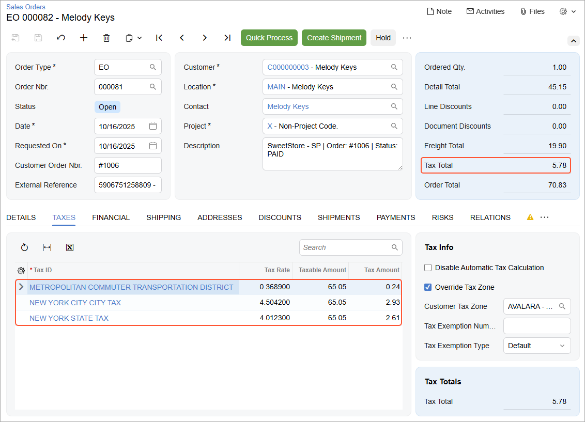

# Import of Taxes: To Set Up Tax Synchronization {#_2775fb2a-220c-439f-8826-255c08d9bed1 .task}

The following activity will walk you through the process of setting up the synchronization of taxes between the Shopify store and Acumatica ERP.

**Attention:** The following activity is based on the *U100* dataset.

## Story { .section}

Suppose that SweetLife is using Acumatica ERP and Avalara AvaTax for calculating and reporting taxes on the goods and services it sells. The company currently sells products and needs to collect taxes only in New York State.

As an implementation consultant helping SweetLife to set up a Shopify store, you need to set up the tax calculation in the store for New York State and then make sure that the taxes calculated for online orders appear correctly in sales orders imported to Acumatica ERP.

## Configuration Overview {#section_tz4_djx_cnb .section}

For the purposes of this activity, a company profile has been defined for SweetLife in an Avalara AvaTax sandbox account.

In the *U100* dataset, the following tasks have been performed to support this activity:

-   On the [Tax Providers](TX_10_20_00.md) \(TX102000\) form, the *AVALARA* tax provider has been created, a connection to the Avalara AvaTax account has been established, and the SweetLife branches have been mapped to a company profile defined for SweetLife in the AvaTax account.
-   On the [Tax Zones](TX_20_60_00.md) \(TX206000\) form, the *AVALARA* tax zone has been defined.
-   On the [Tax Categories](TX_20_55_00.md) \(TX205500\) form, the *TAXABLE* and *EXEMPT* tax categories have been defined. These tax categories have been assigned to item classes on the [Item Classes](IN_20_10_00.md) \(IN201000\) form, and to individual stock and non-stock items on the [Stock Items](IN_20_25_00.md) \(IN202500\) and [Non-Stock Items](IN_20_20_00.md) \(IN202000\) forms, respectively.
-   On the **General** tab of the [Order Types](SO_20_10_00.md) \(SO201000\) form, for the *EO - eCommerce Order* order template, the **Disable Automatic Tax Calculation** check box \(the **Order Settings** section\) has been cleared.

## Process Overview { .section}

In this activity, you will do the following:

1.  In the admin area of the Shopify store, review the tax regions where you will collect sales tax on products sold to customers.
2.  On the [Enable/Disable Features](CS_10_00_00.md) \(CS100000\) form, enable the *External Tax Calculation Integration* feature.
3.  On the [Tax Categories](TX_20_55_00.md) \(TX205500\) and [Tax Zones](TX_20_60_00.md) \(TX206000\) forms, review some of the tax-related entities that have been predefined in the *U100* dataset.
4.  On the [Shopify Stores](BC_20_10_10.md) \(BC201010\) form, specify the tax synchronization settings for your Shopify store.
5.  On the [Substitution Lists](SM_20_60_26.md) \(SM206026\) form, review the mapping of tax categories between Acumatica ERP and the Shopify store.
6.  On the [Entities](BC_20_20_00.md) \(BC202000\) form, update the export filtering settings to include stock items of one more item class.
7.  On the [Prepare Data](BC_50_10_00.md) \(BC501000\) form, prepare the stock item data for synchronization; on the [Process Data](BC_50_15_00.md) \(BC501500\) form, process the prepared data.
8.  Review the exported items in the admin area of the Shopify store.
9.  To make sure that the tax applied to a sales order in the Shopify store is imported to Acumatica ERP correctly, create an online order in the admin area of the Shopify store.
10. Import the sales order to Acumatica ERP by using the [Prepare Data](BC_50_10_00.md) and [Process Data](BC_50_15_00.md) forms.
11. On the [Sales Orders](SO_30_10_00.md) \(SO301000\) form, review the imported sales order.

## System Preparation { .section}

Do the following:

1.  Make sure the connection to the Shopify store is established and the minimum configuration is performed as described in the prerequisite activity, [Initial Configuration: To Configure the Store Connection](Commerce_SP_Initial_Configuration_Implem_Activity.md).
2.  Make sure that the customers of the *DEFAULT* customer class have been exported to the Shopify store.
3.  Make sure that the integration with the Shopify Payments payment provider has been implemented, as described in [Order Synchronization: To Configure and Import Shopify Payments](Commerce_SP_Syncing_Orders_To_Use_Shopify_Payments.md).
4.  Sign in to the admin area of the Shopify store as the store administrator in the same browser.

## Step 1: Configuring Sales Tax Collection in the Shopify Store { .section}

To make sure that tax collection is set up in your store for New York State, in the Shopify store, do the following:

1.  In the bottom of the left menu, click **Settings**.
2.  In the left menu of the page that opens, click **Taxes and duties**.
3.  On the **Taxes and duties** page, which opens, in the **Regional settings** section, click the line with the *United States* region in the table.

    **Tip:** If you do not see the needed region in the table, turn the list of regions with the arrow buttons below the table.

    On the page that opens, notice that *Shopify Tax* is displayed in the **Tax service** section.

4.  In the **States you’re collecting in** section, click **Collect in new state**.
5.  In the **Set up tax collected** dialog box, which opens, in the **Region** box, select *New York*.
6.  Click **Collect taxes** to save your changes and close the dialog box.

## Step 2: Enabling the Needed Feature { .section}

To enable the *External Tax Calculation Integration* feature, which is required for integration of Acumatica ERP with Avalara AvaTax, in Acumatica ERP, do the following:

1.  Open the [Enable/Disable Features](CS_10_00_00.md) \(CS100000\) form.
2.  On the form toolbar, click **Modify**.
3.  Under **Third-Party Integrations**, select the **External Tax Calculation Integration** check box.
4.  On the form toolbar, click **Enable**.

## Step 3: Reviewing the Tax Configuration in Acumatica ERP { .section}

To review the tax configuration that has been predefined in Acumatica ERP, do the following:

1.  Open the Tax Categories \(TX2055PL\) form.

    Notice that there are only two tax categories listed in the table \(*TAXABLE* and *EXEMPT*\). Tax categories in Acumatica ERP determine whether exported products will be taxable or nontaxable in the Shopify store. In the following steps, you will review how these categories are mapped between Acumatica ERP and the Shopify store.

2.  On the [Tax Zones](TX_20_60_00.md) \(TX206000\) form, select the *AVALARA* tax zone.

    Notice that the **External Tax Provider** check box is selected in the Summary area, which indicates that this tax zone is used for setting up tax calculation by using an external tax provider, and *AVALARA* is selected as the tax provider.

## Step 4: Configuring Tax Synchronization { .section}

To configure the synchronization of taxes between Acumatica ERP and the Shopify store, in Acumatica ERP, do the following:

1.  On the [Shopify Stores](BC_20_10_10.md) \(BC201010\) form, select the *SweetStore - SP* store.
2.  On the **Orders** tab \(**Taxes** section\), specify the following settings:

    -   **Tax Synchronization**: Selected
    -   **Default Tax Zone**: *AVALARA*
    -   **Use as Primary Tax Zone**: Selected
    With these settings specified, a sales order placed in the Shopify store will be imported to Acumatica ERP with sales taxes that have been calculated for the order in the Shopify store. Because the *AVALARA* tax zone has been selected as the primary tax zone, the taxes will be recalculated by the Avalara AvaTax service.

    Note that the *EO* order type has been set up to recalculate taxes in the orders on invoice creation.

3.  In the **Substitution Lists** section, note the substitution lists used for taxes \(*SPCTAXCODES*\) and tax categories \(*SPCTAXCLASSES*\). These substitution lists are predefined and are inserted as the default values in these boxes.

    **Tip:** For the purposes of this activity, you do not need to change the selected values. However, in a production environment, you can create other substitution lists on the [Substitution Lists](SM_20_60_26.md) \(SM206026\) form and specify them in these boxes.

4.  On the form toolbar, click **Save** to save your changes.

## Step 5: Reviewing the Substitution List for Tax Categories { .section}

To make sure that stock and non-stock items exported from Acumatica ERP are assigned the correct tax category in the Shopify store, do the following:

1.  Open the [Substitution Lists](SM_20_60_26.md) \(SM206026\) form.
2.  In the **Substitution List** box, select *SPCTAXCLASSES*.

    Notice that the table contains two rows, shown in the following table.

    |Original Value|Substitution Value|
    |--------------|------------------|
    |*TAXABLE*|*TRUE*|
    |*EXEMPT*|*FALSE*|

    With these settings, non-stock and stock items that have the *TAXABLE* tax category in Acumatica ERP, after being exported, have the **Charge tax on this product** check box selected, and items with the *Exempt* tax category have the same check box cleared.

    **Important:** This mapping affects only the export of stock and non-stock items. If the state of the check box is changed for a product in the Shopify store and then a sales order with this item is placed and imported to Acumatica ERP, the tax category that appears in the sales order is copied from the **Tax Category** box of the **General** tab of the [Stock Items](IN_20_25_00.md) \(IN202500\) or [Non-Stock Items](IN_20_20_00.md) \(IN202000\) form \(depending on the type of the item\). When taxes are recalculated in Acumatica ERP, there might be discrepancies between the order tax amount in the Shopify store and the tax amount calculated in Acumatica ERP. To avoid these discrepancies, make sure that the same changes are made to product tax settings in both systems \(that is, that products are synchronized in a timely manner\).

## Step 6: Updating the Export Filter for Stock Items { .section}

To verify that stock items are exported to the Shopify store with the correct tax category, you need to synchronize \(or resynchronize\) them between the two systems. Before you do it, you need to update the filter for stock items so that more stock items are synchronized with the Shopify store \(in this step, you will add stock items of the *JUICER* item class\). Do the following:

1.  On the [Entities](BC_20_20_00.md) \(BC202000\) form, specify the following settings in the Summary area:
    1.  **Store Name**: *SweetStore - SP*
    2.  **Entity**: *Stock Item*
2.  On the **Export Filtering** tab, update the filtering conditions by adding one more line and specifying the settings described in the following table:

    |Active|Opening Brackets|Field Name|Condition|Value|Closing Brackets|Operator|
    |------|----------------|----------|---------|-----|----------------|--------|
    |Selected|*\(*|*Item Class*|*Equals*|`Jam`|-|*Or*|
    |Selected|-|*Item Class*|*Equals*|`Juicer`|\)|*And*|

3.  On the form toolbar, click **Save**.

## Step 7: Exporting the Stock Items { .section}

1.  On the [Prepare Data](BC_50_10_00.md) \(BC501000\) form, specify the following settings in the Summary area:
    -   **Store**: *SweetStore - SP*
    -   **Prepare Mode**: *Full*
    -   **Date Range**: Cleared
2.  In the table, select the check box in the unlabeled column in the row of the *Stock Item* entity.
3.  On the form toolbar, click **Prepare**.
4.  In the **Processing** dialog box, which opens, click **Close** to close the dialog box.
5.  In the row of the *Stock Item* entity, click the link in the **Ready to Process** column.
6.  On the [Process Data](BC_50_15_00.md) \(BC501500\) form, which opens with the *SweetStore - SP* store and the *Stock Item* entity selected, click **Process All** on the form toolbar.
7.  In the **Processing** dialog box, which opens, click **Close** to close the dialog box.

## Step 8: Viewing the Synchronized Stock Items in the Store { .section}

To review the items that have been synchronized between Acumatica ERP and the Shopify store and verify that they have been exported to the Shopify store with the correct tax category, in the Shopify admin area, do the following:

1.  In the left menu, click **Products**.
2.  On the **Products** page, click the row of the *Commercial citrus juicer with a production rate of 2 liters per minute* product.
3.  On the product management page, which opens for the *Commercial citrus juicer with a production rate of 2 liters per minute* product, in the **Price** section, at the bottom right, click the arrow-down icon to expand the section. Review the product details.

    Notice that the **Charge tax on this product** check box is cleared. The system assigned this tax category to the product because the *JUICER20C* stock item is assigned the *EXEMPT* tax category in Acumatica ERP.

4.  In the left menu, click **Products** to return to the **Products** page.
5.  On the **Products** page, click the row of the *Kiwi jam 96 oz* product.
6.  On the product management page, which opens for the *Kiwi jam 96 oz* product, review the product details.

    Notice that in the **Price** section, the **Charge tax on this product** check box is selected \(click the arrow-down icon at the bottom right of the section to expand the section if needed\). The system assigned this tax category to the product because the *KIWIJAM96* stock item is assigned the *TAXABLE* tax category in Acumatica ERP.

## Step 9: Creating a Sales Order in the Shopify Store { .section}

To make sure that the taxes applied to taxable products in an online order are imported correctly during the order synchronization, you need to create an order in the Shopify store and import it to Acumatica ERP.

To create an order with the taxable and nontaxable products, in the admin area of the Shopify store, do the following:

1.  In the left menu, click **Orders**.
2.  On the **Orders** page, which opens, in the upper right, click **Create order**.
3.  On the **Create order** page, which opens, in the **Products** section, start typing `Kiwi jam` in the search bar.
4.  In the list of search results, select the check box next to *Kiwi jam 96 oz*, and click **Add**.
5.  In the **Customer** section, click in the search bar and in the menu that opens, select *Melody Keys*.
6.  In the **Payment** section, click **Add shipping or delivery**.
7.  In the **Shipping or delivery options** dialog box, which appears, select the *Economy* shipping rate, and click **Done**.
8.  In the **Payment** section, click **Collect payment** &gt; **Mark as paid**.

    For the purposes of this activity, assume that the payment was received outside Shopify.

9.  In the **Mark as paid** dialog box, which appears, click **Create order**.

    The system closes the **Mark as paid** dialog box and creates the order. At the top of the order page, which opens, notice that the system has assigned the order an order number, the *Paid* payment status, and *Unfulfilled* fulfillment status.

    In the **Paid** section, in the **Taxes** row, notice the tax amount of $5.78 has been applied to the order.

10. Expand the *Tax details* link in the **Taxes** row and notice that the following taxes have been applied:

    -   *New York State Tax 4%*: $2.61
    -   *New York City City Tax 4.5%*: $2.93
    -   *Metropolitan Commuter Transportation District 0.375%*: $0.24
    Notice the identifier of the order \(which is the number in the page URL that follows */orders/*\). You will use it to identify this order during the order import.

## Step 10: Importing the Sales Order { .section}

To import the sales order to Acumatica ERP, in Acumatica ERP, do the following:

1.  On the [Prepare Data](../Shared/../UserGuide/BC_50_10_00.md) \(BC501000\) form, specify the following settings in the Summary area:
    -   **Store**: *SweetStore - SP*
    -   **Prepare Mode**: *Incremental*
2.  In the table, select the check box in the unlabeled column in the row of the *Sales Order* entity.
3.  On the form toolbar, click **Prepare**.
4.  In the **Processing** dialog box, which opens, click **Close** to close the dialog box.
5.  In the row of the *Sales Order* entity, click the link in the **Ready to Process** column.
6.  On the [Process Data](BC_50_15_00.md) \(BC501500\) form, which opens with the *SweetStore - SP* store and the *Sales Order* entity selected, select the unlabeled check box in the row of the sales order that you created \(which you can find by its identifier in the **External ID** column and empty **ERP ID**\), and on the form toolbar, click **Process**.
7.  In the **Processing** dialog box, which opens, click **Close** to close the dialog box.

## Step 11: Reviewing the Taxes in the Imported Sales Order { .section}

To review how the taxes are displayed in the imported sales order, do the following:

1.  On the [Sync History](BC_30_10_00.md) \(BC301000\) form, specify the following settings in the Summary area:
    -   **Store**: *SweetStore - SP*
    -   **Entity**: *Sales Order*
2.  In the Filter List drop-down menu above the table, select *Processed*.
3.  In the table, in the row of the sales order that you have just imported \(which you can locate by its external ID\), click the link in the **ERP ID** column.
4.  On the [Sales Orders](SO_30_10_00.md) \(SO301000\) form, which opens, review the settings of the order, as shown in the screenshot below.

    In the Summary area, the **Tax Total** amount matches the tax amount of the order in the Shopify store \(which is $5.78\).

    In the table on the **Taxes** tab, review the taxes that have been applied to the order lines. Notice that the table shows the same taxes that you observed on the order page in the Shopify store.

    

5.  Go to the **Details** tab. In the line with the *KIWIJAM96* item, **Tax Category** is set to *TAXABLE*. This tax category has been copied from the **Tax Category** box of the **General** tab of the [Stock Items](IN_20_25_00.md) \(IN202500\) form.

**Parent topic:**[Importing Orders with Taxes](../UserGuide/Commerce_SP_Orders_with_Taxes_Mapref.md)

