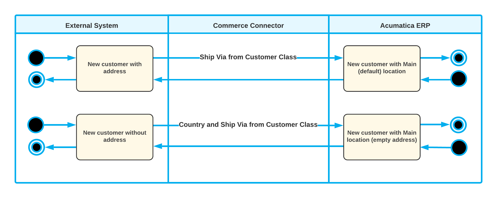
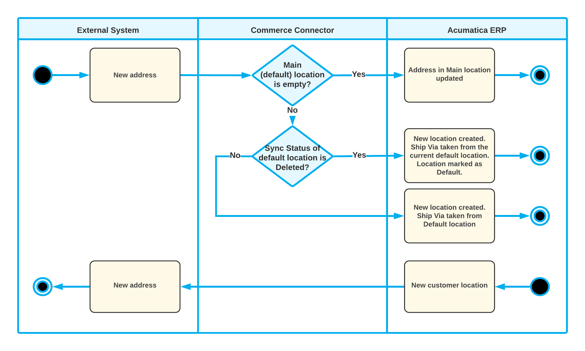
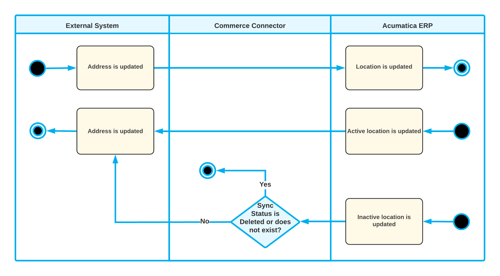
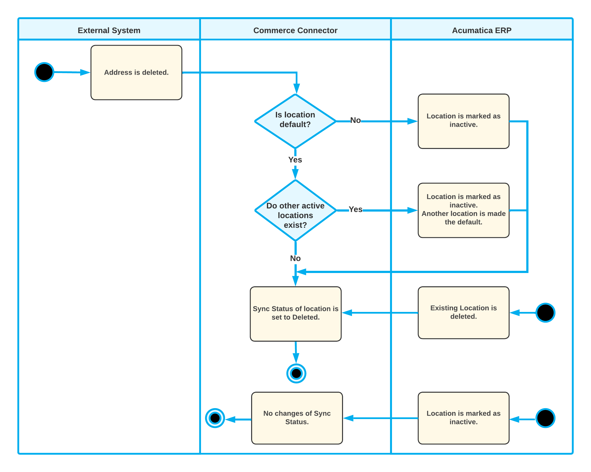

# Customer Synchronization: Individual Customers {#_f67427b0-eecf-4217-8ad3-11344b2a34ee .concept}

Individual customers are synchronized during the synchronization of the *Customer* entity. The sections below describe what happens during the synchronization of customers that have one or multiple locations when the *Customer Location* entity is both disabled and enabled.

## Synchronization of Individual Customers Without Customer Locations { .section}

If the *Customer* entity is activated and the *Customer Location* entity is not activated on the [Shopify Stores](BC_20_10_10.md) \(BC201010\) form, when the *Customer* entity is synchronized between the Shopify store and Acumatica ERP, the customer location \(address\) data is not copied from one system to the other.

When an individual customer created in the Shopify store is imported to Acumatica ERP, the system creates a new customer on the [Customers](AR_30_30_00.md) \(AR303000\) form. In the **Customer Category** box, the system selects *Individual*, which indicates that the customer is an individual rather than a company. In the **Ext. Ref. Nbr.** box on the **General** tab, the system inserts the identifier of the customer from the Shopify store, along with the store name, in the following format: *&lt;Customer Identifier&gt; - &lt;Store Name&gt;*.

When a sales order created in the Shopify store is imported, the address information \(that is, the billing address and shipping address\) specified in the order is imported to Acumatica ERP as part of sales order data; however, new locations are not created and existing locations are not updated with the imported data.

## Creation of a Customer Without an Address { .section}

If you need to synchronize individual customers along with their locations, both the *Customer* entity and the *Customer Location* entity must be activated on the [Shopify Stores](BC_20_10_10.md) \(BC201010\) form.

With both entities activated, when a new customer is created in the Shopify store without an address, after the *Customer* entity is synchronized, a customer record is created in Acumatica ERP with the *MAIN* location. In the *MAIN* location, the system populates the **Country** and **Ship Via** values based on the customer class specified in the **Customer Class** box on the **Customers** tab of the [Shopify Stores](BC_20_10_10.md) form. However, the address lines are left blank.

In Acumatica ERP, when a new customer is created, the default *MAIN* location is always created and specified for the customer. When the *Customer* entity is exported, in the Shopify store, this customer is created with an address record.

The following diagram illustrates the synchronization of customers created without an address.



## Creation of a Customer Address { .section}

If the *Customer* and *Customer Location* entities are activated on the [Shopify Stores](BC_20_10_10.md) \(BC201010\) form and a new address was created for a customer in the Shopify store, during the import of the *Customer* entity, the ecommerce connector does one of the following:

-   If the default *MAIN* location has empty address lines, the new address is used to populate the elements of the *MAIN* location.
-   If the default location has been deleted in Acumatica ERP, and there is a corresponding synchronization record with the *Deleted* status on the [Sync History](BC_30_10_00.md) \(BC301000\) form, the ecommerce connector creates a new location and makes it the default.
-   If the default location exists and the address lines in it are filled in, the connector creates a new location.

For the imported location, the system inserts the identifier of the location from the Shopify store, along with the store name, in the **External ID** box on the **General** tab of the [Customer Locations](AR_30_30_20.md) \(AR303020\) form in the following format: *&lt;Location Identifier&gt; - &lt;Store Name&gt;*.

If a new location was created for a customer in Acumatica ERP, when the *Customer* entity is exported, the corresponding new address is created for the customer in the Shopify store with the data of the new location.

The following diagram illustrates the synchronization of a new customer address.



## Editing of a Customer Address { .section}

With the *Customer* and *Customer Location* entities activated on the [Shopify Stores](BC_20_10_10.md) \(BC201010\) form, if an existing customer address synchronized with Acumatica ERP is edited in the Shopify store, during the import of the *Customer* entity, the corresponding customer location in Acumatica ERP is updated with the changes made to the customer address in the Shopify store.

If an existing customer location is edited in Acumatica ERP, during the export of the *Customer* entity, the ecommerce connector does one of the following:

1.  If the customer location is active—that is, if the **Active** check box is selected for it on the [Customer Locations](AR_30_30_20.md) \(AR303020\) form—the corresponding customer address in the Shopify store is updated based on the changes to the customer location.
2.  If the customer location is inactive \(that is, if the **Active** check box is cleared for it\), the synchronization proceeds as follows:
    -   If the location's synchronization record has a status other than *Deleted*, the corresponding customer address in the Shopify store is updated based on the changes to the customer location.
    -   If the location's synchronization record has the *Deleted* status or the location has not been synchronized previously, the location is not synchronized with the Shopify store.

The following diagram illustrates the synchronization of an updated customer address.



## Deletion of a Customer Address { .section}

With the *Customer* and *Customer Location* entities activated on the [Shopify Stores](BC_20_10_10.md) \(BC201010\) form, if a customer address is deleted in the Shopify store, the import of the *Customer* entity proceeds as follows:

-   If the corresponding customer location in Acumatica ERP is not the default customer location, the system makes it inactive and its synchronization status changes to *Deleted*.
-   If the corresponding customer location in Acumatica ERP is the default customer location, the connector does one of the following:
    -   If the customer location is the only active location of a customer, the connector assigns the *Deleted* status to the location's synchronization record.
    -   If other active locations exist for the customer, the connector makes this default location inactive, assigns the *Deleted* status to its synchronization record, and makes one of the other active locations the default one.

If an existing customer location is made inactive in Acumatica ERP, when the *Customer* entity is exported, the inactive customer location is not synchronized with the Shopify store.

The following diagram illustrates the synchronization of a deleted customer address.



## Use of the Guest Customer Account { .section}

If you want to allow placing orders in your store without providing the customer's phone number or email address and want to import such orders to Acumatica ERP, you need to fill in the **Generic Guest Customer** box on the **Customer Settings** tab of the [Shopify Stores](../Shared/../UserGuide/BC_20_10_10.md) \(BC201010\) form. This customer account appears on imported sales orders that have been placed in the Shopify store without customer details.

The customer record selected in the **Generic Guest Customer** box is not exported to the Shopify store during the synchronization of customers.

You can also configure the system to change a guest customer account after a particular number of sales orders have been created for this account. You do so by selecting the **Use Multiple Guest Accounts** check box. When the maximum allowed number of sales orders is exceeded, the system creates a new customer and inserts its identifier in the **Generic Guest Customer** box. The settings of the new customer account are copied from the previous generic guest customer account, and its identifier is generated based on the numbering sequence specified in the **Customer Numbering Sequence** box.

By default, the allowed number of sales orders per guest customer account is limited to 10,000. You can override this number by adding the `MaxOrdersPerGuestAccount` key to the &lt;appSettings&gt; section of the `web.config` file. For example, to change the guest customer account after every 500 sales orders, add the following key:

```
<add key="MaxOrdersPerGuestAccount" value="500"/>
```

For more information about creating a customer, see [Customers: General Information](../Shared/../UserGuide/Customer_GeneralInfo.md).

**Parent topic:**[Synchronizing Individual and Business Customers](../UserGuide/Commerce_SP_Syncing_Customers_Mapref.md)

