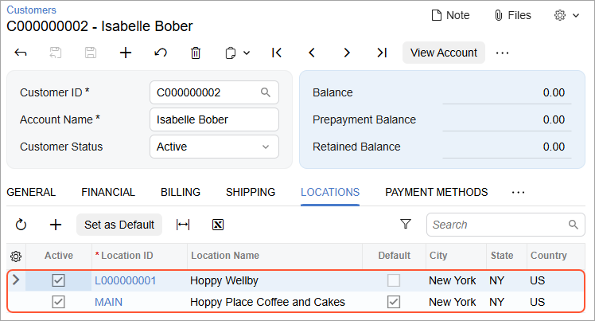

# Customer Synchronization: To Synchronize Customers with Multiple Locations {#_7b2d3020-f552-4b47-b8c2-dfea8f86d42a .task}

The following activity will walk you through the process of setting up the synchronization of customer locations and performing the synchronization of individual customers with locations between Acumatica ERP and the Shopify store.

**Attention:** The following activity is based on the *U100* dataset.

**Important:** In this activity, you will be synchronizing business customers by following the business-to-consumer \(B2C\) path. This approach is useful if your Shopify subscription plan does not include business-to-business \(B2B\) features.

## Story { .section}

Suppose that SweetLife Fruits &amp; Jams works with individual customers and small businesses that order items to be delivered to multiple locations. The company keeps track of customer addresses in the Shopify store and wants these addresses to be in sync with customer locations in Acumatica ERP.

SweetLife's Shopify subscription does not include business-to-business features, so individual and business customers should be synchronized together.

Acting as an implementation consultant helping SweetLife to set up the integration of Acumatica ERP with the Shopify store, you need to configure the synchronization of customers along with their locations between the two systems. You will then test the import of customers with multiple locations, then update location details, and test the export of the updated data.

## Configuration Overview {#section_tz4_djx_cnb .section}

In the *U100* dataset, the following tasks have been performed to support this activity:

-   On the [Enable/Disable Features](CS_10_00_00.md) \(CS100000\) form, the *Business Account Locations* feature has been enabled.
-   On the [Customer Classes](AR_20_10_00.md) \(AR201000\) form, the *ECCUSTOMER* customer class has been configured.
-   On the [Numbering Sequences](CS_20_10_10.md) \(CS201010\) form, the *ECCUSTOMER* and *ECLOCATION* numbering sequences have been defined.

## Process Overview { .section}

In this activity, you will do the following:

1.  On the [Shopify Stores](BC_20_10_10.md) \(BC201010\) form, update the settings of the *Customer* and *Customer Locations* entities.
2.  In the admin area of the Shopify store, create a new customer with two addresses.
3.  On the [Prepare Data](BC_50_10_00.md) \(BC501000\) form, prepare the customer and customer address data for synchronization.
4.  On the [Process Data](BC_50_15_00.md) \(BC501500\) form, process the customer and customer address data prepared for synchronization.
5.  On the [Customers](AR_30_30_00.md) \(AR303000\) form, review the imported customer data.
6.  On the [Customer Locations](AR_30_30_20.md) \(AR303020\) form, review the imported customer address data and update one of the customer locations.
7.  By using the [Sync History](BC_30_10_00.md) \(BC301000\) form, synchronize the updated customer location with the Shopify store.
8.  In the admin area of the Shopify store, review the updated customer address.

## System Preparation { .section}

Before you perform the instructions in this activity, do the following:

1.  Make sure that the following prerequisites have been met:
    -   The Shopify store has been created and configured, as described in [Initial Configuration: To Set Up a Shopify Store](Commerce_SP_Initial_Configuration_To_Set_Up_a_Shopify_Store.md).
    -   The connection to the Shopify store has been established and the initial configuration has been performed, as described in [Initial Configuration: To Configure the Store Connection](Commerce_SP_Initial_Configuration_Implem_Activity.md).
2.  Launch the Acumatica ERP website with the *U100* dataset preloaded, and sign in with the following credentials:
    -   **Username**: *gibbs*
    -   **Password**: *123*
3.  Sign in to the admin area of the Shopify store as the store administrator in the same browser.

## Step 1: Configuring the Synchronization Settings of the Customer and Customer Location Entities { .section}

To review the synchronization settings of the *Customer* and *Customer Locations* entities, do the following:

1.  On the [Shopify Stores](../Shared/../UserGuide/BC_20_10_10.md) \(BC201010\) form, select the *SweetStore - SP* store.
2.  On the **Entities** tab, do the following:
    1.  Make sure that the **Active** check box is selected in the rows of the *Customer* and *Customer Location* entities.
    2.  In the row of the *Customer* entity, make sure that **Sync Direction** is set to *Bidirectional*.

        **Tip:** Notice that all other settings of the *Customer Location* entity \(including the synchronization direction\) are the same as those of the *Customer* entity and cannot be edited.

3.  On the **Customers** tab, make sure that the following settings have been specified:
    -   **Customer Class**: *ECCUSTOMER*

        When a new customer is imported from the Shopify store to Acumatica ERP, its default settings are defined based on the customer class selected in this box.

    -   **Customer Numbering Sequence**: *ECCUSTOMER*

        Each new customer imported from the Shopify store will be assigned an identifier based on the numbering sequence selected in this box.

    -   **Location Numbering Sequence**: *ECLOCATION*

        Each new customer location imported from the Shopify store will be assigned an identifier based on the numbering sequence selected in this box.

4.  On the form toolbar, click **Save** to save your changes.

## Step 2: Creating a Customer in the Shopify Store { .section}

To create a customer and a first address, in the admin area of the Shopify store, do the following:

1.  In the left menu of the Shopify admin area, click **Customers**.
2.  On the **Customers** page that opens, click **Add customer** in the upper right.
3.  On the **New customer** page that opens, specify the following details in the **Customer overview** section:
    -   **First name**: `Isabelle`
    -   **Last name**: `Bober`
    -   **Email**: `hoppy_info@example.com`
4.  In the **Default address** section, click **Add address**.
5.  In the **Add default address** dialog box, which opens, specify the following details:
    -   **Country/region**: *United States* \(inserted by default\)
    -   **First name**: `Isabelle` \(inserted by default based on the information specified in the customer overview section\)
    -   **Last name**: `Bober` \(inserted by default based on the information specified in the customer overview section\)
    -   **Company**: `Hoppy Place Coffee and Cakes`
    -   **Address**: `3690 Taylor Street`
    -   **City**: `New York`
    -   **State**: *New York*
    -   **ZIP code**: `10007`
6.  Click **Save** to save the address.

    The system closes the dialog box and adds the primary address for the customer.

7.  At the top of the page, in the **Unsaved changes** bar, click **Save** to save the customer record.

    The customer page opens for *Isabel Bober*. Notice that in the **Customer** section, the email address is displayed, and the **Default Address** section shows the address lines that you entered in this step.

## Step 3: Adding an Address for the Customer { .section}

To add a second address for the customer you created in the previous step, while you are still viewing the **Customers** page for *Isabelle Bober*, do the following:

1.  In the **Customer** section, in the upper right, click the More button and then click **Manage addresses**.
2.  In the **Manage addresses** dialog box, which opens, click **Add new address**.
3.  The **Add new address** dialog box, which opens, in the **Country/region** box, select *United States*. The **State** and **ZIP code** boxes appear in the dialog box.
4.  Fill in the boxes as follows:
    -   **First name**: `William`
    -   **Last name**: `Duncan`
    -   **Company**: `Hoppy Wellby`
    -   **Address**: `2671 Simons Hollow Road`
    -   **City**: `New York`
    -   **State**: *New York*
    -   **ZIP code**: `10001`
5.  Click **Save** to save the address.

    The dialog box closes and you return to the customer page for *Isabel Bober*.

6.  In the **Customer** section, in the upper right, click the More button and then click **Manage addresses**.

    In the **Manage addresses** dialog box, which opens, notice that the second address has been added.

7.  Close the **Manage addresses** dialog box.

## Step 4: Preparing the Customer and Customer Location Data for Synchronization { .section}

To prepare the customer and customer location data for synchronization, in Acumatica ERP, do the following:

1.  On the [Prepare Data](BC_50_10_00.md) \(BC501000\) form, specify the following settings in the Summary area:

    -   **Store**: *SweetStore - SP*
    -   **Prepare Mode**: *Incremental*
    This setting controls which data will be loaded. *Incremental* indicates that only the customer records that match the filtering conditions and have been modified since the previous processing of the data have been prepared for synchronization.

2.  In the table, select the check box in the unlabeled column in the row of the *Customer* entity.
3.  On the form toolbar, click **Prepare**.

    **Tip:** Because customer locations are synchronized along with customers during the synchronization of the *Customer* entity, the *Customer Location* entity is not listed in the table and cannot be prepared separately.

4.  In the **Processing** dialog box, which opens, review the results of the processing, and click **Close** to close the dialog box and return to the [Prepare Data](../Shared/../UserGuide/BC_50_10_00.md) form.

    Notice that the **Prepared Records** column shows the number of synchronization records that have been prepared and are ready to be processed.

## Step 5: Processing the Prepared Customer and Customer Location Data { .section}

To process the customer and customer location data you have prepared for synchronization, do the following:

1.  While you are still viewing the [Prepare Data](BC_50_10_00.md) \(BC501000\) form, click the link in the **Ready to Process** column of the row with the *Customer* entity.

    The [Process Data](BC_50_15_00.md) \(BC501500\) form opens with the *SweetStore - SP* store and the *Customer* entity selected in the Summary area. The table displays all synchronization records of the *Customer* entity that you prepared.

2.  In the table, select the unlabeled check box in the only row that has a number in the **External ID** column but does not have any value in the **ERP ID** column.

    The empty **ERP ID** column indicates that the record has been created in the Shopify store but has not yet been synchronized with Acumatica ERP.

3.  On the form toolbar, click **Process** to process the selected synchronization record.
4.  In the **Processing** dialog box, which opens, click **Close** to close the dialog box.

## Step 6: Reviewing the Imported Customer and Customer Locations { .section}

Perform the following instructions to review the customer and customer locations that have been imported to Acumatica ERP:

1.  Open the Customers \(AR3030PL\) form.
2.  In the list of customers, in the **Customer Name** column, locate the *Isabelle Bober* customer, and click the link for this customer in the **Customer ID** column.
3.  On the [Customers](AR_30_30_00.md) \(AR303000\) form, which opens for *Isabelle Bober*, on the **General** tab, notice that the system has inserted the customer identifier from Shopify in the **Ext. Ref. Nbr.** box \(**Additional Information** section\).
4.  Open the **Locations** tab and review the locations that the system created when the customer record was synchronized.

    Notice that the table displays the following locations, as shown in the screenshot below:

    -   The location with the *MAIN* identifier, which was created for the customer first in the Shopify store. This location is also marked as the default \(that is, the **Default** check box is selected for this location\).
    -   The location with the identifier that the system assigned to it based on the numbering sequence selected for locations in the store settings on the [Shopify Stores](BC_20_10_10.md) \(BC201010\) form.
    

5.  Click the *MAIN* link in the **Location ID** column.
6.  On the [Customer Locations](AR_30_30_20.md) \(AR303020\) form, which the system has opened in a pop-up window, on the **General** tab, review the location details that have been imported from the Shopify store. Notice the following:
    -   The **Company** value from the address in Shopify has been imported as the **Account Name** box of the **Additional Location Info** section as well as the **Location Name** box in the Summary area.

        The address lines, city, state, country, and postal code have been imported to the appropriate boxes of the **Location Address** section.

        The first and last name of the address in Shopify have been imported to the **Attention** box of the **Additional Location Info** section.

        The location identifier from Shopify along with the store name have been imported to the **External ID** box of the **Other Settings** section.

## Step 7: Updating the Customer Location { .section}

Suppose that you need to update the contact and address details of the *MAIN* customer location for *Isabelle Bober*. Do the following:

1.  While you are still viewing the [Customer Locations](AR_30_30_20.md) \(AR303020\) form with the *MAIN* location of the *Isabelle Bober* customer, on the **General** tab, in the **Additional Location Info** section, type `Gail Anderson` in the **Attention** box.
2.  In the **Location Address** section, change **Address Line 1** to `3650 Taylor Street`.
3.  On the form toolbar, click **Save &amp; Close** to save your changes and close the pop-up window with the [Customer Locations](AR_30_30_20.md) form.

## Step 8: Synchronizing the Updated Location with the Shopify Store { .section}

To synchronize the updated customer location with the Shopify store in order to update the address in the store, do the following:

1.  On the [Sync History](BC_30_10_00.md) \(BC301000\) form, in the Summary area, specify the following settings:
    -   **Store**: *SweetStore - SP*
    -   **Entity**: *Customer Location*
2.  In the Filter List drop-down menu above the table, select *Processed*.
3.  In the table, select the unlabeled check box in the row of the *MAIN, Hoppy Place Coffee and Cakes* location.
4.  On the form toolbar, click **Sync**.

    **Tip:** When you change a location of a customer, the ecommerce connector recognizes the customer record as having been modified as well. So in this step, you could have selected the synchronization record for the *Isabelle Bober* customer and clicked **Sync**, and the updated customer location would have been synchronized as part of the customer synchronization process. Alternatively, you could have prepared the *Customer* entity for synchronization on the [Prepare Data](BC_50_10_00.md) \(BC501000\) form and then processed the prepared synchronization records on the [Process Data](BC_50_15_00.md) \(BC501500\) form.

## Step 9: Reviewing the Updated Customer Address in the Shopify Store { .section}

To review the updated customer address in the Shopify store, do the following:

1.  While you are still viewing the [Sync History](BC_30_10_00.md) \(BC301000\) form, in the row of the *MAIN, Hoppy Place Coffee and Cakes* customer location, click the link in the **External ID** column.

    The customer page of the admin area of the Shopify store opens for *Isabelle Bober*.

2.  In the **Customer** section, under **Default Address**, review the updated details of the customer address.

    Notice that the first name, last name, and the address line have been updated to reflect the changes that you made to the customer location. The name is now *Gail Anderson*, and the address has been changed to *3650 Taylor Street*.

**Parent topic:**[Synchronizing Individual and Business Customers](../UserGuide/Commerce_SP_Syncing_Customers_Mapref.md)

