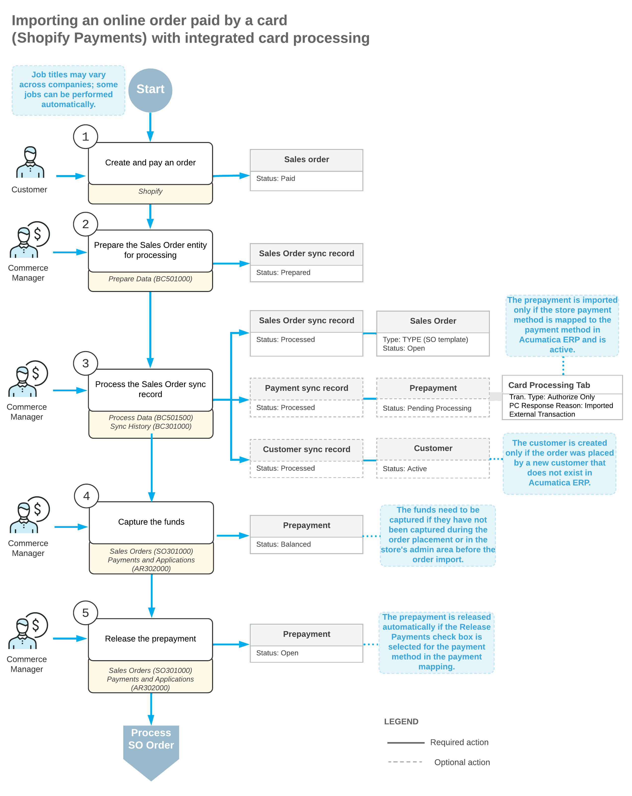

# Order Synchronization: Card Payments {#_81e38562-0f7f-4114-a896-b02982e37ae9 .concept}

In Acumatica ERP Retail Edition, users can import and, if necessary, process debit and credit card payments from external ecommerce systems through integration with payment gateways. The ability to use card-processing features, such as authorization, capture, voiding, and refunding card transactions, is available if the *Integrated Card Processing* feature is enabled on the [Enable/Disable Features](CS_10_00_00.md) \(CS100000\) form. This topic explains how to configure payment providers for processing of payments made in the Shopify store after they are imported to Acumatica ERP.

## Configuration of Shopify Payments for Integrated Card Processing { .section}

Shopify Payments is a payment provider available to Shopify customers in certain countries and regions. It supports all major payment methods, does not require additional registration, and can be used as soon as the store is created. For information about availability of Shopify Payments, see [the Shopify documentation](https://help.shopify.com/en/manual/payments/shopify-payments/shopify-payments-requirements).

Before payments based on Shopify Payments can be imported from the Shopify store to Acumatica ERP, you need to configure payment processing via Shopify Payments as follows:

1.  Set up Shopify Payments in your Shopify store.

    You activate Shopify Payments on the **Payments** settings page of your Shopify store. When you set up Shopify Payments, you might be required to provide information about your business and bank account details to receive payouts. For information about setting up Shopify Payments in the Shopify store, see [the Shopify documentation](https://help.shopify.com/en/manual/payments/shopify-payments).

2.  Activate integrated card processing.

    You activate integrated card processing \(that is, the ability to use additional card processing steps for AR payments\) by selecting the **Enable Integrated CC Processing** check box on the [Accounts Receivable Preferences](AR_10_10_00.md) \(AR101000\) form.

3.  Configure a processing center for Shopify Payments in Acumatica ERP. You set up the processing center on the [Processing Centers](CA_20_50_00.md) \(CA205000\) form. During the configuration, you select the *Shopify Payments API plug-in* as the **Payment Plug-In \(Type\)** and on the **Plug-In Parameters** tab, you specify the *STORENAME* parameter, which is the name of the Shopify store as it is defined on the [Shopify Stores](BC_20_10_10.md) \(BC201010\) form.
4.  Configure a card-based payment method in Acumatica ERP.

    After you have configured the processing center, on the [Payment Methods](CA_20_40_00.md) \(CA204000\) form, you need to set up a payment method that will be associated with the processing center. For information about setting up payment methods in Acumatica ERP, see [Cash Management: Payment Methods](../ImplementationGuide/config_Basic_Company_Payment_Methods.md).

5.  Map the card-based payment method with the Shopify Payments store payment method.

    You map payment methods between Acumatica ERP and the Shopify store on the [Shopify Stores](BC_20_10_10.md) \(BC201010\) form. When a payment is imported from the Shopify store to Acumatica ERP, a prepayment is created on the [Payments and Applications](AR_30_20_00.md) \(AR302000\) form based on the payment method from Acumatica ERP that was mapped to the payment method used for payment in the Shopify store.

For step-by-step instructions on configuring and importing payments based on the Shopify Payments payment method, see [Order Synchronization: To Configure and Import Shopify Payments](Commerce_SP_Syncing_Orders_To_Use_Shopify_Payments.md).

## Configuration of Acumatica Payments for Integrated Card Processing { .section}

Acumatica Payments is a payment provider available to Shopify customers as an app. Before payments based on Acumatica Payments can be imported from the Shopify store to Acumatica ERP, you need to configure payment processing via Acumatica Payments as follows:

1.  Set up Acumatica Payments in your Shopify store.

    You install the Acumatica Payments app form the Shopify App Store. Then you configure the installed app. When you set up Acumatica Payments, you are required to provide the user ID and API key as well as the location and product IDs that you can obtain from the payment gateway.

2.  Enable the *Acumatica Payments* feature on the [Enable/Disable Features](CS_10_00_00.md) \(CS100000\) form.
3.  Activate integrated card processing, configure a processing center for Acumatica Payments, and configure a card-based payment method in Acumatica ERP as described in [To Configure Acumatica Payments](AR__HOW_To_Configure_Acumatica_Payments.md). When configuring the processing center, use the same payment gateway credentials as in Shopify.
4.  Map the payment method with the Acumatica Payments store payment method.

    You activate the *ACUMATICA PAYMENTS* store payment method and specify the ERP payment method, cash account, and processing center you've configured on the **Payments** tab of the [Shopify Stores](BC_20_10_10.md) \(BC201010\) form.

When a payment is imported from the Shopify store to Acumatica ERP, a prepayment is created on the [Payments and Applications](AR_30_20_00.md) \(AR302000\) form based on the payment method from Acumatica ERP that was mapped to the payment method used for payment in the Shopify store.

**Important:**

Due to limitations of the Acumatica Payments integration with Shopify, you cannot export changes made to an imported payment in Acumatica ERP back to Shopify. For example, if you import an authorized payment processed with Acumatica Payments from Shopify, you must capture the payment in Shopify.

If a payment is authorized in Shopify with Acumatica Payments, imported into Acumatica ERP, and then captured in Shopify, the connector validates it in Acumatica ERP automatically during the next synchronization. However, if a payment is authorized and captured in Shopify before the first import into Acumatica ERP, you must additionally validate the payment in Acumatica ERP.

## Mapping of Card-Based Payment Methods { .section}

During the configuration of a connection to the Shopify store, one of the steps you perform is the mapping of payment methods configured in Acumatica ERP with payment methods configured in the Shopify store. You define payment method mapping in the table on the **Payments** tab of the [Shopify Stores](BC_20_10_10.md) \(BC201010\) form.

You specify the following:

-   **Active**: A check box that you select for a payment method to indicate that payments made in the ecommerce system that are based on should be imported to Acumatica ERP.
-   **ERP Payment Method**: The identifier of the payment method in Acumatica ERP that was configured to use the same processing center as was used for setting up the payment provider in the online store.
-   **Cash Account**: A cash account that was specified for the payment method on the **Allowed Cash Accounts** tab on the [Payment Methods](CA_20_40_00.md) \(CA204000\) form.
-   **Proc. Center ID**: The identifier of the processing center configured for the payment method on the **Processing Centers** tab of the [Processing Centers](CA_20_50_00.md) \(CA205000\) form.
-   **Release Payments and Refunds**: A check box that you select to indicate that the payment should be immediately released after it is imported to Acumatica ERP. If this check box is selected for a card-based payment method associated with a credit card processing center in Acumatica ERP \(that is, for the payment method for which a processing center is selected in the **Proc. Center ID** column\), only payments that have been captured in the store will be automatically released on import. Payments that have been authorized but not captured in the store need to be processed after import and then released manually or by using the [Release AR Documents](AR_50_10_00.md) \(AR501000\) form.
-   **Process Refunds**: A check box that indicates \(if selected\) that refunds made to the payment method should be imported to Acumatica ERP. This check box is selected and unavailable for card payment methods for which a processing center is specified, which indicates that all refunds made to such payment methods must be imported to Acumatica ERP.

## Additional Mapping for Shopify Payments Fees { .section}

You can import the breakdown of fees charged on each payment made with Shopify Payments in a Shopify store.

**Important:** Shopify Payments fees can be imported only for payments that have been captured in the Shopify store. Also, this payment method must be mapped with a card-based payment method in Acumatica ERP that has been configured with a processing center based on the Shopify Payments plug-in.

To import the Shopify Payments fees to Acumatica ERP, you need to perform the following additional configuration steps:

1.  Create the entry types on the [Entry Types](CA_20_30_00.md) \(CA203000\) form. These entry types will be used to reflect the breakdown of Shopify Payments fees imported from the Shopify store.

    An entry type can be used in the fee mapping if it meets the following criteria:

    -   The entry type has the *Disbursement* type.
    -   A default offset account has been specified for the entry type.
    -   The **Deduct from Payment** check box is selected for the entry type.
    -   On the [Cash Accounts](CA_20_20_00.md) \(CA202000\) form, the entry type has been added to the cash account specified in the mapping for the Shopify Payments payment method.
2.  Map Shopify Payments fees to the entry types in the **Payment Fees** table on the [Shopify Stores](BC_20_10_10.md) form.

    Initially, the **Payment Fees** table is empty. During the first import of a payment containing Shopify Payments fees, the synchronization fails, and the **Fee Type** column is populated with the Shopify Payments fees. You need to map each Shopify Payments fee type with an entry type by specifying the entry type of the *Disbursement* type in the **ERP Entry Type** column, and then sync the payment again.

## Import of Card Payments with Integrated Card Processing { .section}

When the pre-authorized payment is imported from Shopify to Acumatica ERP \(as part of the synchronization of the *Sales Order* entity or the *Payment* entity\), on the [Payments and Applications](AR_30_20_00.md) \(AR302000\) form, the system creates a document of the *Prepayment* type with the *Pending Processing* status. In the Summary area of the created document, the system inserts the following information:

-   **Payment Method**: The payment method that has been mapped to the store payment method in the table on the **Payments** tab of the [Shopify Stores](BC_20_10_10.md) \(BC201010\) form
-   **Cash Account**: The cash account selected for the mapped payment method
-   **Payment Ref.**: The number of the related credit card transaction in the processing center
-   **Processing Status**: The processing status of the credit card transaction. Depending on the last successful operation with the transaction, the processing status can be one of the following:
    -   *Pre-Authorized*: The payment has been authorized but the funds have not been captured. The last successful operation was *Authorize Only*.
    -   *Captured*: The funds have been captured. The last successful operation with the credit card transaction was either *Authorize and Capture* or *Capture Authorized*.
    -   *Pre-Auth./Capture Pending Validation*: The last successful operation with the credit card transaction is unknown. To get the correct processing status of the credit card transaction, you can use the **Validate Card Payment** action on the [Payments and Applications](AR_30_20_00.md) form.

On the **Card Processing** tab, the system creates a row for the last successful operation with the credit card transaction. In the **PC Response Reason** box, *Imported External Transaction* indicates that the information about the credit card transaction operation has been imported from the external ecommerce system. The transaction operation can have one of the following types:

-   *Authorize Only*: The payment was authorized when the order was placed but has not yet been captured.
-   *Authorize and Capture*: The payment was captured when the order was placed.
-   *Capture Authorized*: The payment was authorized when the order was placed, and then the funds were captured in the admin area of the store.
-   *Unknown*: The status of the operation with the credit card transaction is unknown.

**Important:** If the **Use Payment Currency instead of Store Currency** check box is cleared for the store on the **Orders** tab of the [Shopify Stores](BC_20_10_10.md) form, and the customer paid an order in the Shopify store in a currency other than the default store currency, the system imports the credit card payment to Acumatica ERP in the default store currency. This payment can be captured, voided, or refunded only in the Shopify store.

The following diagram illustrates the workflow of importing a sales order to Acumatica ERP from a Shopify store where it was placed and paid by a card based on a payment method for which integrated card processing has been configured in Acumatica ERP.

## Deferred Processing of Imported Credit Card Payments { .section}

Credit card transactions created in Acumatica ERP during the import of payments based on credit card payment methods require validation if the last operation on the credit card transaction has the *Unknown* status.

External credit card transactions that meet this condition are displayed on the **Deferred Processing Required** tab of the [Validate Card Payments](AR_51_30_00.md) \(AR513000\) form.

When you start the validation process, the system requests the status of the credit card transaction, and updates the processing status of the transaction and the status of the prepayment, if necessary. If the updated processing status of the transaction is *Captured*, the status of the prepayment changes to *Balanced*. If on the **General Settings** tab of the [Accounts Receivable Preferences](AR_10_10_00.md) \(AR101000\) form, the **Enable Integrated CC Processing** check box is selected, the system releases the prepayment.

Customizations may support forced validation of all imported credit card transactions. In this case, all credit card transactions imported from external systems will be displayed on the **Deferred Processing Required** tab of the [Validate Card Payments](AR_51_30_00.md) form and will need to be validated.

**Tip:** A sales order can be fulfilled only if the credit card payment imported for it from an external ecommerce system has been validated. To streamline shipping of orders, you can set up an automation schedule on the [Validate Card Payments](../Shared/../UserGuide/AR_51_30_00.md) form to regularly process imported card transactions that require validation. For information about automation schedules, see [Automated Processing: General Information](../Shared/../UserGuide/SA_Scheduling_Automated_Processing_GeneralInfo.md).

**Parent topic:**[Synchronizing Orders](../UserGuide/Commerce_SP_Syncing_Orders_Mapref.md)

