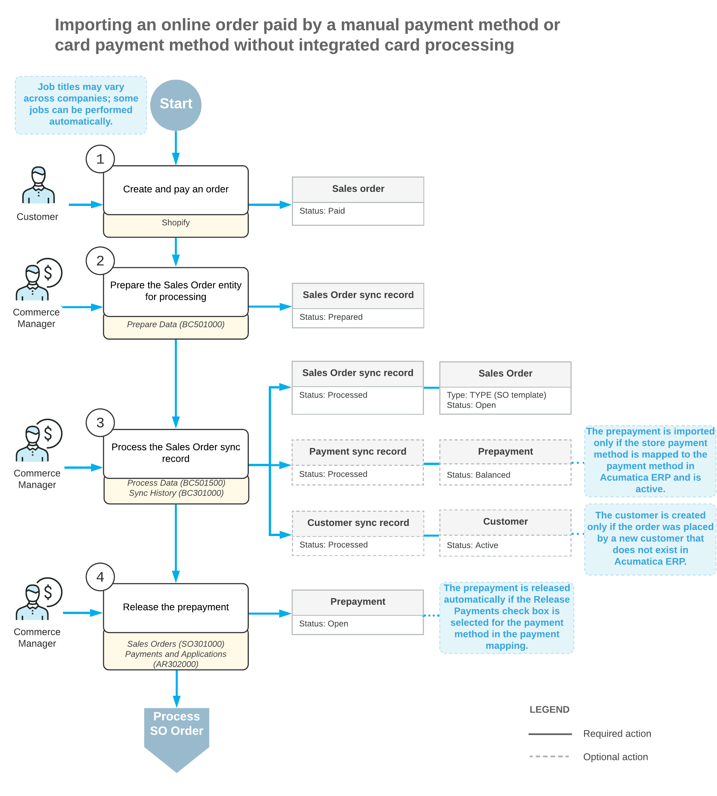

# Order Synchronization: General Information {#_31141ba2-9535-4201-be95-c98e17dc8e4e .concept}

You can import sales orders placed in the Shopify store to Acumatica ERP for further processing.

## Learning Objectives { .section}

In this chapter, you will learn how to do the following:

-   Configure the synchronization of orders between Acumatica ERP and the Shopify store
-   Configure the synchronization of payments between Acumatica ERP and the Shopify store
-   Import sales orders with payments from the Shopify store to Acumatica ERP
-   Configure card payment processing in Acumatica ERP and Shopify

## Applicable Scenarios { .section}

The synchronization of orders is the main scenario for the integration between an ERP system and an external ecommerce system. You set up the import of orders from the Shopify store to Acumatica ERP so that you can process the imported orders further, for example, create a shipment, invoice the customer, and process the payment.

You set up the import of payments if you want to track them within Acumatica ERP. For card payments, you may want to set up integrated card processing so that you can capture the payment in Acumatica ERP after the order has been shipped.

## Minimal Configuration of Order Synchronization {#_8776a431-1627-4fd3-828f-842ff9192794 .section}

To start importing sales orders from the Shopify store, you need to activate the required entities and specify the minimal settings for the activated entities on the [Shopify Stores](BC_20_10_10.md) \(BC201010\) form. On the **Entities** tab, you activate the *Sales Order* and *Customer* entities, as well as the *Stock Item* entity, *Non-Stock Item* entity, or both entities. If shipments created and processed in Acumatica ERP for the imported order should be synchronized with the Shopify store, you need to activate the *Shipment* entity.

You specify the minimal required settings for the activated entities as follows:

-   *Customer*: You specify the settings for customer synchronization on the **Customers** tab. For information, see [Customer Synchronization: General Information](Commerce_SP_Syncing_Customers_GeneralInfo.md).
-   *Stock Item* and *Non-Stock Item*: You specify the settings for the synchronization of stock and non-stock items on the **Inventory** tab. For details, see [Product Synchronization: General Information](Commerce_SP_Syncing_Products_GeneralInfo.md).
-   *Sales Order*: On the **Orders** tab, in the **Branch** box, you specify the branch the system will insert in imported sales orders, and in the **Order Type for Import** box, you specify the order type that will be assigned to and provide the default settings for the imported sales orders. On the **Shipping** tab, you map each shipping option \(which is a combination of a shipping zone and shipping method\) defined in the Shopify store with the ship via code and, optionally, shipping zone and shipping terms defined in Acumatica ERP.

## Import of Orders Without Customers { .section}

If you do not need to process the customer data in Acumatica ERP, you can import orders from the Shopify store without importing customers using a generic guest customer instead.

To configure the synchronization of orders without customers for the Shopify store, you should perform the steps described in the [Minimal Configuration of Order Synchronization](#_8776a431-1627-4fd3-828f-842ff9192794) topic above with the following differences on the [Shopify Stores](BC_20_10_10.md) \(BC201010\) form:

-   Selecting *Import* in the **Sync Direction** column for the *Sales Order* entity on the **Entities** tab.
-   Skipping the activation of the *Customer* entity on the **Entities** tab. That is, the **Active** check box remains cleared for the *Customer* entity, and no steps are performed to activate the entity.
-   Specifying a guest customer in the **Generic Guest Customer** box on the **Customers** tab,

When the system imports orders from the Shopify store, the guest customer is assigned as the customer for each created sales order. The system does not import customers from the store and does not create new customer records. On the **Addresses** tab of the [Sales Orders](SO_30_10_00.md) \(SO301000\), the system selects the **Override Contact** and **Override Address** check boxes and fills in the ship-to and bill-to information with the corresponding customer's data from the Shopify store.

## The Order Time Zone { .section}

While you are performing the initial configuration of the Shopify store, on the **Orders** tab of the [Shopify Stores](BC_20_10_10.md) \(BC201010\) form, you can specify the **Order Time Zone** that the system will use for each sales order imported from the Shopify store when it is created in Acumatica ERP. The order time zone is needed to determine the correct date and time of the order if Acumatica ERP and the Shopify store are located in different time zones.

## Limiting the Date Range for Order Import { .section}

If you have had the Shopify store for a while before implementing Acumatica ERP, you might want to prevent old orders from being imported to Acumatica ERP when you start synchronizing orders. On the **Orders** tab of the [Shopify Stores](BC_20_10_10.md) \(BC201010\) form, you specify the **Earliest Order Date**. Orders created before this date in the Shopify store will be excluded from synchronization between Acumatica ERP and the Shopify store. Payments and shipments created for such orders are excluded from synchronization too.

## Tracking Imported Sales Orders in the Shopify Store { .section}

If your Shopify store accepts a large number of orders, it might be useful to be able to see at a glance which orders have already been imported to Acumatica ERP. On the **Orders** tab of the [Shopify Stores](BC_20_10_10.md) \(BC201010\) form, you select the **Tag Ext. Order with ERP Order Nbr.** check box. When a sales order is imported from the Shopify store and assigned an order number in Acumatica ERP, the order in Shopify is assigned two tags, *ERP* and a tag with the order number from Acumatica ERP.

## Mapping of Shipping Options { .section}

You define the mapping of each shipping option \(which is a combination of a shipping zone and shipping method\) defined in Shopify to the ship via code, and optionally, shipping zone and shipping terms defined in Acumatica ERP on the **Shipping** tab of the [Shopify Stores](BC_20_10_10.md) \(BC201010\) form. The **Store Shipping Zone** and **Store Shipping Method** columns of the table are populated with the settings from Shopify automatically for shipping options defined in the Shopify store.

## Configuration of Payment Synchronization {#_68a3836d-7899-4995-940d-0b3628e19363 .section}

If payments for at least one payment method set up in the Shopify store should be imported to Acumatica ERP, you need to activate the *Payment* entity on the **Entities** tab of the [Shopify Stores](BC_20_10_10.md) \(BC201010\) form.

For each store payment method—that is, each payment method defined and activated in the Shopify store—payments by which should be imported to Acumatica ERP, you need to create a mapping with a payment method defined in Acumatica ERP on the **Payments** tab. The system automatically adds a row with the store payment method and the currency it was defined for specified \(in the **Store Payment Method** and the **Store Currency** boxes, respectively\) for each store payment method that is active in the Shopify store.

To map the combination of the store payment method and the store currency with the Acumatica ERP payment method, in the table of the **Payments** tab, you specify the following settings:

-   To indicate that payments by a specific store payment method should be imported to Acumatica ERP, you select the **Active** check box.
-   In the **ERP Payment Method** column, you select the payment method defined in Acumatica ERP for the store payment method. Payments imported from the Shopify store to Acumatica ERP will have this payment method inserted. For information about setting up payment methods in Acumatica ERP, see [Cash Management: Payment Methods](../ImplementationGuide/config_Basic_Company_Payment_Methods.md).

    **Note:** We recommend mapping the *PAYPAL* payment method to a *Cash/Check* ERP payment method.

-   In the **Cash Account** column, you select a cash account associated with the payment method. The cash account must be in the currency of the store payment method and belong to the branch selected on the **Orders** tab. For information about setting up cash accounts in Acumatica ERP, see [Cash Management: Cash Accounts](../ImplementationGuide/config_Basic_Company_Cash_Accounts.md) and [Configuring Cash Accounts](CA__MNG_CashAccounts.md).

You can also indicate that payments that are imported from the Shopify store should be automatically released as soon as they are imported by selecting the check box in the **Release Payments and Refunds** column. If refunds issued in the store should be imported to Acumatica ERP, you select the **Import Refunds** check box.

## Synchronization of Sales Orders and Payments { .section}

Orders are imported from a Shopify store during the synchronization of the *Sales Order* entity. During the data processing stage of the order import, the system does the following in Acumatica ERP:

1.  Creates a sales order on the [Sales Orders](SO_30_10_00.md) \(SO301000\) form. For information about the details and settings that the system inserts in the created sales order, see [Sales Order Entity](Commerce_SP_Mapping_SalesOrder.md).

    **Attention:** Note that orders that have the *Archived* status in the Shopify store are filtered during the order import. That is, for each order with this status, the system creates a synchronization record and assigns it the *Filtered* status on the [Sync History](BC_30_10_00.md) \(BC301000\) form.

2.  Searches for products \(that is, stock and non-stock items\) included in the sales order.

    Products included in a sales order must be synchronized with or created in Acumatica ERP. During the import of a sales order, the system searches for an inventory ID of an inventory item in Acumatica ERP that matches the product's SKU in the Shopify store. If no matching inventory ID has been found, the system continues to search for a matching alternate ID \(that is, an additional identifier of the item, which can be an identifier used by your company's customer or vendor, that is specified on the **Cross-Reference** tab of the [Stock Items](IN_20_25_00.md) \(IN202500\) form for a stock item and of the [Non-Stock Items](IN_20_20_00.md) \(IN202000\) form for a non-stock item\). If the matching alternate ID has been found, the system inserts in the imported order an inventory item associated with this alternate ID.

3.  Searches for a customer that placed the order, and inserts it in the sales order. If the customer has been updated in the Shopify store, updates the customer record in Acumatica ERP. If the customer has not been found, creates a new customer on the [Customers](AR_30_30_00.md) \(AR303000\) form, and inserts it in the sales order.
4.  Creates a document of the *Prepayment* type on the [Payments and Applications](AR_30_20_00.md) \(AR302000\) form, if the payment method used for paying the sales order in the Shopify store has an active mapping with a payment method defined in Acumatica ERP on the [Shopify Stores](BC_20_10_10.md) \(BC201010\) form, and applies it to the sales order.

    If the mapping of the store payment method is inactive or has not been configured, the system creates a synchronization record for the payment on the [Sync History](BC_30_10_00.md) form and assigns it the *Filtered* status. In this case, the prepayment document is not created on the [Payments and Applications](AR_30_20_00.md) form.


## Workflow of Importing a Sales Order with a Manual Payment { .section}

The following diagram illustrates the workflow of importing a sales order to Acumatica ERP from a Shopify store where it was placed and paid by a manual payment method or a card payment method without integrated card processing.



## Synchronization of Payments { .section}

You can import payments independently of orders by preparing and processing the *Payment* entity.

During the synchronization of the *Payment* entity, the system creates a document of the *Prepayment* type on the [Payments and Applications](AR_30_20_00.md) \(AR302000\) form and applies it to the sales order if the following conditions are met:

-   The store payment method with which the order was paid is mapped to an Acumatica ERP payment method and the mapping is active on the [Shopify Stores](BC_20_10_10.md) \(BC201010\) form.
-   The sales order has the *Open* status and has an unbilled balance, or the sales order has the *Canceled* status.

If the mapping of the store payment method is inactive or has not been configured, the system creates a synchronization record for the payment on the [Sync History](BC_30_10_00.md) \(BC301000\) form and assigns it the *Filtered* status. In this case, the prepayment document is not created on the [Payments and Applications](AR_30_20_00.md) form.

If the sales order has been fully invoiced, the system cannot apply the prepayment to the sales order. In this case, the prepayment is applied to the invoice or invoices created for the sales order.

If the sales order has been partially invoiced, the prepayment is applied to the sales order only in the amount equal to the unbilled amount of the sales order. You need to manually apply the remaining amount to the invoice or invoices.

## Import of the Shipping Price { .section}

When the shipping price of an order is updated in a Shopify store, the freight price of the corresponding sales order that has been already imported to Acumatica ERP is updated only if all of the following conditions are met:

-   The imported sales order has the *Open*, *Back Order*, or *Shipping* status on the [Sales Orders](SO_30_10_00.md) \(SO301000\) form.
-   If the Shopify order has not been paid yet, the shipping price has been either increased or decreased.
-   If the Shopify order has been already paid, the shipping price has been increased.

## Use of the Guest Customer Account { .section}

If you want to allow placing orders in your store without providing the customer's phone number or email address and want to import such orders to Acumatica ERP, you need to fill in the **Generic Guest Customer** box on the **Customer Settings** tab of the [Shopify Stores](../Shared/../UserGuide/BC_20_10_10.md) \(BC201010\) form. This customer account appears on imported sales orders that have been placed in the Shopify store without customer details.

The customer record selected in the **Generic Guest Customer** box is not exported to the Shopify store during the synchronization of customers.

You can also configure the system to change a guest customer account after a particular number of sales orders have been created for this account. You do so by selecting the **Use Multiple Guest Accounts** check box. When the maximum allowed number of sales orders is exceeded, the system creates a new customer and inserts its identifier in the **Generic Guest Customer** box. The settings of the new customer account are copied from the previous generic guest customer account, and its identifier is generated based on the numbering sequence specified in the **Customer Numbering Sequence** box.

By default, the allowed number of sales orders per guest customer account is limited to 10,000. You can override this number by adding the `MaxOrdersPerGuestAccount` key to the &lt;appSettings&gt; section of the `web.config` file. For example, to change the guest customer account after every 500 sales orders, add the following key:

```
<add key="MaxOrdersPerGuestAccount" value="500"/>
```

For more information about creating a customer, see [Customers: General Information](../Shared/../UserGuide/Customer_GeneralInfo.md).

## Importing Archived Orders { .section}

The connector does not import archived Shopify orders. Instead, it creates a filtered sync record for an archived order if any of the following conditions are met:

-   The order is not fulfilled
-   The order is a POS order
-   The order is partially or fully refunded

**Parent topic:**[Synchronizing Orders](../UserGuide/Commerce_SP_Syncing_Orders_Mapref.md)

