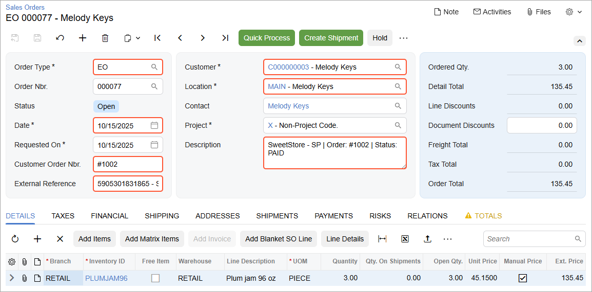
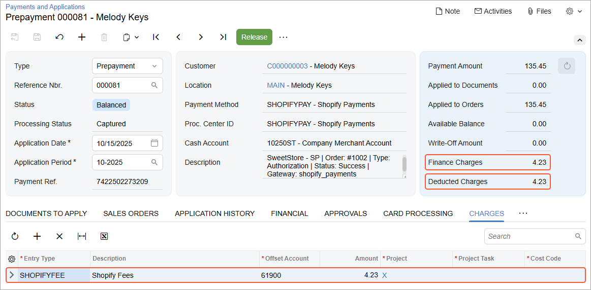

# Order Synchronization: To Configure and Import Shopify Payments {#_34594d89-fe88-4b0c-a07c-df2649263390 .task}

The following activity will walk you through the configuration of the system so that you can import payments based on the Shopify Payments payment method from the Shopify store to Acumatica ERP.

**Attention:** The following activity is based on the *U100* dataset.

## Story {#section_zq4_mtv_gtb .section}

Suppose that the SweetLife Fruits &amp; Jams company wants to accept card payments in the Shopify store. The company sells its products in the United States, where Shopify Payments is supported.

Further suppose that the company management wants to import the Shopify Payments fees to Acumatica ERP for tracking purposes.

Acting as an implementation consultant helping SweetLife to set up the synchronization of data between Acumatica ERP and the Shopify store, you need to configure Shopify Payments as a card payment provider in the Shopify store, configure the card payment processing in Acumatica ERP, and then configure the import of card payments from the Shopify store to Acumatica ERP.

## Configuration Overview {#section_tz4_djx_cnb .section}

In the *U100* dataset, the following tasks have been performed to support this activity:

-   On the [Enable/Disable Features](CS_10_00_00.md) \(CS100000\) form, the *Integrated Card Processing* feature has been enabled.
-   On the [Cash Accounts](CA_20_20_00.md) \(CA202000\) form, the *10250ST* cash account has been created.
-   On the [Entry Types](CA_20_30_00.md) \(CA203000\) form, the *SHOPIFYFEE* entry type of the *Disbursement* type has been defined.

## Process Overview {#section_ar4_mtv_gtb .section}

In this activity, you will do the following:

1.  On the [Accounts Receivable Preferences](AR_10_10_00.md) \(AR101000\) form, activate integrated card processing.
2.  On the [Processing Centers](CA_20_50_00.md) \(CA205000\) form, define a processing center.
3.  On the [Processing Centers](CA_20_50_00.md) form, connect the processing center to the Shopify store.
4.  On the [Payment Methods](CA_20_40_00.md) \(CA204000\) form, define a payment method that will represent payments based on the Shopify Payments store payment method.
5.  In the admin area of the Shopify store, activate the *Shopify Stores* payment option.
6.  On the [Shopify Stores](BC_20_10_10.md) \(BC201010\) form, map the *Shopify Payments* store payment method with the payment method defined in Acumatica ERP.
7.  On the [Shopify Stores](BC_20_10_10.md) \(BC201010\) form, map the Shopify fees to the entry types defined in Acumatica ERP.
8.  On the storefront of the Shopify store, create a test sales order paid by card.
9.  In the admin area of the Shopify store, review the created test sales order.
10. On the [Prepare Data](BC_50_10_00.md) \(BC501000\) form, prepare the sales order for synchronization; on the [Process Data](BC_50_15_00.md) \(BC501500\) form, process the sales order data prepared for synchronization.
11. On the [Sales Orders](SO_30_10_00.md) \(SO301000\) form, review the imported sales order.

## System Preparation {#section_br4_mtv_gtb .section}

Before you complete the instructions in this activity, do the following:

1.  Make sure that the following prerequisites have been met:
    -   The Shopify store has been created and configured, as described in [Initial Configuration: To Set Up a Shopify Store](Commerce_SP_Initial_Configuration_To_Set_Up_a_Shopify_Store.md).
    -   The connection to the Shopify store has been established and the initial configuration has been performed, as described in [Initial Configuration: To Configure the Store Connection](Commerce_SP_Initial_Configuration_Implem_Activity.md).
2.  Launch the Acumatica ERP website with the *U100* dataset preloaded, and sign in with the following credentials:
    -   **Username**: *gibbs*
    -   **Password**: *123*
3.  Sign in to the admin area of the Shopify store as the store administrator in the same browser.

## Step 1: Activating Integrated Card Processing {#section_cr4_mtv_gtb .section}

To activate integrated card processing, do the following:

1.  On the [Accounts Receivable Preferences](AR_10_10_00.md) \(AR101000\) form, in the **Data Processing Settings** section on the **General** tab, select the *Enable Integrated CC Processing* check box.
2.  On the form toolbar, click **Save**.

## Step 2: Creating the Processing Center {#section_dr4_mtv_gtb .section}

To create the processing center that will be connected to the Shopify Payments payment gateway, do the following:

1.  On the [Processing Centers](CA_20_50_00.md) \(CA205000\) form, create a new record.
2.  In the Summary area, specify the following settings:
    -   **Proc. Center ID**: `SHOPIFYPAY`

        This processing center represents the connection to the Shopify store for the credit card processing transactions from the online store.

    -   **Name**: `Shopify Payments`
    -   **Cash Account**: *10250ST - Company Merchant Account*

        This cash account determines the currency in which the system will make the authorization and capture credit card transactions.

    -   **Active**: Selected
    -   **Payment Plug-In \(Type\)**: *Shopify Payments API Plug-In*

        The selected payment plug-in is a card processing plug-in supplied with Acumatica ERP that interacts with the Shopify store.

3.  On the **Plug-In Parameters** tab, in the table row of the *STORENAME* parameter, select *SweetStore - SP* in the **Value** column.
4.  On the form toolbar, click **Save**.
5.  On the form toolbar, click **Test Credentials** to test the connection settings.

    If the test connection is successful, the system will display the following confirmation message in the **Result** dialog box, which opens: *The credentials were accepted by the processing center.*

## Step 3: Configuring a Payment Method That Represents Shopify Payments {#section_fr4_mtv_gtb .section}

To create the *SHOPIFYPAY* payment method for all payments by credit card, do the following:

1.  On the [Payment Methods](CA_20_40_00.md) \(CA204000\) form, create a new record.
2.  In the Summary area, specify the following settings:
    -   **Payment Method ID**: `SHOPIFYPAY`
    -   **Active**: Selected
    -   **Means of Payment**: *Credit Card*

        When you set **Means of Payment** to *Credit Card*, on the **Settings for Use in AR** tab, the **Integrated Processing** check box becomes selected, and the **Processing Centers** tab appears.

    -   **Description**: `Shopify Payments`
    -   **Use in AP**: Cleared
    -   **Use in AR**: Selected \(default state\)
    -   **Require Remittance Information for Cash Account**: Cleared
3.  On the **Allowed Cash Accounts** tab, do the following:
    1.  On the table toolbar, click **Add Row**.
    2.  In the new row, select the *10250ST* cash account in the **Cash Account** column.
    3.  Make sure the **Use in AR** check box is selected.
4.  On the **Processing Centers** tab, add a row, and specify the following settings in the row:
    -   **Proc. Center ID**: *SHOPIFYPAY*
    -   **Active**: Selected
    -   **Default**: Selected
5.  On the form toolbar, click **Save** to save your changes.

## Step 4: Activating Shopify Payments in the Shopify Store { .section}

To activate the *Shopify Payments* payment provider in the Shopify store, do the following:

1.  In the lower left of the admin area, click **Settings**.
2.  In the left menu of the page that opens, click **Payments**. The **Payments** page opens.
3.  In the **Shopify Payments** section, click **Activate Shopify Payments**.
4.  On the **Set up Shopify Payments** page, which opens, do the following:

    1.  In **Step 1 of 4**, in the **I'm running my store as** section, select the **An individual** option button.
    2.  In the lower right, click **Next**.
    3.  In **Step 2 of 4**, in the **Account representative** section, specify the following settings:
        -   **First name**: Your first mane
        -   **Last name**: Your last mane
        -   **Date of birth Name**: Your date of birth
        -   **Email**: Your email
        -   **Phone number**: `516 555 0150`
    4.  In the **Residential address** section, specify the following settings:
        -   **Country/region**: *United States* \(selected by default\)
        -   **Address**: `516 555 0150`
        -   **City**: `Elmont`
        -   **State**: *New York*
        -   **ZIP code**: `11003`
    5.  In the **Identification numbers** section, specify your SIN in the **Social Security number \(SSN\)** box, for example, `345555555`.
    6.  In the lower right, click **Next**.
    7.  In **Step 3 of 4**, in the **Industry type** section, specify the following settings:
        -   **Category**: *Food and drink*
        -   **Sub-category**: *Candy, nuts, and confectionaries*
        -   **Description of products or services**: `Fresh fruit, berries, and jams`
    8.  In the lower right, click **Next**.
    9.  In **Step 4 of 4**, in the lower right, click **Submit for verification**.
    The **Complete account setup** page opens with a notification saying that your information has been submitted for verification.

    **Tip:** If the system displays an error saying it failed to verify your details and asks to update them, save the details with no changes and submit them again. The verification process takes 14 days, so you can complete the activity.

## Step 5: Configuring Test Mode for the Payment Provider {#section_gr4_mtv_gtb .section}

To configure test mode for the *Shopify Payments* payment provider in the Shopify store, do the following:

1.  While you are signed in to the admin area of your Shopify store and reviewing the store settings, in the left menu, click **Payments**.
2.  On the **Payments** page, which opens, in the **Shopify Payments** section, click **Manage**.
3.  On the **Shopify Payments** page, which opens, in the **Test mode** section, switch on the only toggle to enable the test mode for the payment provider.

    When the test mode is switched on, at the top of the page, the *Test mode* status appears on the right of the page name.

4.  At the top of the page, click Back.

    The **Payments** page opens. In the **Shopify Payments** section, notice that the *Test mode* status has appeared right to the section name.

5.  In the **Payment capture method** section, select the **Manually** option button.
6.  Clear **Send a warning 1 day before an authorization expires to &lt;your email&gt;** check box.
7.  At the top of the page, in the **Unsaved changes** bar, click **Save**.

## Step 6: Creating the Mapping for the Shopify Payments Store Payment Method {#section_hr4_mtv_gtb .section}

To map the Shopify Payments store payment method to the payment method defined for it in Acumatica ERP, do the following:

1.  On the [Shopify Stores](../Shared/../UserGuide/BC_20_10_10.md) \(BC201010\) form, select the *SweetStore - SP* store.
2.  In the table on the **Payments** tab, in the existing row of the *SHOPIFY\_PAYMENTS* store payment method, specify the following settings:
    -   **Active**: Selected
    -   **Store Currency**: *USD* \(inserted by default\)
    -   **ERP Payment Method**: *SHOPIFYPAY*
    -   **Cash Account**: *10250ST*
    -   **Proc. Center ID**: *SHOPIFYPAY*
3.  On the form toolbar, click **Save** to save your changes.

## Step 6: Mapping the Shopify Fees { .section}

To map Shopify fees to entry types, while you are still viewing the [Shopify Stores](BC_20_10_10.md) \(BC201010\) form, do the following:

1.  On the **Payments** tab, in the upper table, click the row with the *SHOPIFY\_PAYMENTS* store payment method.
2.  On the toolbar of the **Payment Fees** table, click **Add Row**.
3.  In the added row, specify the following settings:
    -   **Fee Type**: `processing_fee`
    -   **ERP Entry Type**: *SHOPIFYFEE*
4.  On the form toolbar, click **Save** to save your changes.

**Attention:** If at least one Shopify fee has not been mapped to an entry type, the synchronization of payments made with the Shopify Payments payment method will fail, and the system will automatically add the unmapped fees to the **Payment Fees** table. You need to manually map each fee type to an ERP entry type, and then resynchronize the failed payments.

## Step 7: Creating an Order Through the Storefront {#section_ir4_mtv_gtb .section}

To purchase a jar of jam, so that you can later import the order and review the credit card payment, in the Shopify store, do the following:

1.  In the left menu of the admin area, under **Sales Channels**, hover over the **Online Store** sales channel, and click the **View your online store** icon, which appears right of the channel, to open the storefront.
2.  On the storefront, start typing `plum` in the search bar, and in the list of search results, click *Plum jam 96 oz*.
3.  On the page for the *Plum jam 96 oz* product, change the quantity to *3* and click **Add to cart**.
4.  In the upper right, click the cart icon, and in the **Cart** pop-up, click **Check out**.

    The checkout page opens.

5.  In the **Contact** section, in the **Email or mobile phone number** box, specify `melody@example.com`.
6.  In the **Delivery** section, fill in the shipping address boxes as follows:
    -   **Country/region**: *United States*
    -   **First name**: `Melody`
    -   **Last name**: `Keys`
    -   **Address**: `3402 Angus Road`
    -   **City**: `New York`
    -   **State**: *New York*
    -   **ZIP code**: `10003`
7.  In the **Shipping method** section, make sure that *Economy* is selected.
8.  In the **Payment** section, specify the following card settings under **Credit card**:
    -   **Card number**: `4242 4242 4242 4242`
    -   **Expiration date**: `12/26`
    -   **Security code**: `123`
    -   **Name on card**: `Melody Keys` \(inserted by default\)
9.  Select the **Use shipping address as billing address** check box.
10. At the bottom of the page, click **Pay now** to place and pay your order. The order confirmation page opens.

## Step 8: Reviewing the Sales Order in the Admin Area {#section_jr4_mtv_gtb .section}

To review the sales order that you placed in the previous step, in the admin area of the Shopify store, do the following:

1.  In the left menu, click **Orders**.
2.  On the **Orders** page, which opens, click the row of the order for *Melody Keys*.
3.  On the order details page, which opens, review the order details.

    At the top of the page, notice the order number which is represented by the prefix *\#* followed by four digits. In the URL of the order page, after */orders/*, note the order identifier. This is the identifier that will be shown in Acumatica ERP, in the **External ID** column on the [Process Data](BC_50_15_00.md) \(BC501500\) form and on the [Sync History](BC_30_10_00.md) \(BC301000\) form.

    **Tip:** You can change the format of the order number on the **General** settings page in the Shopify admin area.

    Notice that the payment status is *Authorized*.

4.  In the payment section, click **Capture payment**.
5.  In the **Capture payment** dialog box, which opens, click **Accept**.

    Notice that the payment status of the order has changed to *Paid*.

    **Tip:** You may need to reload the order page to refresh the payment status.

6.  Under **Timeline**, expand the first listed link, which indicates that the order total amount has been captured, and then expand the *Information from the gateway* link.

    **Tip:** You may need to refresh the page to make the link appear in the timeline.

    Notice the **Transaction fee total amount**, which is the Shopify Payments fee associated with the payment transaction.

## Step 9: Importing the Sales Order {#section_mr4_mtv_gtb .section}

To prepare the sales order data for synchronization and then process it, in Acumatica ERP, do the following:

1.  On the [Prepare Data](../Shared/../UserGuide/BC_50_10_00.md) \(BC501000\) form, specify the following settings in the Summary area:
    -   **Store**: *SweetStore - SP*
    -   **Prepare Mode**: *Incremental*
2.  In the table, select the check box in the unlabeled column in the row of the *Sales Order* entity, and on the form toolbar, click **Prepare**.
3.  In the **Processing** dialog box, which opens, click **Close** to close the dialog box.
4.  In the row of the *Sales Order* entity, click the link in the **Ready to Process** column.
5.  On the [Process Data](BC_50_15_00.md) \(BC501500\) form, which opens with the *SweetStore - SP* store and the *Sales Order* entity selected, select the unlabeled check box in the only row, and click **Process** on the form toolbar.
6.  In the **Processing** dialog box, which opens, click **Close** to close the dialog box.

## Step 10: Reviewing the Imported Sales Order {#section_nr4_mtv_gtb .section}

To review the settings of the imported sales order, do the following:

1.  On the [Sync History](BC_30_10_00.md) \(BC301000\) form, specify the following settings in the Summary area:
    -   **Store**: *SweetStore - SP*
    -   **Entity**: *Sales Order*
2.  In the Filter List drop-down menu above the table, select *Processed*.
3.  In the table, in the row of the sales order that you have just imported, click the link in the **ERP ID** column.
4.  On the [Sales Orders](SO_30_10_00.md) \(SO301000\) form, which opens for the imported order in a pop-up window, review the settings of the order \(see the following screenshot\).

    

    In the Summary area, notice the following:

    -   The imported order has the *EO* type \(shown in the **Order Type**\), which is configured on the [Shopify Stores](BC_20_10_10.md) \(BC201010\) form to be assigned to all sales orders imported from the *SweetStore - SP* store.
    -   In the **Customer Order Nbr.** box, the order number assigned to the order in the Shopify store is displayed.
    -   In the **External Reference** box, the order identifier assigned to the order in the Shopify store and the name of the store are displayed.
    -   The **Date** of the sales order is the same as the date on which the order was created in the Shopify store.
    -   In the **Description** box, the store name, the order number and the payment status of the order are displayed.
    -   The **Customer** and **Location** boxes display the information about the customer and customer location that were created in Acumatica ERP during the import of the sales order; both were created during the order placement in the Shopify store. The customer and location IDs were generated based on the customer numbering sequence and location numbering sequence specified on the [Shopify Stores](BC_20_10_10.md) \(BC201010\) form
5.  On the **Payments** tab, review the details of the created payment document of the *Prepayment* type.

    The document includes the external credit card transaction associated with the purchase. The number of the transaction \(which in Shopify is shown in the **Timeline** section\) is displayed in the **Payment Ref.** column. The transaction's status, which is *Captured*, is displayed in the **Proc. Status** column, and the payment's status, which is *Balanced*, is displayed in the **Status** column.

## Step 11: Reviewing the Shopify Fees { .section}

To review the Shopify fees in the imported payment, while you are still viewing the [Sales Orders](SO_30_10_00.md) \(SO301000\) form, do the following:

1.  On the **Payments** tab, click the link in the **Reference Nbr.** column.

    The [Payments and Applications](AR_30_20_00.md) \(AR302000\) form opens in a new pop-up window with the payment selected.

    On the **Charges** tab, notice that the Shopify processing fee that you mapped in this activity has been imported with the payment, as the following screenshot shows. The *61900* account is the default offset account associated with the *SHOPIFYFEE* entry type.

    

2.  On the form toolbar, click **Release** to release the payment.
3.  Close the pop-up windows with the [Payments and Applications](AR_30_20_00.md) and [Sales Orders](SO_30_10_00.md) forms.
4.  On the [Account Details](GL_40_40_00.md) \(GL404000\) form, in the Selection area, specify the following settings to review the charges for the Shopify processing:

    -   **Company/Branch**: *RETAIL*
    -   **Account**: *61900*
    In the table, review the Shopify processing fee that debited the offset account associated with the *SHOPIFYFEE* entry type when you released the payment.

In a production setting, you would create and confirm the shipment and prepare the invoice, which is beyond the scope of this activity.

**Parent topic:**[Synchronizing Orders](../UserGuide/Commerce_SP_Syncing_Orders_Mapref.md)

