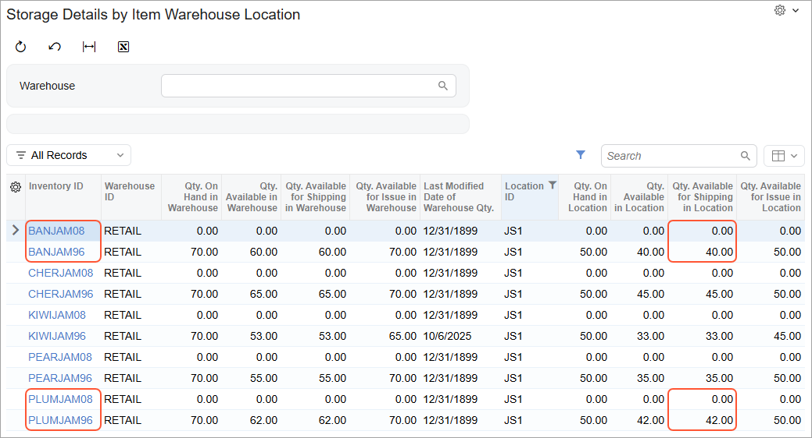

# Product Availability: To Export Product Availability Data {#_dff71e2c-f1cb-4cff-b308-635d3fcad982 .task}

In this activity, you will specify the default availability settings for the Shopify store, specify item-specific availability settings for particular stock items, export product availability data to the Shopify store, and review the results of the export.

**Attention:** The following activity is based on the *U100* dataset.

## Story { .section}

Suppose that the SweetLife Fruits &amp; Jams company sells several kinds of jams in its online store. By default, items should be available for purchase in the store only if they are in stock. Some of the jams, however, need to be available for purchase all the time, regardless of their stock levels. The jams can be ordered in the online store as follows:

-   Banana jams \(*BANJAM96* and *BANJAM08*\) should be available for purchase only if there is enough stock.
-   Plum jams \(*PLUMJAM96* and *PLUMJAM08*\) should be available for purchase when there is sufficient quantity in stock. If there is no quantity in stock, the availability to purchase the item should be determined by the settings specified for the item on the product management page in the BigCommerce store.

Acting as an implementation consultant helping SweetLife to set up the synchronization of Acumatica ERP with the Shopify store, you need to configure the system so that the items' availability will be tracked according to the business needs.

## Configuration Overview { .section}

In the *U100* dataset, the following tasks have been performed to support this activity:

-   For the purposes of this activity, the following features have been enabled on the [Enable/Disable Features](CS_10_00_00.md) \(CS100000\) form:
    -   *Multiple Warehouses*, which provides the functionality of working with several warehouses \(including virtual warehouses\)
    -   *Multiple Warehouse Locations*, which supports multiple locations for each warehouse
-   On the [Warehouses](IN_20_40_00.md) \(IN204000\) form, the *RETAIL* warehouse and the *JS1* warehouse location have been configured.
-   On the [Stock Items](IN_20_25_00.md) \(IN202500\) form, the stock items have been created in the system and assigned the availability settings as listed in the following table.

    |Stock Item|Availability|When Qty. Unavailable|
    |----------|------------|---------------------|
    |*BANJAM96*|*Store Default*|*Store Default*|
    |*BANJAM08*|*Store Default*|*Store Default*|
    |*PLUMJAM96*|*Set as Available \(Track Qty.\)*|*Do Nothing*|
    |*PLUMJAM08*|*Set as Available \(Track Qty.\)*|*Do Nothing*|

## Process Overview { .section}

In this activity, you will do the following:

1.  On the [Shopify Stores](BC_20_10_10.md) \(BC201010\) form, update the default availability settings for the Shopify store.
2.  On the [Storage Details by Item Warehouse Location](IN_40_80_55.md) \(IN408055\) form, review the quantities of stock items available in the *RETAIL* warehouse.
3.  On the [Prepare Data](BC_50_10_00.md) \(BC501000\) form, prepare the product availability data for synchronization, and on the [Process Data](BC_50_15_00.md) \(BC501500\) form, process the prepared product availability data.
4.  In the Shopify store, review the availability settings and quantities of the exported stock items.

## System Preparation { .section}

Before you complete the instructions in this activity, do the following:

1.  Make sure that the following prerequisites have been met:
    -   The Shopify store has been created and configured, as described in [Initial Configuration: To Set Up a Shopify Store](Commerce_SP_Initial_Configuration_To_Set_Up_a_Shopify_Store.md).
    -   The connection to the Shopify store has been established and the initial configuration has been performed, as described in [Initial Configuration: To Configure the Store Connection](Commerce_SP_Initial_Configuration_Implem_Activity.md).
2.  Launch the Acumatica ERP website with the *U100* dataset preloaded, and sign in with the following credentials:
    -   **Username**: *gibbs*
    -   **Password**: *123*
3.  On the [Shopify Stores](../Shared/../UserGuide/BC_20_10_10.md) \(BC201010\) form, select the *SweetStore - SP* store.
4.  On the **Entities** tab, select the **Active** check box in the row of the *Product Availability* entity.
5.  On the form toolbar, click **Save**.
6.  Sign in to the admin area of the Shopify store as the store administrator in the same browser.

## Step 1: Updating the Default Availability Settings { .section}

You need to specify the availability settings that the system will apply by default to stock items and non-stock items exported from Acumatica ERP to the Shopify store. While you are still viewing the [Shopify Stores](BC_20_10_10.md) \(BC201010\) form for the *SweetStore - SP* store, do the following:

1.  On the **Inventory** tab, specify the following settings:
    -   **Default Availability**: *Set as Available \(Track Qty.\)*

        With this setting, by default, a stock item exported to the Shopify store will be available for purchase through the storefront \(from the specified Shopify location\), and its quantity will be tracked.

    -   **When Qty. Unavailable**: *Set as Unavailable*

        With this setting, if the stock item's quantity becomes zero, the stock item will no longer be available for purchase in the Shopify store.

    -   **Availability Mode**: *Available for Shipping*
    -   **Warehouse Mode**: *Specific Warehouses*
2.  In the **Warehouse Mapping for Inventory Export** table, add a row, and in the added row, specify the following settings:

    -   **Warehouse**: *RETAIL*
    -   **Location ID**: *JS1*
    -   **Shopify Location**: *Shop location* \(which is the only location that was created when you were registering the *SweetStore - SP* store\)
    For each item, only its quantity available for shipping at the *JS1* location in the *RETAIL* warehouse is synchronized with the Shopify store's location.

3.  On the form toolbar, click **Save** to save the settings.

## Step 2: Reviewing the Available Quantities of Items { .section}

To review the item quantities available from the *RETAIL* warehouse, do the following:

1.  Open the [Storage Details by Item Warehouse Location](IN_40_80_55.md) \(IN408055\) form.
2.  Click the header of the **Location ID** column, and in the dialog box that opens, select *Equals*, type `JS1` in the text box, and click **Apply**.

    The system now displays only the items that are stored in the *JS1* warehouse location. Because in Step 1 you have set the **Availability Mode** setting to *Available for Shipping*, the quantities of the items displayed in the **Qty. Available for Shipping in Location** column \(which is shown in the following screenshot\) will be synchronized with the Shopify store. Notice that the *BANJAM96* and *PLUMJAM96* stock items are available at the *JS1* location \(a nonzero quantity is displayed for each of these items in the **Qty. Available for Shipping in Location** column\), whereas the *BANJAM08* and *PLUMJAM08* stock items have zero quantities.

    

## Step 3: Synchronizing the Product Availability Entity { .section}

To synchronize the availability settings and the quantities of the stock items you reviewed in the previous step, do the following:

1.  On the [Prepare Data](../Shared/../UserGuide/BC_50_10_00.md) \(BC501000\) form, specify the following settings in the Summary area:
    -   **Store**: *SweetStore - SP*
    -   **Prepare Mode**: *Incremental*
2.  In the table, select the check box in the unlabeled column in the row of the *Product Availability* entity.

    Before the quantity of a stock item and its availability settings can be exported, the stock item itself must be synchronized. Quantities of items that have been prepared but not processed will not be updated in the Shopify store.

3.  On the form toolbar, click **Prepare**.
4.  In the **Processing** dialog box, which opens, click **Close** to close the dialog box.
5.  Click the link in the **Ready to Process** column in the row of the *Product Availability* entity.

    The [Process Data](BC_50_15_00.md) \(BC501500\) form opens with the *SweetStore - SP* store and the *Product Availability* entity selected in the Summary area.

6.  On the form toolbar, click **Process All** to process the prepared synchronization records of the stock items you updated in the previous steps.
7.  In the **Processing** dialog box, which opens, click **Close** to close the dialog box.

## Step 4: Reviewing the Synchronized Data { .section}

To review the synchronized availability data, in the admin area of the Shopify store, do the following:

1.  In the left menu, click **Products**.
2.  On the **Products** page, click the row of *Banana jam 96 oz.*.

    On the product management page for the *Banana jam 96 oz.* stock item, which opens, in the **Inventory** section, notice that the **Inventory tracked** toggle is switched on.

3.  At the bottom right of the **Inventory** section, click the arrow-down icon to expand the section. Notice that the **Continue selling when out of stock** check box is cleared. In the only line in the **Quantity** table, notice that the quantity in the **Available** column is *40*.
4.  In the left menu, click **Products** to return to the list of products.
5.  On the **Products** page, click the row of *Banana jam 8 oz.*.

    On the product management page for the *Banana jam 8 oz.* stock item, which opens, in the **Inventory** section, notice that the **Inventory tracked** toggle is switched on and the **Continue selling when out of stock** check box is cleared \(click the arrow-down icon at the bottom right of the section to expand the section if needed\). In the only line in the **Quantity** table, notice that the quantity in the **Available** column is zero.

6.  At the top of the page, click **Preview**.
7.  On the product page, notice that the **Sold out** button is displayed for the *Banana jam 8 oz* item and this item is not available for purchase.
8.  Return to the admin area of the Shopify store.
9.  On the **Products** page, click the row of *Plum jam 8 oz.*.

    On the product management page for the *Plum jam 8 oz.* stock item, which opens, in the **Inventory** section, notice that the **Inventory tracked** toggle is switched on and the **Continue selling when out of stock** check box is selected \(click the arrow-down icon at the bottom right of the section to expand the section if needed\). In the only line in the **Quantity** table, notice that the quantity in the **Available** column is zero, which means that *Plum jam 8 oz.* is still available for purchase despite that this item is not in stock.

10. At the top of the page, click **Preview**.
11. On the product page, notice that the *Plum jam 8 oz.* item is available for purchase.

**Parent topic:**[Synchronizing Product Availability](../UserGuide/Commerce_SP_Syncing_Product_Availability_Mapref.md)

