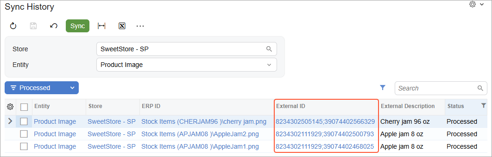

# Product Synchronization: To Sync Product Images {#_dfd1e8d0-16f0-4560-9615-a8fa52d94591 .task}

The following activity will walk you through the process of synchronizing product images between Acumatica ERP and the Shopify store.

**Attention:** The following activity is based on the *U100* dataset.

## Story { .section}

Suppose that the SweetLife Fruits &amp; Jams company wants to store some images of the products it sells in the online store in an external storage. Some of the images, however, are attached to items in the Acumatica ERP instance.

Acting as an implementation consultant helping SweetLife to set up the integration of Acumatica ERP with the Shopify store, you want to test how images stored in Acumatica ERP are exported to the Shopify store.

## Configuration Overview {#section_tz4_djx_cnb .section}

In the *U100* dataset, for the purposes of this activity, on the [Stock Items](IN_20_25_00.md) \(IN202500\) form, the *APJAM08* stock item of the *JAM* item class been created.

## Process Overview { .section}

In this activity, you will do the following:

1.  On the [Shopify Stores](BC_20_10_10.md) \(BC201010\) form, activate the *Customer Locations* entity.
2.  On the [Stock Items](IN_20_25_00.md) \(IN202500\) form, add images to the *APJAM08* stock item.
3.  On the [Prepare Data](BC_50_10_00.md) \(BC501000\) form, prepare the stock item data for synchronization.
4.  On the [Process Data](BC_50_15_00.md) \(BC501500\) form, process the stock item data prepared for synchronization.
5.  In the admin area of the Shopify store, review the exported stock item.
6.  On the [Shopify Stores](BC_20_10_10.md) \(BC201010\) form, activate the *Product Image* entity.
7.  On the [Prepare Data](BC_50_10_00.md) form, prepare the product image data for synchronization.
8.  On the [Process Data](BC_50_15_00.md) form, process the product image data prepared for synchronization.
9.  In the admin area of the Shopify store, review the exported images.

## System Preparation { .section}

Before you complete the instructions in this activity, do the following:

1.  Make sure that the following prerequisites have been met:
    -   The Shopify store has been created and configured, as described in [Initial Configuration: To Set Up a Shopify Store](Commerce_SP_Initial_Configuration_To_Set_Up_a_Shopify_Store.md).
    -   The connection to the Shopify store has been established and the initial configuration has been performed, as described in [Initial Configuration: To Configure the Store Connection](Commerce_SP_Initial_Configuration_Implem_Activity.md).
2.  Download the AppleJam1.png and AppleJam2.png files to your device.
3.  Launch the Acumatica ERP website with the *U100* dataset preloaded, and sign in with the following credentials:
    -   **Username**: *gibbs*
    -   **Password**: *123*
4.  On the [Shopify Stores](../Shared/../UserGuide/BC_20_10_10.md) \(BC201010\) form, select the *SweetStore - SP* store.
5.  On the **Entities** tab, select the **Active** check box in the row of the *Product Image* entity.
6.  On the form toolbar, click **Save**.
7.  Sign in to the admin area of the Shopify store as the store administrator in the same browser.

## Step 1: Adding an Image to the Stock Item { .section}

To add an image to the *APJAM08* stock item in Acumatica ERP, do the following:

1.  On the [Stock Items](IN_20_25_00.md) \(IN202500\) form, select the *APJAM08* inventory item.
2.  On the **Description** tab, drag each of the files you downloaded to the Image area.

    The files are attached to the form. You can browse them in the Image area or access them by clicking **Files** on the form title bar. The image that is visible in the Image area, after being exported, will be the main image of the product in the Shopify store.

3.  On the **eCommerce** tab, in the **Media URLs** table, add a row and specify the following settings of the image in the added row:
    -   **URL**: `http://acumatica-builds.s3.amazonaws.com/builds/University/CommerceTraining/AppleJam3.png`
    -   **Type**: *Image*
4.  On the form toolbar, click **Save**.

## Step 2: Preparing the Stock Item Data for Synchronization { .section}

Before you can synchronize images for a stock item, you need to synchronize the stock item itself. To prepare the stock item data for synchronization, do the following:

1.  On the [Prepare Data](../Shared/../UserGuide/BC_50_10_00.md) \(BC501000\) form, specify the following settings in the Summary area:
    -   **Store**: *SweetStore - SP*
    -   **Prepare Mode**: *Incremental*
2.  In the table, select the check box in the unlabeled column in the row of the *Stock Item* entity, and on the form toolbar, click **Prepare**.
3.  In the **Processing** dialog box, which opens, review the results of the processing, and click **Close** to close the dialog box and return to the [Prepare Data](../Shared/../UserGuide/BC_50_10_00.md) form.

    Notice that the **Prepared Records** column shows the number of synchronization records that have been prepared and are ready to be processed.

## Step 3: Processing the Prepared Stock Item Data { .section}

To process the stock item data prepared for synchronization, do the following:

1.  While you are still viewing the [Prepare Data](BC_50_10_00.md) \(BC501000\) form, click the link in the **Ready to Process** column in the row of the *Stock Item* entity.

    The [Process Data](BC_50_15_00.md) \(BC501500\) form opens with the *SweetStore - SP* store and the *Stock Item* entity selected in the Summary area.

2.  Select the unlabeled check box in the row with the *Apple jam 8 oz.* item, and on the form toolbar, click **Process**.
3.  In the **Processing** dialog box, which opens, click **Close** to close the dialog box.

## Step 4: Reviewing the Synchronized Stock Item { .section}

To review the *Apple jam 8 oz.* stock item, in the Shopify store, do the following:

1.  In the left menu, click **Products**.
2.  On the **Products** page, which opens, click the row of the *Apple jam 8 oz.* product to open the product management page of this product.

    Notice that the **Media** section contains only one image, which you added as an external link to the **Media URLs** table on the **eCommerce** tab of the [Stock Items](IN_20_25_00.md) \(IN202500\) form. Images added to this table are synchronized as part of the synchronization of the *Stock Item* entity.

    In the next steps, you will synchronize the images that you uploaded on the **Description** tab of the [Stock Items](IN_20_25_00.md) form.

## Step 5: Preparing the Image Data for Synchronization { .section}

To prepare the image data for synchronization, in Acumatica ERP, do the following:

1.  On the [Prepare Data](BC_50_10_00.md) \(BC501000\) form, specify the following settings шn the Summary area:

    -   **Store**: *SweetStore - SP*
    -   **Prepare Mode**: *Incremental*
    Because you have not processed the *Product Image* entity before, the system will prepare all images attached to the synchronized items as it would if *Full* mode were selected.

    **Attention:** Note that images are synchronized only for stock and non-stock items that have been synchronized with the Shopify store. If an item has not been synchronized, images added to it will not be exported during the synchronization of the *Product Image* entity.

2.  In the table, select the unlabeled check box in the row of the *Product Image* entity, and on the form toolbar, click **Prepare**.
3.  In the **Processing** dialog box, which opens, review the results of the processing, and click **Close** to close the dialog box and return to the [Prepare Data](../Shared/../UserGuide/BC_50_10_00.md) form.

    Notice that the **Prepared Records** column shows the number of synchronization records that have been prepared and are ready to be processed.

## Step 6: Processing the Prepared Image Data { .section}

To process the image data prepared for synchronization, do the following:

1.  While you are still viewing the [Prepare Data](BC_50_10_00.md) \(BC501000\) form, click the link in the **Ready to Process** column in the row of the *Product Image* entity.

    The [Process Data](BC_50_15_00.md) \(BC501500\) form opens with the *SweetStore - SP* store and the *Product Image* entity selected in the Summary area. The table displays at least two synchronization records of the *Product Image* entity.

    **Tip:** The **ERP ID** column displays the item type \(stock items\) and identifier \(*APJAM08*\) followed by the backslash and then the name of the image file. You can click the link in this column to open the image details on the [File Maintenance](SM_20_25_10.md) \(SM202510\) form.

2.  On the form toolbar, click **Process All** to process both synchronization records displayed in the table.
3.  In the **Processing** dialog box, which opens, click **Close** to close the dialog box.

## Step 7: Reviewing the Synchronized Images { .section}

To review the images that have been exported for the *Apple jam 8 oz.* product, do the following:

1.  On the [Sync History](BC_30_10_00.md) \(BC301000\) form, specify the following settings in the Summary area:
    -   **Store**: *SweetStore - SP*
    -   **Entity**: *Product Image*
2.  In the Filter List drop-down menu above the table, select *Processed*.

    The table displays synchronization records of the *Product Image* entity, as shown in the following screenshot. In the **External ID** column, notice that the identifier of each image in the Shopify store consists of the identifier of the product and the identifier of the image.

    

3.  In any row with the *Apple jam 8 oz.* external description, click the link in the **External ID** column to review the item in the Shopify store. The product management page opens for the *Apple jam 8 oz.* product.

    Notice that the **Media** section now contains three images. The two images uploaded on the **Description** tab of the [Stock Items](IN_20_25_00.md) form were exported as part of the synchronization of the *Product Image* entity. The main product image \(which is the image that appears larger than other thumbnails\) is the image that is visible in the Image area of the **Description** tab.

4.  In the upper right, click **Preview**, and review how the imported images are displayed on the product page on the storefront.
5.  At the top of the page, click **Catalog**. Locate the *Apple jam 8 oz.* product and review how the main product image is displayed on the product listing page.

**Parent topic:**[Synchronizing Products](../UserGuide/Commerce_SP_Syncing_Products_Mapref.md)

