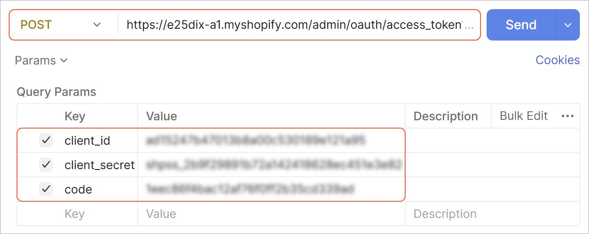

# Initial Configuration: To Establish the Store Connection with a Custom App {#_5b501ed1-37c4-4209-a47a-953acfc128da .task}

The following activity will walk you through the process of creating a custom Shopify app and connecting your Shopify store to your Acumatica ERP instance with the credentials of the custom app.

**Attention:** This activity is based on the *U100* dataset. If you are using another dataset or if any system settings have been changed in *U100*, these changes can affect the workflow of the activity and the results of the processing. To avoid issues, restore the *U100* dataset to its initial state.

## Story { .section}

Suppose that the SweetLife Fruits &amp; Jams company wants to sell jam in its online store, which is deployed on the Shopify platform. SweetLife is already using Acumatica ERP and now needs to integrate its instance with a new Shopify store. As SweetLife's implementation consultant, you need to create and install a custom app in your Shopify store and establish the connection between Acumatica ERP and the Shopify store using the app's credentials .

## Process Overview { .section}

In this activity, you will create a custom app in the Shopify dev dashboard,and assign it the necessary access permissions. Then you will install the app and generate an access token for it. Finally, you will use the app's credentials to connect Acumatica ERP to your Shopify store.

## System Preparation { .section}

Before you start this activity, do the following:

1.  Make sure you have deployed an Acumatica ERP instance and made it publicly accessible through the internet.
2.  Make sure you have set up a Shopify store, as described in [Initial Configuration: To Set Up a Shopify Store](Commerce_SP_Initial_Configuration_To_Set_Up_a_Shopify_Store.md).
3.  Sign in to Acumatica ERP by using the *gibbs* username and the *123* password.
4.  Sign in to the Shopify store as the store owner.
5.  Sign up for free to [https://postman.com/](https://postman.com/).

## Step 1: Creating a Custom App { .section}

Before you can establish a connection between your instance of Acumatica ERP and the online store, you need to create a custom app for the store as follows:

1.  In the lower left of the Shopify admin area, click **Settings**.
2.  In the left menu of the page that opens, click **Apps**.
3.  In the top right, click **Develop apps**.
4.  On the **App development** page, in the **Build and manage apps in your Dev Dashboard** section, click **Build apps in Dev Dashboard**.

    The dev dashboard page opens in a new browser tab.

5.  On the **Apps** page of the dev dashboard, in the top right, click **Create app**.
6.  On the **Create an app** page that opens, in the **Start from Dev Dashboard** section, enter `Acumatica ERP Custom` in the **App name** box.
7.  Click **Create** next to the app name.

    Shopify creates the custom app, opens the *Acumatica ERP Custom* app page, and prompts to create the app version on the **Create version** page.

## Step 2: Configuring the App { .section}

After you have created the custom app, you need to configure it and assign API scopes to it. To do this, while you are still viewing the **Create version** page of the *Acumatica ERP Custom* app on the dev dashboard, do the following:

1.  In the **Webhooks API version** section, leave the default value, which is the current version of the Shopify API.
2.  In the **Access** section, click **Select scopes**.
3.  In the **Select scopes** dialog box that opens, select the check boxes for all the listed scopes.
4.  In the lower right, click **Done** to save your changes.

    The dialog box closes. You can now see all the scopes you have selected listed in the **Access** section.

5.  In the **Redirect URLs**, enter `http://localhost`. This is the URL you will be redirected to once the app is installed. You will need this to get an authorization code later.
6.  Optional: In the **POS** section, select the **Embed app in Shopify POS** check box if you plan to integrate custom functionality directly into the Shopify Point of Sale interface.
7.  In the lower right, click **Release**.
8.  In the **Release this new version?** dialog box that opens, click **Release**.

    On the **Versions** page that opens, you can see the active *acumatica-erp-custom-2* version of the app you have just released.

9.  In the left menu, click **Acumatica ERP Custom**.

## Step 3: Installing the App { .section}

After you have created and configured the custom app, you need to install it to your Shopify store. To do this, while you are still viewing the *Acumatica ERP Custom* app on the dev dashboard, do the following:

1.  In the left menu, click **Acumatica ERP Custom**.
2.  On the **Overview** page that opens, in the **Installs** section, click **Install app**.

    **Tip:**

    If you create a custom app through the Shopify admin, as we’ve done here, you can install the app only in the same Shopify store.

    Otherwise, you need to choose a distribution method on the same page before installing it. *Public distribution* makes the app publicly available, allowing you to distribute or sell it to multiple merchants through the Shopify App Store. *Custom distribution* allows you to distribute the app to one store or to multiple stores within the same Shopify Plus organization by using a distribution link.

3.  In the Shopify admin area that opens in a new browser tab, on the **Install app** page, click **Install** in the lower right.

    The system installs the app and opens the app page, displaying the example domain that was selected by default in the app settings and that we did not change. You can also see the app listed under **Apps** in the left menu.

## Step 4: Locating the Client ID and Secret { .section}

To locate the client ID and secret key for the custom app, do the following:

1.  Go back to the browser tab with the *Acumatica ERP Custom* app opened on the Shopify dev dashboard.
2.  In the left menu, click **Settings**.

    On the **Settings** page that opens, in the **Credentials** section, notice the client ID and the secret key in the **Client ID** and **Secret** boxes, respectively. You can click the **Copy to clipboard** button next to them to copy them.

## Step 5: Initiating Authorization { .section}

To obtain the access token for your custom app, you first need to initiate authentication and obtain the authorization code. Do the following:

1.  In the address bar of a new browser tab, enter the following URL: `https://<store name>.myshopify.com/admin/oauth/authorize?client_id=<client id>&redirect_uri=<redirect url>`.

    In this URL, you should replace the following values that correspond to your store and custom app:

    -   *&lt;store name&gt;*: The store name that you can copy from the URL address of your Shopify admin area or storefront. For a trial store, the *&lt;store name&gt;* is a randomly generated unique alphanumeric value.
    -   *&lt;client id&gt;*: The client ID of your custom app that you obtained in Step 4 of this activity.
    -   *&lt;redirect url&gt;*: The redirect URL that is specified for the active version of your custom app. In this activity, you have been asked to use *http://localhost*.
    Your URL should look similar to the following one: *https://e25dix-a1.myshopify.com/admin/oauth/authorize?client\_id=ad15137b47062b8a00c522189b491a95&amp;redirect\_uri=http://localhost*

2.  Navigate to the URL.

    This initiates the authentication process and redirects you to the local host you specified as the redirect URL.

3.  Copy the authorization code from the URL of the page you have been redirected to. This URL should look similar to the following one, where the authorization code follows the *code=* text: *http://localhost/?code=&lt;authorization code&gt;&amp;hmac=&lt;hash-based message authentication code&gt;&amp;host=&lt;host code&gt;&amp;shop=&lt;store name&gt;.myshopify.com&amp;timestamp=&lt;time stamp&gt;*

## Step 6: Obtaining the Access Token { .section}

Having the client ID, secret, and the authorization code, you can obtain the access token. You will use Do the following:

**Tip:** To perform this step, you will need to send an API request. You can use any app that fits your needs. If you have no app, you can use the Postman API Client by signing up for free at [https://postman.com/](https://postman.com/).

1.  In a new browser tab, open the Postman API Client and create a request with the following parameters, as shown in the screenshot below:
    -   Method: *POST*
    -   URL \(right to the method\): `https://<store name>.myshopify.com/admin/oauth/access_token`

        In the URL, replace the *&lt;store name&gt;* with the store name that you can copy from the URL address of your Shopify admin area or storefront.

2.  Add the following query parameters to your request, which are also shown in the screenshot below:

    -   `client_id`: The client ID of your custom app that you obtained in Step 4 of this activity.
    -   `client_secret`: The secret key of your custom app that you obtained in Step 4 of this activity.
    -   `code`: The authorization code that you obtained in Step 5 of this activity.
    As soon as you add a query parameter, Postman adds it to the URL.

    

3.  Click **Send** to send the request.

    Postman processes your request and returns a response. Notice the access token that is going to be the second line of the response, starting with *access\_token*.

    **Tip:** The authorization code is short-lived and typically expires within several minutes. If you receive the *400 - Oauth error* response, repeat the instructions of Step 5 to regenerate the authorization code, and send the request with the new code again.

## Step 7: Establishing the Store Connection { .section}

To establish a connection with the Shopify store, in your instance of Acumatica ERP, do the following:

1.  On the [Shopify Stores](BC_20_10_10.md) \(BC201010\) form, create a new record.
2.  In the Summary area, enter *SweetStore - SP* in the **Store Name** box.
3.  On the **General** tab, use the information that you have captured in the previous step to specify the settings as follows:
    -   In the **Store Admin URL** box, enter the path of your Shopify store with *admin/* added to the end.

        The full URL usually looks like this: *https://&lt;store name&gt;.myshopify.com/admin/*.

    -   In the **API Access Token** box, enter the access token that was generated for the custom app that you have installed in your Shopify store.
    -   In the **API Secret Key** box, enter the API secret key that was generated for the custom app that you have installed in your Shopify.
4.  On the form toolbar, click **Save** to save your changes.
5.  Click **Test Connection** on the form toolbar to verify that you have specified the connection settings correctly.

    If the connection is successfully established, the system fills in the **Store Properties** section with the store settings. You can proceed to specifying the required settings for entities, customers, inventory, orders, and payments.

**Parent topic:**[Initial Configuration of a Shopify Store](../UserGuide/Commerce_SP_Initial_Configuration_Mapref.md)

